# 1. Getting started and taking the first steps

## 1.1 Introduction

!!! presented "Introduction"
    Introduction to Workshop & Oracle Application Express with some [Slides](assets/documents/APEX%20Workshop%2024.2.6.pdf){target="_blank"}.

    Good to know for the Beginning

    - App Development IDE & Enduser IDE is a web browser -> **No client Software needed**
    - APEX App Definitions are stored as metadata in the database -> **Declarative, No Code generation**
    - Page Generation is in the database with only one request -> **Page & Data together** 
    - Show Page & Accept Page: APEX processes every request in two phases: Show Page (page rendering) and Accept Page (processing submitted data, validations, and branching).
    - Session Management: APEX maintains session state to persist user-specific data across page requests, enabling stateful application behavior on top of the stateless HTTP protocol.
    - APEX uniquely spans the App Dev spectrum, from No Code to Low Code to High Control -> **flexible & extensible**
    - Accessible UI for any device -> **responsive apps**
    - ORDS as Listener 
    - Single Database with Multiple Workspaces

    
## 1.2 UI - Overview

!!! presented "UI" 
    APEX Development UI will be shown with its 3 other parts than App Builder
    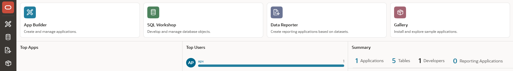{ style="display:block;margin:auto;" }

    **SQL Workshop** is about database objects (Object Browser), SQL Statements and Scripts, Utilities (Data Loading, Data Generation and others) and RESTful Services (just a frontend to the Database/ORDS capabilities)

    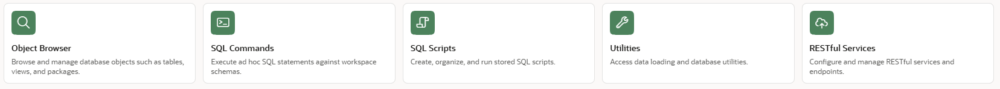{ style="display:block;margin:auto;" }

    The **Gallery** contains sample and starter applications. 

    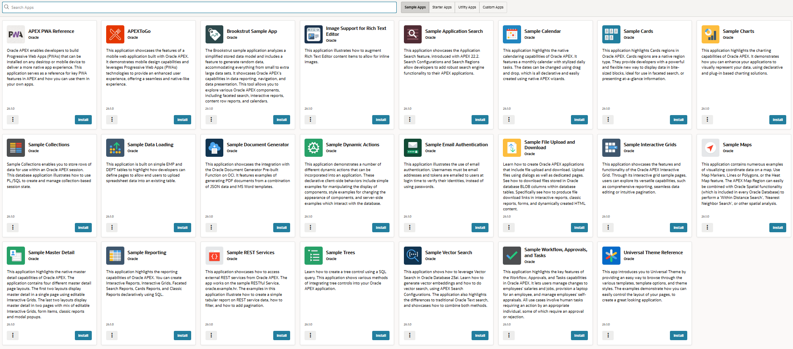{ style="display:block;margin:auto;" }

    The **Data Reporter** is to create reporting applications based on the data in your schema without the overhead of full application development.

## 1.3 Create Tables EMP & DEPT

The exercises will use the well-known tables EMP and DEPT, and we will create them out of the Sample Datasets. For both tables, sequences and triggers are created for the primary key columns. 
Two foreign keys are also created so that employees can only work in departments that exist and that employees can only have a boss that exists.

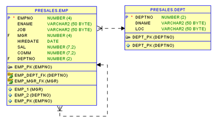{ style="display:block;margin:auto;" }

  

    The exercises will use the well-known tables EMP and DEPT, and we will create them out of the Sample Datasets. For both tables, sequences and triggers are created for the primary key columns. 
Two foreign keys are also created so that employees can only work in departments that exist and that employees can only have a boss that exists.
  

  

    
  

We will use **Sample Datasets**, but there are some other options (Quick SQL, Data Generator).

!!! exercise "Create Table (Sample Datasets)"
    In the **SQL Workshop** we choose the **Sample Datasets** in the **Utilities**

    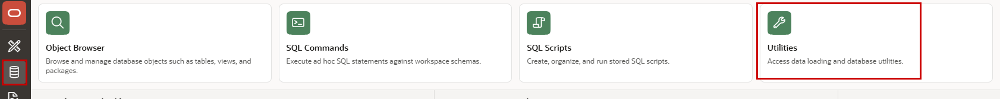{ style="display:block;margin:auto;" }
    
    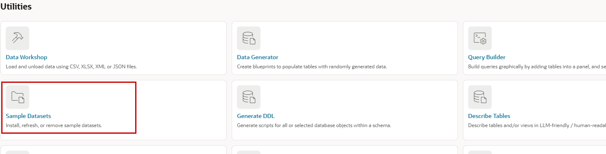{ style="display:block;margin:auto;" }
    
    There we click on **Install** for EMP/DEPT and select the language (please use English) and the database schema to install the tables. (At oracleapex.com there's only one schema possible).
    
    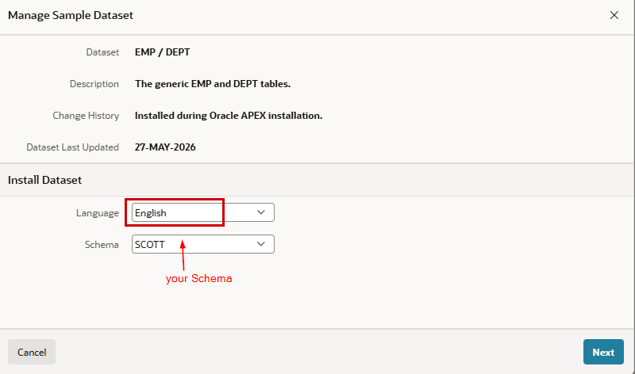{ style="display:block;margin:auto;" }
    
    After clicking **Next** we just choose **Install Dataset** in the next window and then **Exit** (Please don't use the Create Application Button). 
     
Now the tables are created and this could be checked in the **Object Browser**.

!!! bytheway "Dark and Light Mode"
    

       

          *By the way*, 
          clicking on your initial on the bottem left you can easily choose the mode of the application builder between Light and Dark Mode or a time-dependent automatic mode.
       

    

        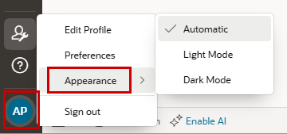{ style="display:block;margin:auto;" }
    

    

## 1.4 Create First Application with the Wizard - MyEmployees

We will use the wizard to create an application with an initial homepage and a report/form for the employees. After that, we will add a second page in Page Designer. This will be our starting point for the upcoming exercises. Everything that’s created here can be changed later.

!!! exercise "Create first application with the Wizard"

    In the **App Builder** we click on **Create**.

    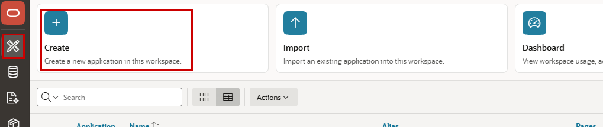{ style="display:block;margin:auto;" }

    There are various ways to create an application.

    Just giving a name (`MyEmployees`) and clicking on the **Create Application** button would create an empty application. We will click on **Use Create App Wizard**. The ID is System Generated and must be unique in an APEX Instance.

    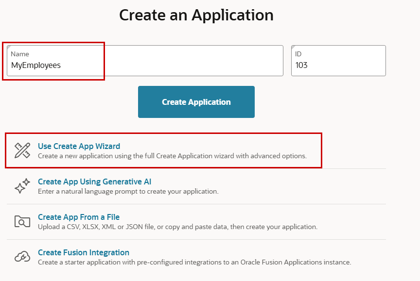{ style="display:block;margin:auto;" }

    !!! tip "Create App Using Generative AI"
        The entry **Create App Using Genrative AI** is only available, when you've configured an **Generative AI Service** in the Workspace Utilities. The same is valid for the APEX Assistants in the Code Editors.

    We can change the logo and the default Appearance. We **Add Page**. 

    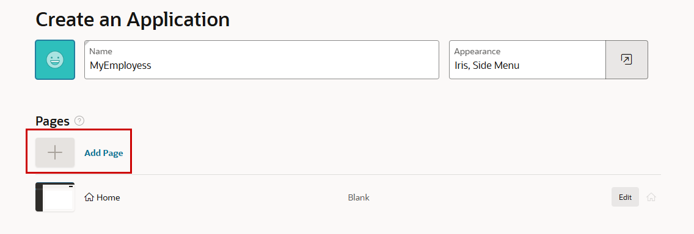{ style="display:block;margin:auto;" }

    We can create an empty page or choose a region for the new page. We use a **Form** region.

    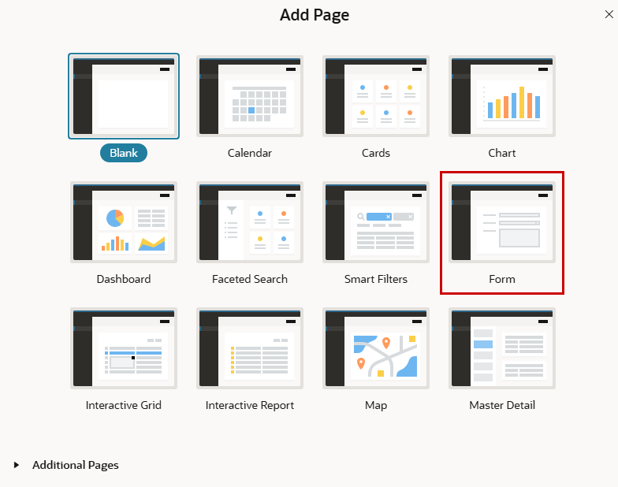{ style="display:block;margin:auto;" }

    Name the Page `Employee` and choose our just created table `EMP`. To get a report to see and select the employees we check the **Include Report** checkbox.

    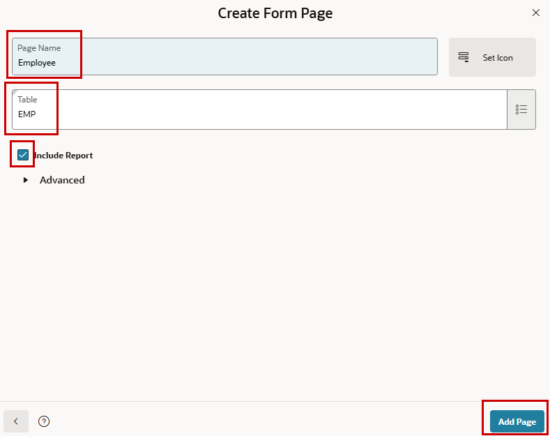{ style="display:block;margin:auto;" }

    Keep the rest of the properties in the wizard as they are and click **Create Application**

    { style="display:block;margin:auto;" }

    After a few seconds the application is created and you can see the pages. **Run Application** to see the result. Username and Password are identical to those you’ve chosen to connect to the development environment, as the default Authentication Scheme is Oracle APEX Accounts.

    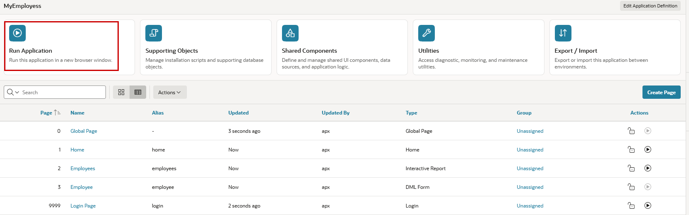{ style="display:block;margin:auto;" }

## 1.5 Add a page (Faceted Search)

We now will add an additional page to the application, to see how this is done without the wizard.

!!! exercise "Add a Faceted Search Page"
    You see the application with the already created pages by the wizard and click **Create Page**. Later we will see, that that’s also possible in the Page Designer.

    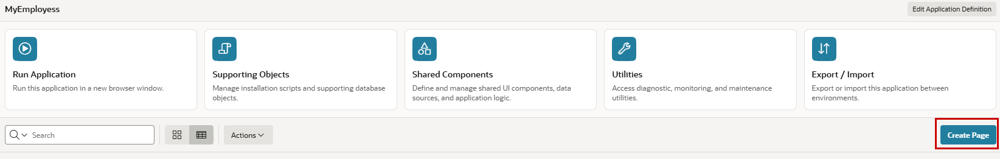{ style="display:block;margin:auto;" }

    Now we choose **Faceted Search** as component for the new page.

    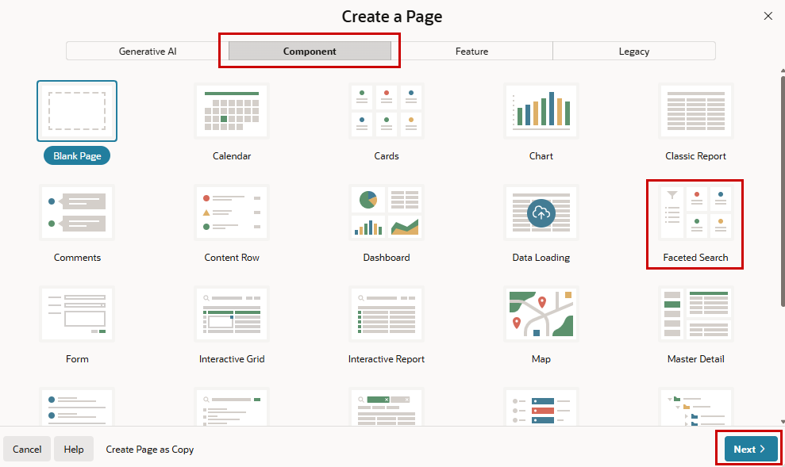{ style="display:block;margin:auto;" }

    **Page Number** `4` should be pre-initialized and we **name** the page `EmpFacets`. As **Data Source** we use the **Local Database** and here our table `EMP`.

    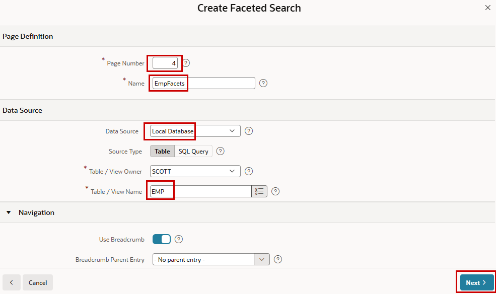{ style="display:block;margin:auto;" }

    We want to display the results as **Cards** and leave all selected attributes for facets clicked before creating the page.

    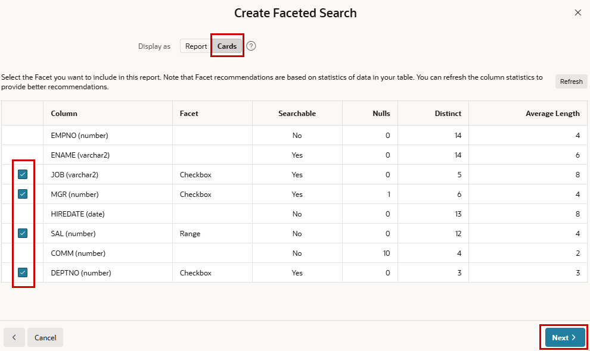{ style="display:block;margin:auto;" }

    Finally, we like to see the Cards in a **Grid** and select, which columns of the table should be shown as the title and the body of the cards. `ENAME` and `JOB` should be preselected here. 

    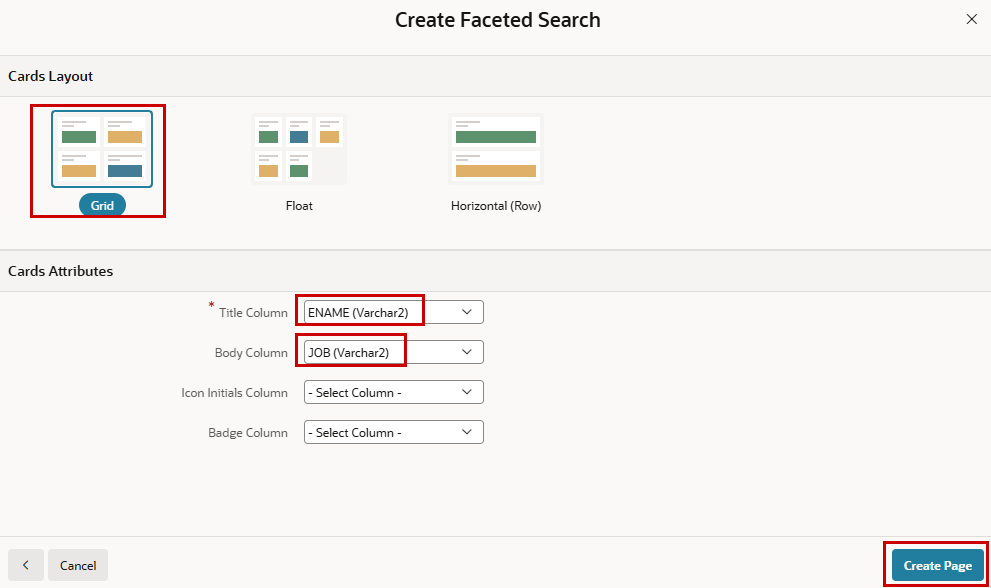{ style="display:block;margin:auto;" }

## 1.6 Page Designer

!!! presented "Page Designer"
    Based on the just created application an overview of the Page Designer will be given.

    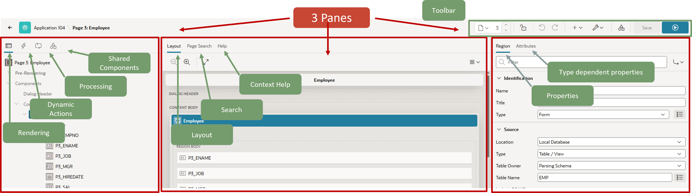{ style="display:block;margin:auto;" }

    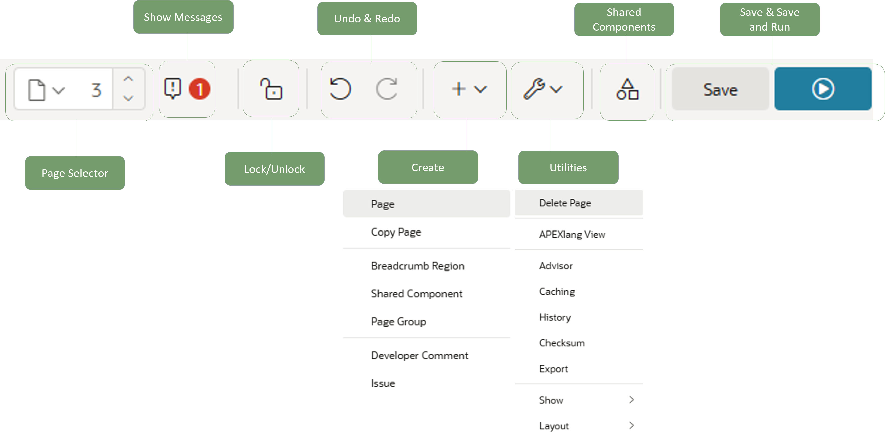{  width="70%" style="display:block;margin:auto;" }

    - Pages
    - Regions
    - Items
    - Buttons
    - Properties (Generic / Specific / Sections)
    - Multiselect
    - Layout (Drag & Drop / Properties)
    - Error Marking
    - Help
    - Developer Toolbar

    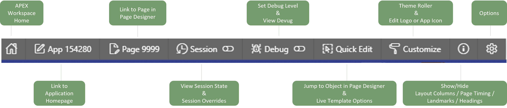{  width="70%" style="display:block;margin:auto;" }
     
    !!! bytheway "Location of Developer Toolbar"
        

            

                *By the way*, 
                you can decide where the developer toolbar is shown on the screen.
            

            

                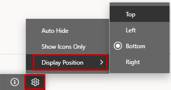{ style="display:block;margin:auto;" }
            

        

!!! bytheway "Pane Mode"
    

       

          *By the way*, 
          in Page Designer you sometimes don’t use the Layout pane in the middle. Then choosing elements in the left pane and editing them in the right attributes pane might need a lot of “mouse-meters”. It’s not only possible to change the size of the panes, you can also choose between 2 und 3 panes. The Two-Pane-Mode hides the middle pane
       

    

        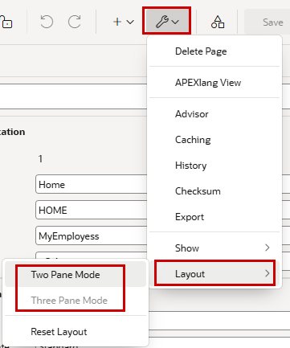{ style="display:block;margin:auto;" }
    

    

!!! bytheway "Multi Select"
    

       

          *By the way*, 
          when selecting more than one object in the navigator, at the property pane, you’ll see blue triangles and blue, empty fields. This indicates that there are different entries for the chosen items. You can still put it here (for all objects at once).
       

    

        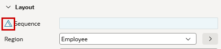{ style="display:block;margin:auto;" }
    

    

 
!!! bytheway "Conditions"
    

       

          *By the way*, 
          when there’s a red circle on the lower right side of the icon of an object (button, item, process, …) that indicates, that there’s a condition on this object
       

    

        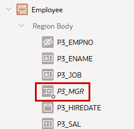{ style="display:block;margin:auto;" }
    

    

 
!!! bytheway "Changed Items"
    

       

          *By the way*, 
          unsaved settings can be identified by the green line in front of an object.
       

    

        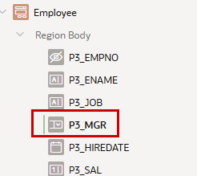{ style="display:block;margin:auto;" }
    

    
