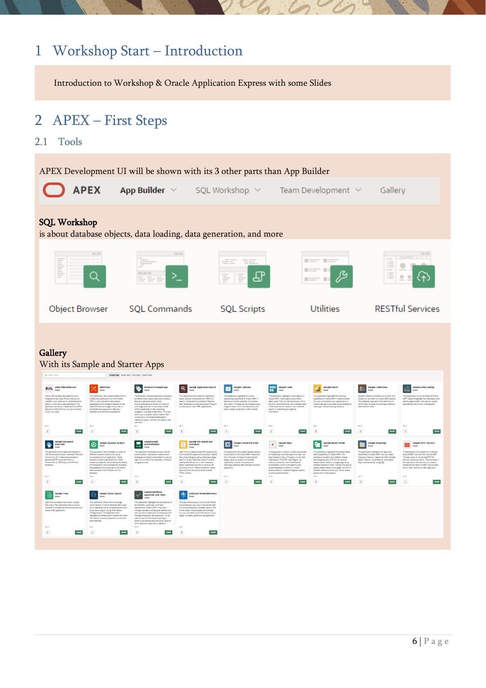

# 2. APEX - First Steps

Tools, sample tables, the first application wizard, and faceted search.

{ .chapter-image }

## What this chapter covers

- Introduces the APEX development UI beyond App Builder: SQL Workshop and Gallery.
- Creates the EMP and DEPT tables from sample datasets.
- Builds the first application, MyEmployees, with the wizard.
- Adds a Faceted Search page for the EMP table.
- Walks through the main Page Designer and App Builder concepts.

> The early pages establish the baseline application that later chapters extend.

## Workshop transcript

Transcribed from PDF pages 6-13

### PDF page 6

1 Workshop Start – Introduction

Introduction to Workshop & Oracle Application Express with some Slides

2 APEX – First Steps 2.1 Tools

APEX Development UI will be shown with its 3 other parts than App Builder

SQL Workshop is about database objects, data loading, data generation, and more

Gallery With its Sample and Starter Apps

### PDF page 7

2.2 Create EMP & DEPT Tables The exercises will use the well-known tables EMP and DEPT, and we will create them out of the Sample Datasets. For both tables, sequences and triggers are created for the primary key columns.

Two foreign keys are also created so that employees can only work in departments that exist and that employees can only have a boss that exists.

Then click Install Dataset and after that, click Exit

You can check what was created in SQL Workshop using the Object Browser.

### PDF page 8

2.3 Create First Application with the Wizard – MyEmployees We will use the wizard to create an application with an initial homepage and a report/form for the employees. After that, we will add a second page in Page Designer. This will be our starting point for the upcoming exercises. Everything that’s created here can be changed later

Just giving a name (MyEmployees) and clicking on the Create Application button would create an empty application. We will click on Use Create App Wizard. The ID is System Generated and must be unique in an APEX Instance.

We add a page ...

... and choose Form page to manipulate the EMP table and Include a Report in front of that

### PDF page 9

Keep the rest of the properties in the wizard as they are and Create the Application

Run the Application and see what’s being generated.

Username and Password are identical to those you’ve chosen to connect to the development environment, as the default Authentication Scheme is Oracle APEX Accounts

### PDF page 10

2.4 Add a page (Faceted Search) We now will add an additional page to the application, to see how this is done without the wizard.

You see the application with the already created pages by the wizard and click Create Page Later we will see, that that’s also possible in the Page Designer.

Now we choose Faceted Search as component for the new page

### PDF page 11

Page Number 4 should be pre-initialized and we name the page EmpFacets. As Data Source we use the Table emp of the Local Database.

We want to display the results as Cards and leave all selected attributes for facets clicked.

### PDF page 12

Finally, we like to see the Cards in a Grid and select, which columns of the table should be shown as the title and the body of the cards.

By the way, You can easily choose the mode of the application builder between Light and Dark Mode or a time-dependent automatic mode.

### PDF page 13

2.5 APEX Application Builder

You will see and learn about

- Page Designer with the panes and toolbar

- Pages

- Regions

- Items

- Properties (Generic/Specific/Sections)

o Sections will be shown on the Screenshots of the Exercises and are very helpful to find the mentioned properties

- Multiselect

- Layout (Drag & Drop / Properties)

- Error-Marking

- Help

- Developer Toolbar

