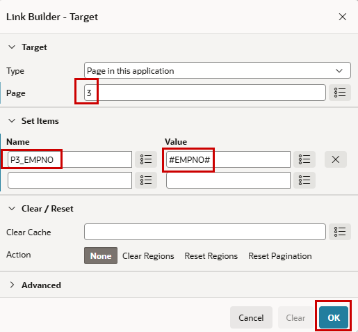
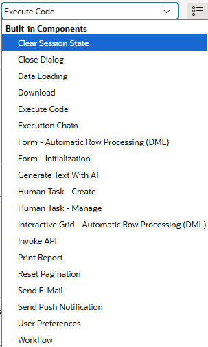

# 2. Application Adjustments

## 2.1 Links & Items 

### 2.1.1 Navigation - Link from Report to Form

!!! presented "Action  Menu & Forms" 
    - Where to manipulate the Action Menu of the Interactive Report
    - How a form works
      - Primary Key
      - Pre-Rendering
      - Process Form 
      - Buttons with Conditions

To see how linked navigation works in APEX, we will add our own to the automatically created one. We want to make the name of the employee clickable (on page 2 - Employees) and navigate to the employee form (page 3), like with the pencil.

!!! exercise "Add a navigation link"
    
    In Page Designer, search for column **ENAME** in Region **Employees** (on page 2). In the properties on the right side, choose   `Link` as **Type**. In the Link-Section click on **No Link defined**                       
    
    { style="display:block;margin:auto;" }

    The target is the Form Page `3`. There, we set the primary key (`P3_EMPNO`) with the value of the chosen row in the report (`#EMPNO#`).

    { style="display:block;margin:auto;" }

When you now run the application, you’ll see that the employee names are clickable, and they navigate us to the corresponding form page like the pencil.

### 2.1.2 Change Date Formats

In this exercise, we will change the display format of the HIREDATE in the form and the report.
Depending on the environment, the data format might not be one you like. It’s possible to set a default format for the application, which we haven’t done so far. 

!!! exercise "Change Data Format"

    Choose Column **HIREDATE** in Region **Employees** on Page 2. In the Appearance section set **Format Mask** to `DD.MM.YYYY`.

    { style="display:block;margin:auto;" }

    Do the same in the Form Page (3) at item **P3_HIREDATE**. In the Appearance set **Format Mask** to `DD.MM.YYYY`.

    { style="display:block;margin:auto;" }

Now the format of the date should look like the typical German format. We’ve here shown the setting of a format for a single column or item. It’s possible to set a default format for the application which is used when no dedicated format is chosen.
In the **Shared Components** (the three geometric shapes) you’ll find the **Globalization Attributes** in the **Globalization** section. There's an item Application Data Format where you can set the default for the application.
	 
### 2.1.3 Change Item from Select List to Radio Group

### 2.1.4 Add a List of Values to the Job

## 2.2 Behaviour depending on values

### 2.2.1 Validations

### 2.2.2 Conditions

### 2.2.3 Dynamic Actions

## 2.3 Session State

## 2.4 Computations, Processes & Branches

!!! presented "Computations, Processes & Branches"
    

       

          - Computations
          - Processes
            - Invoke API -Call Stored Code declarative
            - Human Tasks – Approval Processes
            - Execute Code – PL/SQL
            - Data Loading
            - Send-EMail 
            - Execution Chain – Order of Execution possible in the Background
              - e.g., Load Data which might take a long time and send an EMail when it’s finished 
          - Branches (Submit Page Sequences)
       

    

        { style="display:block;margin:auto;" }
    

   
          - Computations
          - Processes
            - Invoke API -Call Stored Code declarative
            - Human Tasks – Approval Processes
            - Execute Code – PL/SQL
            - Data Loading
            - Send-EMail 
            - Execution Chain – Order of Execution possible in the Background
              - e.g., Load Data which might take a long time and send an EMail when it’s finished 
          - Branches (Submit Page Sequences)
