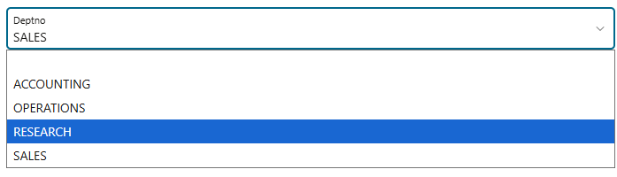
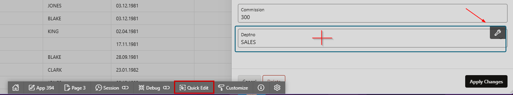
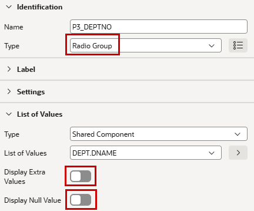
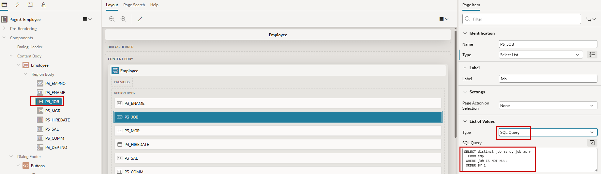

# 2. Application Adjustments

## 2.1 Links & Items 

### 2.1.1 Navigation - Link from Report to Form

!!! presented "Action  Menu & Forms" 
    - Where to manipulate the Action Menu of the Interactive Report
    - How a form works
        - Primary Key
        - Pre-Rendering
        - Process Form 
        - Buttons with Conditions

To see how linked navigation works in APEX, we will add our own to the automatically created one. We want to make the name of the employee clickable (on page 2 - Employees) and navigate to the employee form (page 3), like with the pencil.

!!! exercise "Add a navigation link"
    
    In Page Designer, search for column **ENAME** in Region **Employees** (on page 2). In the properties on the right side, choose   `Link` as **Type**. In the Link-Section click on **No Link defined**                       
    
    { style="display:block;margin:auto;" }

    The target is the Form Page `3`. There, we set the primary key (`P3_EMPNO`) with the value of the chosen row in the report (`#EMPNO#`).

    { style="display:block;margin:auto;" }

When you now run the application, you’ll see that the employee names are clickable, and they navigate us to the corresponding form page like the pencil.

### 2.1.2 Change Date Formats

In this exercise, we will change the display format of the HIREDATE in the form and the report.
Depending on the environment, the data format might not be one you like. It’s possible to set a default format for the application, which we haven’t done so far. 

!!! exercise "Change Data Format"

    Choose Column **HIREDATE** in Region **Employees** on Page 2. In the Appearance section set **Format Mask** to `DD.MM.YYYY`.

    { style="display:block;margin:auto;" }

    Do the same in the Form Page (3) at item **P3_HIREDATE**. In the Appearance set **Format Mask** to `DD.MM.YYYY`.

    { style="display:block;margin:auto;" }

Now the format of the date should look like the typical German format. We’ve here shown the setting of a format for a single column or item. It’s possible to set a default format for the application which is used when no dedicated format is chosen.
In the **Shared Components** (the three geometric shapes) you’ll find the **Globalization Attributes** in the **Globalization** section. There's an item Application Data Format where you can set the default for the application.
	 
### 2.1.3 Change Item from Select List to Radio Group

On page 3, the item **P3_DEPTNO** is set as a `Select List`. We’ll change this now to have a `Radio Group` instead.

{ style="display:block;margin:auto;" }

!!! exercise "Change Item Type"

    Via the Developer Toolbar, you can quickly reach the properties of an item. Click on **Quick Edit** and then direct onto the item. Clicking on the spanner will bring you to the Live Template Options. If you are in the Page Designer, you don't have to go through the Developer Toolbar. This is just an effective way for developers to jump from the running application to the right place in the Page Designer.

    { style="display:block;margin:auto;" }

    When **P3_DEPTNO** in Page Designer is selected, choose `Radio Group` instead of `Select List` as **Type**.
    In the List of Values section suppress the **Display of Extra Values** and the **Display Null Value** property.

    { style="display:block;margin:auto;" }

  

!!! tip "Item Types"

    <div class="two-columns">

      <div style="flex: 30%;">
      Marking the **Type** property and choosing the **Help** Tab in the middle pane, you get a short overview about he available predefined item types.
      </div>

      <div style="flex: 70%;">
          { style="display:block;margin:auto;" }
      </div>

    </div>

    
    
### 2.1.4 Add a List of Values to the Job

The job item in the form is currently a simple Text Field. Now we add a List of Values to this item to let the users select a job from existing jobs in a Select List.

!!! exercise "Add a List of Values"
    Choose item **P3_JOB** on page 3 (via Page Designer or Quick Edit) und set `Select List` as Item **Type**. Immediately, some red color appears for errors. Not only the exclamation mark at the top but also the item in the tree-view and the layout. Click on the exclamation mark, and at the error you want to fix (which is here only one thing)

    { style="display:block;margin:auto;" }

    Choose `SQL Query` as the **Type** for the List of Values. As **SQL Query** choose the Code Snippet and write `no job assigned` as **Null Display Value**

    ```sql title="Query for LoV"
       SELECT distinct job as d, job as r 
         FROM emp
        WHERE job IS NOT NULL
        ORDER BY 1
    ```
     { style="display:block;margin:auto;" }

    There are two columns in a List of Values Query: one is the Display Column, and the other is the Return Column. Look in the context help to see an example.


## 2.2 Behaviour depending on values

### 2.2.1 Validations

### 2.2.2 Conditions

### 2.2.3 Dynamic Actions

## 2.3 Session State

## 2.4 Computations, Processes & Branches

   
!!! presented "Computations, Processes & Branches"

    <div class="two-columns">

      <div>
      **Computations**
      
      **Processes**

      - Invoke API (Call Stored Code declarative)
      - Human Tasks – Approval Processes
      - Execute Code – PL/SQL
      - Data Loading 
      - Send E-Mail
      - Execution Chain – order of execution in the background
       **
      **Branches (Submit Page Sequences)**
      </div>

      <div>
          { style="display:block;margin:auto;" }
      </div>

    </div>