# 2. Anwendung anpassen

## 2.1 Links und Items

### 2.1.1 Navigation - Link vom Report zur Form

!!! presented "Action Menu und Forms"
    - Wo das Action Menu des Interactive Reports angepasst wird
    - Wie eine Form funktioniert
        - Primary Key
        - Pre-Rendering
        - Process Form
        - Buttons mit Conditions

Um zu sehen, wie verlinkte Navigation in APEX funktioniert, fügen wir einen eigenen Link zu dem automatisch erstellten Link hinzu. Der Name des Mitarbeiters soll klickbar werden (auf Seite 2 - Employees) und zur Mitarbeiter-Form (Seite 3) navigieren, genau wie das Stift-Icon.

!!! exercise "Navigationslink hinzufügen"

    Suche im Page Designer die Spalte **ENAME** in der Region **Employees** (auf Seite 2). Wähle rechts in den Eigenschaften als **Type** den Wert `Link`. Klicke im Abschnitt **Link** auf **No Link Defined**.

    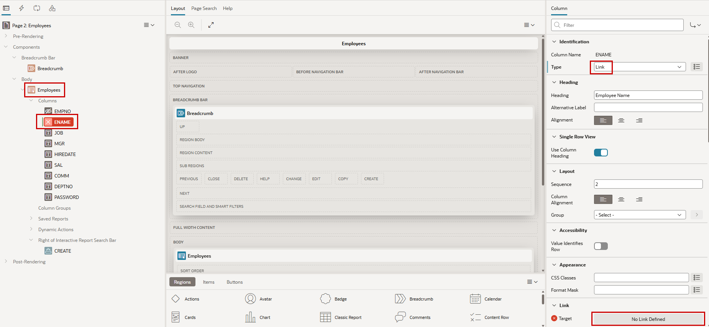{ style="display:block;margin:auto;" }

    Das Ziel ist die Form-Seite `3`. Dort setzen wir den Primary Key (`P3_EMPNO`) mit dem Wert der ausgewählten Zeile im Report (`#EMPNO#`).

    { style="display:block;margin:auto;" }

Wenn du die Anwendung jetzt startest, siehst du, dass die Namen der Mitarbeitenden klickbar sind und wie das Stift-Icon zur passenden Form-Seite navigieren.

### 2.1.2 Datumsformate ändern

In dieser Übung ändern wir das Anzeigeformat von HIREDATE in der Form und im Report.
Je nach Umgebung ist das Datumsformat möglicherweise nicht das gewünschte Format. Man kann ein Standardformat für die Anwendung setzen, was wir bisher noch nicht getan haben.

!!! exercise "Datumsformat ändern"

    Wähle die Spalte **HIREDATE** in der Region **Employees** auf Seite 2. Setze im Abschnitt **Appearance** die **Format Mask** auf `DD.MM.YYYY`.

    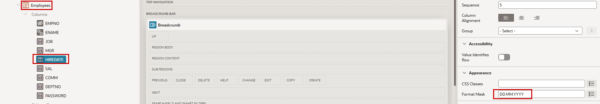{ style="display:block;margin:auto;" }

    Mache dasselbe auf der Form-Seite 3 für das Item **P3_HIREDATE**. Setze unter **Appearance** die **Format Mask** auf `DD.MM.YYYY`.

    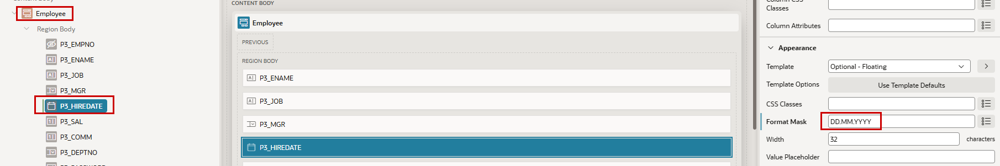{ style="display:block;margin:auto;" }

Jetzt sollte das Datumsformat wie das typische deutsche Format aussehen. Wir haben gezeigt, wie man ein Format für eine einzelne Spalte oder ein einzelnes Item setzt. Es ist auch möglich, ein Standardformat für die Anwendung zu setzen, das verwendet wird, wenn kein eigenes Format gewählt wurde.
In **Shared Components** (die drei geometrischen Formen) findest du im Abschnitt **Globalization** die **Globalization Attributes**. Dort gibt es ein Item **Application Date Format**, in dem du den Standard für die Anwendung setzen kannst.

### 2.1.3 Item von Select List zu Radio Group ändern

Auf Seite 3 ist das Item **P3_DEPTNO** als `Select List` definiert. Wir ändern es nun zu einer `Radio Group`.

{ style="display:block;margin:auto;" }

!!! exercise "Item-Typ ändern"

    Über die Developer Toolbar kommst du schnell zu den Eigenschaften eines Items. Klicke auf **Quick Edit** und danach direkt auf das Item. Ein Klick auf den Schraubenschlüssel bringt dich zu den Live Template Options. Wenn du im Page Designer bist, musst du nicht über die Developer Toolbar gehen. Das ist nur ein effektiver Weg für Entwickler, aus der laufenden Anwendung direkt an die richtige Stelle im Page Designer zu springen.

    { style="display:block;margin:auto;" }

    Wenn **P3_DEPTNO** im Page Designer ausgewählt ist, wähle statt `Select List` den **Type** `Radio Group`.
    Unter **List of Values** unterdrückst du die Eigenschaften **Display Extra Values** und **Display Null Value**.

    { style="display:block;margin:auto;" }

<div class="two-columns">
  <div>
    Wenn du die Anwendung jetzt startest, sollte die Abteilung in der Employees Form als Radio Group angezeigt werden.
  </div>
  <div>
    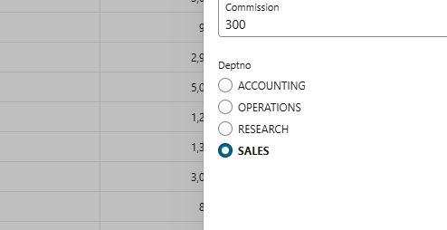
  </div>
</div>

!!! tip "Item Types"

    <div class="two-columns">

      <div style="flex: 30%;">
          Markiere die Eigenschaft **Type** und wähle im mittleren Bereich den Tab **Help**, um einen kurzen Überblick über die verfügbaren vordefinierten Item-Typen zu erhalten.
      </div>

      <div style="flex: 70%;">
          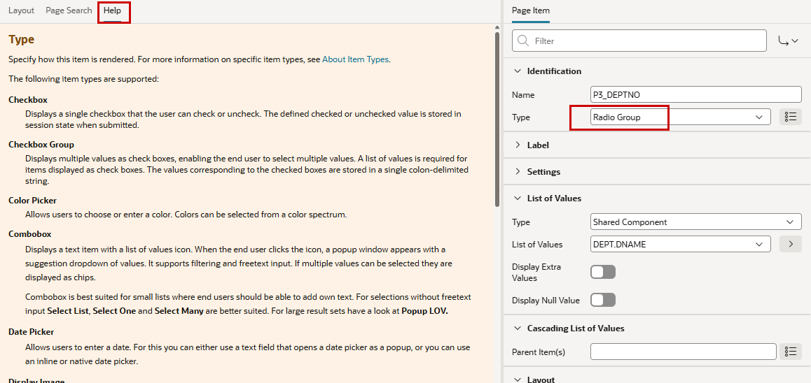{ style="display:block;margin:auto;" }
      </div>

    </div>

### 2.1.4 Modal Dialog ändern

!!! exercise "Modal Dialog ändern"

    Das Darstellungsverhalten des modalen Fensters kann auf Seitenebene geändert werden. Klicke im Page Designer oben links auf Seite 3. Im Abschnitt **Appearance** der Eigenschaften kannst du das **Dialog Template** von `Drawer` auf `Modal Dialog` ändern. Dadurch wird das modale Fenster zentriert, während Drawer es von rechts einblendet. Beim Testen musst du eventuell Shift-Reload verwenden, um die Auswirkung der geänderten Eigenschaft zu sehen.

    Es ist möglich, die Seitengröße für ein modales Fenster festzulegen. Man kann aber auch zulassen, dass Endbenutzer die Größe des modalen Fensters selbst anpassen.

    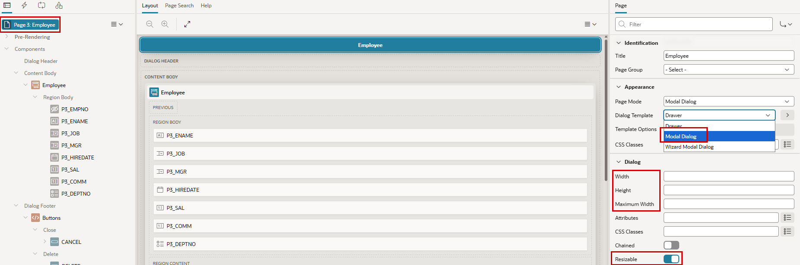{ style="display:block;margin:auto;" }

### 2.1.5 List of Values für den Job hinzufügen

Das Job-Item in der Form ist aktuell ein einfaches Text Field. Jetzt fügen wir diesem Item eine List of Values hinzu, damit Benutzer einen Job aus bestehenden Jobs in einer Select List auswählen können.

!!! exercise "List of Values hinzufügen"
    Wähle auf Seite 3 das Item **P3_JOB** (über Page Designer oder Quick Edit) und setze als **Type** den Wert `Select List`. Sofort erscheinen rote Fehlermarker: nicht nur das Ausrufezeichen oben, sondern auch das Item in der Tree View und im Layout. Klicke auf das Ausrufezeichen und danach auf den Fehler, den du beheben willst. Hier gibt es nur einen.

    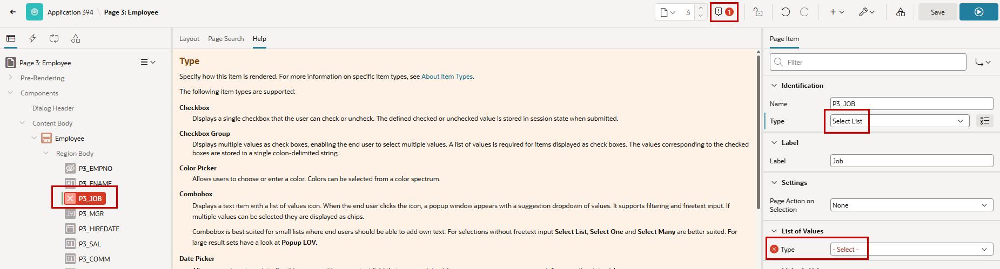{ style="display:block;margin:auto;" }

    Wähle `SQL Query` als **Type** für die List of Values. Verwende als **SQL Query** das Code-Snippet und trage als **Null Display Value** `no job assigned` ein.

    ```sql
       SELECT DISTINCT job as d, job as r
         FROM emp
        WHERE job IS NOT NULL
        ORDER BY 1
    ```

     { style="display:block;margin:auto;" }

    In einer List-of-Values-Abfrage gibt es zwei Spalten: eine Display Column und eine Return Column. Sieh in der Context Help nach, um ein Beispiel zu sehen.

Wenn eine solche List of Values mehrfach verwendet wird, ist es besser, sie als Shared Component zu implementieren und hier nur darauf zu verweisen.

<div class="two-columns">
  <div>
    Wenn du die Anwendung jetzt startest, sollte beim Job-Item eine Select List erscheinen, in der du aus bestehenden Jobs in der Datenbank wählen kannst. Der **Null Display Value** heißt *no job assigned*.
  </div>
  <div>
    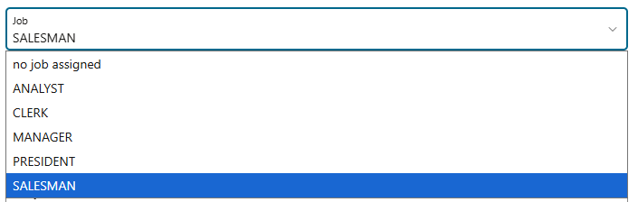
  </div>
</div>

## 2.2 Verhalten abhängig von Werten

In dieser Übung wird die Form geändert, um wertabhängiges Verhalten abzubilden. Unser Ziel ist sicherzustellen, dass nur SALESMAN eine Provision bekommen können (Spalte `comm` in der Tabelle).

### 2.2.1 Validations

Zuerst fügen wir eine Validation hinzu, die prüft, dass das Item `P3_COMM` (die Provision) null ist, wenn der Job nicht SALESMAN ist. In unseren Beispieldaten werden Jobs in Großbuchstaben in der Datenbank gespeichert, und Suchen in der Datenbank sind standardmäßig case-sensitive. Deshalb verwenden wir hier ebenfalls SALESMAN in Großbuchstaben.

!!! exercise "Provision validieren"

     <div class="two-columns">
      <div style="flex: 50%;">
          Klicke auf Seite 3 mit der rechten Maustaste auf das Item **P3_COMM** und wähle **Create Validation**.
      </div>
      <div style="flex: 50%;">
          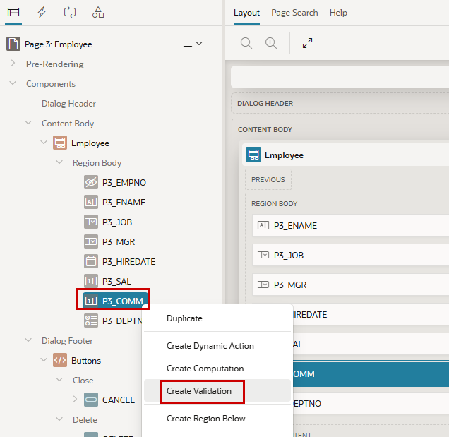{ style="display:block;margin:auto;" }
      </div>
    </div>

   Die Validation (standardmäßig New genannt) ist rot markiert, weil am Anfang Pflicht-Eigenschaften fehlen. Diese sind ebenfalls rot markiert. Nenne die Validation `check_commission`.
   Da es `IS NULL` nicht als **Type** für die Validation gibt, wähle `Expression`. Als **Language** verwenden wir `PL/SQL`, und `:P3_COMM IS NULL` ist unsere **PL/SQL Expression**. Vergiss den Doppelpunkt nicht, um das Page Item zu referenzieren.

   Schreibe zusätzlich eine **Error Message** und wähle aus, wo diese Meldung angezeigt werden soll (**Display Location**).

   Füge jetzt eine Bedingung (**Server-side Condition**) hinzu, wann diese Validation ausgeführt werden soll. Wähle `Item != Value` als **Type**, `P3_JOB` als **Item** und `SALESMAN` als **Value**.

   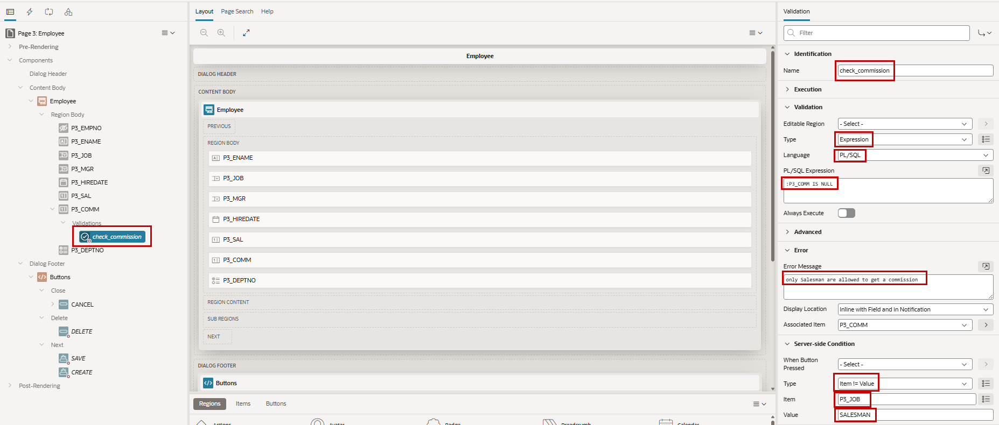{ style="display:block;margin:auto;" }

Versuche, einem Nicht-Salesman eine Provision zu geben, und schau, was passiert.
In diesem Fall ist das aber vielleicht nicht der perfekte Ansatz ...

### 2.2.2 Conditions

Jetzt versuchen wir einen anderen Weg: In der Form soll gar keine Provision eingegeben werden können, wenn der Job des Mitarbeiters nicht SALESMAN ist.

!!! exercise "Conditional Read Only"
    Lösche zuerst die Validation aus der vorherigen Übung, indem du sie mit der rechten Maustaste anklickst und **Delete** wählst. Alternativ kannst du ein Objekt einfach auswählen und DEL drücken. Konfiguriere den Abschnitt **Read Only** des Items **P3_COMM** mit denselben Einstellungen wie zuvor in der Server-side Condition der Validation.

    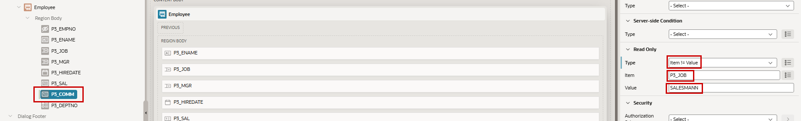{ style="display:block;margin:auto;" }

    Alternativ kannst du dieselben Einstellungen im Abschnitt Server-side Condition verwenden, wodurch das Item bedingt ausgeblendet wird.

Öffne die Form für verschiedene Mitarbeitende und prüfe, wie sich das Item verhält.
Aber auch das ist in diesem Fall vielleicht nicht der perfekte Ansatz ...

### 2.2.3 Dynamic Actions

Wenn der Job in der Form geändert wird, ändert sich das Item für die Provision noch nicht. Im dritten Ansatz blenden wir das Item jetzt dynamisch auf dem Client ein und aus, abhängig vom aktuellen Job-Wert, ohne Interaktion mit dem Server. Dafür ist JavaScript nötig, aber **Dynamic Actions** übernehmen die JavaScript-Generierung für dich. Du musst den Code also nicht selbst schreiben.

!!! exercise "Dynamic Actions"

    <div class="two-columns">
      <div style="flex: 50%;">
          Lösche die Read-Only-Bedingung von vorher. Das geht, indem du als **Type** `- Select -` auswählst.
      </div>
      <div style="flex: 50%;">
          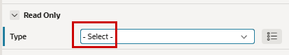{ style="display:block;margin:auto;" }
      </div>
    </div>
    <div class="two-columns">
      <div style="flex: 50%;">
          Klicke mit der rechten Maustaste auf **P3_JOB** (wir wollen etwas erstellen, das passiert, wenn der Job geändert wird) und wähle **Create Dynamic Action**.
      </div>
      <div style="flex: 50%;">
          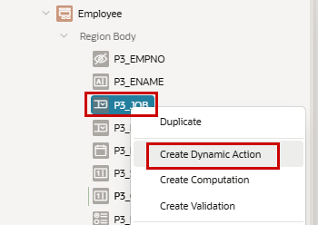{ style="display:block;margin:auto;" }
      </div>
    </div>

    Gib der Action einen **Name** (`JobChanged`). Der Abschnitt **When** ist durch die Art der Erstellung bereits vorbelegt: Es ist das `Change`-Event des **Item** `P3_JOB`.
    Jetzt haben wir zwei Fälle: Der Job wird SALESMAN oder etwas anderes. Wir könnten nun zwei Actions hinter das Event legen, die jeweils prüfen, welcher Fall zutrifft, und entsprechend reagieren. Oder wir prüfen den Fall bereits im Event und gehen dann entweder in den TRUE- oder FALSE-Zweig. In diesem Fall ist das der bessere Ansatz, weil die Prüfung nur einmal passieren muss.
    Dafür verwenden wir jetzt eine **Client-side Condition** (wir wollen keinen Roundtrip zur Datenbank), in der wir definieren, dass das **Item** `P3_JOB` den Wert `SALESMAN` haben soll.

    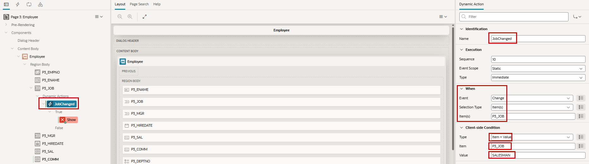{ style="display:block;margin:auto;" }

    Klicke auf die vorab erstellte True Action **Show** (die wegen fehlender Eigenschaften rot ist). Wegen der Bedingung im Dynamic-Action-Event und weil wir im True-Zweig sind, ist die **Action** `Show` richtig. Nenne diese Action `ShowComm`, da das **Affected Element** das Item **P3_COMM** ist. Die Eigenschaft **Fire on Initialization** ist aktiviert, daher sind keine zusätzlichen Schritte nötig, um das Item beim Laden der Seite anzuzeigen, wenn der Job SALESMAN ist.

    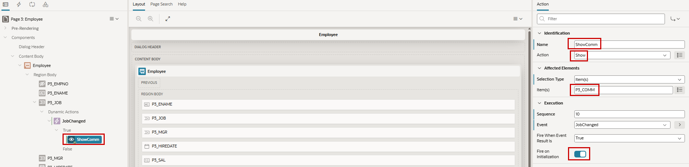{ style="display:block;margin:auto;" }

    <div class="two-columns">
      <div style="flex: 50%;">
           Jetzt brauchen wir die Gegenaktion, um die Provision auszublenden, wenn der Job nicht SALESMAN ist. Klicke mit der rechten Maustaste auf die True Action `ShowComm` und erstelle über **Create Opposite Action** die Gegenaktion, die das Item ausblendet, wenn der Job auf etwas anderes als SALESMAN geändert wird.
      </div>
      <div style="flex: 50%;">
          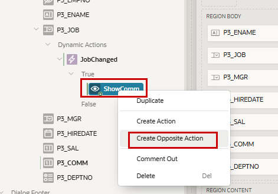{ style="display:block;margin:auto;" }
      </div>
    </div>

    Benenne die erstellte False Action in `HideComm` um, und wir sind fertig.

Probiere es aus und beobachte das Provision-Item in der Form, während du den Job änderst.
Noch nicht berücksichtigt ist, wie mit einem eventuell bereits vorhandenen Provision-Wert umgegangen werden soll.

!!! bytheway "Dynamic Action Event Input"
    *Übrigens*,<br>
    in 24.1 wurde ein Dynamic-Action-Event namens Input eingeführt. Das Event wird jedes Mal ausgelöst, wenn sich der Wert eines Elements ändert. Das unterscheidet sich vom Change-Event aus den Übungen, das erst feuert, nachdem der Benutzer die Eingabe abgeschlossen hat, zum Beispiel durch Enter oder Auswahl eines Werts aus einer List of Values.

!!! sampleapp "Sample App Dynamic Actions"
    <div class="two-columns">
      <div style="flex: 50%;">
           Diese Anwendung demonstriert verschiedene Dynamic Actions, die in eine Anwendung eingebaut werden können. Diese deklarativen clientseitigen Verhaltensweisen umfassen einfache Beispiele zur Manipulation der Anzeige von Komponenten, Styling-Beispiele zur Änderung des Erscheinungsbilds und serverseitige Beispiele, die mit der Datenbank interagieren.
      </div>
      <div style="flex: 50%;">
          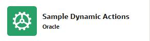{ style="display:block;margin:auto;" }
      </div>
    </div>

!!! bytheway "Trigger Actions"
    *Übrigens*,<br>
    in 26.1 werden Trigger Actions eingeführt. Sie bieten einen vereinfachten Weg, reaktives Verhalten in Oracle APEX zu definieren. Statt eine vollständige Dynamic Action mit Events, Bedingungen und Actions zu erstellen, kann man mit einer Trigger Action deklarativ festlegen, was bei einem bestimmten Ereignis passieren soll. Sie sind dafür gedacht, häufige clientseitige Interaktionsmuster mit weniger Konfiguration und besserer Wartbarkeit abzudecken. Trigger Actions helfen, Komplexität zu reduzieren und trotzdem responsive und interaktive Benutzeroberflächen zu ermöglichen.

## 2.3 Session State

Client-side Conditions werten Item-Werte direkt im Browser mit JavaScript aus. Da die Auswertung auf dem Client erfolgt, muss kein Request an den Server gesendet werden. Das macht clientseitige Bedingungen sehr reaktionsschnell und effizient, zum Beispiel um Regionen ein- oder auszublenden, Items zu aktivieren oder zu deaktivieren oder Benutzereingaben während der Eingabe zu prüfen.

Server-side Conditions werten dagegen Werte aus, die im APEX Session State gespeichert sind. Session State wird auf dem Datenbankserver verwaltet und enthält die aktuellen Werte von Page Items für eine bestimmte Benutzersession. Weil die Auswertung auf dem Server erfolgt, muss Oracle APEX eventuell einen Request zur Datenbank ausführen, bevor die Bedingung ausgewertet werden kann.

Oracle APEX verwaltet den Session State automatisch für jede Benutzersession. Entwickler können von jeder Seite der Anwendung aus auf Session-State-Werte zugreifen. Dadurch lassen sich Informationen über Seiten und Prozesse hinweg teilen. Wichtig ist aber: Ein Wert, den ein Benutzer eingibt, ist zunächst nur im Browser verfügbar. Er wird nicht automatisch im Session State gespeichert.

Damit ein Wert auf dem Server verfügbar ist, muss er submitted werden. Das kann durch Submit der gesamten Seite oder durch Submit nur ausgewählter Page Items über die Eigenschaft Page Items to Submit einer Dynamic Action, Region oder eines Prozesses passieren. Sobald der Wert submitted wurde, liegt er im Session State und kann von serverseitigen Bedingungen, Computations, Validations, Processes und PL/SQL-Code referenziert werden.

Der Unterschied zwischen Browser-Werten und Session State ist beim Entwickeln von APEX-Anwendungen wesentlich, weil er erklärt, warum ein Wert auf der Seite sichtbar sein kann, aber für serverseitige Logik noch nicht verfügbar ist.

Wir erleben das im Kapitel **Charts** direkt.

## 2.4 Computations, Processes und Branches

!!! presented "Computations, Processes und Branches"

    <div class="two-columns">

      <div>

      **Computations**

      **Processes**

      - Invoke API - gespeicherten Code deklarativ aufrufen
      - Human Tasks - Approval Processes
      - Execute Code - PL/SQL
      - Data Loading
      - Send E-Mail
      - Execution Chain - Ausführungsreihenfolge, auch im Hintergrund möglich

      **Branches (Submit Page Sequences)**
      </div>

      <div>
          { style="display:block;margin:auto;" }
      </div>

    </div>

!!! tip "LiveLab"
    Es gibt ein Oracle LiveLab **Implement custom authentication in APEX**.
    [Hier klicken](https://livelabs.oracle.com/ords/r/dbpm/livelabs/view-workshop?wid=3315){target="_blank"}

## 2.5 User Interface Attributes

Als kurzer Ausblick auf das Kapitel **Layout** passen wir nun das Menü unserer Anwendung an, damit die folgenden Übungen leichter nachzuvollziehen und visuell intuitiver sind.

User Interface Attributes enthalten Einstellungen, die das Erscheinungsbild der Benutzeroberfläche einer Anwendung steuern. Ein wichtiger Aspekt ist das Navigationsmenü und seine Platzierung. Diese Einstellungen definieren den Standard für die Anwendung, können aber auf einzelnen Seiten überschrieben werden.

Es gibt mehrere Möglichkeiten, das Menü einer Anwendung darzustellen. Unsere erste App verwendet eine Sidebar für die Navigation. Wir ändern das auf Top Navigation.

!!! exercise "Menü von Side auf Top ändern"

    Suche den Button **Edit Application Definition**, um direkt zu einem bestimmten Teil der Shared Components zu gelangen.

    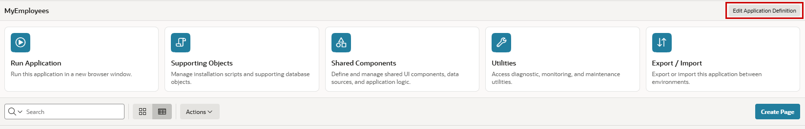{ style="display:block;margin:auto;" }

    Gehe in den Abschnitt **User Interface** und ändere die **Position** für **Navigation Menu** von `Side` auf `Top`.

    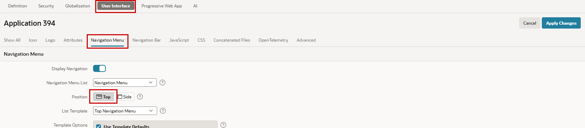{ style="display:block;margin:auto;" }

    <div class="two-columns">
      <div>
        Starte die Anwendung und sieh dir das neue Menü an.
      </div>
      <div>
              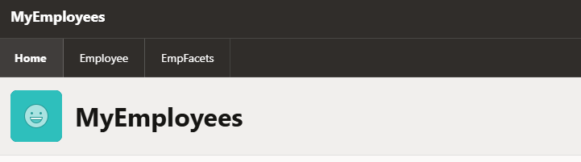{ style="display:block;margin:auto;" }
      </div>

    </div>
