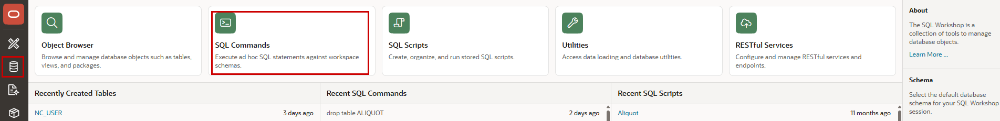
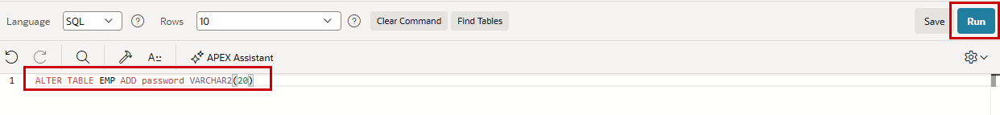
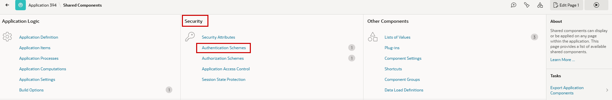
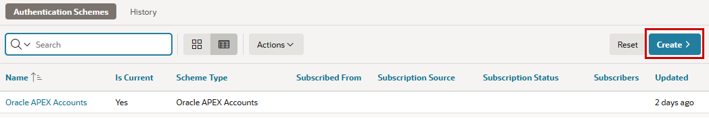
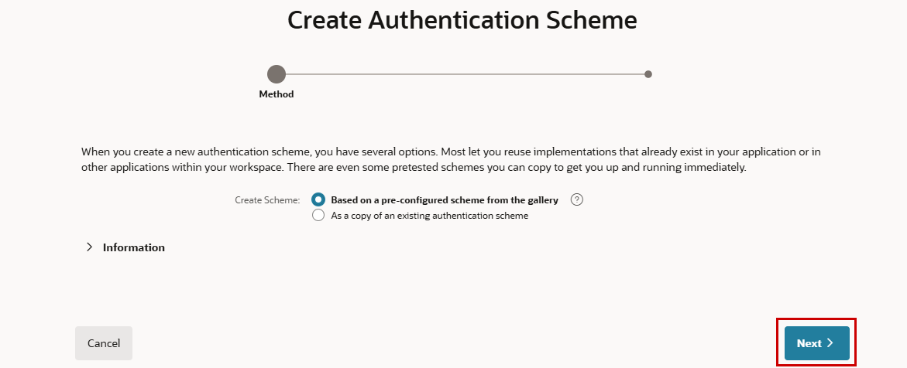
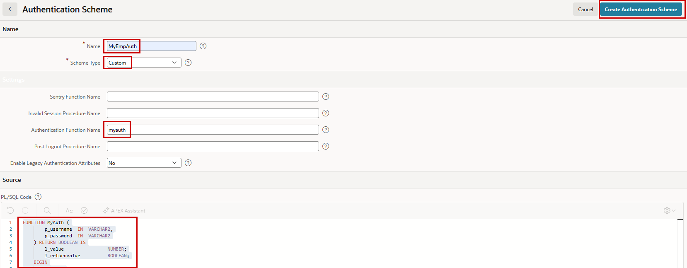
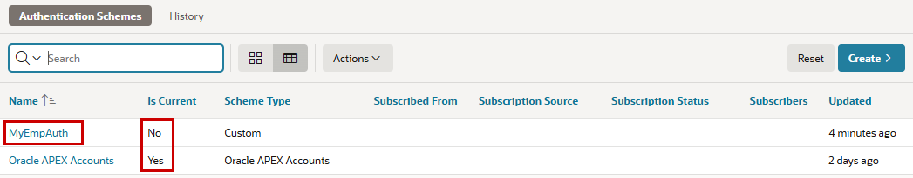
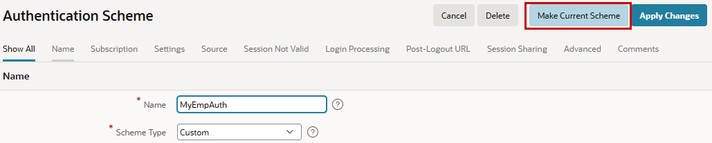

# 3. Authentifizierung

Authentifizierung stellt fest, welche Benutzerin oder welcher Benutzer auf eine Anwendung zugreift. Sobald ein Benutzer identifiziert wurde, verfolgt die Oracle APEX Engine diesen Benutzer ueber den Wert der eingebauten Substitutionszeichenfolge `APP_USER`.

Es gibt mehrere vordefinierte Authentifizierungsschemata:

- **Builder Extension Sign-In** -> Ermoeglicht die Integration dieser Anwendung mit der APEX-Entwicklungsumgebung.
- **Custom** -> Ermoeglicht das Erstellen eines eigenen Authentifizierungsschemas von Grund auf. Damit haben Sie vollstaendige Kontrolle ueber die Authentifizierungslogik.
- **Database Accounts** -> Dieses Authentifizierungsschema setzt voraus, dass ein Datenbankbenutzer bzw. Schema in der lokalen Datenbank existiert. Benutzername und Passwort dieses Datenbankkontos werden fuer die Anmeldung verwendet.
- **HTTP Header Variable** -> Externe Authentifizierung, bei der der Benutzername in einer HTTP-Header-Variable steht, die vom Webserver gesetzt wird.
- **Internal Application Extension** -> Verwenden Sie dieses Schema fuer Erweiterungen interner Anwendungen.
- **LDAP Directory** -> Authentifizierung von Benutzername und Passwort ueber eine Anfrage an einen LDAP-Server.
- **No Authentication** -> Verwendet den aktuellen Datenbankbenutzer.
- **Open Door Credentials** -> Ermoeglicht beliebigen Zugriff auf die Anwendung ueber eine Login-Seite, die einen Benutzernamen erfasst.
- **Oracle APEX Accounts** -> Oracle APEX Account Credentials sind interne Benutzerkonten, die im APEX-Benutzerrepository erstellt und verwaltet werden. Bei dieser Methode authentifiziert sich die Anwendung gegen diese Konten.
- **SAML Sign-In** -> Unterstuetzt Authentifizierung mit SAML2 Identity Providern.
- **Social Sign-In** -> Unterstuetzt Authentifizierung mit Google, Facebook, generischem OpenID Connect und generischem OAuth2.

## 3.1 Eigene Authentifizierung

Bisher haben wir die Benutzerinnen und Benutzer der Anwendung gegen lokal in APEX definierte Benutzer authentifiziert. Das ist normalerweise nicht ueblich, ausser vielleicht in der Entwicklung. Jetzt erstellen wir eine eigene Authentifizierung und definieren einfach die Mitarbeitenden aus unserer Tabelle `EMP` als Benutzer der Anwendung. Etwas leichtsinnig speichern wir das Passwort dabei im Klartext in der Tabelle.

!!! exercise "Eigene Authentifizierung bauen"
    Boxen mit diesem tuerkisen Hintergrund enthalten die Uebungen. Sie werden Schritt fuer Schritt demonstriert, und relevante Details werden erklaert. Danach, oder parallel dazu, ist Zeit, die Schritte selbst nachzuvollziehen.

    Zuerst fuegen wir der Tabelle `EMP` eine Passwortspalte hinzu und fuellen sie mit `ENAME` in Kleinbuchstaben. Fuehren Sie die folgenden Statements in **SQL Commands** im **SQL Workshop** aus, jeweils nacheinander. Mehrere Statements auf einmal koennen in **SQL Scripts** ausgefuehrt werden.

    ```sql
      ALTER TABLE EMP ADD password VARCHAR2(20)
    ```

    ```sql
      UPDATE emp SET password = lower(ename)
    ```

    { style="display:block;margin:auto;" }

    { style="display:block;margin:auto;" }

    Wechseln Sie in die **Shared Components** Ihrer Anwendung und waehlen Sie im Bereich **Security** die **Authentication Schemes**.

    { style="display:block;margin:auto;" }

    Es gibt bereits ein Schema, das wir uebrigens im Wizard beim Erzeugen der Anwendung ausgewaehlt haben. Klicken Sie auf **Create**.

    { style="display:block;margin:auto;" }

    Waehlen Sie **Based on a pre-configured scheme from the gallery** und klicken Sie auf **Next**.

    { style="display:block;margin:auto;" }

    Geben Sie dem Schema einen **Name** (hier `MyEmpAuth`) mit **Scheme Type** `Custom`. Der **Authentication Function Name** lautet `myauth`, und diese Funktion definieren wir im Editor **PL/SQL Code**.

    ```sql
        FUNCTION MyAuth (
           p_username  IN  VARCHAR2,
           p_password  IN  VARCHAR2
          ) RETURN BOOLEAN IS
             l_value                NUMBER;
             l_returnvalue          BOOLEAN;
        BEGIN
           SELECT 1
             INTO l_value
             FROM emp
            WHERE lower(ename) = lower(p_username)
              AND password = p_password;

            l_returnvalue := l_value = 1;
            RETURN l_returnvalue;

        EXCEPTION
           WHEN NO_DATA_FOUND THEN
               RAISE_APPLICATION_ERROR(-20010,'No valid combination for Username/Password');
        END;
    ```

    { style="display:block;margin:auto;" }

    Statt den Code direkt hier zu verwenden, koennte auch eine gespeicherte Funktion oder eine Funktion in einem Datenbank-Package genutzt werden.

    Das neue Schema ist nun vorhanden, aber noch nicht aktiv (**Is Current**). Klicken Sie auf den Namen des neuen Schemas.

    { style="display:block;margin:auto;" }

    Klicken Sie nun auf **Make Current Scheme**, um das neue Schema als aktives Schema der Anwendung festzulegen.

    { style="display:block;margin:auto;" }

Um das neue Schema zu testen, muessen Sie zuerst die aktuelle Anwendungssitzung beenden. Das geht auf jeder Seite der laufenden Anwendung oben rechts, wo der aktuell angemeldete Benutzer angezeigt wird. Danach koennen Sie sich mit einem beliebigen Mitarbeiternamen aus der Tabelle `EMP` anmelden. Als Passwort verwenden Sie den Namen in Kleinbuchstaben. Anschliessend sehen Sie den angemeldeten Benutzer oben rechts in der Anwendung.

!!! bytheway "Authentifizierung wechseln"
    *By the way*,<br>
    Neben der Definition eines Standard-Authentifizierungsschemas unterstuetzt Oracle APEX auch den Wechsel von Authentifizierungsschemata zur Laufzeit. Dadurch kann eine Anwendung je nach Anwendungslogik, Umgebung, Mandantenkonfiguration oder Benutzeranforderung dynamisch unterschiedliche Authentifizierungsmechanismen auswaehlen. Eine einzelne Anwendung kann so mehrere Authentifizierungsstrategien unterstuetzen und trotzdem eine konsistente Benutzererfahrung bieten.

!!! sampleapp "Sample App Email Authentication"
    <div class="two-columns">
      <div style="flex: 50%;">
           Diese Anwendung zeigt die Verwendung von E-Mail-Authentifizierung. Benutzernamen muessen E-Mail-Adressen sein, und Login-Token werden per E-Mail an Benutzer gesendet, um ihre Identitaet zu bestaetigen, statt Passwoerter zu verwenden.
      </div>
      <div style="flex: 50%;">
          { style="display:block;margin:auto;" }
      </div>
    </div>
