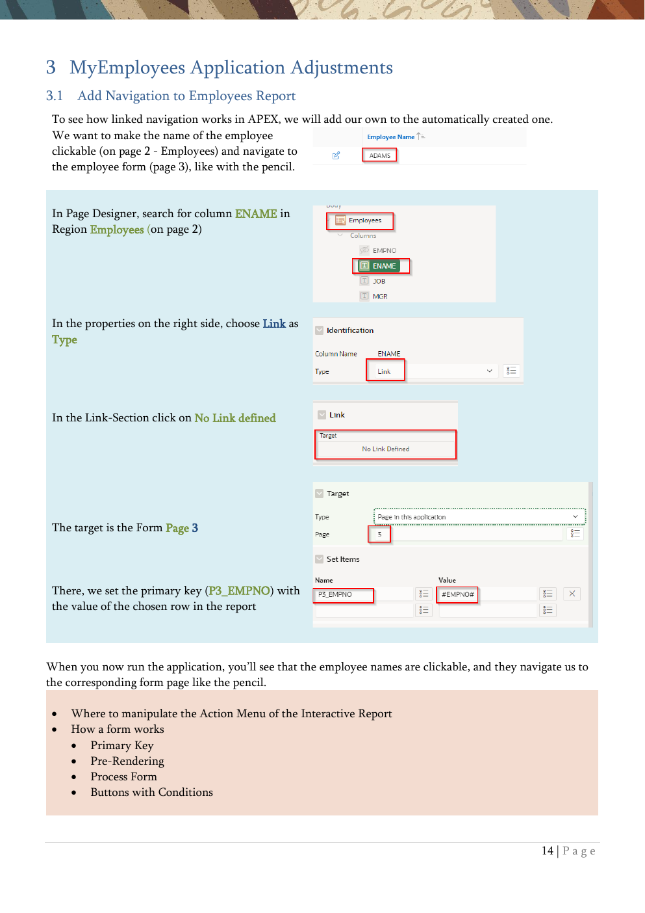

# 3. MyEmployees Application Adjustments

Navigation, formatting, item types, list of values, session state, and behavior.

{ .chapter-image }

## What this chapter covers

- Adds navigation from the employee report to the employee form.
- Formats hire dates consistently in the report and the form.
- Changes the department item to a radio group and adds a job LOV.
- Builds value-dependent behavior with validation, read-only logic, and dynamic actions.
- Explains session state, computations, processes, and branches.

## Workshop transcript

Transcribed from PDF pages 14-22

### PDF page 14

3 MyEmployees Application Adjustments 3.1 Add Navigation to Employees Report To see how linked navigation works in APEX, we will add our own to the automatically created one. We want to make the name of the employee clickable (on page 2 - Employees) and navigate to the employee form (page 3), like with the pencil.

In Page Designer, search for column ENAME in Region Employees (on page 2)

In the properties on the right side, choose Link as Type

In the Link-Section click on No Link defined

The target is the Form Page 3

There, we set the primary key (P3_EMPNO) with the value of the chosen row in the report

When you now run the application, you’ll see that the employee names are clickable, and they navigate us to the corresponding form page like the pencil.

- Where to manipulate the Action Menu of the Interactive Report

- How a form works

- Primary Key

- Pre-Rendering

- Process Form

- Buttons with Conditions

### PDF page 15

3.2 Change the Format of Hiredate in the Report and the Form In this exercise, we will change the display format of the HIREDATE in the form and the report. Depending on the environment, the data format might not be one you like. It’s possible to set a default format for the application, which we haven’t done.

Choose Column HIREDATE in Region Employees on Page 2

In the Appearance section set Format Mask to DD.MM.YYYY

Do the same in the Form Page (3) at item P3_HIREDATE

In the Appearance section choose another Format Mask

Now the format of the date should look like the typical German format. We’ve here shown the setting of a format for a single column or item. It’s possible to set a default format for the application which is used when no dedicated format is chosen.

In the Shared Components

you’ll find the Globalization Attributes in the Globalization section

There you can set the same format

or

### PDF page 16

3.3 Change Item Department from Select List to a Radio Group

On page 3, the item P3_DEPTNO is set as a Select List. We’ll change this now to have a Radio Group instead.

Via the Developer Toolbar, you can quickly reach the properties of an item. Click on Quick Edit and then direct onto the item.

Clicking on the spanner will bring you to the Live Template Options.

If you are in the Page Designer, you don't have to go through the Developer Toolbar. This is just an effective way for developers to jump from the running application to the right place in the Page Designer.

When P3_DEPTNO in Page Designer is selected, choose Radio Group instead of Select List

In the List of Values section suppress the Display of Extra Values or the Null Value

Running the application now should show the department in the Employees Form as Radio Group

The drawing behavior of the model window can be changed at the page level (click on page 3 in the Page Designer at the top left at “Page 3: Employee”) in the Appearance section. Modal Dialog centers the modal window while Drawer inserts it on the side. When testing that, potentially you had to Shift-Reload to see the effect of changing the property

### PDF page 17

It is possible to specify the page size for a modal window, but it is also possible to allow the end user to customise the size of the modal window.

3.4 Add a List of Values for the Job Item The job item in the form is currently a simple Text Field. Now we add a List of Values to this item to let the users select a job from existing jobs in a Select List.

Choose item P3_JOB on page 3 (via Page Designer or Quick Edit)

Choose Select List as Item Type

Immediately, some red color appears for errors. Not only the exclamation mark at the top but also the item in the tree-view and the layout

Click on the exclamation mark, and at the error you want to fix (which is here only one thing)

Choose SQL Query as the Type for the List of Values

As SQL Query choose Code Snippet 2 and write “no job assigned” as Null Display Value

There are two columns in a List of Values Query: one is the Display Column, and the other is the Return Column.

### PDF page 18

When using such a List of Values more than once, it’s better to implement them as a Shared Component and just refer to it here.

Now, when running the application, there should be a Select List at the job item in which you can choose from any existing job in the database, and the Null Display Value is named “no job assigned”

3.5 Behavior depending on values

In this exercise, the Form will be changed to reflect a value-dependent behavior. Our goal is to enforce that only SALESMAN can get a commission (column comm in the table).

3.5.1 Validation

First, we will add a validation that checks that item P3_COMM is null when the job is different from SALESMAN. In our example data, the jobs are stored in uppercase in the database and searches in the database are by default case-sensitive, so we use here SALESMAN in uppercase too.

On Page 3 click right on item P3_COMM and choose Create Validation

The validation (named New by default) is marked red as there are mandatory properties not set at the beginning. These are marked in red too.

As “IS NULL” does not exist as a type for the validation, we choose Expression.

As Language, we use PL/SQL and :P3_COMM is null (Code Snippet 3) will be our PL/SQL Expression. (Don’t forget the colon to reference the page item)

Additionally, we write an Error Message, and we can choose where to display this message.

### PDF page 19

Now we add a condition for when this validation should happen (when the job is not SALESMAN)

Try to give a non-Salesman a commission and see what happens.

3.5.2 Conditional Read-Only

Now we try another approach to ensure that no commission can be entered in the form when the job of the employee is not SALESMAN.

First, we delete the validation from the preceding exercise by right-clicking it and choosing Delete.

Alternatively, you can simply select an object and press DEL

Configure the Read Only Section of the Item P3_COMM with the same settings as before the Server-side Condition for the validation

As an alternative, you can do the same settings in the Server- side Condition section, which hides the item.

Open the form for different employees and see how the item behaves.

3.5.3 Dynamically Show and Hide Item (Dynamic Actions)

In the third approach, we now will hide and show the item depending on the current value of the job dynamically on the client, without interaction with the server (this is called a Dynamic Action).

Delete the Read Only condition from before. This can be done by just choosing – Select – as Type

### PDF page 20

Right-click in P3_JOB and choose Create Dynamic Action

Give the action a Name

Define in the When section when the action should run (when the value of the item job is changed)

As Client-side Condition we define that item P3_Job should be SALESMAN

Click on the pre-initiated True-Action Show

Choose Show as Action for the Affected Element P3_COMM

The we click on the Show-True Event and let us create the Opposite Action (which hides the Item when the job is changed to something different as SALESMAN).

For both actions the property Fire on initialization is activated, so that there’s no need

### PDF page 21

for some extra steps to show or hide the item when loading the page

Now play around and watch the commission item in the form when changing the job. As an alternative, we could have a Dynamic Action without a Client-side Condition and two True-Actions with opposing Conditions.

By the way, In 24.1 a Dynamic Action Event Input was introduced. The event is fired every time the value of the element changes. This is different from the Change event we used in the exercises , which only fires when the value is committed--for example, by pressing the Enter key or selecting a value from a list of value.

3.6 Session State

Client-side Conditions are checking the values of items in the Browser. In contrast to Server-side Conditions, which do this in the Session State, which is stored in the database. So, there’s no need for a roundtrip to the database.

Oracle APEX transparently maintains session state and provides developers with the ability to get and set session state values from any page in the application. To ensure, that a value is in the Session State he must be submitted. You can submit a whole page or just even some items

In the Charts-Chapter you’ll find an example for that.

The session state is achieved with the Session ID, which is a unique number assigned to a specific user for the duration of the user's session.

### PDF page 22

3.7 Computations, Processes & Branches

- Computations

- Processes

o Invoke API -Call Stored Code declarative o Human Tasks – Approval Processes o Execute Code – PL/SQL o Data Loading o Send-EMail o Execution Chain – Order of Execution possible in the Background ▪ e.g., Load Data which might take a long time and send an EMail when it’s finished

- Branches (Submit Page Sequences)

By the way, in Page Designer you sometimes don’t use the Layout pane in the middle. Then choosing elements in the left pane and editing them in the right attributes pane might need a lot of “mouse-meters”. It’s not only possible to change the size of the panes, you can also choose between 2 und 3 panes. The Two-Pane-Mode hides the middle pane

