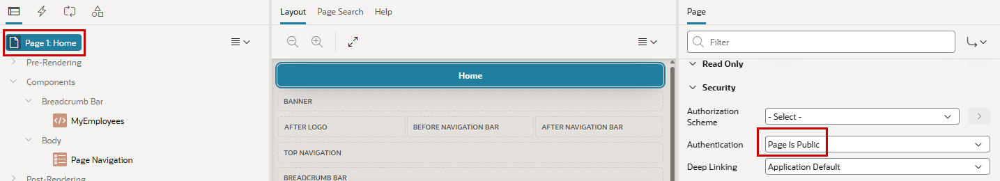
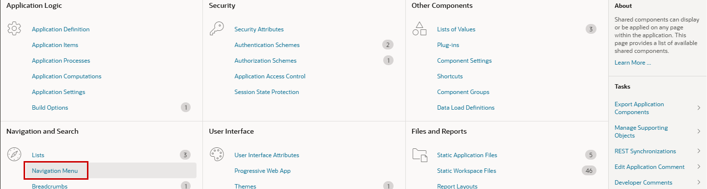
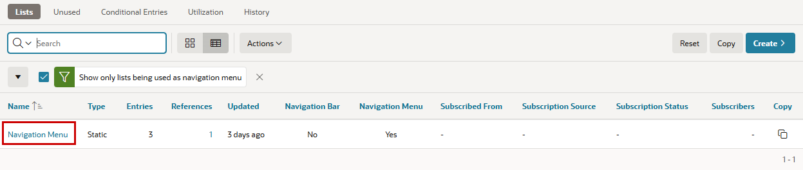
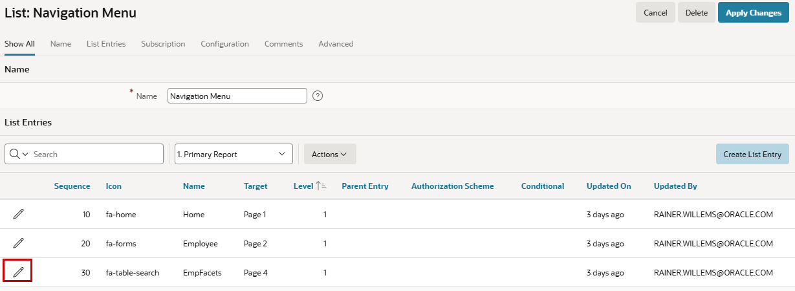
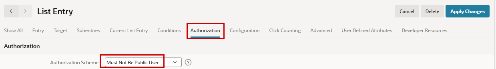
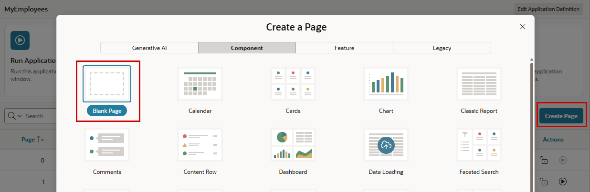
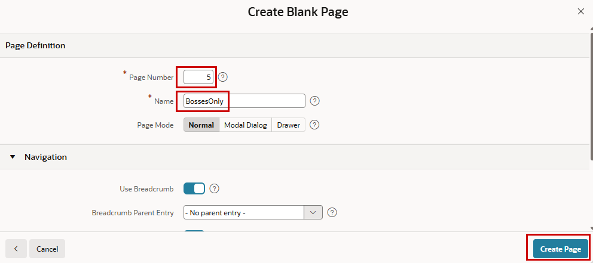
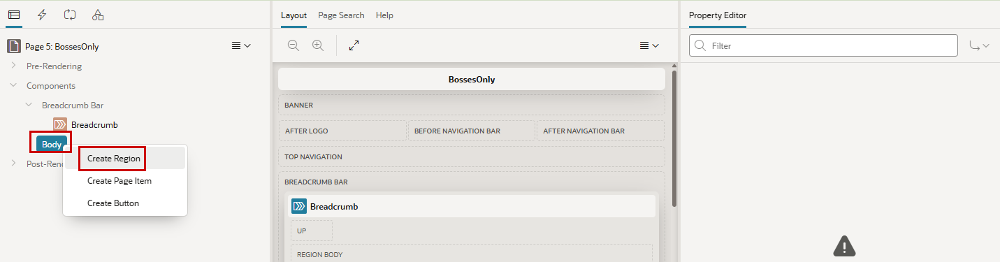
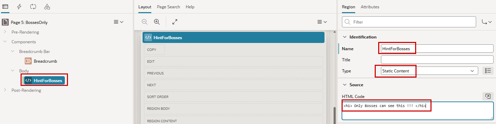

# 4. Authorization

Authorization Schemes control which users are allowed to access specific components within an Oracle APEX application. While Authentication determines *who* a user is, Authorization determines *what* that user is allowed to do. Authorization Schemes can be applied to pages, regions, items, buttons, navigation entries, and processes to restrict access based on predefined rules.

Oracle APEX provides several types of Authorization Schemes, including role-based checks, PL/SQL functions, and custom logic. Authorization is evaluated whenever a protected component is accessed, ensuring that only authorized users can view or interact with the corresponding functionality.

By centralizing access control in Authorization Schemes, developers can implement consistent security policies and simplify the maintenance of application security requirements.

## 4.1 Basics 

First we will look what's possible without authorization.

### 4.1.1 Make Page available without Authentication

The homepage should be reachable without login for Public Users, but when clicking along, the login screen should appear.

!!! exercise "Public Page"
    Go to the Page Designer for page 1 and click on the Page Level. In the properties column in the section Security choose `Page is Public` instead of the default `Page Requires Authentication`as **Authentication**. The property **Authorization Scheme** will be used later.
    { style="display:block;margin:auto;" }

Now when you logout, you will see Page 1 without login (as user **nobody**), and when you navigate to another page, the login screen appears. The properties (Authorization Scheme and Authentication) are available for a lot of objects in APEX.

### 4.1.2 Make Menu Entry only visible for logged-in users

The menu item **EmpFacets** to reach the corresponding page should not be visible to public users (on the now public page 1). After a user is logged in, it should be visible regardless of the specific user.

!!! exercise "Not Public"
    In the **Shared Components** choose **Navigation Menu** in the Navigation section.
    { style="display:block;margin:auto;" }

    There is currently only one menu available, which is also named **Navigation Menu**. Click on the name.
    { style="display:block;margin:auto;" }

    You see the three current menu entries. As we want to change the visibility of the **EmpFacets** entry click the pencil of this row. 
    { style="display:block;margin:auto;" }

    In the **Authorization** section choose `Must Not Be Public User` as **Authorization Scheme**
    { style="display:block;margin:auto;" }

Now, when starting the application, you can see the homepage without logging in. But you won’t see Master Detail in the menu. After logging in (by clicking on the still visible Employees Menu Item), the topic can be seen in the menu.

## 4.2 Use an Authorization Schemes

Now we will create an Authorization Scheme and use this scheme on different objects in the application.

### 4.2.1 Create new page for Bosses

Fist we add a new page for demonstration purposes.

!!! exercise "Create Page BossesOnly"
    Use one of the possible ways to create a new page and choose **Blank Page**. 
    { style="display:block;margin:auto;" }

    We **Name** this Page `BossesOnly` and give them the **Page Number** `5`.
    { style="display:block;margin:auto;" }

    Now we add a Region to the page with the right click on **Body** by choosing **Create Region**.
    { style="display:block;margin:auto;" }
   
    **Name** the new region `HintForBosses`. It's of the **Type** `Static Content` and in the **HTML Code** write anything you want (with or without HTML-Tags) as HTML Code. I've choosen `<h1>Only Bosses can see this !!! </h1>`.
    { style="display:block;margin:auto;" }

### 4.2.2 Create an Authentication Scheme

### 4.2.3 Use Authentication Scheme with Application Objects

#### 4.2.3.1 Only mangers should see the new created page und the corresponding menu entry

#### 4.2.3.2 Only privileged Users should be able to create new Employees

#### 4.2.3.3 Only privileged Users should see Salary & Commission

### 4.3 Filter data depending current user
