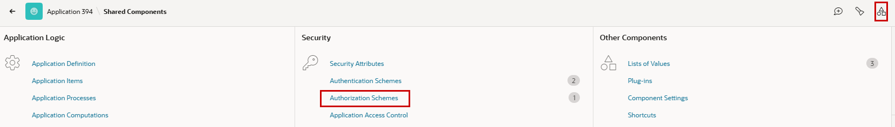
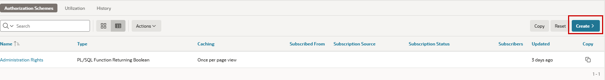
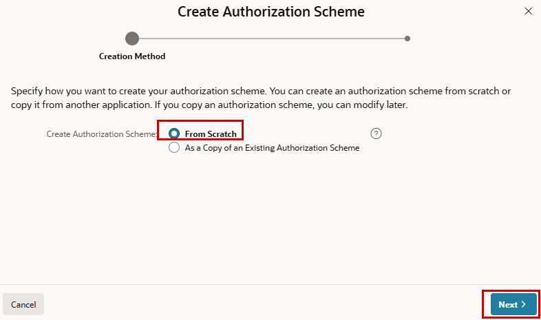
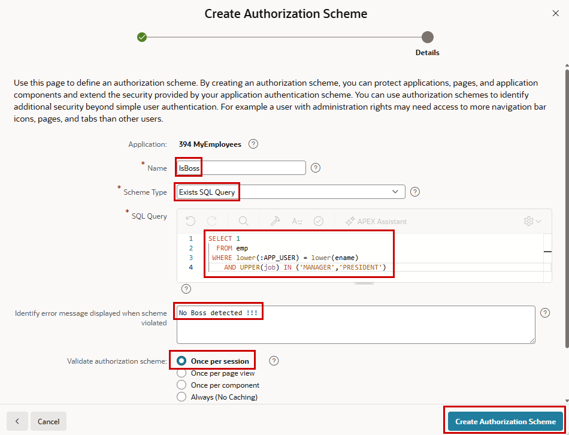
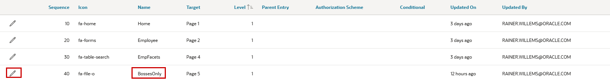
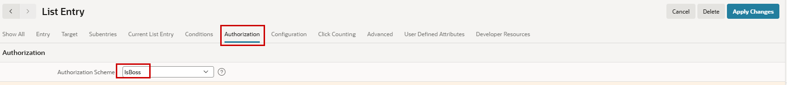
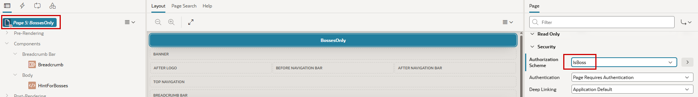
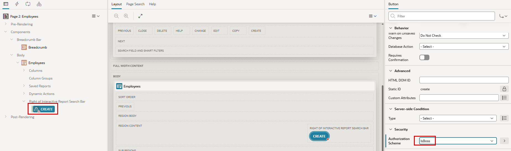
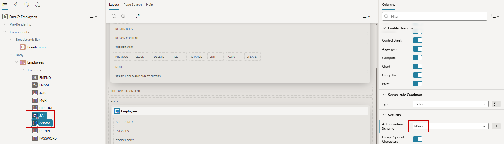
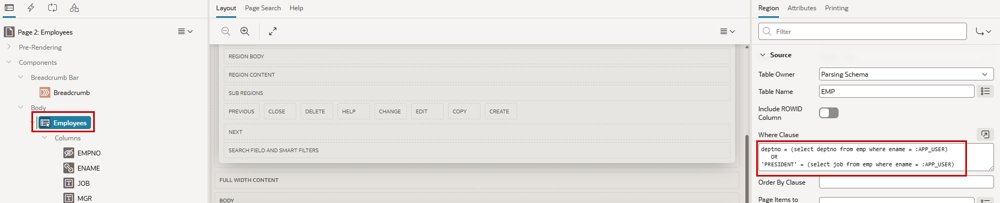

# 4. Authorization

Authorization Schemes control which users are allowed to access specific components within an Oracle APEX application. While Authentication determines *who* a user is, Authorization determines *what* that user is allowed to do. Authorization Schemes can be applied to pages, regions, items, buttons, navigation entries, and processes to restrict access based on predefined rules.

Oracle APEX provides several types of Authorization Schemes, including role-based checks, PL/SQL functions, and custom logic. Authorization is evaluated whenever a protected component is accessed, ensuring that only authorized users can view or interact with the corresponding functionality.

By centralizing access control in Authorization Schemes, developers can implement consistent security policies and simplify the maintenance of application security requirements.

## 4.1 Basics 

First, we will look at what is possible without authorization.

### 4.1.1 Make a Page Available without Authentication

The home page should be reachable without login for public users, but when clicking further, the login screen should appear.

!!! exercise "Public Page"
    Go to Page Designer for page 1 and click the page level. In the properties column, in the **Security** section, choose `Page is Public` instead of the default `Page Requires Authentication` as **Authentication**. The property **Authorization Scheme** will be used later.

    { style="display:block;margin:auto;" }

Now, when you log out, you will see page 1 without login (as user **nobody**), and when you navigate to another page, the login screen appears. The properties **Authorization Scheme** and **Authentication** are available for many objects in APEX.

### 4.1.2 Make a Menu Entry Visible Only for Logged-In Users

The menu item **EmpFacets** to reach the corresponding page should not be visible to public users (on the now public page 1). After a user is logged in, it should be visible regardless of the specific user.

!!! exercise "Not Public"
    In **Shared Components**, choose **Navigation Menu** in the **Navigation** section.
    
    { style="display:block;margin:auto;" }

    There is currently only one menu available, which is also named **Navigation Menu**. Click on the name.
    
    { style="display:block;margin:auto;" }

    You see the three current menu entries. As we want to change the visibility of the **EmpFacets** entry, click the pencil in this row.
    
    { style="display:block;margin:auto;" }

    In the **Authorization** section, choose `Must Not Be Public User` as **Authorization Scheme**.
    
    { style="display:block;margin:auto;" }

Now, when starting the application, you can see the home page without logging in. But you will not see Master Detail in the menu. After logging in (by clicking the still visible Employees menu item), the entry can be seen in the menu.

## 4.2 Use an Authorization Scheme

Now we will create an Authorization Scheme and use this scheme on different objects in the application.

### 4.2.1 Create a New Page for Bosses

First, we add a new page for demonstration purposes.

!!! exercise "Create Page BossesOnly"
    Use one of the possible ways to create a new page and choose **Blank Page**. 
    
    { style="display:block;margin:auto;" }

    Name this page `BossesOnly` and give it the **Page Number** `5`.
    
    { style="display:block;margin:auto;" }

    Now add a region to the page by right-clicking **Body** and choosing **Create Region**.
    
    { style="display:block;margin:auto;" }
   
    Name the new region `HintForBosses`. It is of the **Type** `Static Content`, and in **HTML Code** write anything you want (with or without HTML tags). I have chosen `<h1>Only Bosses can see this !!! </h1>`.
    
    { style="display:block;margin:auto;" }

### 4.2.2 Create an Authorization Scheme

In the Authorization Scheme we will create, we will check if the user is a **MANAGER** or **PRESIDENT**. Therefore, we call this scheme `IsBoss`.

!!! exercise "Create Authorization Scheme"
    In **Shared Components**, go to **Authorization Schemes** in the **Security** section.
    
    { style="display:block;margin:auto;" }

   Create a new Authorization Scheme.
 
   { style="display:block;margin:auto;" }
 
   Choose **From Scratch** and click **Next**.
        
   { style="display:block;margin:auto;" }

   Give the scheme a **Name** (here `IsBoss`) and choose `Exists SQL Query` as **Scheme Type**.
   For the **SQL Query**, use the following code, which checks whether the logged-in user (`:APP_USER`) is in a managerial role.

   ```sql 
      SELECT 1
        FROM emp
       WHERE lower(:APP_USER) = lower(ename)
         AND UPPER(job) IN ('MANAGER','PRESIDENT')
   ```

   Write an error message and validate the rule once per session.

  { style="display:block;margin:auto;" }
   
Now the Authorization Scheme is ready to be used in the application.

!!! bytheway "Referencing Bind Variables"
    *By the way*,<br>
    Bind variables like APP_USER or page items can be integrated in different ways at various points throughout the application:<br>
    - **:MYVARIABLE** - with a colon inside APEX in SQL and PL/SQL as seen in this example.<br>
    - **v('MYVARIABLE')** - with the functions v and nv (for value and numeric value) in PL/SQL code outside of APEX.<br>
    - **&MYVARIABLE.** - enclosed by an ampersand and a dot (do not forget this dot at the end) as a substitution string like in APEX items (Static Text).<br>
    - **#MYVARIABLE#** - enclosed by hash signs as template substitution strings.<br>

### 4.2.3 Use Authorization Schemes with Application Objects

#### 4.2.3.1 Only Managers Should See the Newly Created Page and the Corresponding Menu Entry

In this exercise, we use the **IsBoss** authorization scheme that we just created and assign it to Page 5 at the page level by setting the page's authorization to this scheme.

!!! exercise "Set Authorization Scheme to Menu Entry"
    In **Shared Components**, choose **Navigation Menu** in the **Navigation** section.
    
    { style="display:block;margin:auto;" }

    Click **Navigation Menu**. 
    
    { style="display:block;margin:auto;" }
    
    Choose the **BossesOnly** menu entry by clicking the pencil.
   
    { style="display:block;margin:auto;" }

    Choose the **Authorization Scheme** `IsBoss` in the **Authorization** section.

    { style="display:block;margin:auto;" }

    It is better to secure the corresponding page as well. Go to **BossesOnly** page 5 and, at page level in the **Security** section, choose the **Authorization Scheme**.

    { style="display:block;margin:auto;" }
 
Run the application with different users and check whether you see **BossesOnly** in the menu.

#### 4.2.3.2 Only Privileged Users Should Be Able to Create New Employees

Next, we want to allow only bosses to create new employees in the database.

!!! exercise "Set Authorization Scheme to Button"
    The same thing you did for the page in the step before can be done for the **CREATE** button on page 2.
    
    { style="display:block;margin:auto;" }

Now the form is still usable for editing by other users, but creating a new employee is only reachable by privileged users. To prevent non-privileged users from changing existing employees, you can use the Authorization Scheme for the Apply Changes button on the form.

!!! bytheway "Open Door Credentials"
    *By the way*,<br>
    We can test this here, as we know every credential. However, these are normally not known in real applications. To test the application anyway, the Authentication Scheme **Open Door Credentials** can be used. With this, you simply enter a user name when logging in, without verification. Please do not forget to change this again before you go live.

#### 4.2.3.3 Only Privileged Users Should See Salary and Commission

In the employee report (page 2), there are two financial columns (SAL, COMM). If a non-privileged user opens this report, they should be suppressed.

!!! exercise "Set Authorization Scheme to Columns in a Report"
    Again, but now for both previously mentioned report columns on page 2, set the **Authorization Scheme**.
    Select them together (using the Ctrl key), so you only need to change the property once for both.
    
    { style="display:block;margin:auto;" }

Non-privileged users can now see the report, but without the two financial columns. They can still see salary and commission in the corresponding form, but now you know how to change that (suppress the items) or how to prevent them from reaching the form at all.

### 4.3 Filter Data Depending on the Current User

As the last exercise in this chapter, we want to change the report of the employees so that users can only see employees in their own department. Only the president should see all the data.

!!! exercise "Filter Report Data by Current User"
    Choose the report region **Employees** in Page Designer (page 2) and add a **Where Clause** to the report source that checks if the user is PRESIDENT or if the selected data is only from the same department as the user.

    ```sql 
      deptno = (select deptno from emp where ename = :APP_USER) 
          OR
      'PRESIDENT' = (select job from emp where ename = :APP_USER) 
    ```
 
    { style="display:block;margin:auto;" }

Run the report with different users and check the result.

!!! bytheway "Row Level Security"
    *By the way*,<br>
    **Virtual Private Database (VPD)** might be a great alternative for implementing Row-Level Security. The VPD context can easily be set at the beginning of an APEX session.
    Also, **Real Application Security (RAS)**, the next generation of VPD, provides a declarative model that enables security policies that encompass not only the business objects being protected but also the principals (users and roles) that have permissions to operate on those business objects.
    New with Database 23.26.2, **Oracle Deep Data Security (Deep Sec)** is a database-enforced data authorization framework in the database. It enforces fine-grained access control at the row, column, and cell levels using declarative SQL, securing all access paths to sensitive data across enterprise applications, analytics tools, and agentic AI systems. Deep Sec integrates natively with external identity and access management systems (like Microsoft Entra ID and OCI IAM) to establish end-user security contexts, which ensures that every SQL operation is authorized against the actual requesting user's identity, roles, and attributes.
