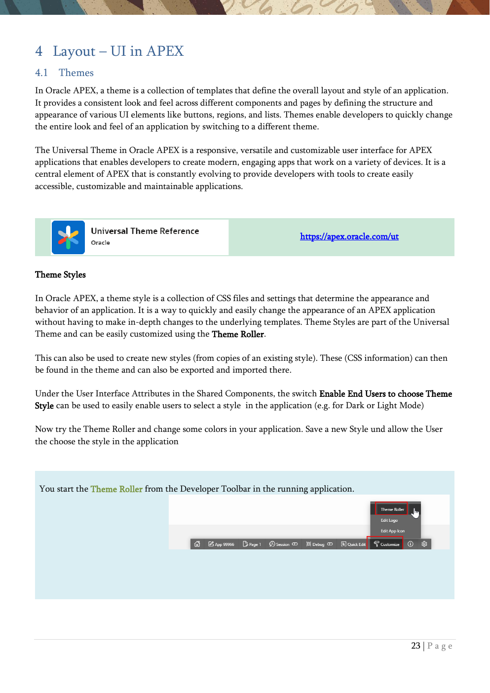

# 4. Layout - UI in APEX

Themes, templates, template components, and UI attributes.

{ .chapter-image }

## What this chapter covers

- Explains the Universal Theme and theme styles.
- Shows how templates and template options shape the UI.
- Introduces template components and how they can be reused.
- Demonstrates styling at the object level with CSS classes and inline CSS.
- Moves the application menu from side navigation to top navigation via UI attributes.

## Workshop transcript

Transcribed from PDF pages 23-32

### PDF page 23

4 Layout – UI in APEX 4.1 Themes In Oracle APEX, a theme is a collection of templates that define the overall layout and style of an application. It provides a consistent look and feel across different components and pages by defining the structure and appearance of various UI elements like buttons, regions, and lists. Themes enable developers to quickly change the entire look and feel of an application by switching to a different theme.

The Universal Theme in Oracle APEX is a responsive, versatile and customizable user interface for APEX applications that enables developers to create modern, engaging apps that work on a variety of devices. It is a central element of APEX that is constantly evolving to provide developers with tools to create easily accessible, customizable and maintainable applications.

Theme Styles

In Oracle APEX, a theme style is a collection of CSS files and settings that determine the appearance and behavior of an application. It is a way to quickly and easily change the appearance of an APEX application without having to make in-depth changes to the underlying templates. Theme Styles are part of the Universal Theme and can be easily customized using the Theme Roller.

This can also be used to create new styles (from copies of an existing style). These (CSS information) can then be found in the theme and can also be exported and imported there.

Under the User Interface Attributes in the Shared Components, the switch Enable End Users to choose Theme Style can be used to easily enable users to select a style in the application (e.g. for Dark or Light Mode)

Now try the Theme Roller and change some colors in your application. Save a new Style und allow the User the choose the style in the application

You start the Theme Roller from the Developer Toolbar in the running application.

https://apex.oracle.com/ut

### PDF page 24

Make some changes and save your changes as new Theme Style

With Select Theme you can choose the Theme you like in Theme Roller.

Select the Themes in Shared Components, choose Universal Theme and scroll down to see the Styles including CSS Code.

In the User Interface Attributes in the Shared Components (could also be reached via the Edit Application Definition Button at the Home Page of the application in the App Builder) search for the Enable End Users to choose Theme Style and enable it.

Now in the left side at the bottom af the application, there’s a Customize Link to choose a style.

4.2 Templates Templates are reusable components that define the structure and appearance of different elements, such as pages, regions or reports. They provide a way to control the HTML output and layout. In addition to an HTML structure and CSS classes, these can also contain JavaScript code.

Template Options then enable variants through the use of different CSS classes or modifiers. For the Universal Theme, these can be nicely illustrated in the Sample App. Live Template Options are these options, which can be changes directly in the running application without switching to the page designer.

Templates contain substitution strings that are replaced by dynamic values at runtime

By the way, There’s a page 0 in APEX. This is a kind of template for the application, as all components of this page will be rendered on all pages of an application. So, there’s only page rendering at page 0 and for example, you can define a footer, which should appear on every site of your application.

### PDF page 25

We create a new Page with a Classic Report

We choose 90 as page number and name the page Layout.

As Data Source we select our table EMP and create the page.

Selecting the Report Region at page 90, you’ll see a Template under Region- Appearance und one under Attributes- Appearance. The first is for the Region itself, the second is a specific Template for a Report.

For every Template, there are Template Options to change predefined properties. Most of them can be changed as “Live Template Option” in the application itself to have a direct Feedback.

Use Quick Edit in the Developer Toolbar and click on the wrench of the corresponding object

### PDF page 26

The definitions of the templates can be found in the Shared Components. There are several different templates for each type.

We see, how often a template is referenced and copy it with the icon at the end.

We will copy the Report Template Namend Standard and use the name MyReportTemplate for our new Report Template.

It’s now in the list and we can click on it to inspect and change it.

We change line 1 in the section Before Rows with Code Snippet 4. This adds a border in a defined color.

And in line 1 of the section Column Templates we use Code Snippet 5 This adds a style with a color and italic for the font.

We save that and now choose our new Template for the Report (remember, in the Attributes Section, not the Region Section) and check the result.

### PDF page 27

4.3 Template Components Before APEX 23.1 for some specific UI-Components you had to use the Classic Report Region with a Template to generate specific output. Therefore, you had to know the used substitution strings.

Template Components are plug-in that allows developers to create reusable UI components with HTML templates and (optional) CSS and JavaScript. They can be used to define new region types, display data as single or multiple rows, and even be used within report columns.

There are some Oracle-provided Template Components, but you can build his own Template Components which than can be used by other developers in a low code manner in APEX.

As a good introduction you can read the great blog Developing a Responsive Number Counter with Oracle APEX: My First Template Component, in which Timo Herwix shows step-by-step how to build a template component using HTML, CSS & some JavaScript and how to integrate and use it in APEX1.

A one-hour introduction to template components was given as APEX Office Hour and is available on Youtube2.

In the Shared Components we go to the Templates, where we changed the report template before. There we create a new Template Component from scratch.

We name it MyTC.

We want to use this Component for single data (Partial) and for multiple lines (Report). So we can use this Template Component for a report (Multiple) or for example in an report for a column (Single).

1 https://tm-apex.hashnode.dev/developing-a-responsive-number-counter-with-oracle-apex-my-first-template-component 2 https://youtu.be/BiKOTn4bL1A

### PDF page 28

A basic structure is now seen

Normally in HTML conditions are not available, but we can use here conditions.

The definition for Partial is referenced by Report Row (Multiple)

We copy Code Snippet 6 into Partial

There’s a reference to another (predefined) Template Component named Avatar.

We want to have a card with that, which rotates and information on both sides of the card. The required CSS Classes referred here, we will add later.

For the Report Row we don’t want to see the typical bullet point for a list und so we add a style suppressing this. This is Code Snippet 7 and we copy it to Report Body.

In the section custom attributes we can define placeholders visible for the developer for intuitive use in page designer. We do that via synchronizing from the template.

If there are more attributes, they can be grouped. We add two groups (Basic and Money) and and assign the attributes to the groups

Attributes not assigned to a group are in the Settings Group per default.

### PDF page 29

We add Job & Commission to the group Money and the others to the group Basis.

Last we copy Code Snippet 8 into the field Report Container. With that a unique DOM ID is generated when the template is invoked, which is useful for referencing other DOM elements in the provided HTML markup.

Now we create a new region named Swap at the “layout” page 90 at the right side of the existing region. As Type we choose are new Template Component und in the source we choose the table emp.

Now clicking in the attributes tab, we see the sections Basis & Money from the Template Component definition. We map the columns accordingly Running this works, but doesn’t look nice, as the CSS is missing. At page level we copy Code Snippet 9 into the attribute CSS – Inline.

Another approach for that is to create a file in the Shared Components – Static Application Files and reference this in the attribute FileURLs above. And potentially smartest and if you want to use this Template Component everywhere with the same CSS, is to reference this file in the Template Component itself, so it’s available independent of the page used.

### PDF page 30

4.4 Layout at Object Level

It’s possible to manipulate layout at object level with adding CSS Classes without modifying or creating Templates.

We will change at the employee form (page 3) the item sal.

In the Appearance section in the CSS Classes attribute add the “word” my-highlight.

Now we need to define this class. This could be done for example – as ssen in the chaper before - at page level in the property CSS – Inline. Use Code Snippet 10 here.

Check the sal item in the application now, there should be a yellow frame around the salary.

### PDF page 31

It’s also possible to add individual HTML styles.

We now go to to the item P3_COMM and set in the Advanced section in the Costum Attributes attribute the style from Code Snippet 11.

The commission should now be shown in red und large.

Last we want to format the name conditional. To do this, we create a dynamic action with the Page Load event. In the True Action wie choose Execute JavaScript Code as Action and copy Code Snippet 12 into the Code field.

The name is now a red background when the job is Manager or President.

By the way, To get a better overview of which environment you are currently connected to (Dev, Test, Production) it’s possible to set a Banner in the Environment for a direct visual hint about that. For that click on the man with the spinner in his hand (Administration, Top-Right), choose Manage Service – Define Environment Banner.

### PDF page 32

4.5 User Interface Attributes User interface attributes include settings that control the appearance of an application's user interface. An important aspect here is the navigation menus and their placement. These settings form the standard for the application, but can be deviated from on individual pages.

There are several possibilities for presenting the menu of an application. Our first app uses a sidebar for the navigation. We change this to a Top-Navigation

Look for the Edit Application Definition Button

Go to the User Interface section

Change Position for Navigation Menu from Side to Top

Run the application and see the new menu

By the way, while many components within Universal Theme automatically make use of several colors, you can use them in custom components as well. Universal Theme provides a number of CSS utility classes that can be used to apply this color palette to any HTML markup. https://apex.oracle.com/pls/apex/r/apex_pm/ut/color-and- status-modifiers

