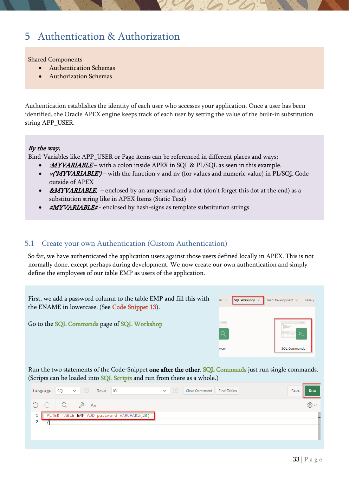

# 5. Authentication & Authorization

Custom authentication, authorization schemes, and row-level access control.

{ .chapter-image }

## What this chapter covers

- Explains APP_USER and the main forms of bind variables and substitution strings.
- Creates a custom authentication scheme using the EMP table.
- Makes the start page public while protecting the rest of the app.
- Restricts menu entries and button actions with authorization schemes.
- Filters report rows so users only see data from their own department unless they are the president.

## Workshop transcript

Transcribed from PDF pages 33-42

### PDF page 33

5 Authentication & Authorization

Shared Components

- Authentication Schemas

- Authorization Schemas

Authentication establishes the identity of each user who accesses your application. Once a user has been identified, the Oracle APEX engine keeps track of each user by setting the value of the built-in substitution string APP_USER.

By the way, Bind-Variables like APP_USER or Page items can be referenced in different places and ways:

- :MYVARIABLE – with a colon inside APEX in SQL & PL/SQL as seen in this example.

- v(‘MYVARIABLE’) – with the function v and nv (for values and numeric value) in PL/SQL Code

outside of APEX

- &MYVARIABLE. – enclosed by an ampersand and a dot (don’t forget this dot at the end) as a

substitution string like in APEX Items (Static Text)

- #MYVARIABLE# - enclosed by hash-signs as template substitution strings

5.1 Create your own Authentication (Custom Authentication) So far, we have authenticated the application users against those users defined locally in APEX. This is not normally done, except perhaps during development. We now create our own authentication and simply define the employees of our table EMP as users of the application.

First, we add a password column to the table EMP and fill this with the ENAME in lowercase. (See Code Snippet 13).

Go to the SQL Commands page of SQL Workshop

Run the two statements of the Code-Snippet one after the other. SQL Commands just run single commands. (Scripts can be loaded into SQL Scripts and run from there as a whole.)

### PDF page 34

and the second statement …

Go to the Shared Components of your application

You can find them on the main page in the menu

or

from the Page Designer by clicking on the three geometrical figures at the top right near the Save-Button

Choose Authentication Schemes

Create a new Authentication Scheme …

…Based on one a pre-configured scheme from the gallery

Give the scheme a name (here MyEmpAuth) with Schema Type Custom …

write myauth into the Authentication Function Name field …

### PDF page 35

and define this function in the Source section with Code Snippet 14.

Instead of using the code here, it could be a Stored Function or a function in a Package in the database.

Create Authentication Scheme

The new scheme is available, but not the used scheme (IS Current)

By clicking on a scheme, a button will appear to change the currently used scheme.

To test the new scheme, you first had to disconnect your current application session. You can do this on any page of the running application at the top right, where you see the currently connected user.

Now you can log in with any of the employee names in the EMP table (using the name in lowercase as the password) and you’ll see the connected user at the top right of the application.

There are also various other preconfigured authentication options available, including Database Accounts, HTTP Header Variables, LDAP, SAML Sign-In (including Multi-Domain Support) or Social Sign-In to use for example the Google Login in APEX, OAuth2 or OpenID Connect Provider.

In the Email Authentication sample, passwordless authentication via tokens sent by email is used.

### PDF page 36

5.2 Change some application behavior depending current User In this exercise, we customize the application to have a Public Page without authentication and we create an Authorization to control which rights different users have.

5.2.1 Make the Start Page visible without Authentication

The homepage should be reachable without login for Public Users, but when clicking along, the login screen should appear

Go to Page Designer for page 1 and click on the Page Level

In the properties column in the section Security choose Page is Public as Authentication.

The property Authorization Scheme will be used in the next exercises.

Now when you logout, you will see Page 1 without login (as user “nobody”), and when you navigate to another page, the login screen appears. These properties (Authorization Scheme and Authentication) are available for a lot of objects in APEX.

By the way, There’s a powerful search capability in APEX in the page designer

which lets you find objects or code fragments in your page, application, or workspace,

### PDF page 37

5.2.2 EmpFacets Menu Entry only visible for logged-in Users

The menu item EmpFacets to reach the corresponding page should not be visible to public users. After a user is logged in, it should be visible regardless of the specific user.

In the Shared Components choose Navigation Menu in the Navigation section

Click again on the Navigation Menu

Click on the EmpFacets menu entry.

In the Authorization section choose Must Not Be Public User as Authorization Scheme

Now, when starting the application, you can see the homepage without logging in. But you won’t see Master Detail in the menu. After logging in (by clicking on the still visible Employees Menu Item), the topic can be seen in the menu.

By the way, when selecting more than one object in the navigator, at the property pane, you’ll see blue triangles and blue, empty fields. This indicates that there are different entries for the chosen items. You can still put it here (for all objects at once).

### PDF page 38

5.3 Create an Authorization Scheme and use this in the application Now we will create an Authorization Scheme and use this scheme on different objects in the application.

5.3.1 Create a new page “BossesOnly”

Use one of the possible ways to create a new page and choose Blank Page

We Name this Page Number 5 BossesOnly

Now we add a simple Region of Type Static Content to this page and give this region the Title Hint.

Write anything you like (with or without HTML- Tags) as HTML Code

5.3.2 Create Authorization Scheme

In the Authorization Scheme we will create, we will check if the user is a MANAGER or PRESIDENT. Therefore, we call this scheme “IsBoss”

In the Shared Components go to the Authorization Schemes in the Security section

Create a new Authorization Scheme

### PDF page 39

… From Scratch

Give the scheme a name (here IsBoss) and choose Exists SQL Query as Type. For the SQL Query use Code Snippet 15.

:APP_USER gives you the current user of the application.

Write an error message and let’s check the rule once per session.

Now the Authorization Scheme is ready to be used in the application. 5.3.3 Change access to objects depending on the Authorization

In this exercise, we use the just-built Authorization Scheme “IsBoss” and set the Authorization of at Page Level for Page 5 to this Scheme.

5.3.3.1 Only Managers should see the BossesOnly menu and the corresponding page

With “IsBoss” we check the user and suppress the BossesOnly menu topic and the corresponding page if the user is neither MANAGER nor PRESIDENT.

Go to the Navigation Menu in the Shared Components

Choose the BossesOnly menu entry

### PDF page 40

Choose the Authorization Scheme IsBoss in the Authorization section

It’s better to secure the corresponding page as well. So go to BossesOnly page 5 and choose, at page level in the Security section, the scheme.

Run the application with different users and check if you see BossesOnly in the menu.

5.3.3.2 Only privileged Users should be able to create new Employees

Next, we want to allow only bosses, to create new employees in the database

The same you’ve done for the page in the step before, you can do for the CREATE button on Page 2

Now the form is still usable for editing by other users, but to create a new employee, it’s only reachable by privileged users. To prevent them from changing existing employees, you can use the Authorization Scheme for the Apply Changes button on the form. We can test this here, as we know every credential. However, these are not normally recognised. In order to be able to test the application anyway, the Authentication Open Door Credentials can be used. With this, you simply enter a user name when logging in without verification. But please don't forget to change this again before you go live

### PDF page 41

By the way, you can choose between two different styles of URLs used for APEX applications. In the properties of the application, you can enable or disable Friendly URLs.

The first one uses the Application ID and the Page ID in the URL, and the other the aliases which you can set in the Page Designer. The property can be reached via the Edit Application Definition or Shared Components – Application Definition. There you can also set the Application Alias, whereas a page alias is set at the page level in the Page Designer.

5.3.3.3 Only privileged Users should see Salary & Commission

In the employee report (page 2) there are both financial columns (SAL, COM). If a non-privileged user calls this report, it should be suppressed.

… and again, but now for both the previously mentioned report columns on page 2, set the Authorization Scheme. Select them together (using the CTRL-Button), so you only need to change the property once for both.

Non-privileged users can now see the report, but without the two financial columns. Ok, they can still see salary and commission in the corresponding form, but now you might know, how to change that (suspend the items) or how to prevent that they can reach the form at all.

### PDF page 42

5.4 Filter the report-rows depending current user As the last exercise in this chapter, we want to change the report of the employees so that users can only see employees in their own department. Only the president should see all the data.

Choose the Report Region Employees in Page Designer (Page 2)

.. and add a Where Clause to the report source. You can use Code Snippet 16 for that.

Run the report with different users and check the result.

By the way, Virtual Private Database (VPD) might be a great alternative to fulfill the task of Row-Level Security. The VPD Context can easily be set at the beginning of an APEX session. Also, Real Application Security (RAS), the next generation VPD provides a declarative model that enables security policies that encompass not only the business objects being protected but also the principals (users and roles) that have permissions to operate on those business objects.

