# 5. Maps

## 5.1 Build a Report with a Form about departments

We want to show geographical information of our departments and therefore we first built a page for that. 

!!! exercise "Create Interactive report with a Form"
    
    We choose Interactive Report in the dialog when creating a new page.

    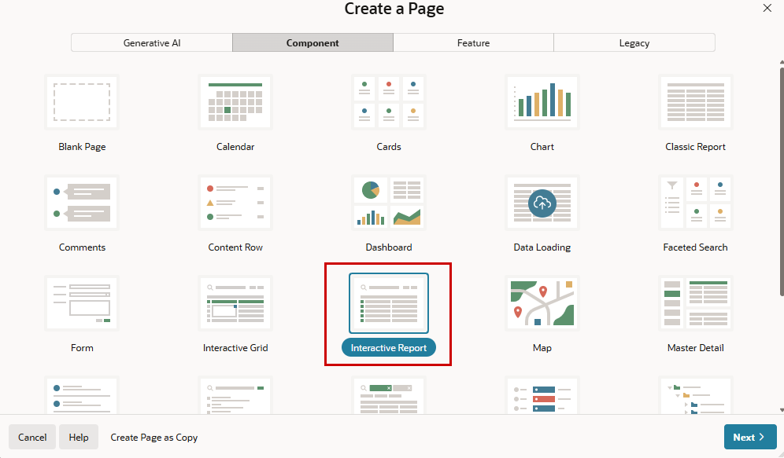{ style="display:block;margin:auto;" }

    Setting (or keeping) the **Page Number** with `6` and **Name** the page `Departments`. After enabling the switch for **Include Form Page** we can set also the number (`7`) and name (`Department`) for the Form Page. In the beginning we’ve seen the creating of a form with an including report (for EMP), which results in the same as this approach here. Finally `Dept` is our **Table** for this two pages.

    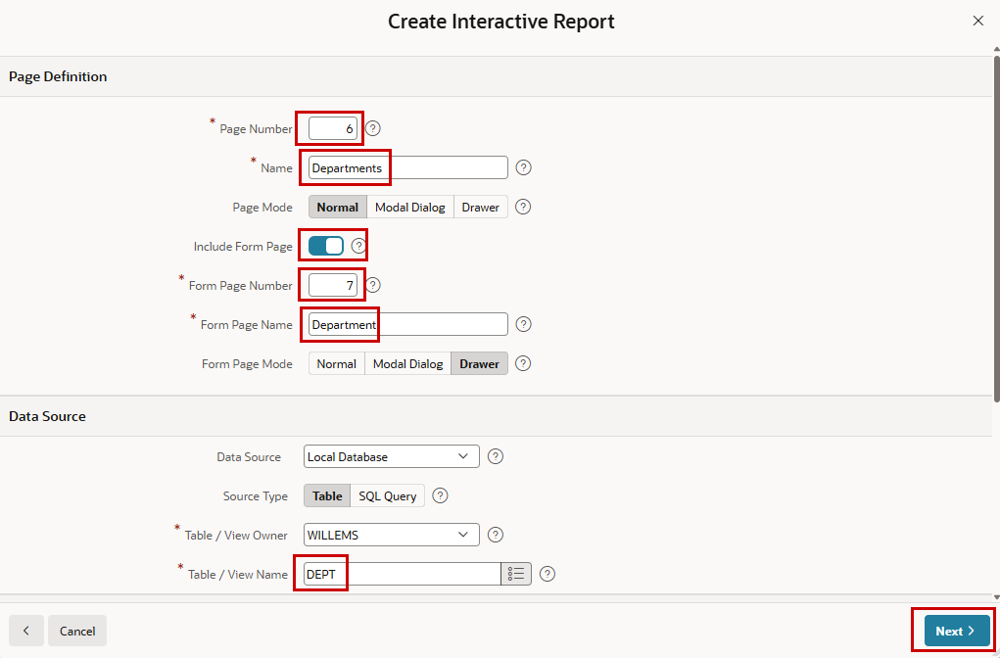{ style="display:block;margin:auto;" }

    After choosing the `DEPTNO` as **Primary Key Column** we create the page(s).

    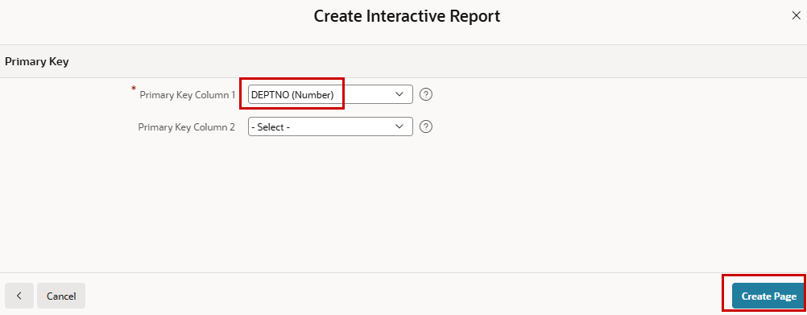{ style="display:block;margin:auto;" }   

    
Run the application to see the new components.

## 5.2 Augment data model to store spatial data and addresses

To store spatial data in the database for our departments, we add a column with the datatype SDO_GEOMETRY. Additionally, we add columns to store besides the city (column “location”) the street, and the zip code.

!!! exercise "Augment table DEPT"
    
    Run the ALTER TABLE command in **SQL Commands**.

    ```sql 
      ALTER TABLE DEPT 
        ADD zipcode     varchar2(20)
        ADD street      varchar2(50)
        ADD geolocation SDO_GEOMETRY
    ```
    
    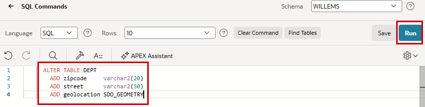{ style="display:block;margin:auto;" }

Have a look at the table dept in the **Object Browser**.

Are you now confused as to why we first created the page and then augmented the table and not the other way around? Surely that would have been easier. But then we wouldn't see how to synchronize regions (the form we just created) with the database. Items do not have to be added individually.

## 5.3 Geocode given addresses

In this exercise, we will enhance the existing form for table DEPT by adding items for zip code and street. Then we add functionality that geocodes a given address and even sanitizes it.
You can add items to forms manually by adding them via the context menu or drag-and-drop from the toolbar at the bottom, and then configure and map them manually to the new database columns.

!!! exercise "Modify Form for Departments"
    
    We just synchronize the form region with the underlying database table. So right-click on the region **Department** on page 7 (the Forms-Page) and select **Synchronize Page Items**

    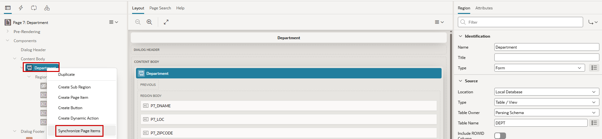{ style="display:block;margin:auto;" }

    APEX detects the added columns and expands the form accordingly. Now we edit the new item **P7_GEOLOCATION** and change the **Type** to `Geocoded Address`. 
    We note, but do not change the settings for **Structured Address**, **Sanitize Address** & **Trigger Geocoding**.
    In the Geocoding Input section, we change **Country** to `Germany` with **Country Type** set to `Static` and add the corresponding page items for **Street Item**, **Postal Code Item** and **City Item** with the appropriate columns of the table dept.

    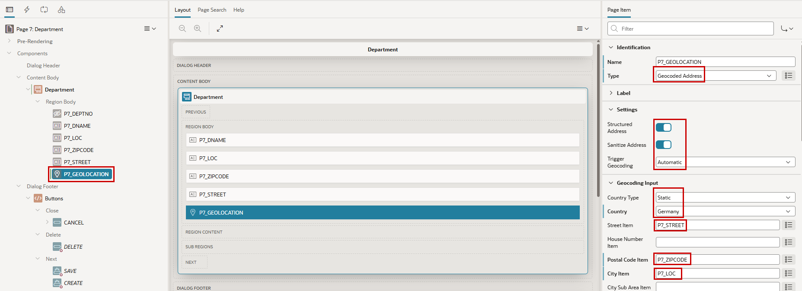{ style="display:block;margin:auto;" }

Now you can use the form to add addresses (in Germany) to the departments. So, choose cities in Germany and add a street (house numbers could be included). A zip code is by the way optional (like street, but street should be better used for geocoding). 

When changing something in the form, the information will be automatically sanitized and geocoded, and the spatial result is stored in the SDO_GEOMETRY column and a map with the address is shown.

!!! bytheway "Oracle eLocation Service"
    *By the way*,<br>
    for the seen maps here, the Oracle eLocation Service is used (https://maps.oracle.com). It can be used without API Key and it’s free in the context of Oracle APEX. There are some default provided styles of maps, but you can use your own maps.
    And since 2019 the features of the formerly known Spatial and Graph Option for the Enterprise Edition are part of the database (Enterprise Edition and Standard Edition 2) without the need of an option. It’s part of the standard installation. If you are using a database that has been running for some time, the SDO_GEOMETRY data type used in the exercise may not be available because it is not automatically added in an upgrade.

## 5.4 Add a map to visualize department locations

On the report page for the departments, we will now add a map region to show all geocoded addresses.

!!! exercise "Add a Map Region"
    
    Drag and drop a Map region from the gallery below the departments region on Page 6.

    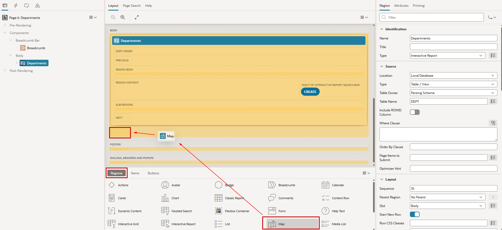{ style="display:block;margin:auto;" }

   Alternatively, you can create such a region with a right-mouse click in the Content Body, choosing **Create Region**, and setting `Map` as **Region Type**.

   Give the region a **Name** (`MyMap`).
 
   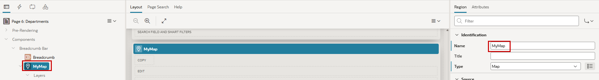{ style="display:block;margin:auto;" }

   Now have a look at the layer which is predefined with some sample data. **Name** and **Label** the layer `location` and choose as source the `Local Database`and there the table `DEPT`. Now there should be two errors marked red  at the exclamation  mark at the top.

   { style="display:block;margin:auto;" }

   Navigating to these errors via scrolling down in the properties or choosing the error message window, you'll find the Column Mapping responsible for the errors. In this section we choose as **Geometry Column Data Type** `SDO_GEOMETRY` and our new column`GEOLOCATION`as **Geometry Column**. And it might be a good idea to define the **Primary Key Column**

   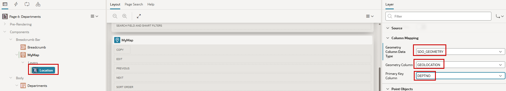{ style="display:block;margin:auto;" }

## 5.5 Refresh map automatically when data changed

Changing an address in the form and coming back to the page with the report and the map, the report is refreshed automatically but the map is not. For the report, there’s already a refresh action there, created from the wizard at page creation. We will now implement the automatic refresh of the map region.

!!! exercise "Automatic refresh of Map Region"
    
    For the report, there's already a refresh action there. We find this action in the Dynamic Actions (the flash) unter Dialog closed. There's a True Action which refreshed the report region when the dialog of the form is closed. We just duplicate this action (right mouse click on the action)

    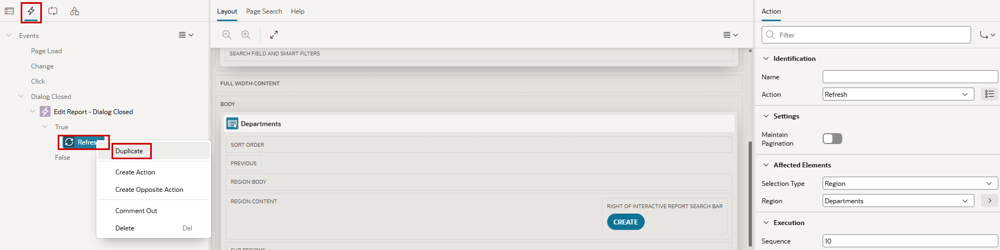{ style="display:block;margin:auto;" }

    For the new Refresh Action (or the other ;)) change the *Region** in the Affected Elements section from Departments to `MyMap`.

    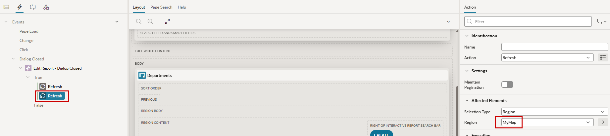{ style="display:block;margin:auto;" }

    It might be a good idea to name the actions accordingly. 

Now change an existing address or add a new department, and the map should be refreshed automatically, like the report. However, we can't see the nice camera flyover to the points just yet.