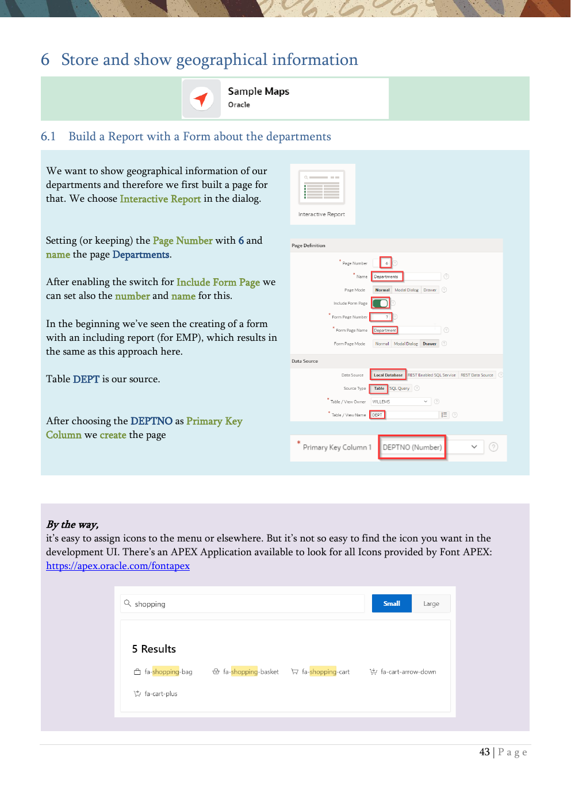

# 6. Store and show geographical information

Spatial data, geocoding, maps, and automatic refresh.

{ .chapter-image }

## What this chapter covers

- Creates a departments page with report and form.
- Adds spatial columns and address fields to the DEPT table.
- Uses geocoding to turn addresses into spatial data.
- Adds a map region that shows department locations.
- Refreshes the map automatically when the underlying form changes.

## Workshop transcript

Transcribed from PDF pages 43-47

### PDF page 43

6 Store and show geographical information

6.1 Build a Report with a Form about the departments

We want to show geographical information of our departments and therefore we first built a page for that. We choose Interactive Report in the dialog.

Setting (or keeping) the Page Number with 6 and name the page Departments.

After enabling the switch for Include Form Page we can set also the number and name for this.

In the beginning we’ve seen the creating of a form with an including report (for EMP), which results in the same as this approach here.

Table DEPT is our source.

After choosing the DEPTNO as Primary Key Column we create the page

By the way, it’s easy to assign icons to the menu or elsewhere. But it’s not so easy to find the icon you want in the development UI. There’s an APEX Application available to look for all Icons provided by Font APEX: https://apex.oracle.com/fontapex

### PDF page 44

6.2 Add datatype to store spatial data and addresses To store spatial data in the database for our departments, we add a column with the datatype SDO_GEOMETRY. Additionally, we add columns to store besides the city (column “location”) the street, and the zip code.

Run the ALTER TABLE command in SQL Command with Code Snippet 17.

Have a look at the table dept in the Object Browser.

Are you now confused as to why we first created the page and then expanded the table and not the other way around? Surely that would have been easier. Yes, but then we wouldn't see how to synchronize regions (the form we just created) with the database. Items do not have to be added individually.

6.3 Geocode given addresses In this exercise, we will enhance the existing form for table DEPT by adding items for zip code and street. Then we add functionality that geocodes a given address and even sanitizes it. You can add items to forms manually by adding them via the context menu or drag-and-drop from the toolbar at the bottom, and then configure and map them manually to the new database columns.

It is easier just to synchronize the form region with the underlying database table. So right-click on the region Department on page 7 (the Forms-Page) and select Synchronize Page Items

APEX detects the added columns and expands the form accordingly

Now we edit the new item P7_GEOLOCATION and change the Type to Geocoded Address

### PDF page 45

We note, but do not change the settings for Structured Address, Sanitize Address & Trigger Geocoding.

In the Geocoding Input section, we change Country (as static type) to Germany und add the corresponding page items for Street Item, Postal Code Item and City Item

Now you can use the form to add addresses (in Germany) to the departments. So, choose cities in Germany and add a street (house numbers could be included). A zip code is by the way optional (like street, but street should be better used for geocoding).

When changing something in the form, the information will be automatically sanitized and geocoded, and the spatial result is stored in the SDO_GEOMETRY column and a map with the address is shown.

By the way, for the seen maps here, the Oracle eLocation Service is used (https://maps.oracle.com). It can be used without API Key and it’s free in the context of Oracle APEX.

There are some default provided styles of maps, but you can use your own maps.

And since 2019 the features of the formerly known Spatial and Graph Option for the Enterprise Edition are part of the database (Enterprise Edition and Standard Edition 2) without the need of an option. It’s part of the standard installation. If you are using a database that has been running for some time, the SDO_GEOMETRY data type used in the exercise may not be available because it is not automatically added in an upgrade.

### PDF page 46

6.4 Add a map with the location of the departments On the report page for the departments, we will now add a map region to show all geocoded addresses.

Drag and drop a Map region below the departments region on Page 6.

Alternatively, you can create such a region with a right- mouse click in the Content Body, choosing Create Region, and setting Map as Region Type

Give the region a name (MyMap) and look for the 2 errors indicated in red at the layer. The first is to choose the table name for the source of the layer.

Click on it and choose DEPT as Table Name in the Source section.

Second is the Geometry Column which is our new column GEOLOCATION.

And it might be a good idea to define the Primary Key Column

A map is shown on the page. Inspect the attributes of the map region to get a feel for what’s possible to customize. Add a second (or more) address(es) in Germany for that.

### PDF page 47

6.5 Refresh the map automatically Changing an address in the form and coming back to the page with the report and the map, the report is refreshed automatically but the map is not. We will now implement the automatic refresh of the map region.

For the report, there’s already a refresh action there.

Go to the Dialog Closed event in the events tab (Page 6, flash-sign) and Duplicate the Refresh Action.

The event will fire when a dialog (our forms page) is closed

For the new Refresh Action change the region in the Affected Elements section from Departments to MyMap

Now change an existing address or add a new department, and the map should be refreshed automatically, like the report.

By the way, When you run an application, the Application Express Engine relies on two processes:

- Page Rendering (Show Page)

This process assembles everything needed to build the viewable HTML page (including items & buttons in or outside regions and all the regions themselves

- Page processing (Accept Page)

This process runs when you submit a page and performs all processing on the page like validations, processes, or computations

