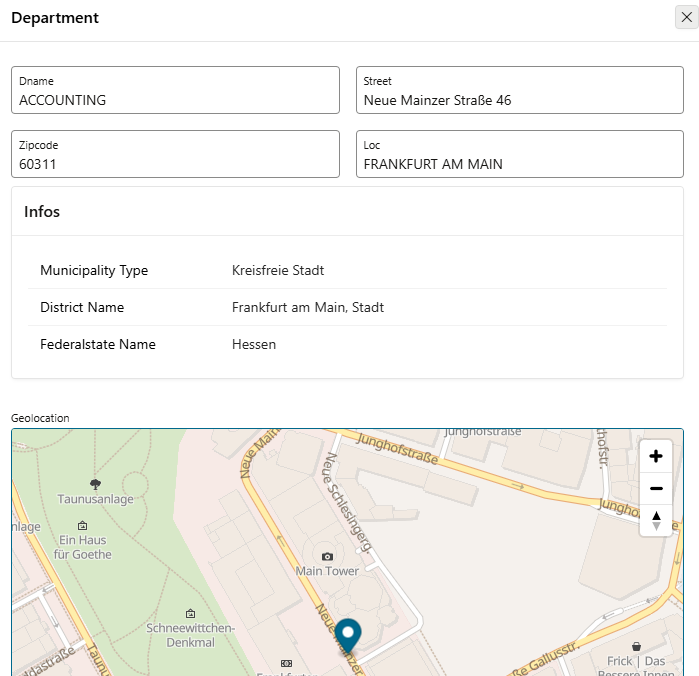

# 6. RESTful Services

!!! sampleapp "Sample App REST Services"
    <div class="two-columns">
      <div style="flex: 50%;">
           Diese Anwendung zeigt, wie externe REST Services aus Oracle APEX heraus angesprochen werden. Die App arbeitet mit dem Beispiel-RESTful-Service oracle.example.hr. Die Beispiele in dieser Anwendung zeigen, wie man einen einfachen tabellarischen Report auf REST-Service-Daten erstellt, filtert und Pagination hinzufügt.
      </div>
      <div style="flex: 50%;">
          { style="display:block;margin:auto;" }
      </div>
    </div>

In diesem Kapitel lesen wir Standortdaten aus einer REST Data Source und fügen sie der Form-Seite der Departments hinzu.

## 6.1 REST Data Source definieren

Zuerst definieren wir die **REST Data Source** einmal in den **Shared Components** der Anwendung, damit wir sie später auf den Seiten verwenden können.

!!! exercise "REST Data Source definieren"

    Wir verwenden für diese Übung einen einfachen, freien REST-Service, der Informationen zu einer gegebenen Postleitzahl zurückgibt, zum Beispiel Landkreis, Bundesland oder Gemeindetyp.

    ```text
         https://openplzapi.org/de/Localities?postalCode=55593
    ```

    Führe diese URL im Browser aus, um die Antwort zu sehen.

    Gehe in **Shared Components** im Abschnitt **Data Sources** zu **REST Data Sources** und klicke auf **Create**.

    Wir verwenden **From scratch** als Methode.

    { style="display:block;margin:auto;" }

    Wähle `Simple HTTP` als **REST Data Source Type** und nenne den Service `locations`. Verwende für den **URL Endpoint** die oben genannte URL.

    { style="display:block;margin:auto;" }

    Nach einem Klick auf **Next** extrahiert APEX den **Remote Server**, die **Base URL** und den **Service URL Path**. Bestätige das mit **Next**.

    { style="display:block;margin:auto;" }

    Wir verwenden keine **Pagination**, da es für eine Postleitzahl nicht viele Daten gibt.

    { style="display:block;margin:auto;" }

    Für Services, die zum Beispiel einen API-Key benötigen, kannst du zuerst Web Credentials in den Shared Components definieren und diese dann in den Services verwenden. Hier nutzen wir einen öffentlichen Service ohne Authentication, daher bleibt der Switch **Authentication Required** deaktiviert. Jetzt können wir den Service mit **Discover** untersuchen.

    { style="display:block;margin:auto;" }

    Wir erhalten drei Tabs. Einer enthält die Daten, die wir bereits im Browser gesehen haben (**Response Body**). Dieselben Daten stehen im Tab **Data**, aber nicht als JSON. Klicke auf den Tab **Data Profile**. Dort entfernen wir Daten aus dem Service, die wir nicht verwenden wollen. Entferne alle Zeilen außer **DISTRICT_NAME**, **FEDERALSTATE_NAME** und **MUNICIPALITY_TYPE** und klicke danach auf **Create REST Data Source**.

    { style="display:block;margin:auto;" }

    Wenn du auf den neu erstellten Service klickst, kannst du die Einstellungen inspizieren und sehen, wo sie später bei Bedarf angepasst werden können. Es gibt auch einen Test-Button.

!!! bytheway "Eigene REST Services"
    *Übrigens*,<br>
    hier integrieren wir bestehende REST Services. In Verbindung mit ORDS (Oracle REST Data Services) ist es möglich, eigene REST Services für deine Daten zu bauen. APEX ist eines der möglichen Werkzeuge, um solche REST Services zu erstellen.
    { style="display:block;margin:auto;" }

## 6.2 Daten aus einer REST Data Source in die Anwendung integrieren

Wir wollen die Standortdaten aus der REST Data Source jetzt auf der Departments-Form anzeigen.

!!! exercise "REST Data Source in der Anwendung verwenden"
    Gehe in den **Page Designer** für Seite 7 **Department**.
    Zuerst ordnen wir die bestehenden Items neu an, damit vertikal etwas mehr Platz entsteht. Das geht per Drag-and-drop oder über die Eigenschaft **Start New Row** (und eventuell **Sequence**) im Abschnitt **Layout** der Items.

    { style="display:block;margin:auto;" }

    Ziehe einen **Classic Report** aus der **Gallery** per Drag-and-drop oberhalb des Items **P7_GEOLOCATION**.

    { style="display:block;margin:auto;" }

    Die neue Region ist jetzt eine Subregion der Department-Region und mit Beispieldaten vorbelegt. Nenne die neue Region `Infos` und wähle als **Location** (der Quelle) `REST Source` statt `Sample Data`. Danach kannst du die zuvor definierte **REST Source** `locations` auswählen.

    { style="display:block;margin:auto;" }

    Du siehst die drei Informationen, die wir aus der REST Source gewählt haben, als **Columns** und `postalCode` als **Parameter**. Sortiere die Spalten in die Reihenfolge MUNICIPALITY_TYPE, DISTRICT_NAME und FEDERALSTATE_NAME. Das geht per Drag-and-drop oder über die Spalteneigenschaft **Sequence**.
    Wähle den Parameter **postalCode** und ändere den **Type** auf `Item`. Dann können wir `P7_ZIPCODE` als **Item** verwenden.

    { style="display:block;margin:auto;" }

    Du kannst die Anwendung jetzt speichern und starten, um das aktuelle Ergebnis zu sehen. Wir wollen es aber noch etwas schöner machen.

    Markiere die Region **Infos** und ersetze im Tab **Attributes** im Abschnitt **Appearance** das **Template** `Standard` durch `Value Attribute Pairs - Column`. Prüfe, dass der **Type** für **Pagination** auf `No Pagination (Show All Rows)` steht.
    Es gibt Postleitzahlen, für die unser einfacher REST Service mehrere Treffer liefert. Zur Vereinfachung können wir die Anzahl der Zeilen auf 1 begrenzen. Dafür passen wir das Attribut **Number of Rows** für die neue Report-Region an.

    { style="display:block;margin:auto;" }

<div class="two-columns">
  <div>
    Jetzt sollte die Seite wie dieses Beispiel aussehen (hier Frankfurt am Main), mit einer Kombination aus lokalen Daten und Remote-Daten über einen RESTful Service.
  </div>
  <div>
    
  </div>
</div>

!!! bytheway "Nested JSON"
    *Übrigens*,<br>
    bis 23.2 konnte APEX nur flache Strukturen aus REST-API-Antworten extrahieren. Ab 24.1 gibt es Unterstützung für verschachtelte JSON-Antworten. Jede APEX-Komponente mit Unterstützung für REST Data Sources unterstützt deshalb Array Columns. Dazu gehören Reports (Classic, Interactive Reports und Grids), Karten und Diagramme, Kalender, Region Plug-ins und Automations.

!!! bytheway "REST Source Catalogs"
    *Übrigens*,<br>
    du kannst REST Services in REST Source Catalogs bündeln (zu finden in **Workspace Utilities**). Dadurch lassen sich diese gebündelten Services einfach mit anderen Workspaces oder Umgebungen teilen. Entwickler können solche Kataloge durchsuchen, die Metadaten über REST Services enthalten, und daraus APEX REST Data Sources erstellen.

!!! bytheway "REST Synchronization"
    *Übrigens*,<br>
    stell dir vor, es kommen viele Daten aus einer REST Data Source, die sich nicht sehr häufig ändern. Dann kann es sinnvoll sein, die Daten lokal zu speichern und in einem passenden Intervall zu synchronisieren. Das kann mit REST Data Source Synchronizations automatisiert werden.

!!! tip "LiveLab"
    Es gibt ein Oracle LiveLab **Build a Movies Watchlist Application using Oracle APEX**, das auf REST Data Sources basiert. Dort lernst du etwas über **Web Credentials**, **REST Catalogs** und **Post Processing** des Ergebnisses von REST Sources.
    Zusätzlich behandelt das LiveLab Cards, Application Items and Processes, Quick SQL, Faceted Search, Template Options und CSS.
    [Hier klicken](https://livelabs.oracle.com/ords/r/dbpm/livelabs/view-workshop?wid=942){target="_blank"}

!!! bytheway "Oracle LiveLabs"
    *Übrigens*,<br>
    Oracle LiveLabs ist eine APEX-Anwendung.
