# 6. RESTful Services

!!! sampleapp "Sample App REST Services"
    <div class="two-columns">
      <div style="flex: 50%;">
           This application showcases how to access external REST services from Oracle APEX. The app works on the sample RESTful Service, oracle.example.hr. The examples in this application illustrate how to create a simple tabular report on REST service data, how to filter, and how to add pagination.
      </div>
      <div style="flex: 50%;">
          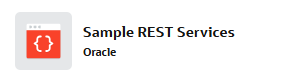{ style="display:block;margin:auto;" }
      </div>
    </div>

In this chapter, we will read location data from a REST Data Source and add it to the form page of the departments.

## 6.1 Define REST Data Source

First, we define the **REST Data Source** once in the **Shared Components** of the application, so we can use it later on the pages.

!!! exercise "Define REST Data Source"
    
    We use a simple, free REST service for this exercise, which returns information for a given zip code, such as district, federal state, or municipality.
    
    ```text
         https://openplzapi.org/de/Localities?postalCode=55593
    ```
    
    Run this URL in your browser to see the response.

    Go to **REST Data Sources** in the **Data Sources** section of **Shared Components** and click the **Create** button.

    We use **From scratch** as the method.

    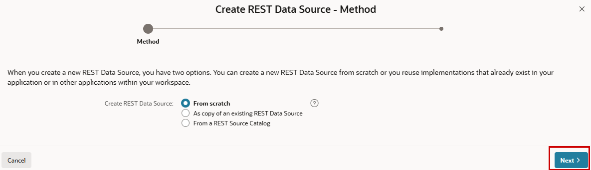{ style="display:block;margin:auto;" }

    Choose `Simple HTTP` as the **REST Data Source Type** and name the service `locations`. For the **URL Endpoint**, use the URL above.

    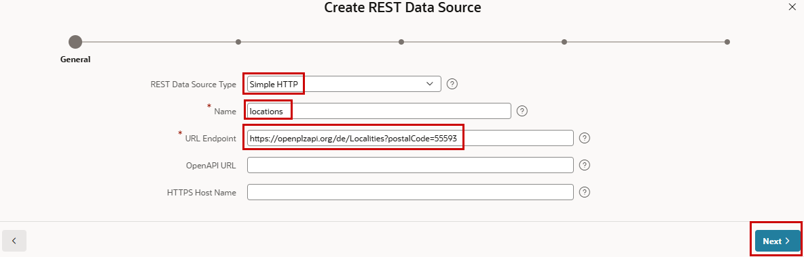{ style="display:block;margin:auto;" }

    After clicking **Next**, APEX extracts the **Remote Server**, the **Base URL**, and the **Service URL Path**. Confirm this with the **Next** button.

    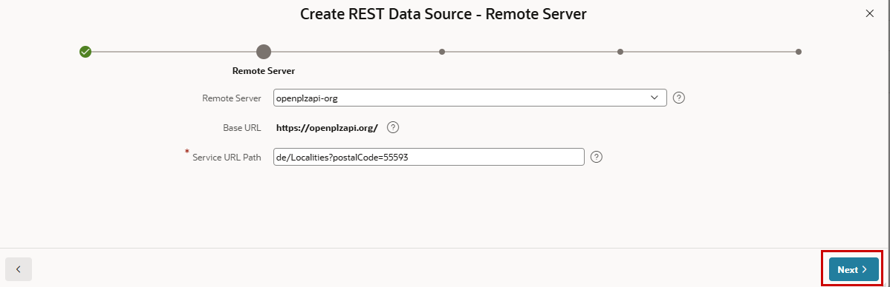{ style="display:block;margin:auto;" }  

    We do not use **Pagination**, as there is not much data for one zip code.

    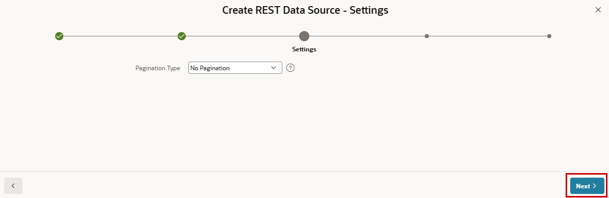{ style="display:block;margin:auto;" }  

     For services requiring, for example, an API key, you can first define Web Credentials in Shared Components, which you can then use in the services. Here we use a public service without the need for authentication, so the **Authentication Required** switch stays disabled. Now we can **Discover** the service.

    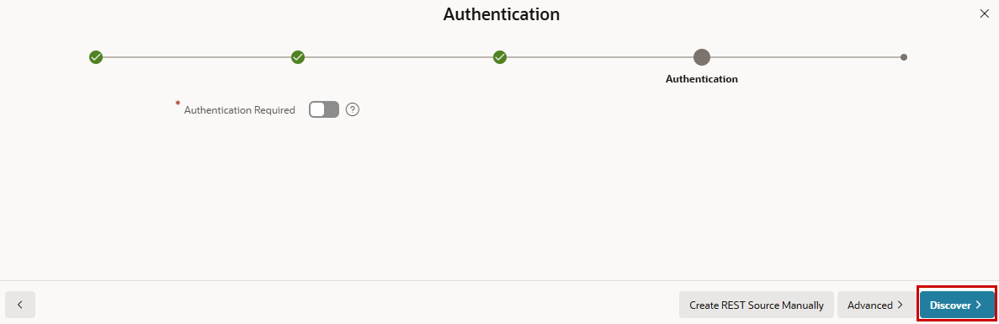{ style="display:block;margin:auto;" }  

    We get three tabs. One contains the data we have already seen in the browser (**Response Body**). The same data is in the **Data** tab, but not as JSON. Click the **Data Profile** tab, where we remove data from the service that we do not want to use. Remove every row other than **DISTRICT_NAME**, **FEDERALSTATE_NAME** and **MUNICIPALITY_TYPE**, and then click **Create REST Data Source**.
    
    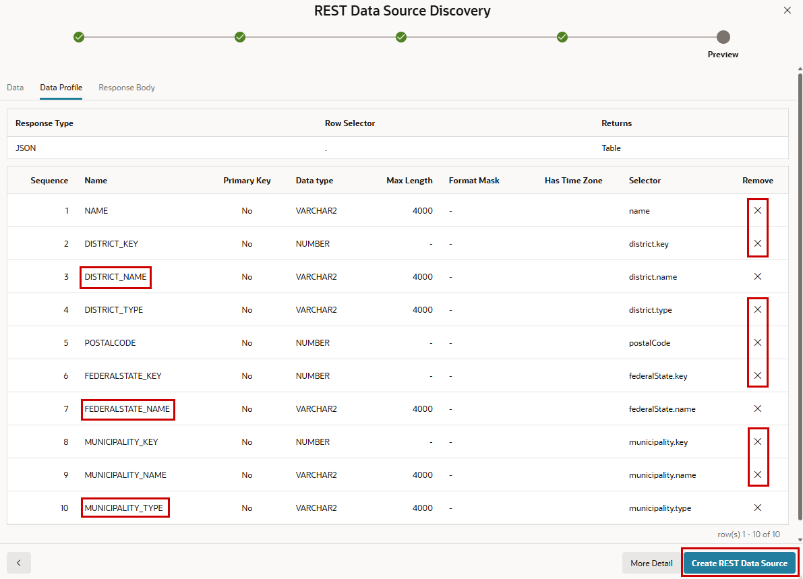{ style="display:block;margin:auto;" } 

    When you click the newly created service, you can inspect the settings and see where you can manipulate them later if needed. There is also a test button.


!!! bytheway "Own REST Services"
    *By the way*,<br>
    Here we integrate existing REST services. In conjunction with ORDS (Oracle REST Data Services), it is possible to build your own REST services for your data. APEX is one of the possible tools to create such REST services.
    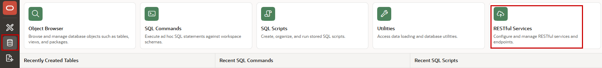{ style="display:block;margin:auto;" } 


## 6.2 Integrate Data from a REST Data Source in the Application

We now want to display the location data from the REST Data Source on the Departments form.

!!! exercise "Use REST Data Source in the Application"
    Go to **Page Designer** for page 7 **Department**. 
    First, we rearrange the existing items to have some more vertical space. This can be done via drag and drop or the property **Start New Row** (and potentially **Sequence**) in the **Layout** section of the items.

    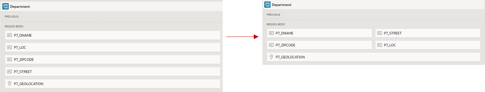{ style="display:block;margin:auto;" }

    Drag and drop a **Classic Report** from the **Gallery** above the item **P7_GEOLOCATION**.
   
    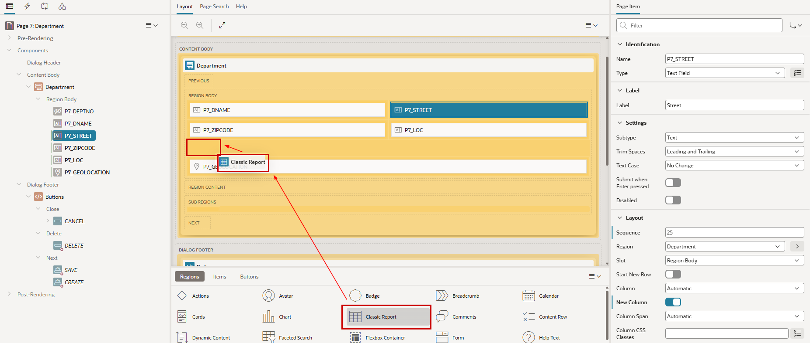{ style="display:block;margin:auto;" } 

    The new region is now a subregion of the Department region (and predefined with some sample data). Name this new region `Infos` and choose `REST Source` as **Location** (of its source) instead of `Sample Data`. Then you can select the **REST Source** `locations` we defined before.

    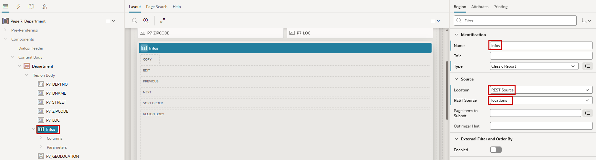{ style="display:block;margin:auto;" } 

     You will see the three pieces of information we have chosen from the REST Source as **Columns** and `postalCode` as **Parameter**. Reorder the columns into MUNICIPALITY_TYPE, DISTRICT_NAME and FEDERALSTATE_NAME. This can be done via drag and drop or the column property **Sequence**.
     Select the parameter **postalCode** and change the **Type** to `Item`. Then we can use `P7_ZIPCODE` as **Item**.

    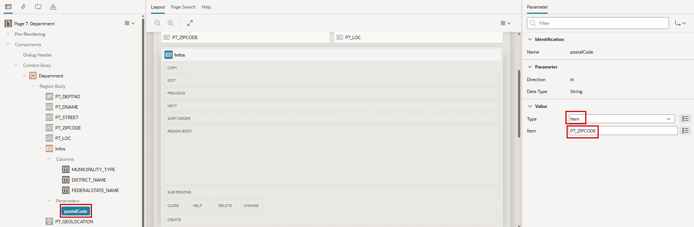{ style="display:block;margin:auto;" } S

    You can now save and run the application to see the current result, but we want to make it a little nicer.

    Mark the **Infos** region and, under the **Attributes** tab in the **Appearance** section, replace the **Template** named `Standard` with `Value Attribute Pairs - Column`. Check that the **Type** for **Pagination** is set to `No Pagination (Show All Rows)`.
    There are postal codes for which there are multiple hits in our simple REST Service. For simplification, we may limit the number of rows to 1. To do this, we adjust the **Number of Rows** attribute for the new report region.

    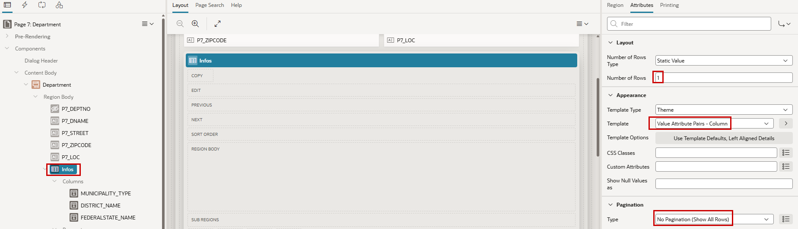{ style="display:block;margin:auto;" } 

<div class="two-columns">
  <div>
    Now the page should look like this example (here Frankfurt am Main), with a combination of local data and remote data through a RESTful service.
  </div>
  <div>
    
  </div>
</div>

!!! bytheway "Nested JSON"
    *By the way*,<br>
    Until 23.2, APEX could only extract flat structures from REST API responses. Beginning with 24.1, there is support for nested JSON responses. Every APEX component with support for REST Data Sources therefore supports Array Columns. This includes reports (Classic, Interactive Reports and Grids), maps and charts, calendars, region plug-ins, and automations.

!!! bytheway "REST Source Catalogs"
    *By the way*,<br>
    You can bundle REST services together in REST Source Catalogs (found in **Workspace Utilities**). This makes it easy to share these bundled services with other workspaces or environments. Developers can search and browse such catalogs that contain metadata about the REST services and create APEX REST Data Sources based on REST service metadata within the catalog.

!!! bytheway "REST Synchronization"
    *By the way*,<br>
    Imagine that there is a lot of data coming from a REST Data Source that may not change very often. It might be a good idea to store and use the data locally and synchronize it at a meaningful frequency. This can be automated with REST Data Source Synchronizations.

!!! tip "LiveLab"
    There is an Oracle LiveLab **Build a Movies Watchlist Application using Oracle APEX** available, which is based on REST Data Sources. There you can learn about **Web Credentials**, **REST Catalogs**, and **Post Processing** the result of REST sources.
    Additionally, you can learn in the LiveLab about Cards, Application Items and Processes, Quick SQL, Faceted Search, Template Options, and CSS.
    [Click here](https://livelabs.oracle.com/ords/r/dbpm/livelabs/view-workshop?wid=942){target="_blank"}

!!! bytheway "Oracle LiveLabs"
    *By the way*,<br>
    Oracle LiveLabs is an APEX Application.
