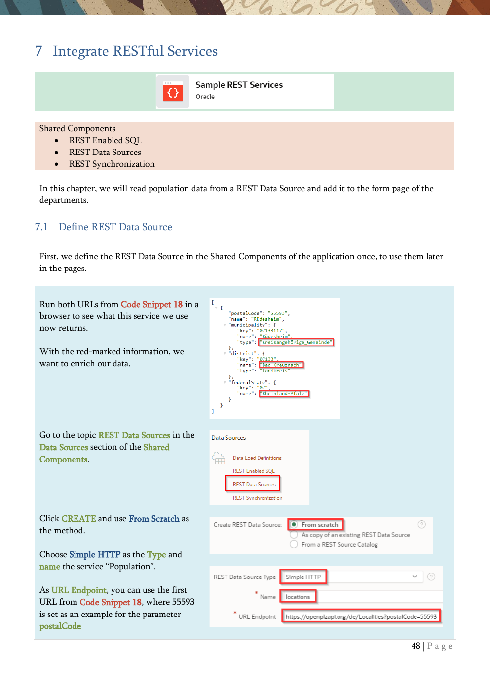

# 7. Integrate RESTful Services

REST data sources, synchronization, nested JSON, and source catalogs.

{ .chapter-image }

## What this chapter covers

- Defines a REST Data Source called Population.
- Uses REST metadata to enrich a local departments page.
- Combines local table data with REST data in a single page region.
- Describes REST synchronization for local storage and periodic refresh.
- Highlights nested JSON support and REST source catalogs.

## Workshop transcript

Transcribed from PDF pages 48-53

### PDF page 48

7 Integrate RESTful Services

Shared Components

- REST Enabled SQL

- REST Data Sources

- REST Synchronization

In this chapter, we will read population data from a REST Data Source and add it to the form page of the departments.

7.1 Define REST Data Source

First, we define the REST Data Source in the Shared Components of the application once, to use them later in the pages.

Run both URLs from Code Snippet 18 in a browser to see what this service we use now returns.

With the red-marked information, we want to enrich our data.

Go to the topic REST Data Sources in the Data Sources section of the Shared Components.

Click CREATE and use From Scratch as the method.

Choose Simple HTTP as the Type and name the service “Population”.

As URL Endpoint, you can use the first URL from Code Snippet 18, where 55593 is set as an example for the parameter postalCode

### PDF page 49

After clicking Next APEX extracts the Remote Server, the BASE URL and the Service URL Path, and you can confirm this by clicking again on the Next button.

We ignore the possible pagination when fetching from the data source.

For services needing, for example, an API key, you can first design Web Credentials in the Shared Components, which you can use in the services. Here we use a public service without the need for authentication.

Discover the service now.

You’ll see the returned data from the service and can inspect the Data Profile.

On the right side, you can remove fields. Please remove everything other than district.name, federalState.name and municipality.type.

Now create the REST Data Source

When you click on the just created service, you can inspect the settings and see where you can manipulate them later if needed. There’s also a test button.

### PDF page 50

By the way, we integrate existing REST Services. In conjunction with the ORDS (Oracle REST Data Services), it’s possible to build your own REST Services for your data with APEX as the development UI. Also, other tools such as SQL Developer, Database Actions from ORDS, or even SQL*Plus or SQLcl can be used for this purpose. But that’s part of another workshop. In addition to the above the ORDS provides further APIs.

https://www.oracle.com/ords

7.2 Integrate Data from REST Data Sources into the application We now want to display the population data from the REST Data Source on the Departments form.

Go to Page Designer for page 7.

First, we rearrange the existing items to have some more vertical space.

Manipulate this layout …

… to get this

Remember, you can do this via Drag & Drop or in the Layout Section of the Items properties (with Start New Row / New Column)

Drag and drop a Classic Report from the bottom of the page above the Item P5_GEOLOCATION

### PDF page 51

Name this new region Infos and choose as Location the value REST Source instead of Local Database. Then you can select the REST Data Source Population from the previous exercise as the REST Source

In Page Designer select the region Infos (which is part of the region Department), open the columns list and reorder them into MUNICIPALITY_TYPE, DISTRICT_NAME and FEDERALSTATE_NAME. This could be done via Drag and Drop or the column property Sequence

Select the parameter postalCode, change the Type from REST Source Default to Item and choose P7_ZIPCODE as Item (as we don’t want to see the values for Zip Code 55595 for every location).

You can now save and run the application to see the current result … but we want to have it a little bit nicer

Mark the Infos region. For a little bit nicer view, we replace under the Attributes Tab in the section Appearance the Template named Standard with Value Attribute Pairs – Column

And set the pagination type to No Pagination.

There are postal codes for which there are multiple hits. For simplification, we may limit the number of rows to 1. To do this, we adjust the Number of Rows attribute for the new report region (under Attributes).

### PDF page 52

Now the page should look like this one (here Frankfurt am Main).

A combination of local data and remote data through a RESTful Service.

Until 23.2 APEX could only extract flat structures from REST API responses. Beginning with 24.1 there’s now support for nested JSON response3. So every APEX component with support for REST Data Sources supports Array Columns. This includes Reports (Classic, Interactive Reports & Grids), Maps & Charts, Calender, Region Plug-Ins and Automations.

7.3 More REST capabilities and other stuff in Oracle LiveLabs There’s a detailed Oracle LiveLab Build a Movies Watchlist Application using Oracle APEX available4. In this LiveLab an application based on several REST Services is built. There you can learn about

- Using Web Credentials to connect via API

Key to a REST Service

- Working with REST Catalogs (collections of

REST definitions)

- Post Processing the Result of REST Sources

and a lot of other topics like

- Card-Regions

- Application Items & Processes

- Quick SQL

- Faceted Search

- Template Options & CSS

There are several other Live Labs about Oracle APEX available5.

By the way, Oracle LiveLabs is an APEX Application: https://apexapps.oracle.com/pls/apex/dbpm/r/livelabs/home

3 https://blogs.oracle.com/apex/post/rest-data-sources-and-nested-json-responses 4 https://apexapps.oracle.com/pls/apex/r/dbpm/livelabs/view-workshop?wid=942 5 https://apexapps.oracle.com/pls/apex/f?p=133:100:::::SEARCH:APEX

### PDF page 53

7.4 Use REST Synchronization to store & use the data locally Imagine that there’s a lot of data coming from a REST Data Source, which potentially didn’t change so often. So, it might be a good idea to store and use the data locally and synchronize them at a meaningful frequency. This can be automated with REST Data Source Synchronizations.

Going to the REST Data Source you want to synchronize, you’ll find the Manage Synchronization link on the right side.

Then you define your local table, which APEX creates for you if wished. That’s a nice example that APEX is very API Driven, as you can see here the API Call creates the table out of the corresponding REST Service definition.

Then you can define if you want to Append, Merge or Replace the data during synchronization and the schedule.

If you try this with our small example service, you will notice that only one data record ends up in the local table, as the zip code is used as a parameter.

7.5 REST Data Sources returning nested JSON Documents REST Data Sources also support REST APIs that return JSON responses with nested arrays. Beginning with APEX 24.1 the Data Profile of a REST Data Source now also contains information about the hierarchy of JSON array elements. If an APEX component is created on the basis of a REST Data Source, an Array Column can now also be selected. This defines the hierarchy level at which the component works.

7.6 REST Source Catalog You can bundle REST Services together in REST Source Catalogs. Then is very easy to share these bundled Services with other Workspaces or Environments. Developers can search and browse through such catalogs that contain metadata about the REST Services and create APEX REST Data Sources based on REST Service metadata within the catalog.

