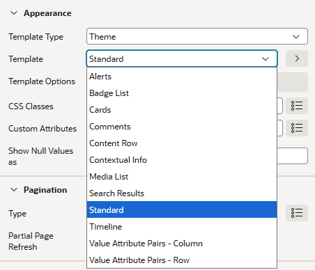
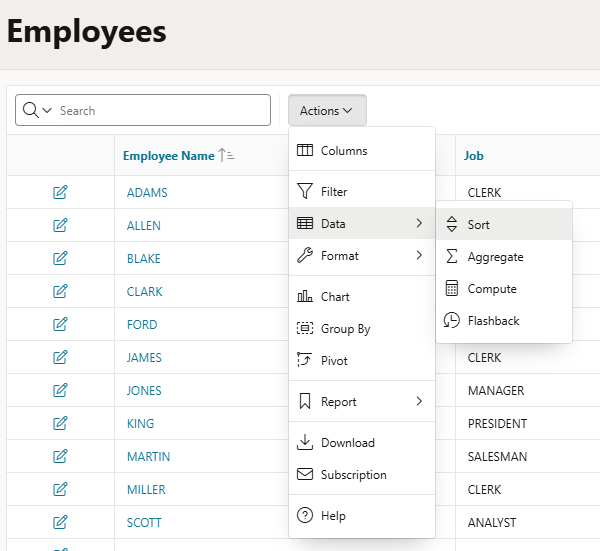
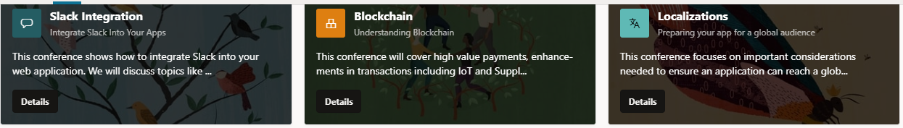
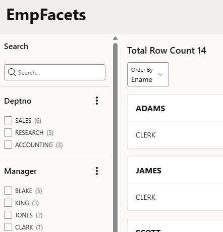
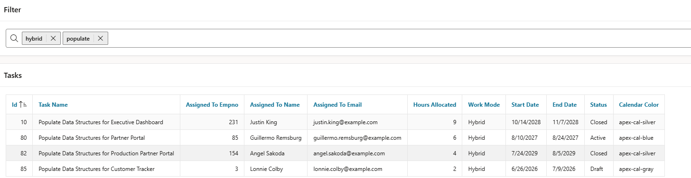

# 7. Reporting und Suche

Dieses Demo-Kapitel enthält keine Übungen.

## 7.1 Reporting-Regionen

!!! sampleapp "Sample App Reporting"
    

      

           Diese Anwendung hebt die Reporting-Fähigkeiten von Oracle APEX hervor. Du kannst Interactive Reports, Interactive Grids, Faceted Search Reports, Cards Reports und Classic Reports deklarativ mit SQL erstellen.
      

      

          { style="display:block;margin:auto;" }
      

    

**Classic Reports**

  

    Ein Classic Report ist eine Liste von Daten auf Basis des formatierten Ergebnisses einer SQL-Abfrage oder einer Tabelle/View. Spaltensortierung ist standardmäßig enthalten. Für Classic Reports gibt es verschiedene Template Options, um andere Ausgaben als Standardlisten zu erzeugen.
  

  

    
  

**Interactive Reports**

  

    Ein Interactive Report ist eine leistungsfähige Reporting-Komponente in Oracle APEX, mit der Endbenutzer Daten analysieren und anpassen können, ohne dass Entwickler eingreifen müssen. Benutzer können Daten direkt im Report sortieren, filtern, suchen, hervorheben, aggregieren, berechnen und gruppieren. Interactive Reports unterstützen außerdem gespeicherte Report-Layouts, Control Breaks, Charts und Daten-Downloads in verschiedenen Formaten. Damit sind sie ideal für Ad-hoc-Analysen und Self-Service-Reporting.
  

  

    
  

**Interactive Grids**

!!! sampleapp "Sample App Interactive Grids"
    

      

           Diese Anwendung zeigt die Features und Funktionen des Oracle APEX Interactive Grid. Über die Beispielseiten können Benutzer vielseitige Fähigkeiten erkunden, zum Beispiel umfangreiches Reporting, einfache Datenbearbeitung und intuitive Pagination.
      

      

          { style="display:block;margin:auto;" }
      

    

Ein Interactive Grid kombiniert die Reporting-Fähigkeiten eines Interactive Reports mit eingebauter Datenbearbeitung. Benutzer können Daten sortieren, filtern, anpassen und analysieren und gleichzeitig Datensätze direkt im Grid erstellen, aktualisieren und löschen.

**Cards**

!!! sampleapp "Sample App Cards"
    

      

           Diese Anwendung hebt Cards-Regionen in Oracle APEX hervor. Cards-Regionen sind ein nativer Regionstyp. Sie geben Entwicklern eine leistungsfähige und flexible Möglichkeit, Daten in kompakten Blöcken darzustellen, ideal für Faceted Search oder für Informationen auf einen Blick.
           Diese App ist online verfügbar unter: [https://apex.oracle.com/go/sample_cards](https://apex.oracle.com/go/sample_cards){target="_blank"}
      

      

          { style="display:block;margin:auto;" }
      

    

Cards sind ein nativer Report-Regionstyp in Oracle APEX, der Daten als Sammlung kompakter, visuell ansprechender Blöcke darstellt. Card-Regionen eignen sich besonders für Faceted-Search-Anwendungen und Dashboards, in denen Informationen leicht erfassbar präsentiert werden sollen.

Entwickler können viele Aspekte einer Card anpassen, darunter Layout, Erscheinungsbild, Icons, Badges, Medien und Actions. Jede Card kann mehrere Actions unterstützen, sodass Benutzer zu verwandten Seiten navigieren oder bestimmte Funktionalität ausführen können.

Medieninhalte können aus einer BLOB-Spalte, einer URL, in einem iframe eingebetteten Videos oder Oracle-JET-Datenvisualisierungen stammen. Dadurch sind Cards eine vielseitige Option für moderne Anwendungsoberflächen.

{ style="display:block;margin:auto;" }

!!! sampleapp "Sample App Brookstrut"
    

      

           Die Brookstrut-Beispielanwendung analysiert ein vereinfachtes gespeichertes Datenmodell und enthält eine Funktion zur Erzeugung zufälliger Daten, von kleinen bis sehr großen Datenmengen. Sie zeigt Oracle-APEX-Fähigkeiten in Datenreporting, Navigation und Datenpräsentation. Mit diesem Werkzeug kannst du verschiedene Oracle-APEX-Komponenten erkunden, darunter Faceted Search, Interactive Reports, Content Row Reports und Kalender.
      

      

          { style="display:block;margin:auto;" }
      

    

## 7.2 Suchfunktionen

**Faceted Search**

  

    Faceted Search bietet Benutzern eine intuitive Möglichkeit, große Datenmengen zu durchsuchen und zu filtern. Typischerweise besteht sie aus einer Suchregion mit mehreren Filter-Facets und einer Ergebnisregion, die passende Datensätze anzeigt. Wenn Benutzer Filter anwenden, werden die Ergebnisse dynamisch aktualisiert. So lassen sich große Datenmengen leicht eingrenzen.
    Am Anfang dieses Workshops haben wir mit dem Create Application Wizard eine Faceted-Search-Seite erzeugt. Das hat gezeigt, wie schnell Oracle APEX mit minimaler Konfiguration eine leistungsfähige Suchoberfläche erstellen kann.
  

  

    
  

**Smart Filters**

Smart Filters bieten eine kompakte und benutzerfreundliche Alternative zu Faceted Search. Statt mehrere Filtersteuerelemente anzuzeigen, verwenden Smart Filters ein einzelnes Suchfeld, in das Benutzer Suchbegriffe eingeben und Filter dynamisch anwenden können. Die Suchergebnisse können mit verschiedenen Regionstypen angezeigt werden, zum Beispiel Cards, Classic Reports, Maps oder Calendars.

Während Faceted Search gut für komplexe Filterszenarien geeignet ist, bieten Smart Filters ein platzsparenderes Layout und sind ideal für Anwendungen, die eine einfache und intuitive Suche benötigen.

{ style="display:block;margin:auto;" }

**Application Search**

!!! sampleapp "Sample App Application Search"
    

      

           Diese Anwendung zeigt die Application-Search-Funktion, die mit APEX 22.2 eingeführt wurde. Search Configurations und Search Regions ermöglichen Entwicklern, robuste Suchmaschinen-Funktionalität zu APEX-Anwendungen hinzuzufügen.
      

      

          { style="display:block;margin:auto;" }
      

    

Die Application-Search-Funktion bietet eine nahtlose Sucherfahrung, die sich wie eine Suchmaschine innerhalb deiner Anwendung anfühlt. Benutzer können Daten über mehrere Datenquellen hinweg durchsuchen und finden so leichter die benötigten Informationen.
Mit Application Search kannst du mehrere Search Configurations erstellen, die eine lokale Datenquelle, REST-enabled SQL oder eine REST API durchsuchen. Dadurch kannst du Benutzern eine umfassende Sucherfahrung bieten und relevante Informationen aus unterschiedlichen Quellen abrufen.
Search Configurations enthalten Informationen über eine durchsuchbare Datenquelle und abstrahieren konkrete Suchimplementierungen. Das bietet Flexibilität und Spielraum für zukünftige Verbesserungen. Du kannst deine **Search Configurations** unter **Shared Components** -> **Navigation and Search** -> **Search Configurations** erstellen und verwalten.

