# 8. Diagramme

!!! sampleapp "Sample App Charts"
    <div class="two-columns">
      <div style="flex: 50%;">
           Diese Anwendung hebt die Charting-Faehigkeiten von Oracle APEX hervor. Sie zeigt, wie du deine Anwendungen erweitern kannst, um Daten visuell darzustellen, mit deklarativen und plug-in-basierten Charting-Loesungen.
           Diese App ist online verfuegbar unter: [https://apex.oracle.com/go/sample_charts](https://apex.oracle.com/go/sample_charts){target="_blank"}
      </div>
      <div style="flex: 50%;">
          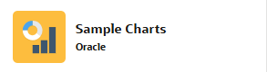{ style="display:block;margin:auto;" }
      </div>
    </div>

In dieser Uebung bauen wir ein Pie Chart und ein Bar Chart. Das Pie Chart (Summe der Gehaelter pro Abteilung) soll klickbar sein, sodass das Bar Chart (Gehaelter der Mitarbeitenden) abhaengig von der im Pie Chart angeklickten Abteilung aktualisiert wird. Es werden nur Mitarbeitende dieser Abteilung angezeigt.

## 8.1 Seite mit zwei Charts erstellen

Zuerst erstellen wir eine neue Seite mit einem Chart.

!!! exercise "Seite mit Chart erstellen"

    Erstelle eine Seite und klicke auf **Chart**. Die Option **Dashboard** erzeugt eine Seite mit vier Charts.

    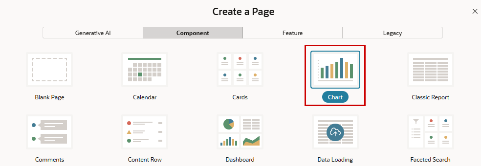{ style="display:block;margin:auto;" }

    Wir beginnen mit einem **Pie Chart**.

    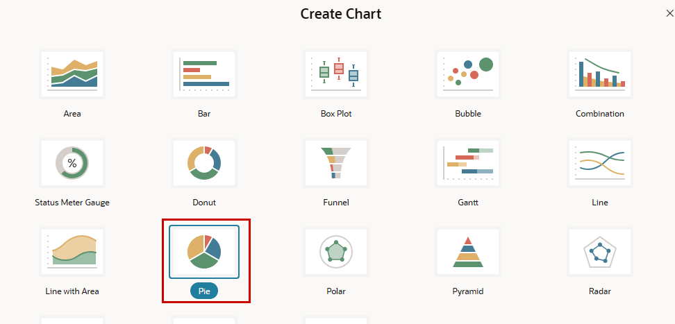{ style="display:block;margin:auto;" }

    Waehle `8` als **Page Number** und gib der Seite einen **Name** (zum Beispiel `MyCharts`).
    Als **Data Source** verwenden wir eine **SQL Query** statt einer Tabelle. Im SQL-Statement berechnen wir die Summe der Gehaelter pro Abteilung.

    ```sql
        SELECT deptno, SUM(sal) AS deptsummary
          FROM emp
          GROUP BY deptno
          ORDER BY deptno
    ```

    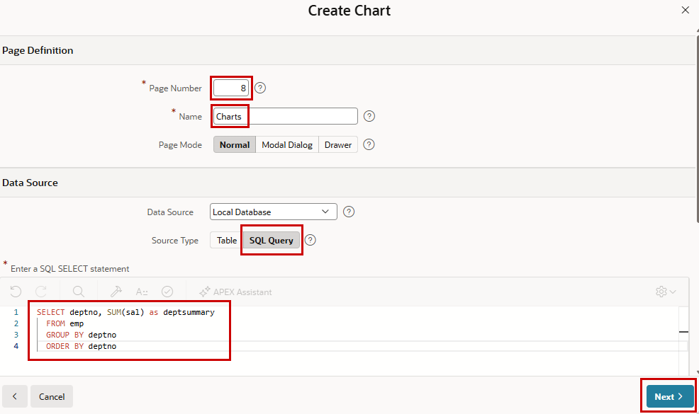{ style="display:block;margin:auto;" }

    Im naechsten Schritt setzen wir die **Label Column** und die **Value Column** fuer das Pie Chart.

    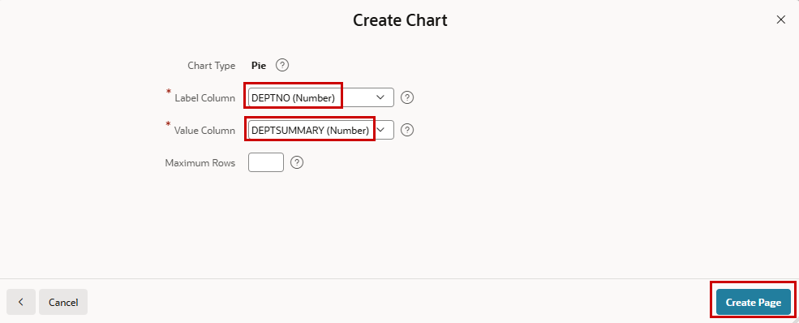{ style="display:block;margin:auto;" }

    Sieh dir den Page Designer an. Du siehst eine Chart-Region mit einer Serie. Sowohl die Region als auch die Serie koennen eine Data Source haben. In diesem Fall wird die Query als Data Source der Serie verwendet, und das Chart selbst hat keine Data Source. Es ist moeglich, die Data Source des Charts in einer Serie zu referenzieren, sodass mehrere Serien auf denselben Daten mit nur einem Request basieren koennen. Mit unterschiedlichen Quellen auf Serienebene kannst du mehrere Datenquellen im selben Chart verwenden.
    Jetzt wollen wir ein Bar Chart mit mehr als einer Serie hinzufuegen (Gehalt und Provision der Mitarbeitenden). Hier verwenden wir die Data Source in der Region und referenzieren sie in der Serie. Ziehe dafuer eine **Chart**-Region aus der Gallery per Drag-and-drop rechts neben das bestehende Chart.

    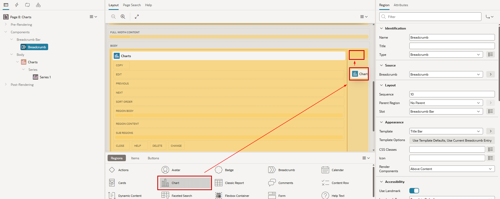{ style="display:block;margin:auto;" }

    Nenne die neue Region `Employees` und waehle `Chart` als **Type**. Die **Location** unserer Quelle ist die `Local Database`, und der **Table Name** ist unsere Tabelle `EMP`. Wenn du moechtest, kannst du den Namen des ersten Charts und seiner Serie aendern.

    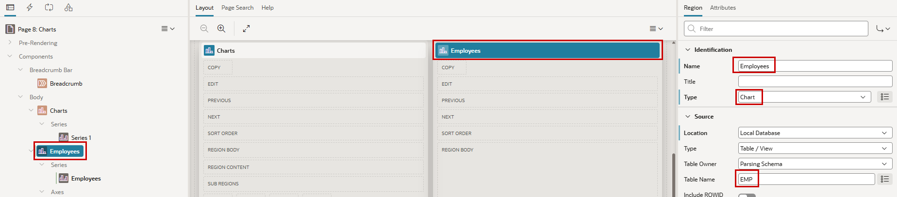{ style="display:block;margin:auto;" }

    Aendere im Tab **Attributes** den Chart-**Type** auf Bar, falls er nicht bereits gesetzt ist.

    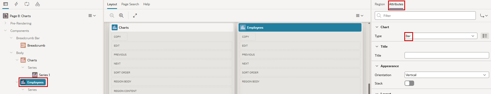{ style="display:block;margin:auto;" }

    Die Serie des neuen Charts ist wieder mit Beispieldaten vorbelegt. Nenne die Serie `Salary` und ersetze die vordefinierte **Location** `Sample Data` durch **Region Source**, die auf die Datenquelle der Region selbst zeigt. Jetzt koennen wir Daten aus dieser Quelle auswaehlen und **Label** auf `EMPNO` sowie **Value** auf `SAL` setzen. Da Aggregation hier irrelevant ist, setzen wir die Eigenschaft **Value Aggregation** auf `No Aggregation`.

    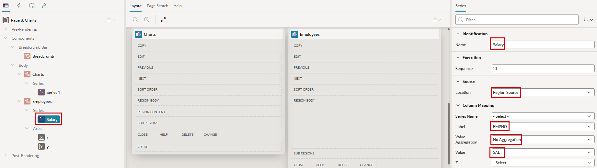{ style="display:block;margin:auto;" }

    Jetzt koennen wir diese Serie **Duplicate** (Rechtsklick auf die Serie) und nur den **Name** auf `Commission` sowie den **Value** von `SAL` auf `COMM` aendern.

    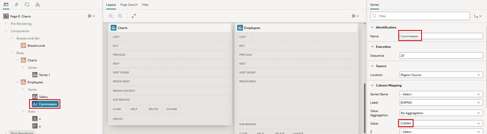{ style="display:block;margin:auto;" }

Jetzt stehen die beiden Charts unabhaengig nebeneinander.

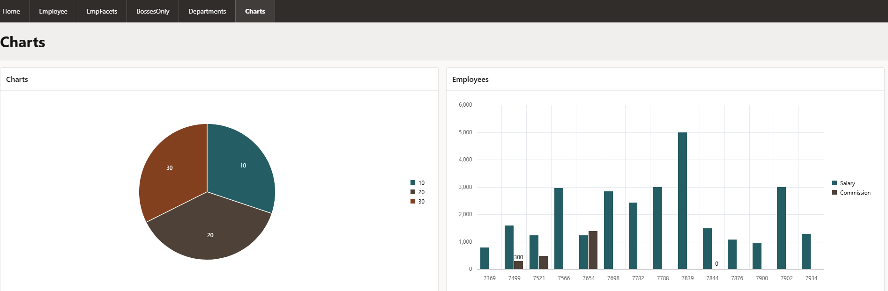{ style="display:block;margin:auto;" }

## 8.2 Ein Chart durch Klick auf ein anderes aendern

Jetzt wollen wir im Bar Chart nur Mitarbeitende aus der Abteilung anzeigen, die im Pie Chart ausgewaehlt wurde (durch Klick auf ein Segment). Dafuer verwenden wir ein verstecktes Item, das durch den Klick gefuellt und danach als Filter fuer das zweite Chart verwendet wird.

!!! exercise "Ein Chart durch Klick auf ein anderes aendern"

    Erstelle ein Page Item im Body (per Rechtsklick auf **Body**). Nenne dieses Item `P8_DEPTNO`. Position oder Label sind irrelevant, weil dieses Item spaeter versteckt wird (als **Type**), aber fuer den Anfang behalten wir `Text Field` als **Type**, damit wir sehen, was mit dem Item passiert.

    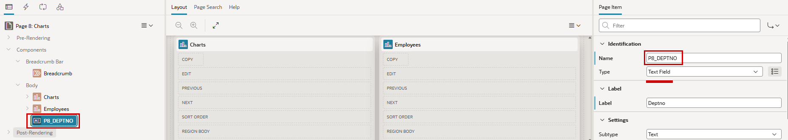{ style="display:block;margin:auto;" }

    Wir verwenden dieses Item jetzt als Filter fuer das Bar Chart. Fuege dafuer diese Clause zur **Where Clause** der Region **Employees** hinzu. Wenn `P8_DEPTNO` null ist, werden alle Abteilungen angezeigt.

    ```sql
           deptno = nvl(:P8_DEPTNO,deptno)
    ```

    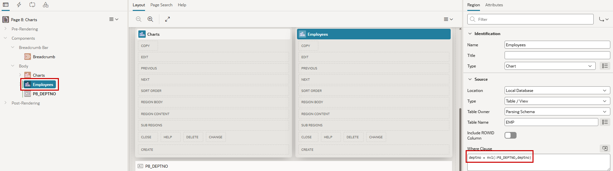{ style="display:block;margin:auto;" }

    Waehle jetzt die Serie des ersten Charts aus (sie heisst **Chart** und **Series1**, wenn du sie nicht geaendert hast). Setze im Abschnitt **Link** den **Type** auf `Redirect to Page in this Application`. Dann erscheint die Eigenschaft **Target**, und du kannst auf **No Link Defined** klicken.

    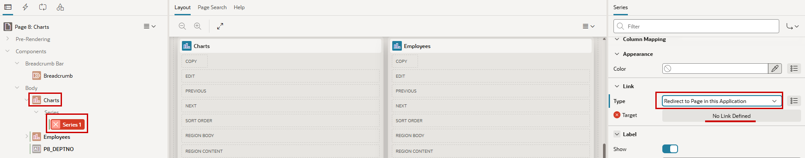{ style="display:block;margin:auto;" }

    Setze `8` (die gleiche Seite, auf der wir sind) als **Page** fuer das **Target** und mappe das Page Item `P8_DEPTNO` auf den Wert der Chart-Region (`&DEPTNO.`). Das kannst du ueber die Menue-Icons tun.

    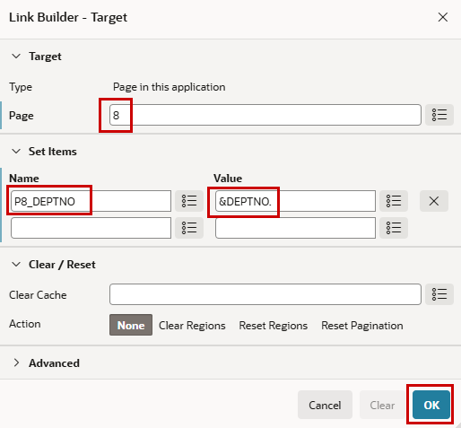{ style="display:block;margin:auto;" }

Das Pie Chart ist jetzt klickbar. Beim Klick wird die Seite neu geladen und das Bar Chart mit den passenden Daten aktualisiert. Du siehst auch die Aenderung unseres Hilfs-Items. Was noch fehlt, ist ein Reset-Button, um wieder alle Mitarbeitenden anzuzeigen. Den fuegen wir spaeter hinzu.

## 8.3 Chart aktualisieren, ohne die ganze Seite neu zu laden

Aktuell wird die ganze Seite neu geladen, obwohl nur das eine Bar Chart aktualisiert werden muss. Fuer den Klick auf eine Serie gibt es leider keine Dynamic Action, aber wir koennen dafuer ein kleines eigenes JavaScript verwenden.

!!! exercise "JavaScript fuer partielles Neuladen verwenden"
    Aendere den Link-**Type** der Serie in der Pie-Chart-Region auf `Redirect to URL` und schreibe etwas JavaScript als URL, um unser verstecktes Item zu setzen.

    ```javascript
           javascript:apex.item('P8_DEPTNO').setValue('&DEPTNO.');
    ```

    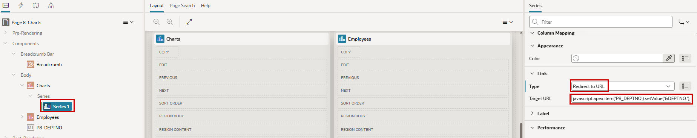{ style="display:block;margin:auto;" }

    Es ist also keine echte Weiterleitung. Wir verwenden dies, um das Item im Browser zu setzen, nicht auf dem Server (Session State).
    Fuege dem Item eine **Dynamic Action** hinzu, die ausgefuehrt wird, wenn sich das Item aendert. Das ist im Abschnitt **When** vorbelegt, wenn die Dynamic Action ueber das Kontextmenue des Items erstellt wird.

    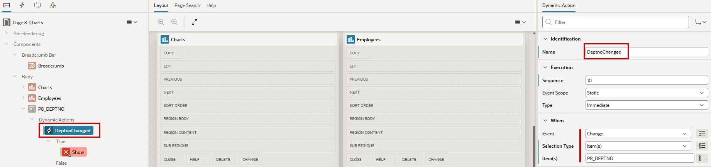{ style="display:block;margin:auto;" }

    Aendere die rot markierte True Action **Show** zur **Action** `Refresh`. **Affected Elements** ist unsere Bar-Chart-`Region` mit dem Namen `Employees`. Die Action kann benannt werden. Wenn der **Name** leer ist, werden Actions im Tree mit ihrer **Action** angezeigt.

    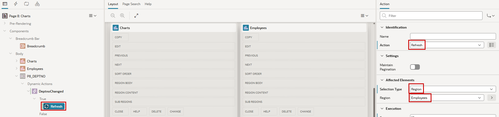{ style="display:block;margin:auto;" }

    Du kannst die Anwendung jetzt testen und siehst, dass beim Klick auf einen Abschnitt des Pie Charts ein Spinner im Bar Chart erscheint, sich aber nichts aendert. Unser Item aendert sich, aber das scheint keinen Effekt zu haben. Das ist ein Beispiel fuer **Session State**. Wir haben `P8_DEPTNO` im Browser geaendert (per JavaScript), ohne es zu submitten. Die Aenderung existiert also nur im Document Object Model (DOM). Die Query fuer das Chart laeuft in der Datenbank, aber dort ist die Item-Aenderung nicht bekannt. Deshalb muessen wir diese Aenderung selbst submitten.
    Der einfachste Weg ist, in der Zielregion (unser Bar Chart) die Items zu definieren, die beim Refresh der Region submitted werden sollen. Dafuer gibt es die Eigenschaft **Page Items to Submit**.

    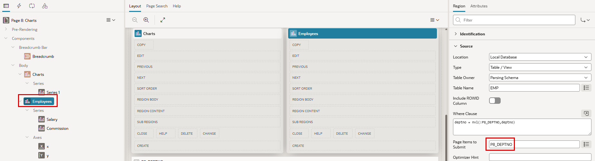{ style="display:block;margin:auto;" }

    Zuletzt fuegen wir einen Button hinzu, um die Auswahl zurueckzusetzen. Waehle im Kontextmenue der Region **Employees** den Eintrag **Create Button**.
    Fuer **Button Name** und **Label** setzen wir `Reset`.

    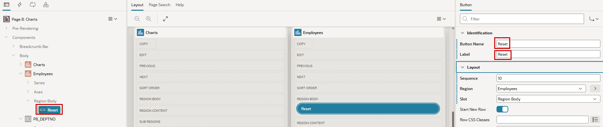{ style="display:block;margin:auto;" }

    Im Abschnitt **Behavior** mit dem **Type** `Standard` waehlen wir als **Action** den Wert `Trigger Action` (die vereinfachten Dynamic Actions aus Kapitel 2).

    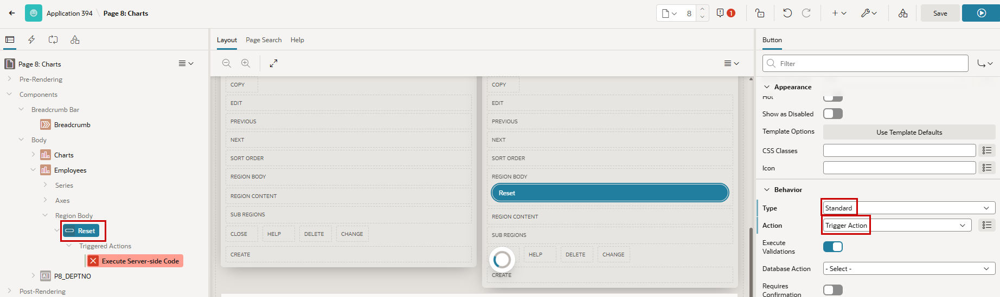{ style="display:block;margin:auto;" }

    Als **Triggered Action** waehle die **Action** `Set Value`. **Affected Element** ist unser **Item** `P8_DEPTNO`, und der **Value** ist leer, weil wir das Item auf null setzen wollen.

    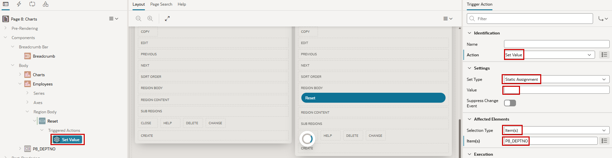{ style="display:block;margin:auto;" }

    Das Setzen des Werts loest die Refresh Action von oben aus, und diese Aufgabe ist erledigt.

!!! bytheway "Charts ueber verfuegbare Eigenschaften hinaus anpassen"
    <div class="two-columns">
       <div>
          *Uebrigens*,<br>
          Charting in APEX basiert auf den Oracle JavaScript Extension Toolkit (JET) Data Visualizations. Weitere Informationen zu Oracle JET und den Data-Visualization-Komponenten findest du im [Jet Cookbook](https://www.oracle.com/webfolder/technetwork/jet/jetCookbook.html?component=home&demo=rootVisualizations){ target="_blank" } und im [ojChart API Guide](https://www.oracle.com/webfolder/technetwork/jet/jsdocs/oj.ojChart.html){ target="_blank" }.
          Nicht jede Eigenschaft von JET Charts kann ueber die APEX UI gesetzt werden. Es ist moeglich, diese Eigenschaften per JavaScript zu manipulieren. Im JavaScript Initialization Code (unter dem Tab **Attributes** einer Chart-Region) zeigt die Hilfe ein kleines Beispiel, wie das gemacht werden kann.
       </div>
    <div>
        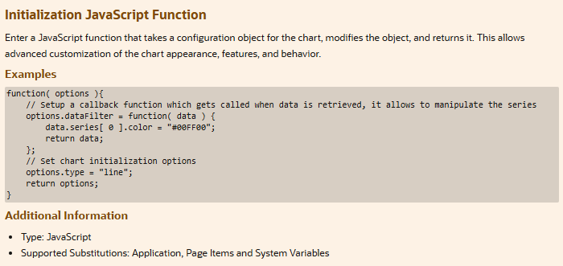{ style="display:block;margin:auto;" }
    </div>
    </div>

