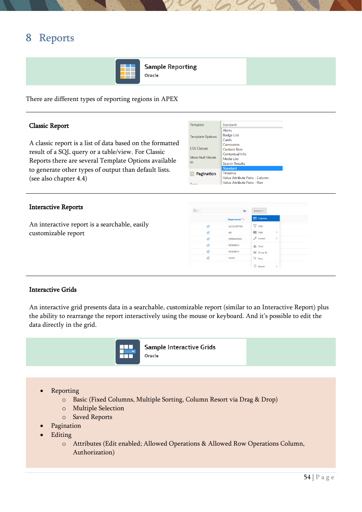

# 8. Reports

Classic reports, interactive reports, interactive grids, cards, faceted search, and smart filters.

{ .chapter-image }

## What this chapter covers

- Summarizes the main APEX reporting region types.
- Contrasts classic reports, interactive reports, and interactive grids.
- Explains cards as flexible, data-driven blocks.
- Introduces faceted search and smart filters for guided exploration.

## Workshop transcript

Transcribed from PDF pages 54-55

### PDF page 54

8 Reports

There are different types of reporting regions in APEX

Classic Report

A classic report is a list of data based on the formatted result of a SQL query or a table/view. For Classic Reports there are several Template Options available to generate other types of output than default lists. (see also chapter 4.4)

Interactive Reports

An interactive report is a searchable, easily customizable report

Interactive Grids

An interactive grid presents data in a searchable, customizable report (similar to an Interactive Report) plus the ability to rearrange the report interactively using the mouse or keyboard. And it’s possible to edit the data directly in the grid.

- Reporting

o Basic (Fixed Columns, Multiple Sorting, Column Resort via Drag & Drop) o Multiple Selection o Saved Reports

- Pagination

- Editing

o Attributes (Edit enabled; Allowed Operations & Allowed Row Operations Column, Authorization)

### PDF page 55

Cards

Cards is a native report region type in APEX. The Cards region type gives developers a powerful, flexible, new way of displaying data in bite-sized blocks. Card regions are ideal for use in faceted search or presenting at-a-glance information. It allows you to effortlessly customize every aspect of a Cards region's UI (layout, appearance, icon, badge, and media) and you can define multiple actions per card. A Cards region's media can be sourced from a BLOB column, URL, or video in an iFrame or Oracle JET Data Visualizations.

The mentioned Live Lab in chapter 7.3 is dealing a lot with Card-Regions

Faceted Search

A faceted search displays and filters data using an intuitive experience users recognize from e-commerce sites (a left Search region and report region). It displays the search results as cards or a classic report.

Smart Filters

A smart filters a single search field at the top of the page and a search results report (classic report, cards, map, or calendar). While a smart filter behaves similarly to faceted search, it features a more space- efficient layout.

By the way, an APEX Instance is managed in the INTERNAL Workspace. For this workspace, you set the password at installation time or change it later via a script. The username of this workspace is admin. In this workspace, the instance is managed and configured, and the other workspaces are managed there.

