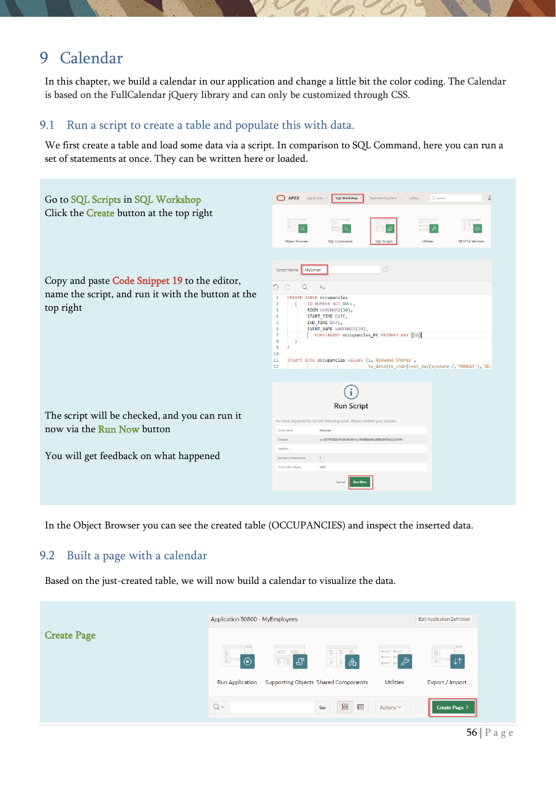

# 9. Calendar

Build a calendar from data and enhance it with CSS and JavaScript.

{ .chapter-image }

## What this chapter covers

- Uses SQL Scripts to create and populate the OCCUPANCIES table.
- Creates a calendar page from the table.
- Adjusts the calendar source query and display columns.
- Applies CSS-based color coding to calendar entries.

## Workshop transcript

Transcribed from PDF pages 56-58

### PDF page 56

9 Calendar In this chapter, we build a calendar in our application and change a little bit the color coding. The Calendar is based on the FullCalendar jQuery library and can only be customized through CSS.

9.1 Run a script to create a table and populate this with data. We first create a table and load some data via a script. In comparison to SQL Command, here you can run a set of statements at once. They can be written here or loaded.

Go to SQL Scripts in SQL Workshop Click the Create button at the top right

Copy and paste Code Snippet 19 to the editor, name the script, and run it with the button at the top right

The script will be checked, and you can run it now via the Run Now button

You will get feedback on what happened

In the Object Browser you can see the created table (OCCUPANCIES) and inspect the inserted data.

9.2 Built a page with a calendar

Based on the just-created table, we will now build a calendar to visualize the data.

Create Page

### PDF page 57

…with a Calendar component

Choose 8 as the page number and give the page a name (MyCalendar).

As the table for the page, we choose the just created table OCCUPANCIES before clicking Next.

In the next step, we set the properties for the Display Column, Start and End Date Column and whether the time should be shown

Click Create Page and run the page to have a look at the calendar.

Now we will make it a little bit nicer

Go to the Page Designer (page 8), click the calendar component, and have a look at the Attributes of the region

### PDF page 58

In the Region tab, we change now the source type from Table/View to SQL Query

As SQL Query we use Code Snippet

Now we go back to the Attributes tab and change the property for Display Column to CAL_DISPLAY.

At the bottom of the Settings section change the CSS Class Property to the column CSS_CLASS

Running the calendar, you now see some nice color coding in the calendar

Look at the top right and change the periods to see other alternatives

