# 9. Dateien und Bilder

!!! sampleapp "Sample App File Upload and Download"
    <div class="two-columns">
      <div style="flex: 50%;">
           Lerne, wie man Oracle-APEX-Anwendungen erstellt, die Datei-Upload und -Download enthalten. Lade Dateien über Dialoge oder eigene Seiten hoch. Sieh, wie Dateien heruntergeladen werden, die in BLOB-Spalten von Oracle-Datenbanktabellen gespeichert sind. Konkret wird gezeigt, wie Datei-Download-Links in Interactive Reports, Classic Reports, Forms und dynamisch erstelltem HTML-Inhalt erzeugt werden.
      </div>
      <div style="flex: 50%;">
          { style="display:block;margin:auto;" }
      </div>
    </div>

!!! sampleapp "Sample App Image Support for Rich Text Editor"
    <div class="two-columns">
      <div style="flex: 50%;">
           Diese Anwendung zeigt, wie Rich-Text-Editor-Inhalte um Inline-Bilder erweitert werden können.
      </div>
      <div style="flex: 50%;">
          { style="display:block;margin:auto;" }
      </div>
    </div>

Mit einer APEX-Anwendung ist es ziemlich einfach, Dateien hoch- und herunterzuladen. Wir machen beides.

## 9.1 Datei in einer Form hochladen

!!! exercise "Dateispalten hinzufügen"
    Zuerst erweitern wir die Tabelle EMP um Spalten zum Speichern von Dateien und deren Metadaten (Name und MIME-Type). Zusätzlich gibt es einen BLOB für Bilder, den wir später verwenden. Führe das in **SQL Commands** aus:

    ```sql
         ALTER TABLE EMP ADD (
            document          BLOB,
            document_mimetype VARCHAR2(100),
            document_name     VARCHAR2(40),
            image             BLOB,
            image_mimetype    VARCHAR2(100),
            image_name        VARCHAR2(40))
    ```

    { style="display:block;margin:auto;" }

    Navigiere im Page Designer zu unserer Form-Seite für die Mitarbeitenden (Seite 3). Wir haben gelernt, dass wir die Form mit der Datenbanktabelle synchronisieren können, aber wir wollen nur eine der neu hinzugefügten Spalten hinzufügen. Wähle deshalb **Create Page Item** in der Region **Employee**.

    Nenne das neue Item `P3_DOCUMENT` und setze den **Type** auf `File Upload`. Setze ein **Label** und wähle im Abschnitt **Display** den Stil aus, wie das File-Browse-Item dargestellt werden soll. Ich habe `Block Dropzone` als **Display As** verwendet und einen **Dropzone Title** gesetzt.

    { style="display:block;margin:auto;" }

     Dateien können temporär in einer zentralen Tabelle gespeichert werden, aber wir wollen sie in unserer gerade erstellten BLOB-Spalte speichern. Deshalb verwenden wir als **Type** `BLOB column specified in Item Source attribute`, einen wirklich langen Wert für eine Eigenschaft. Hier sehen wir, warum wir die Spalten `DOCUMENT_MIMETYPE` und `DOCUMENT_NAME` erstellt haben. Sie können diese Metadaten automatisch speichern, wenn sie in den passenden Eigenschaften **MIME Type Column** und **Filename Column** gesetzt werden. Vergiss nicht den Hinweis aus dem langen Wert oben und definiere die Source für die Datei. In unserem Fall ist das die **Column** `Document` in der **Form Region** `Employee` mit dem **Data Type** `BLOB`.

    { style="display:block;margin:auto;" }

In der Anwendung kannst du nun eine Datei für einen Mitarbeitenden hochladen.

## 9.2 Dateien herunterladen

In der Form ist der Datei-Download bereits verfügbar. Er basiert auf den Eigenschaften **Display Download Link** und **Download Link Text**. Wenn letzteres leer ist, bedeutet es "Download".

Jetzt wollen wir die Download-Option im Report auf Seite 2 hinzufügen.

!!! exercise "Dateien im Report herunterladen"
    In der Employees-Report-Region (Seite 2) brauchen wir eine neue Report-Spalte für die Dokumente. Ein BLOB selbst kann nicht direkt angezeigt werden. Wir können aber einen numerischen Wert verwenden, um zu entscheiden, ob ein Dokument vorhanden ist oder nicht (0 oder ungleich 0), und einen Download-Link anzeigen, wenn ein Dokument existiert. Die Größe des BLOB (0 = keine Datei, ungleich 0 = Datei vorhanden) ist dafür ideal. Ändere dafür im Abschnitt **Source** den **Type** von `Table/View` auf `SQL Query`. Es wird ein SELECT-Statement für die Tabelle EMP mit der WHERE-Bedingung erzeugt, die wir im Authorization-Kapitel hinzugefügt haben.

    { style="display:block;margin:auto;" }

    Für den Report selbst müssen wir nur wissen, ob ein Dokument vorhanden ist. Deshalb ersetzen wir die Zeile **document** durch das folgende Code-Snippet. Über die Länge wissen wir, ob eine Datei existiert.

    ```sql
        dbms_lob.getlength(document) as document,
    ```

    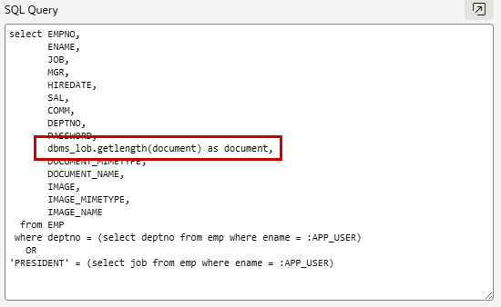{ style="display:block;margin:auto;" }

    Wähle im linken Bereich die Spalte **DOCUMENT**, setze den **Type** auf `Download BLOB` und referenziere im Abschnitt **BLOB Attributes** `EMP` als **Table Name**, `DOCUMENT` als **BLOB Column** und `EMPNO` als **Primary Key Column 1**.
    Setze **Mime Type Column** und **Filename Column** auf unsere Datenbankspalten `DOCUMENT_MIMETYPE` und `DOCUMENT_NAME`, damit der Browser später weiß, was er mit der Datei tun soll.
    Zuletzt können wir einen Anzeigetext für den Download definieren. Wir referenzieren den Dateinamen, der in der Spalte DOCUMENT_NAME gespeichert ist (mit Hash-Zeichen eingeschlossen) - `#DOCUMENT_NAME#` - als **Download Text** im Abschnitt **Appearance**.

    { style="display:block;margin:auto;" }

    Je nach Report-Typ (hier Interactive Report) musst du die neue Spalte im Actions Menu unter Columns im Shuttle sichtbar machen.

    { width="50%" style="display:block;margin:auto;" }

Jetzt siehst du die klickbaren Dateinamen der hochgeladenen Dokumente im Report und kannst sie herunterladen.

{ style="display:block;margin:auto;" }

!!! bytheway "Report für Interactive Report speichern"
    *Übrigens*,<br>
    nach dem Hinzufügen des Dokuments zum Report fällt dir vielleicht auf, dass die Spalte später (in einer neuen Session) wieder nicht sichtbar ist. Es gibt eine Default View (Konfiguration), wie ein Interactive Report angezeigt wird. Als Entwickler kannst du im Menü **Actions** zu **Reports** gehen und auf **Save Report** klicken. Dann kannst du den Report als zusätzliche Ansicht (**As Named Report**) oder als **As Default Report Settings** speichern.

## 9.3 Bild-Upload und Anzeige

Jetzt machen wir dasselbe für Bilder. Bilder sind ebenfalls Dateien, die aber direkt in der UI angezeigt werden können. Der Ansatz ist sehr ähnlich. Natürlich könntest du Bilder auch in unserer Dokument-Spalte speichern, aber wir wollen sie anzeigen.

!!! exercise "Bild-Upload zur Form hinzufügen"
    Navigiere im Page Designer wieder zu unserer Form-Seite für die Mitarbeitenden (Seite 3). Wähle in der Region **Employee** **Create Page Item**.
    Nenne es `P3_IMAGE`, setze den **Type** auf `Image Upload` und prüfe das **Label**.
    Es gibt hier verschiedene Arten, ein Bild anzuzeigen. Wähle für **Display As** den Wert `Icon Dropzone`. Setze die **Preview Size** auf `Medium`.

    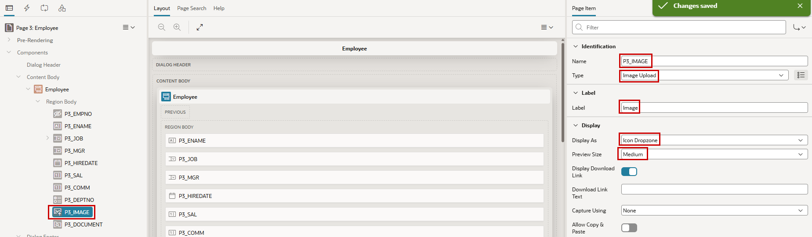{ style="display:block;margin:auto;" }

    Wie zuvor bei den Dokumenten wähle als **Type** für die Speicherung `BLOB column specified in Item Source attribute` und setze die passenden Spaltennamen für **MIME Type Column** und **Filename Column**. Nun müssen wir die Quelle für die Datei definieren. In unserem Fall ist das die **Column** `Image` in der **Form Region** `Employee` mit dem **Data Type** `BLOB`.

    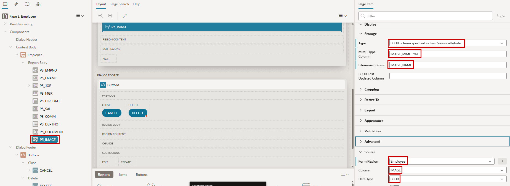{ style="display:block;margin:auto;" }

    Ziehe zuletzt das Item **P3_IMAGE** im Layout Editor rechts neben das Item **P3_DEPTNO**.

    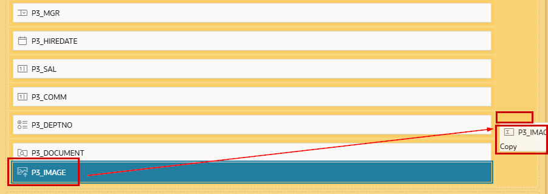{ style="display:block;margin:auto;" }

<div class="two-columns">
  <div>
    Jetzt kannst du Mitarbeitenden Bilder hinzufügen und sie in der Form sehen.
  </div>
  <div>
    
  </div>
</div>

!!! bytheway "Kamera des Smartphones verwenden"
    *Übrigens*,<br>
    es gibt eine Eigenschaft **Capture Using**, mit der du Fotos mit deinem mobilen Gerät aufnehmen und direkt in die Form laden kannst, wenn die App dort läuft.

!!! exercise "Bild im Report anzeigen"
    <div class="two-columns">
      <div>
        Das ist jetzt sehr ähnlich wie das Hinzufügen des Dokuments vorher. Ersetze zuerst die Zeile `image,` in der **SQL Query** des Reports auf Seite 2 durch das folgende Snippet.
        ```sql
           dbms_lob.getlength(image) as image,
        ```
        Wie zuvor wollen wir nur wissen, ob es ein Bild gibt, und definieren nun die Anzeige.
      </div>
      <div>
            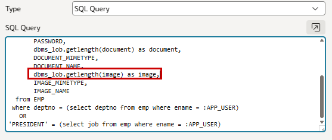{ style="display:block;margin:auto;" }
      </div>
    </div>

    Wähle nun `Display Image` als **Type** für die Spalte **IMAGE**.
    Setze im Abschnitt **BLOB Attributes** **Table Name**, **BLOB Column**, **Primary Key Column 1**, **Mime Type Column** und **Filename Column** mit den passenden Werten.

    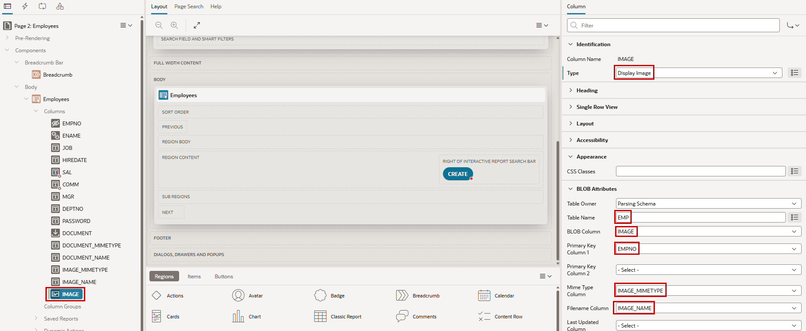{ style="display:block;margin:auto;" }

    Vergiss nicht, die Spalte image über das Actions-Menü zum Report hinzuzufügen.

    Wenn die geladenen Bilder unterschiedliche Größen haben, siehst du im Report unterschiedliche Größen, und sie können zu groß sein. Um das nicht für jedes einzelne Bild nacharbeiten zu müssen, kannst du ein CSS-Snippet verwenden, das die Bilder auf dieselbe Höhe skaliert und sicherstellt, dass Header und Inhalt der Spalte dieselbe Breite haben.

    ```css
        <style>
            .a-IRR-table th[headers="IMAGES"],
            .a-IRR-table td[headers="IMAGES"] {
                width: 95px;
                min-width: 95px;
                max-width: 95px;
                text-align: center;
                vertical-align: middle;
            }

            .a-IRR-table td[headers="IMAGES"] img {
                display: block;
                height: 75px;
                margin: 0 auto;
                border: 4px solid #CCC;
                border-radius: 4px;
                box-sizing: border-box;
            }
        </style>
    ```

    <div class="two-columns">
        <div>
            Setze zuerst die **HTML DOM ID** der Report-Spalte **IMAGE** auf `IMAGES`. Das identifiziert das Objekt im Browser-DOM-Baum und erlaubt uns, es im CSS zu referenzieren.
        </div>
        <div>
            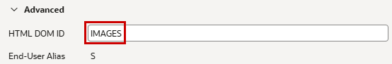{ style="display:block;margin:auto;" }
        </div>
    </div>

    Kopiere das CSS in den **Header Text** der Region **Employees**. In diesem kleinen CSS-Snippet referenzieren wir die zuvor gesetzte DOM ID, um die Größe der Bilder zu manipulieren.

    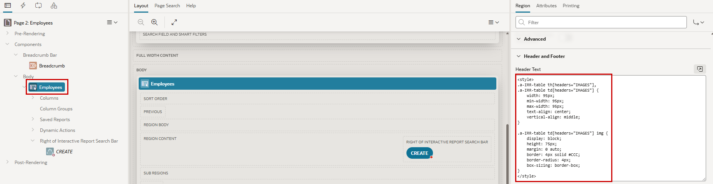{ style="display:block;margin:auto;" }

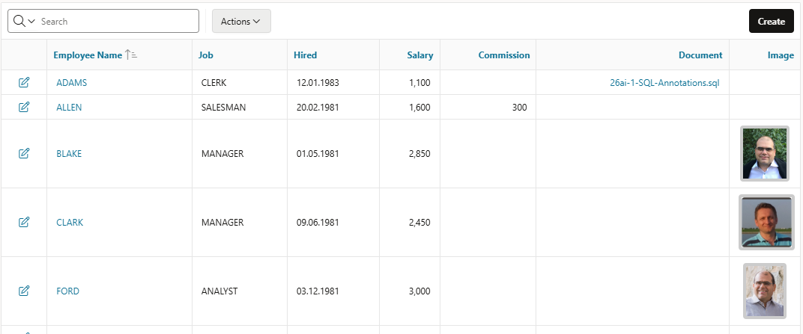{ style="display:block;margin:auto;" }

## 9.4 Datei-Download mit Dynamic Action oder Process

Es gibt eine deklarative Option, eine oder mehrere Dateien (als ZIP) außerhalb eines Reports oder einer Form herunterzuladen. Dafür gibt es eine passende Dynamic Action und einen entsprechenden Process Type. Wir legen jetzt den Download aller Bilder in der Tabelle als ZIP-Datei hinter einen Button.

!!! exercise "Mehrere Dateien herunterladen"
    Navigiere im Page Designer zu unserer Report-Seite (Seite 2). Wähle **Create Button** in der Region **Employees**.
    Setze `ZIP` als **Button Name** und **Label** und positioniere ihn im **Slot** `Right of the Interactive Report Search Bar` (neben dem CREATE-Button).
    Wähle im Abschnitt **Behavior** als **Action** den Wert `Trigger Action`.

    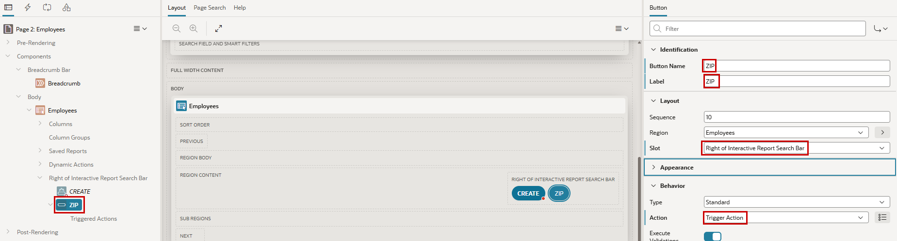{ style="display:block;margin:auto;" }

    Es gibt nun eine rot markierte Triggered Action (standardmäßig Execute Server-Side Code genannt). Ändere die **Action** auf `Download`, aktiviere den Switch für **Multiple Files** und setze den **Filename** auf `images_&APP_USER..zip` (`&APP_USER.` ist die Syntax für Substitution Strings, die zwei Punkte sind also kein Tippfehler).
    Verwende als **SQL Query** diese Abfrage.

    ```sql
        select image, image_name from emp where image is not null
    ```

    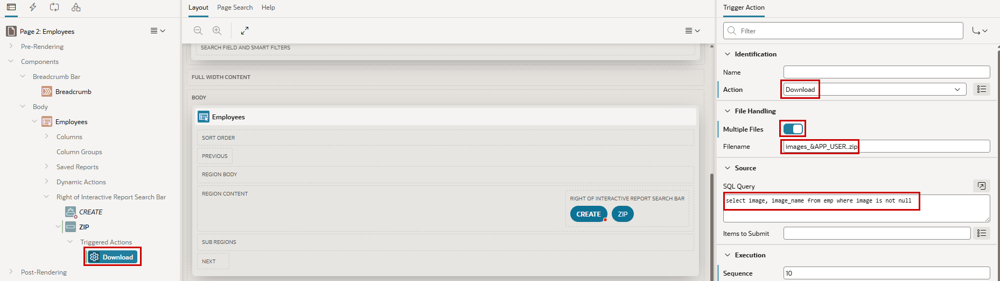{ style="display:block;margin:auto;" }

Jetzt gibt es oben rechts im Report einen Button. Ein Klick darauf lädt eine Datei mit allen Bildern herunter, deren Name vom aktuell angemeldeten Benutzer abhängt. Dieselbe Konfiguration ist mit einem Process Type (ebenfalls Download genannt) möglich, um einen Download als Prozess zu starten.

In unserem Beispiel haben wir nur das Objekt selbst und den Namen ausgewählt. Beim Download einer einzelnen Datei statt mehrerer Dateien auf einmal sollte zusätzlich der MIME-Type in der Query enthalten sein, damit der Browser die Datei entsprechend behandeln kann.

!!! bytheway "Dateien in Object Storage"
    *Übrigens*,<br>
    natürlich ist es auch möglich, die Dokumente nicht in der Datenbank zu speichern, sondern nur zu referenzieren. Zum Beispiel können Dokumente über die passenden APIs in Object Storage in Oracle Cloud Infrastructure abgelegt und von dort referenziert werden. Seit Release 23.2 ist es auch möglich, statische Ressourcen in Object Storage zu speichern.

