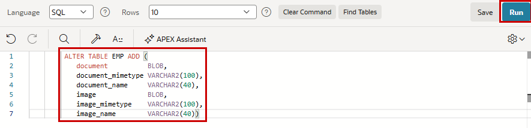
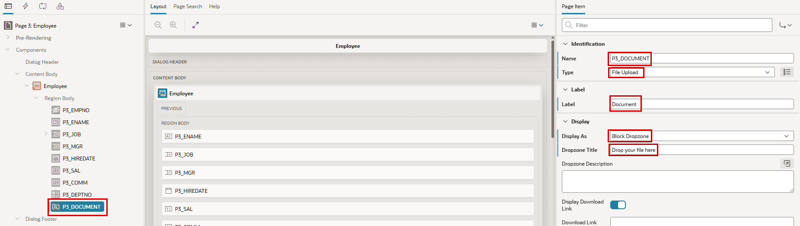
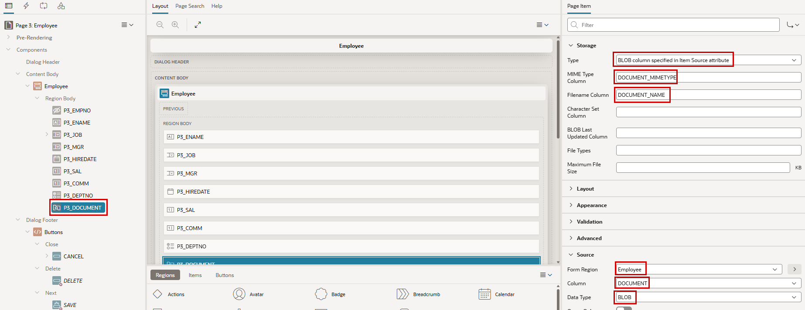
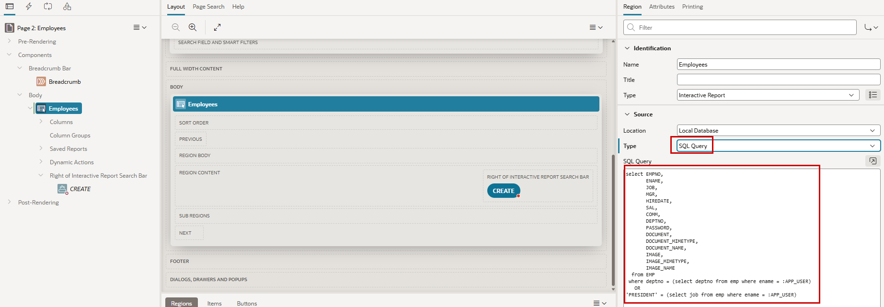
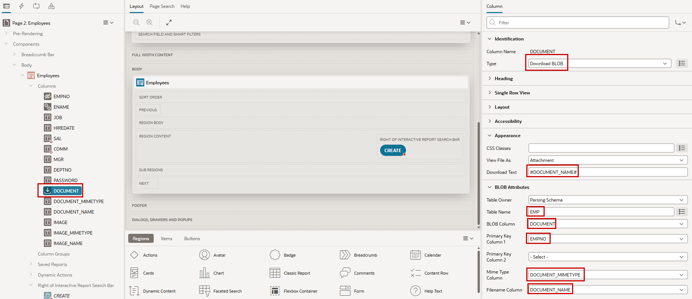
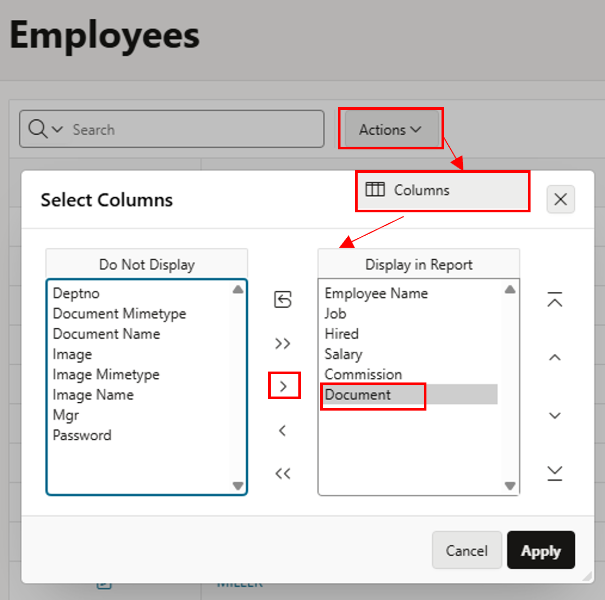
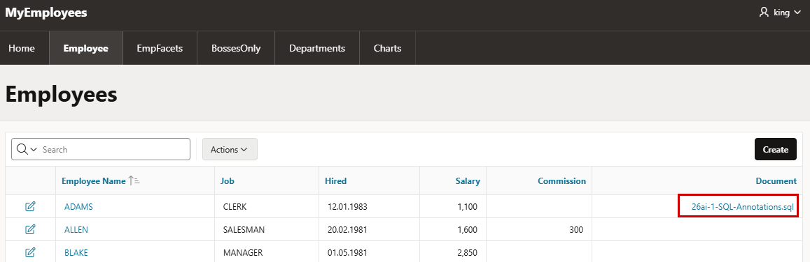

# 9. Files & Images

!!! sampleapp "Sample App File Upload and Download"
    <div class="two-columns">
      <div style="flex: 50%;">
           Learn how to create Oracle APEX applications that include file upload and download. Upload files using dialogs as well as dedicated pages. See how to download files stored in Oracle database BLOB columns within database tables. Specifically see how to produce file download links in interactive reports, classic reports, forms, and dynamically created HTML content.
      </div>
      <div style="flex: 50%;">
          { style="display:block;margin:auto;" }
      </div>
    </div>

!!! sampleapp "Sample App Image Support for Rich Text Editor"
    <div class="two-columns">
      <div style="flex: 50%;">
           This application illustrates how to augment Rich Text Editor content items to allow for inline images.
      </div>
      <div style="flex: 50%;">
          { style="display:block;margin:auto;" }
      </div>
    </div>

It’s quite easy to up- and download files with an APEX Application. And we will do both.

## 9.1 Upload a file in a form

!!! exercise "Define REST Data Sourcen"
    First, we expand the table emp with three columns to store files their metadata (the name and the mimetype). Additionally, there’s a BLOB for pictures, which we will use later. Run this in **SQL Commands**:
    
    ```sql 
         ALTER TABLE EMP ADD (  
            document          BLOB,
            document_mimetype VARCHAR2(100),
            document_name     VARCHAR2(40),
            image             BLOB,
            image_mimetype    VARCHAR2(100),
            image_name        VARCHAR2(40))
    ```

    { style="display:block;margin:auto;" }

    In Page Designer, we navigate to our form page for the employees (page 3).  We’ve learned that we can synchronize the form with the database table, but we just want to add one of the newly added columns. Therefor we just **Create Page Item** in the region employee.
    
    We **Name** the new item `P3_DOCUMENT`, set the **Type** to `File Upload`. Set a **Label** and in the Display section you can choose the style how the file browse item should be displayed (I've used `Block Dropzone` as **Display As** and set a **Dropzone Title**).

    { style="display:block;margin:auto;" }  

     Files can be (temporarily) stored in a central table, but we want to store them in our just-created BLOB column, so as **Type** we use `BLOB column specified in Ite Source attribute` which is a really long value for a property. And here we see, why we’ve created the columns `DOCUMENT_MIMETYPE` & `DOCUMENT_NAME`. They can automatically store this metadata when set in the appropriate properties **MIME Type Column** and **Filename Column**. And do not forget the hint from the long value above and define the source for the file, which is in our case in the **Form Region** `Employee` the **Column** `Document` which is of the **Data Type** `BLOB`

    { style="display:block;margin:auto;" }

In the application, you can now upload a file for an employee.

!!! bytheway "Use Camera of Mobile Phone"
    *By the way*,<br>
    there's a property **Capture Using** which allows you to make photos with your mobile device and load them directly to the form when the app runs there.

## 9.2 Download Files

In the form the download of the files is already available. It's based on the properties **Display Download Link**, **Download Link Text** (which means 'Download' when empty).

Now we want to add the download possibility to the report on page 2. 

!!! exercise "Download Files in Report"
    We need In the Employees Report Region (page 2) a new report column for the documents. a BLOB itself can't be displayed itself, but we can use a numeric value to decide if there's a document or not (0 or not 0) and display a download link when theres a document. So the size of the BLOB (0=no file or not 0 when there's a file) is ideal for that. For this we change the **Type** in the section **Source** from `Table/View` to `SQL Query`. A Select-Statement for the table EMP with the WHERE-Condition we added in the chapter Autorization will be created.

    { style="display:block;margin:auto;" }

    For the report itself we just need to know, if there’s a document or not, so we override the line **document**, with the following Code Snippet. With the length we know, if there’s a file or not.
    
    ```sql
        dbms_lob.getlength(document) as document,
    ```

    { style="display:block;margin:auto;" }
    
    Select to **DOCUMENT** column in the left pane, set the **Type** to `Download BLOB` and reference in the section **BLOB Attributes** `EMP` as **Table Name**, `DOCUMENT` as **BLOB Column** and `EMPNO` as **Primary Key Column 1**. 
    And set the **Mime Type Column** and **Filename Column** with our database columns `DOCUMENT_MIMETYPE` and `DOCUMENT_NAME`, so that the browser is later able to know, what to do with the file.
    Last we can define a display text for the download. We reference to name of the file, which is stored in the column DOCUMENT_NAME (enclosed by hashes) - `#DOCUMENT_NAME#` - as **Download Text** in the section Appearance.

    { style="display:block;margin:auto;" }

    Depending on the type of report (here Interactive Report), you need to make the new column visible in the Actions Menu under Columns in the Shuttle.
    
    { style="display:block;margin:auto;" }

Now you see in the report the clickable filenames of the uploaded documents to downlod them. 

{ style="display:block;margin:auto;" }


## 9.3 Image Upload & Display

## 9.4 File Download with Dynamic Action or Process


!!! bytheway "Customizing Charts beyond available properties"
    *By the way*,<br>
    of course, it is also possible not to save the documents in the database, but only to reference them. For example, the documents can be placed in the Object Store of the Oracle Cloud Infrastructure via the appropriate APIs and then referenced from there. Starting with release 23.2 it’s also possible to store static resources in the Object Storage.
 
