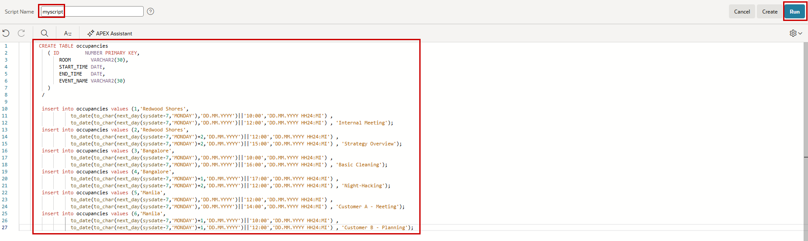
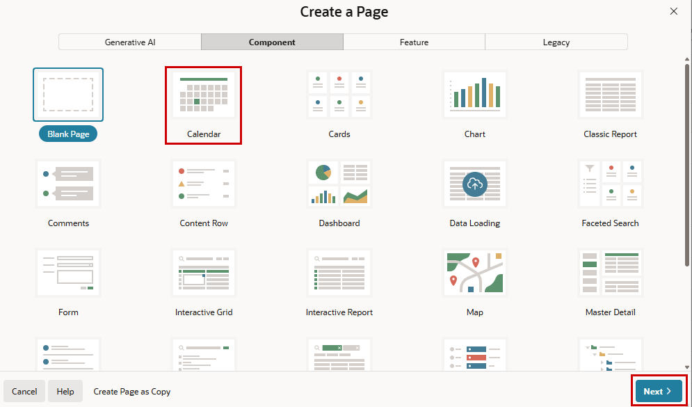
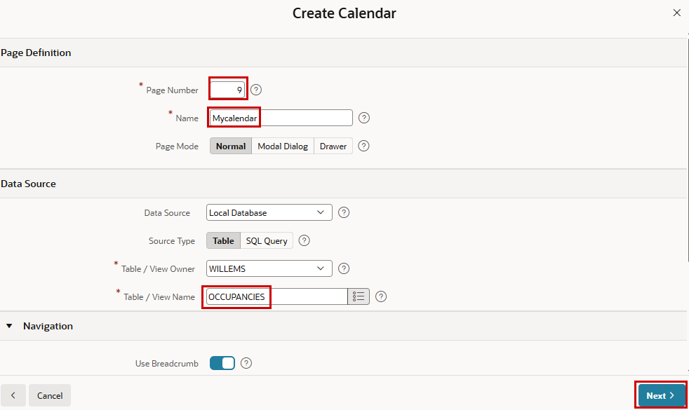
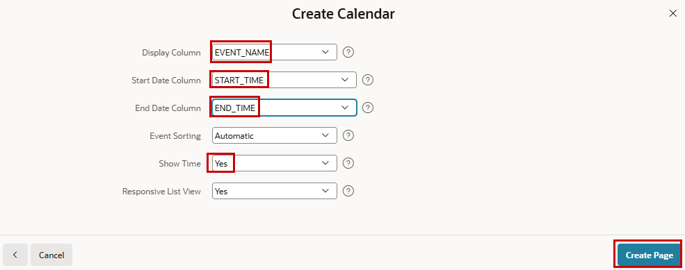
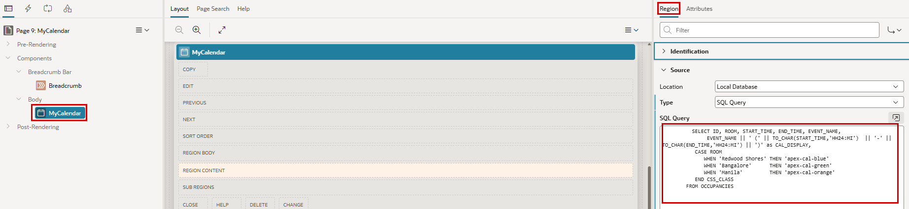
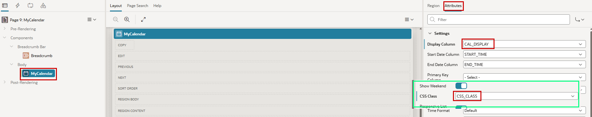

# 10. Calendars

!!! sampleapp "Sample App Calendar"
    <div class="two-columns">
      <div style="flex: 50%;">
           This application highlights the native calendaring capabilities of Oracle APEX. It features a monthly calendar with stylized daily tasks. The dates can be changed using drag and drop, which is all declarative and easily created using native APEX wizards.
      </div>
      <div style="flex: 50%;">
          { style="display:block;margin:auto;" }
      </div>
    </div>

In this chapter, we build a calendar in our application and change a little bit the color coding. The Calendar is based on the FullCalendar jQuery library and can only be customized through CSS. 

## 10.1 Create some data for a calendar

!!! exercise "Download multiple files"
    We first create a table and load some data via a **SQL Script**. In comparison to **SQL Command**, here you can run a set of statements at once. They can be written there or loaded. **Create** a new script und give it the **Script Name** `myscript`. Copy & Paste the following snippet into the code editor. 

    ``` sql
       CREATE TABLE occupancies
          (	ID         NUMBER PRIMARY KEY, 
	          ROOM       VARCHAR2(30), 
	          START_TIME DATE, 
	          END_TIME   DATE, 
	          EVENT_NAME VARCHAR2(30)
          )
        /

        insert into occupancies values (1,'Redwood Shores',
                  to_date(to_char(next_day(sysdate-7,'MONDAY'),'DD.MM.YYYY')||'10:00','DD.MM.YYYY HH24:MI') , 
                  to_date(to_char(next_day(sysdate-7,'MONDAY'),'DD.MM.YYYY')||'12:00','DD.MM.YYYY HH24:MI') , 'Internal Meeting');
        insert into occupancies values (2,'Redwood Shores',
                  to_date(to_char(next_day(sysdate-7,'MONDAY')+2,'DD.MM.YYYY')||'12:00','DD.MM.YYYY HH24:MI') , 
                  to_date(to_char(next_day(sysdate-7,'MONDAY')+2,'DD.MM.YYYY')||'15:00','DD.MM.YYYY HH24:MI') , 'Strategy Overview');
        insert into occupancies values (3,'Bangalore',
                  to_date(to_char(next_day(sysdate-7,'MONDAY'),'DD.MM.YYYY')||'10:00','DD.MM.YYYY HH24:MI') , 
                  to_date(to_char(next_day(sysdate-7,'MONDAY'),'DD.MM.YYYY')||'16:00','DD.MM.YYYY HH24:MI') , 'Basic Cleaning');
        insert into occupancies values (4,'Bangalore',
                  to_date(to_char(next_day(sysdate-7,'MONDAY')+1,'DD.MM.YYYY')||'17:00','DD.MM.YYYY HH24:MI') , 
                  to_date(to_char(next_day(sysdate-7,'MONDAY')+2,'DD.MM.YYYY')||'12:00','DD.MM.YYYY HH24:MI') , 'Night-Hacking');
        insert into occupancies values (5,'Manila',
                  to_date(to_char(next_day(sysdate-7,'MONDAY'),'DD.MM.YYYY')||'12:00','DD.MM.YYYY HH24:MI') , 
                  to_date(to_char(next_day(sysdate-7,'MONDAY'),'DD.MM.YYYY')||'14:00','DD.MM.YYYY HH24:MI') , 'Customer A - Meeting');
        insert into occupancies values (6,'Manila',  
                  to_date(to_char(next_day(sysdate-7,'MONDAY')+1,'DD.MM.YYYY')||'10:00','DD.MM.YYYY HH24:MI') , 
                  to_date(to_char(next_day(sysdate-7,'MONDAY')+1,'DD.MM.YYYY')||'12:00','DD.MM.YYYY HH24:MI') , 'Customer B - Planning');  
    ``` 

    { style="display:block;margin:auto;" }

    The script will be checked when you click **Run** and you had to click **Run** again. You will get feedback on what happened.
    In the **Object Browser** you can see the created table (OCCUPANCIES) and inspect the inserted data.

## 10.2 Built a page with a calendar

Based on the just-created table, we will now build a calendar to visualize the data.

!!! exercise "Download multiple files"
    Create a new page in your application and choose **Calendar** as region for that new page.

    { style="display:block;margin:auto;" }   

    Choose `9` as the **Page Number and **Name** the page `MyCalendar`. As **Table / View Name** select the just created table `Occupancies`.

    { style="display:block;margin:auto;" }   

    In the next step we set the properties for the **Display Column**, **Start Date Column** and **End date Column** to the appropriate columns from the table. As we want to see the time we set **Show Time** to `Yes`. Click Create Page and run the page to have a look at the calendar. 

    { style="display:block;margin:auto;" }   

    Now we will make it a little bit nicer and color the entries depending the rooms.

    Go to the Page Designer (page 9), click the calendar component, and have a look at the **Attributes** tab of the region. In the **Region** tab we change the **Type** in the source from `Table/View` to `SQL Query`. Replace to then seen **SQL Query with this query here:

    ``` sql
        SELECT ID, ROOM, START_TIME, END_TIME, EVENT_NAME,
               EVENT_NAME || ' (' || TO_CHAR(START_TIME,'HH24:MI')  || '-' || TO_CHAR(END_TIME,'HH24:MI') || ')' as CAL_DISPLAY,
           CASE ROOM 
              WHEN 'Redwood Shores' THEN 'apex-cal-blue'
              WHEN 'Bangalore'      THEN 'apex-cal-green'
              WHEN 'Manila'         THEN 'apex-cal-orange'
           END CSS_CLASS
        FROM OCCUPANCIES
    ```

    { style="display:block;margin:auto;" } 

    Now we go back to the **Attributes** tab and change the property **Display Column** to `CAL_DISPLAY` and the **CSS Class** to `CSS_Class' to `CSS_CLASS`.

    { style="display:block;margin:auto;" } 

Running the calendar, you now see some nice color coding in the calendar. Look at the top right and change the periods to see what happens.


