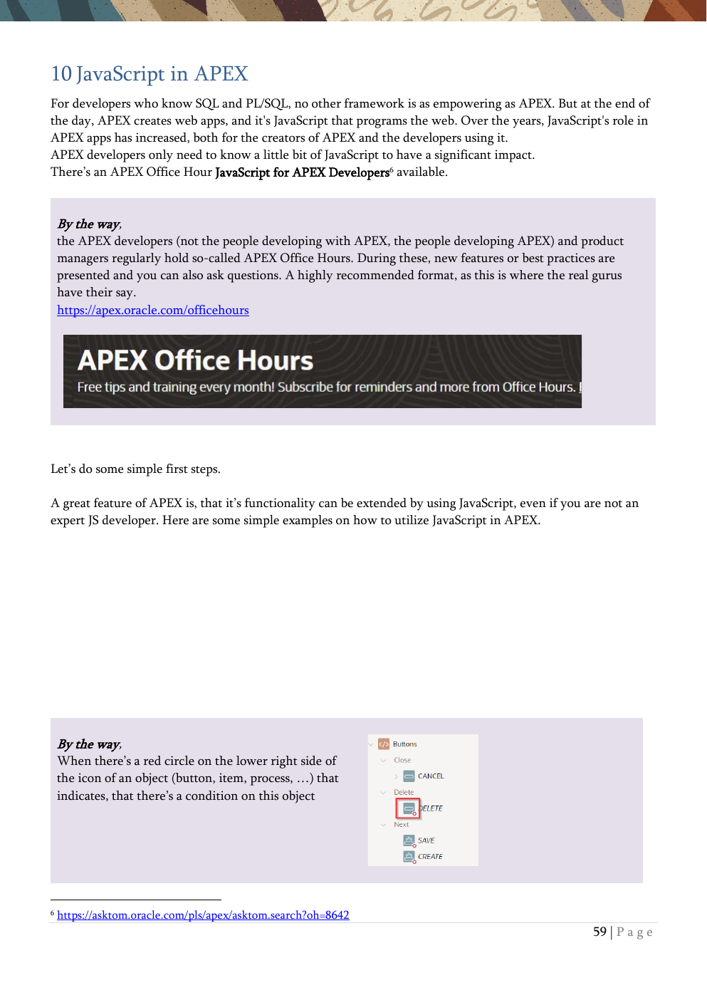

# 10. JavaScript in APEX

Simple JavaScript patterns, console work, dynamic actions, and UI manipulation.

{ .chapter-image }

## What this chapter covers

- Uses the calendar as a starting point to show component initialization.
- Demonstrates interacting with page items from the browser console.
- Traces dynamic actions using console output.
- Changes a button label dynamically with JavaScript and a static ID.
- Shows page-level JavaScript and CSS injection points.

## Workshop transcript

Transcribed from PDF pages 59-64

### PDF page 59

10 JavaScript in APEX For developers who know SQL and PL/SQL, no other framework is as empowering as APEX. But at the end of the day, APEX creates web apps, and it's JavaScript that programs the web. Over the years, JavaScript's role in APEX apps has increased, both for the creators of APEX and the developers using it. APEX developers only need to know a little bit of JavaScript to have a significant impact. There’s an APEX Office Hour JavaScript for APEX Developers6 available.

By the way, the APEX developers (not the people developing with APEX, the people developing APEX) and product managers regularly hold so-called APEX Office Hours. During these, new features or best practices are presented and you can also ask questions. A highly recommended format, as this is where the real gurus have their say. https://apex.oracle.com/officehours

Let’s do some simple first steps.

A great feature of APEX is, that it’s functionality can be extended by using JavaScript, even if you are not an expert JS developer. Here are some simple examples on how to utilize JavaScript in APEX.

By the way, When there’s a red circle on the lower right side of the icon of an object (button, item, process, …) that indicates, that there’s a condition on this object

6 https://asktom.oracle.com/pls/apex/asktom.search?oh=8642

### PDF page 60

Component initialization

Many components in APEX are open source and offer much more features than visible through the App Builder. By using JavaScript, these additional features can be used. For example, the APEX calendar component is built upon a component called FullCalendar. The APEX documentation gives some examples on how the calendar can be customized via JS7. For a full list of settings, visit the FullCalendar documentation8. Though not available in the UI, these additional parameters can be set via JavaScript. The App Builder already comes with a field to add JavaScript initialization code.

Select the calendar region from chapter 9 on the left side and switch to Attributes on the right area. Scroll down to the Advanced section and insert Code Snippet 21 in the Initialization JavaScript Function Area.

With that, we configure thet the calendar week will be displayed in weekly view, show the calendar week and other settings.

7 https://docs.oracle.com/en/database/oracle/apex/22.1/htmdb/managing -calendar-attributes.html 8 https://fullcalendar.io/

### PDF page 61

Querying Values

JavaScript can also be used in the developer console of your browser. For example, navigate to the Employee Form and open the console by hitting <CTRL><SHIFT>I. The console will look different, depending on your browser and it can dock on any side of your browser window.

Console in Firefox

Console in Chromium

In the console, you can interactively execute JavaScript and use the APEX JavaScript API. For example apex.item(“P3_ENAME”).getValue(), or it’s short form $v(“P3_ENAME”) will give you the value of a page item.

Caution: when using a modal page, like our Employees Form example, first point the console to the correct frame ‘Employee’ (Firefox left, Chromium right).

### PDF page 62

Trace Dynamic Actions

In an application with many Dynamic Actions firing, it might get hard to follow the execution flow. One easy option is to use JavaScript in the Dynamic Actions to generate output to the Developer Console of your browser.

Edit Page 3 and add a TRUE action to the JobChanged Event. Name it LogCommission, set the action to Execute JavaScript Code and paste Code Snippet 22 into the Code field.

Right click on the new action and choose Create Opposite Action. Remove the part for the commission for that FALSE action.

Save this and reload the Employees report and the Employee form for any row.

Open the Browser console

Change the Job for the employee back and forth, set a salary if he does not have one, and check the output in the browser console. Especially, when several Dynamic Actions are firing, depending on each other, this is a useful way to follow the program flow.

### PDF page 63

Flexibility & Dynamic

We now want to change the label of the Apply Changes Button in the Employee Form so that the name of the shown employee is used as the label. All objects get an internal ID used in the browser. But we can set this in die Page Designer to know the ID of the object we want to manipulate via JavaScript.

Navigate to page 3 and set the Static ID of the SAVE Button to MYBUTTON.

Then Create Dynamic Action at Page Load in the Dynamic Action container (flash sign)

We set the Name for the Action and the Event Page Load should be preset.

### PDF page 64

As True-Action (after creation called Show and marked in red) we use Execute JavaScript Code und the Code itself can be copied from Code Snippet 23.

We read the value of Item P3_ENAME and write this concatenated with the word Save as the label of the button, referenced by his Static ID.

Now run the application a have a look at the buttons label. That’s just a simple example. There’s Java Script API for more sophisticated tasks available9.

By the way, for example, at the page level, you can add your JavaScript to reuse on the page.

At the same level, you can add your own CSS.

Have a look at the JavaScript API Reference in the APEX Docs

9 https://docs.oracle.com/en/database/oracle/apex/24.1/aexjs/index.html

