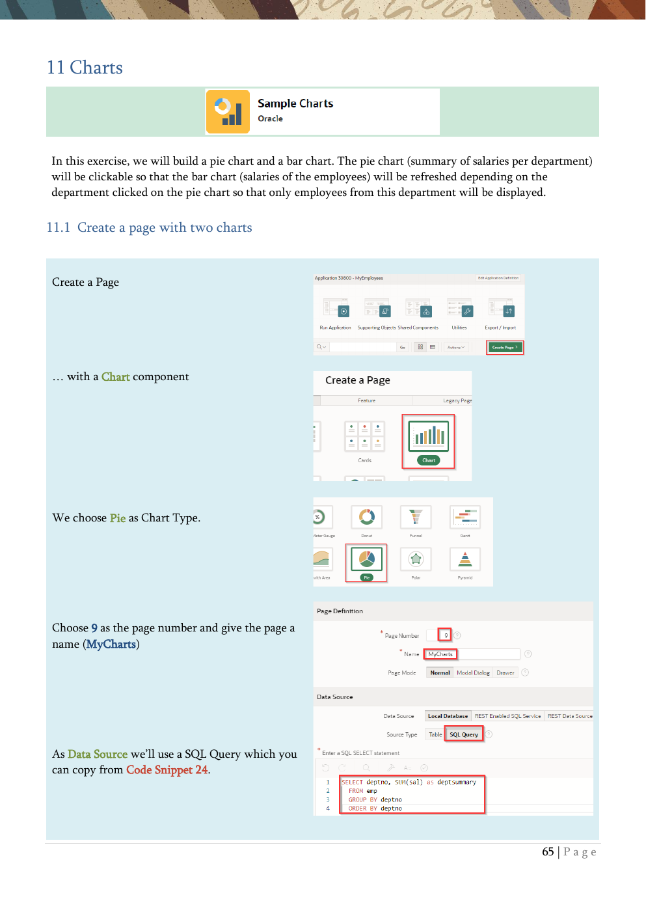

# 11. Charts

Pie charts, bar charts, cross-filtering, and refresh without full page reload.

{ .chapter-image }

## What this chapter covers

- Builds a pie chart for salary summary by department.
- Adds a bar chart that shows employee salaries and commission.
- Uses a hidden item to pass the selected department between charts.
- Refreshes the chart region without reloading the page.
- Adds a reset button to clear the chart filter.

## Workshop transcript

Transcribed from PDF pages 65-70

### PDF page 65

11 Charts

In this exercise, we will build a pie chart and a bar chart. The pie chart (summary of salaries per department) will be clickable so that the bar chart (salaries of the employees) will be refreshed depending on the department clicked on the pie chart so that only employees from this department will be displayed.

11.1 Create a page with two charts

Create a Page

… with a Chart component

We choose Pie as Chart Type.

Choose 9 as the page number and give the page a name (MyCharts)

As Data Source we’ll use a SQL Query which you can copy from Code Snippet 24.

### PDF page 66

In the next step, we set the Label Column und the Value Column for the Pie Chart.

Have a look at the Page Designer. You’ll see a Chart-Region with one Series. Both, the region and the series can have a data source, but in this case the used Query is the data source of the series.

Now we want to add a bar chart with more than one series (salary and commission of employees). Here we will use the data source in the region and reference them in the series.

Run the page and see the chart.

In the context menu of the body Create Region.

Name the new region Employees and select Chart as Type.

As Source select our table EMP.

In the Attributes tab, change the chart Type to Bar.

The series named New is flagged red because it has no source until now

### PDF page 67

We change Series New of the Employees chart region and set some properties in the property’s column.

As Source Location, we reference the Region Source and then we can select ENAME and SAL as Label & Value.

Additionally, it might be a good idea to give the series a meaningful name.

Now we can Duplicate this series and just change the Name (Identification) to Commission and the Value (Column Mapping) from SAL to COMM.

Now we want to have both charts side by side. We can do this in the Layout Editor with Drag & Drop or we can just change the currently activated Start New Row Switch in the Layout Section of the Employees Region

Now the two charts are independently side by side.

### PDF page 68

11.2 Change a Chart by clicking on another Chart Now we want to display in the bar chart only employees from the department we selected in the pie chart. Therefore, we will use a hidden item.

Create Page Item in the Body (Page 9)

Rename this item to P9_DEPTNO and choose Hidden as the Type. We will use this item as a filter for the bar chart which we will set from the pie chart

Add Code Snippet 25 as the Where Clause for the Employees chart region source.

Select the Series 1 series of chart region MyCharts and change the Type in the Link section to Redirect to Page in this Application

Then click on No Link Defined

Set 9 (the same page where we are) as the Page for the Target and map the page item P9_DEPTNO to the value of the chart region (&DEPTNO.). You can do this by clicking on the menu icons.

The pie chart is now clickable and refreshes the bar chart by setting the clicked department as a filter there.

What’s missing is a Reset Button to show all employees again. We will add this later.

### PDF page 69

11.3 Refresh the chart without reloading the entire page Unfortunately, for a click on series, there’s no Dynamic Action, but we use our own JavaScript.

We change the Link-Type of the Series in the MyCharts Region to Redirect to URL and write as URL some JavaScript to set our hidden item. You can use Code Snippet 26 for this.

Now the Item is changed in the Browser, but not in the Server (Session State).

Add a Dynamic Action to the hidden Item P9_DEPTNO which will run when the item is changed (what is preset when created via the context menu)

We change the red marked True Action “Show”. Change the Action to Execute Server-side Code, which we set as null; - we do nothing.

But mentioning P9_DEPTNO in the Items to Submit will write the just changed value of the Item from the Browser to the session state in the database.

Add another True Action (right-click the Dynamic Action “New” and choose Create TRUE Action

We want to refresh the Bar-Chart Region, when the item is changed – and only this region.

As we wrote the value of the filter item from the browser to the session state of the in the browser, we will get a chart depending on this item without reloading the rest of the page.

Just be sure, that the Refresh happens after the writing of the session state

### PDF page 70

Last, we now will add a Reset-Button to show all data from the EMP-Table again in the barchart.

Right-Click the Employees Region an Create Button.

Use Reset as Name and Label for the Button.

The Behavior of the Button should the Action Defined by Dynamic Action.

We add a Dynamic Action with a right click at the Reset Button.

As the default Event for the Dynamic Action is the Click on the Button (due to the way of creating it), we just need to change to True Action.

We change the Action to Set Value and use Null as Static Assignment for the Affected Element P9_DEPTNO.

This set’s the Hidden Filter-Item to null and due to the already implemented Dynamic Action on this Item, the chart will be refreshed with all data.

