# 11. JavaScript in APEX

For developers who are familiar with SQL and PL/SQL, APEX provides an extremely productive environment for building database-centric applications. However, APEX applications are web applications, and JavaScript remains the primary programming language of the browser.

Over the years, JavaScript has become increasingly important within APEX. The APEX development team uses JavaScript extensively to implement the framework's rich user interface components, and application developers can leverage JavaScript to customize and extend the behavior of their applications.

The good news is that APEX developers do not need to become JavaScript experts. Even a basic understanding of JavaScript can significantly enhance an application by enabling custom validations, dynamic user interface behavior, client-side processing, and integration with browser APIs or third-party libraries.

!!! tip "LiveLab"
    There's an Oracle LiveLab **JavaScript for APEX Developers** available.
    [Click here](https://livelabs.oracle.com/ords/r/dbpm/livelabs/view-workshop?wid=3863){target="_blank"}

A great feature of APEX is, that it’s functionality can be extended by using JavaScript, even if you are not an expert JS developer. Here are some simple examples on how to utilize JavaScript in APEX.

## 11.1 JavaScript in the Applicaion

### 11.1.1 Component initialization

Many components in APEX are open source and offer much more features than visible through the App Builder. By using JavaScript, these additional features can be used.
For example, the APEX calendar component is built upon a component called FullCalendar. The APEX documentation gives some examples on how the calendar can be customized via JS. For a full list of settings, visit the [FullCalendar](https://fullcalendar.io/){target="_blank"} documentation.
Though not available in the UI, these additional parameters can be set via JavaScript. The App Builder already comes with a field to add JavaScript initialization code. 

!!! exercise "Add the calendar week to the calender"
    In the following example, the calendar is configured to open in the weekly time grid view. Calendar week numbers are displayed, the current time is highlighted using a now indicator, and the visible time range is limited to business hours between 08:00 and 22:00. In addition, time slots are displayed in 30-minute intervals.
    Select the calendar region built before and switch to **Attributes** tab on the right area. Scroll down to the section Advanced insert the following code to the property **Initialization JavaScript Function**.

    ``` JavaScript
       function ( pOptions) {
            pOptions.initialView    = 'timeGridWeek';
            pOptions.weekNumbers    = true;
            pOptions.weekText       = 'CW ';
            pOptions.weekTextLong   = 'Week ';
            pOptions.nowIndicator   = true;
            pOptions.slotMinTime    = '08:00:00';
            pOptions.slotMaxTime    = '22:00:00';
            pOptions.slotDuration   = '00:30:00';

            return pOptions;
        }
    ```

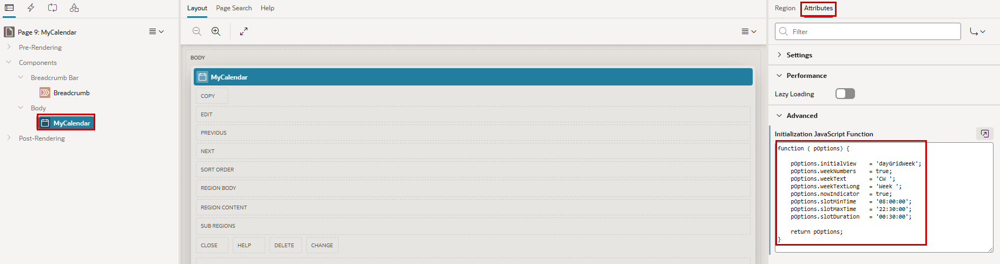{ style="display:block;margin:auto;" }

### 11.1.2 Dynamic Actions

Dynamic Actions are APEX's declarative way of adding client-side interactivity to an application without writing large amounts of JavaScript code. They are based on events, conditions, and actions, allowing developers to react to user interactions such as clicks, value changes, or page load events.

Although Dynamic Actions can be created entirely through the APEX builder, they often execute JavaScript behind the scenes. Developers can also extend Dynamic Actions with custom JavaScript code when more advanced behavior is required.

### 11.1.3 Flexibility and Agility

We now want to change the label of the Apply Changes Button in the Employee Form so that the name of the shown employee is used as the label. All objects get an internal ID used in the browser (HTML DOM ID). We can set this ID in die Page Designer to know the ID of the object we want to manipulate via JavaScript.

!!! exercise "Dynamic button label"
    Navigate to page 3 and set the **HTML DOM ID** of the SAVE Button to `MYBUTTON`.

    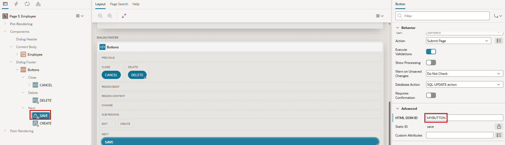{ style="display:block;margin:auto;" }

    <div class="two-columns">
      <div style="flex: 50%;">
           Then **Create Dynamic Action** at **Page Load** in the Dynamic Action tab (flash sign)
      </div>
      <div style="flex: 50%;">
          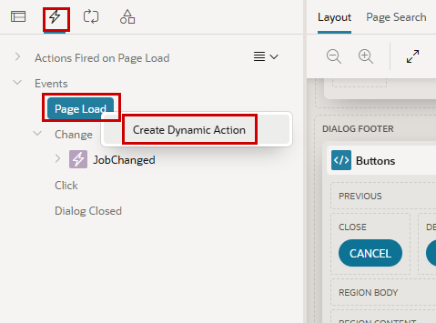{ style="display:block;margin:auto;" }
      </div>
    </div>

    We set the **Name** (`SetLabel`) for the Action and the **Event** `Page Load` should be preset due to the way we created this action. 
          
    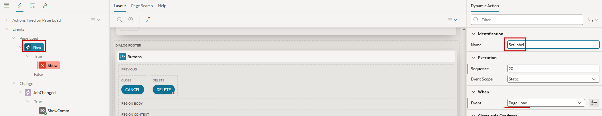{ style="display:block;margin:auto;" }

    As **True-Action** (after creation called Show and marked in red) we use `Execute JavaScript Code` und the **Code** itself can be copied from following code snippet. We read the value of Item P3_ENAME and write this concatenated with the word *Save* as the label of the button, referenced by his HTML DOM ID.

    ``` JavaScript
        const mylabel = 'Save ' + $x("P3_ENAME").value;
        $('#MYBUTTON span').text(mylabel);  
    ```
    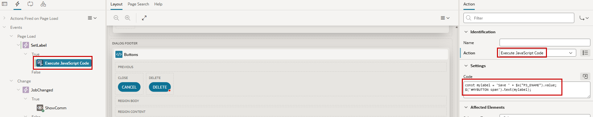{ style="display:block;margin:auto;" }

Now run the application a have a look at the button label. 
That’s just a simple example. Have a look into the [JavaScript API](https://docs.oracle.com/en/database/oracle/apex/26.1/aexjs/index.html){target="_blank"} for more sophisticated tasks.

!!! bytheway "JavaScript at Page Level"
    <div class="two-columns">
       <div>
          *By the way*,<br>
          At page level you can add JavaScript code. Directly or via referenced files. At the same level, you can add your own CSS for the page the same way.
       </div>
       <div>
          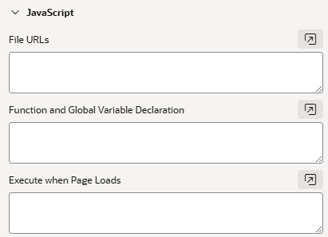{ style="display:block;margin:auto;" }
       </div>
    </div>

## 11.2 JavaScript to understand the application flow

**Querying Values**

JavaScript can also be used in the developer console of your browser. For example, navigate to the Employee Form and open the console by hitting <CTRL><SHIFT>I. The console will look different, depending on your browser and it can dock on any side of your browser window.

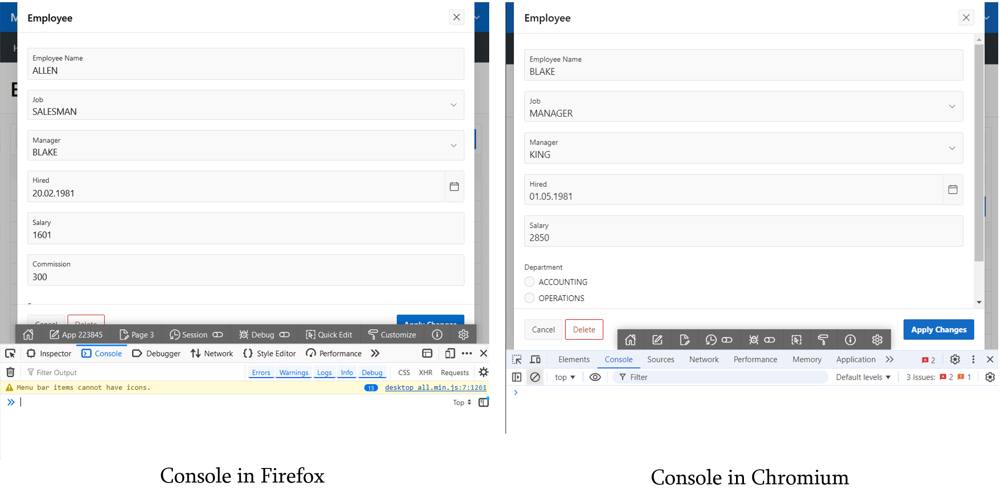{ style="display:block;margin:auto;" }

In the console, you can interactively execute JavaScript and use the APEX JavaScript API. For example apex.item(“P3_ENAME”).getValue(), or it’s short form $v(“P3_ENAME”) will give you the value of a page item. Caution: when using a modal page, like our Employees Form example, first point the console to the correct frame ‘Employee’ (Firefox left, Chromium right).

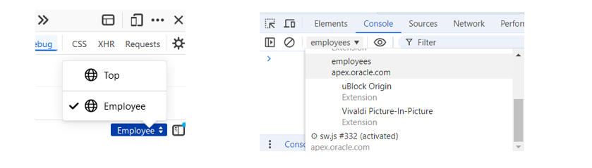{ style="display:block;margin:auto;" }

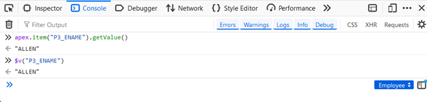{ style="display:block;margin:auto;" }

**Trace Dynamic Actions**

In an application with many Dynamic Actions firing, it might get hard to follow the execution flow. One easy option is to use JavaScript in the Dynamic Actions to generate output to the Developer Console of your browser.

!!! exercise "Write Log to the Console"
    Edit Page 3 and add a **True**-Action to the **JobChanged** Event. **Name** it `LogCommission`, set the **Action** to `Execute JavaScript Code` and paste the code snippet into then **Code** field. 

    ``` JavaScript
        console.log( "Job changed to " + $v("P3_JOB") + " for employee " + $v("P3_ENAME") +  ". Commission is " + $v("P3_COMM") )
    ```
    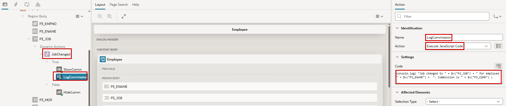{ style="display:block;margin:auto;" 

     <div class="two-columns">
       <div>
          Right click on the new action (`LogCommission`) and choose **Create Opposite Action**. Remove the part for the commission for that FALSE action and save this.
       </div>
       <div>
        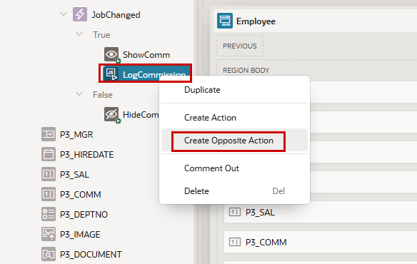{ style="display:block;margin:auto;" }
    </div>
    </div>

    Reload the form for any employee and open the browser console. Change the Job for the employee back and forth, set a commission if he does not have one, and check the output in the browser console.

    After testing, delete both actions for logging.

Especially, when several Dynamic Actions are firing, depending on each other, this is a useful way to follow the program flow.

!!! bytheway "Debugging"
    <div class="two-columns">
       <div>
          *By the way*,<br>
          when developing JavaScript code, it is often helpful to quickly output information using the browser's developer console. However, APEX also provides a built-in debugging framework that offers detailed insights into page processing, Dynamic Actions, AJAX requests, and server-side execution.

          Debug mode can be enabled directly from the Developer Toolbar by selecting **Debug**. Once enabled, detailed execution information is collected and can be reviewed using **View Debug**. The debug output shows the sequence of page rendering and processing steps, executed PL/SQL code, SQL statements, and timing information, making it much easier to identify and analyze issues.
          
          In addition, APEX provides a debugging API that allows developers to write custom debug messages. This can be useful for tracing application logic, monitoring variable values, and simplifying the analysis of complex processes during development and troubleshooting.
       </div>
    </div>


