# 12. Layout

In Oracle APEX definiert ein **Theme** das allgemeine Erscheinungsbild und die User Experience einer Anwendung. Es besteht aus einer Sammlung von **Templates**, die Layout und Darstellung von UI-Komponenten wie Seiten, Regionen, Buttons, Listen und Navigationselementen steuern. Durch ein Theme koennen Entwickler ein konsistentes Look and Feel in der gesamten Anwendung sicherstellen. Themes ermoeglichen auch, das Erscheinungsbild einer Anwendung zentral zu veraendern oder das visuelle Design durch Wechsel auf ein anderes Theme komplett auszutauschen.

## 12.1 Themes

Das **Universal Theme** ist das Standard-Theme von Oracle APEX und dient als Grundlage fuer moderne, responsive Webanwendungen. Es bietet einen umfangreichen Satz vordefinierter Templates, Komponenten und Styling-Optionen, die sich automatisch an verschiedene Bildschirmgroessen und Geraete anpassen. Diese Flexibilitaet ermoeglicht Entwicklern, attraktive und professionelle Benutzeroberflaechen zu erstellen, ohne viel eigenen Code schreiben zu muessen.

Das Universal Theme wird mit jedem APEX-Release weiter verbessert und enthaelt Best Practices fuer Usability, Accessibility, Wartbarkeit und modernes Webdesign. Dadurch koennen Entwickler effizient Anwendungen bauen, die ueber Desktop- und Mobilgeraete hinweg eine konsistente, benutzerfreundliche und zukunftssichere Erfahrung bieten.

!!! sampleapp "Universal Theme Reference"
    <div class="two-columns">
      <div style="flex: 50%;">
           Diese App stellt dir Universal Theme vor und bietet eine einfache Moeglichkeit, die verschiedenen Templates, Template Options und Theme Styles zu durchsuchen. Die Beispiele zeigen, wie du das Layout deiner Seiten einfach steuern kannst, um eine gut aussehende Anwendung zu erstellen.
           Diese App ist online verfuegbar unter: [https://oracleapex.com/ut](https://oracleapex.com/ut){target="_blank"}
      </div>
      <div style="flex: 50%;">
          { style="display:block;margin:auto;" }
      </div>
    </div>

In APEX ist ein **Theme Style** eine Sammlung von CSS-Definitionen und Konfigurationseinstellungen, die das visuelle Erscheinungsbild einer Anwendung steuern. Theme Styles bieten eine einfache Moeglichkeit, Look and Feel einer Anwendung anzupassen, ohne die zugrunde liegenden Templates des Universal Theme zu veraendern.

Mit dem **Theme Roller** koennen Entwickler einen bestehenden Theme Style ueber eine intuitive Benutzeroberflaeche anpassen, indem sie Farben, Schriftarten und andere visuelle Eigenschaften aendern. Neue Theme Styles koennen auch erstellt werden, indem ein bestehender Style kopiert und angepasst wird. Die resultierenden CSS-Definitionen werden im Anwendungstheme gespeichert und koennen exportiert und in anderen Anwendungen wieder importiert werden.

APEX unterstuetzt ausserdem Theme Styles, die vom Benutzer ausgewaehlt werden koennen. In Shared Components -> User Interface Attributes erlaubt die Option **Enable End Users to Choose Theme Style** Benutzern, zur Laufzeit zwischen verfuegbaren Styles zu wechseln. Diese Funktion wird haeufig verwendet, um Optionen wie **Light Mode** und **Dark Mode** anzubieten.

!!! exercise "Theme Roller verwenden"

    <div class="two-columns">
      <div style="flex: 50%;">
          Du startest den **Theme Roller** aus der **Developer Toolbar** in der laufenden Anwendung. Mache das auf Seite 2, dem Employee Report.
      </div>
      <div style="flex: 50%;">
          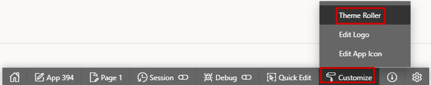{ style="display:block;margin:auto;" }
      </div>
    </div>

    <div class="two-columns">
      <div style="flex: 50%;">
          Nimm einige Aenderungen vor und speichere sie als neuen Theme Style. Verwende **Select Theme** im Theme Roller, um den Theme Style auszuwaehlen, von dem du starten willst. Im Abschnitt **Appearance** gibt es vordefinierte Auswahlmoeglichkeiten, darunter kannst du exakte Farben definieren. Die Aenderungen sind sofort in der Anwendung sichtbar. Aendere zum Beispiel die **Link Color**, und du siehst die Aenderung im Report. Speichere deine Aenderungen als neuen Style.
      </div>
      <div style="flex: 50%;">
          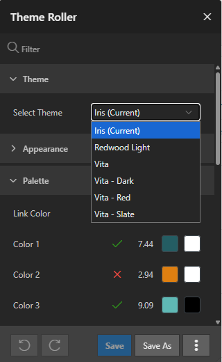{ style="display:block;margin:auto;" }
      </div>
    </div>

    Gehe jetzt zu **Shared Components** und waehle **Themes**. In der Mitte befindet sich der Abschnitt **User Interface**. Klicke auf das **Universal Theme** und gehe zum Abschnitt **Styles**. Dort siehst du deinen neuen Style und kannst pruefen, was darin enthalten ist.

    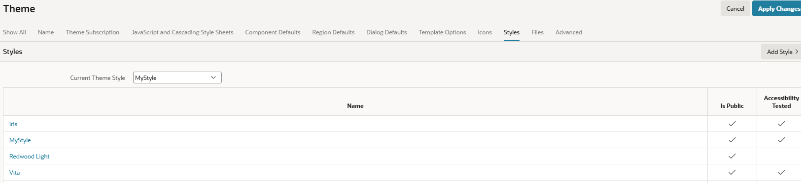{ style="display:block;margin:auto;" }

    Waehle in **User Interface Attributes** in **Shared Components** (auch erreichbar ueber den Button **Edit Application Definition** auf der Application Home Page im App Builder) den Abschnitt **Attributes**. Aktiviere alle drei Switches. Was sie tun, ist selbsterklaerend.

    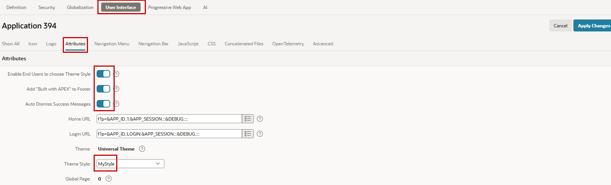{ style="display:block;margin:auto;" }

    <div class="two-columns">
      <div style="flex: 50%;">
          Jetzt gibt es unten links in der Anwendung einen Link **Customize**, ueber den der Endbenutzer einen Style auswaehlen kann. Du siehst auch den gerade aktivierten "Built with Love using APEX"-Footer.
      </div>
      <div style="flex: 50%;">
          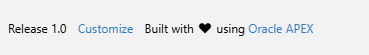{ style="display:block;margin:auto;" }
      </div>
    </div>

## 12.2 Templates und Template Options

**Templates** sind wiederverwendbare Komponenten, die Struktur und Erscheinungsbild von Anwendungselementen wie Seiten, Regionen, Reports, Buttons und Listen definieren. Sie steuern das erzeugte HTML und Layout und sorgen fuer eine konsistente User Experience in der gesamten Anwendung. Neben HTML-Markup und CSS-Klassen koennen Templates auch JavaScript-Code enthalten, um interaktive Funktionalitaet bereitzustellen.

**Template Options** erlauben Entwicklern, Aussehen und Verhalten eines Templates zu veraendern, ohne das Template selbst zu aendern. Diese Optionen werden ueber vordefinierte CSS-Klassen und Modifier umgesetzt. Dadurch lassen sich unterschiedliche visuelle Varianten derselben Komponente einfach erstellen. Fuer das Universal Theme koennen die verfuegbaren Template Options ueber die Sample Application erkundet und demonstriert werden, die viele der unterstuetzten Layouts und Styles zeigt.

APEX bietet auch **Live Template Options**, mit denen Entwickler Template Options direkt in einer laufenden Anwendung ausprobieren koennen. Aenderungen koennen sofort previewed werden, ohne zurueck in den Page Designer zu wechseln. Das macht es einfacher, verschiedene Layouts und Styles waehrend der Entwicklung zu bewerten.

Templates verwenden intensiv **Substitution Strings**. Das sind Platzhalter, die zur Laufzeit durch dynamische Werte ersetzt werden. Dieser Mechanismus erlaubt Templates, anwendungsspezifische Informationen wie Seitentitel, Region-Inhalte, Button-Labels und benutzerspezifische Daten anzuzeigen, waehrend die Template-Definition wiederverwendbar und wartbar bleibt.

!!! exercise "Template bauen"

    Wir erstellen eine neue Seite (verwende `10`) mit einem **Classic Report** als Komponente, basierend auf der Tabelle `EMP`, und nennen die Seite `Layout`.

    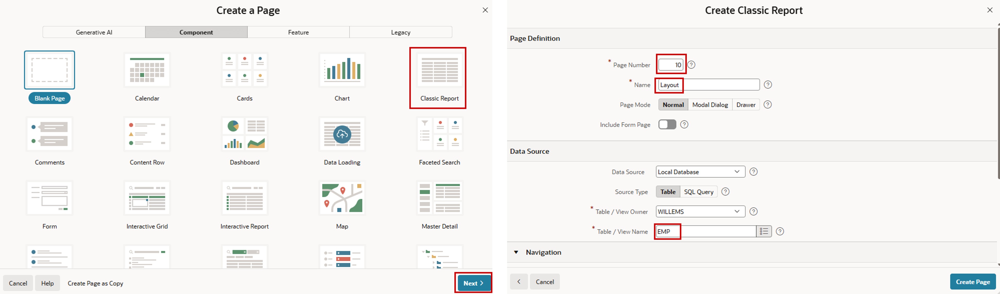{ style="display:block;margin:auto;" }

    Entferne die sechs Spalten fuer Dokumente und Bilder aus dem Report.
    Wenn du die Report-Region auswaehlst, siehst du eine **Template**-Eigenschaft im Abschnitt **Appearance** des Tabs **Region** und eine weitere im Tab **Attributes**. Die erste ist fuer die Region selbst, die zweite ist ein spezifisches Template fuer den Report.

    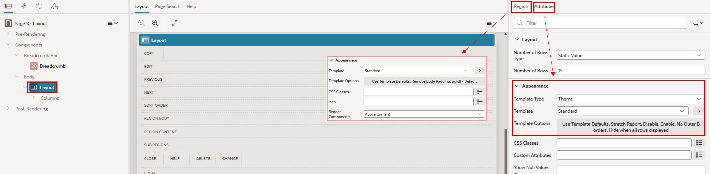{ style="display:block;margin:auto;" }

    Fuer jedes Template gibt es **Template Options**, mit denen vordefinierte Eigenschaften geaendert werden koennen. Die meisten davon koennen als **Live Template Options** direkt in der Anwendung geaendert werden, um sofortiges Feedback zu erhalten. Verwende **Quick Edit** in der Developer Toolbar und klicke auf den Schraubenschluessel des entsprechenden Objekts, um die Live Template Options zu sehen.

    Die Definitionen der **Templates** findest du in **Shared Components**. Es gibt mehrere unterschiedliche Templates pro Typ. Wir koennen sehen, wie oft ein Template in der Anwendung referenziert wird, und es mit dem Icon am Ende kopieren. Wir kopieren das Template **Report - Generic Columns** mit dem Namen **Standard** und verwenden den Namen `MyReportTemplate` fuer unser neues Template.

    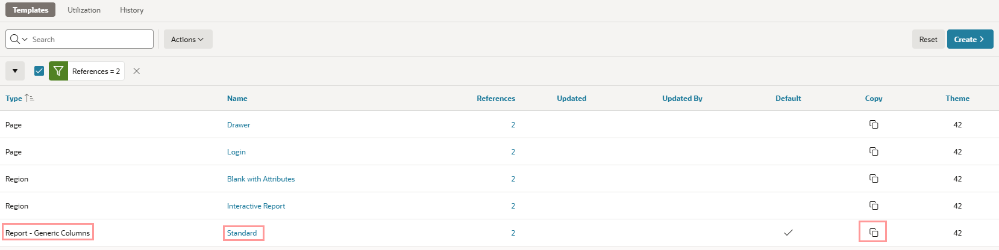{ style="display:block;margin:auto;" }

    Es steht nun in der Liste, und wir koennen darauf klicken, um es zu inspizieren.
    Zuerst wollen wir einen pinken Rahmen um den Report hinzufuegen. Dafuer ergaenzen wir den passenden Style (`style="border: 10px solid #ff00f7"`) im Template. Ersetze die erste Zeile von **Before Rows** durch diese:

    ``` HTML
         <div class="t-Report #COMPONENT_CSS_CLASSES#" id="report_#REGION_DOM_ID#" style="border: 10px solid #ff00f7" #REPORT_ATTRIBUTES# data-region-id="#REGION_DOM_ID#">
    ```

    Wir aendern die Farbe des Inhalts in **Column Template 1**. Es ist moeglich, mehrere Column Templates zu haben, wobei Conditions festlegen, welches Template fuer welche Spalte gilt. Hier fuegen wir `style="color: #ff00f7; font-style: italic;"` in Zeile eins hinzu. Ersetze die erste und einzige Zeile in dieser Eigenschaft durch diese:

    ``` HTML
         <td class="t-Report-cell" #ALIGNMENT# #ACCESSIBLE_HEADERS#  style="color: #ff00f7; font-style: italic;">#COLUMN_VALUE#</td>
    ```

    Speichere das, waehle unser neues Template fuer den Report aus (zur Erinnerung: im Attributes-Tab, nicht im Region-Tab) und pruefe das Ergebnis.

!!! bytheway "HTML DOM ID und Static ID"
    *Uebrigens*,<br>
    in APEX ist eine Static ID ein vom Entwickler definierter Identifier, der Komponenten wie Seiten, Regionen, Items und Buttons zugewiesen werden kann. Sie bietet eine stabile und sinnvolle Moeglichkeit, Komponenten aus CSS, JavaScript, Dynamic Actions oder automatisierten Tests zu referenzieren. Sie ist sehr wichtig bei der Verwendung von APEXLang.

    Vor APEX 26.1 wurde die Static ID verwendet, um das entsprechende HTML-Element im Browser zu identifizieren. Ab APEX 26.1 fuehrt APEX eine klarere Trennung zwischen Static ID und HTML DOM ID ein. Waehrend die Static ID ein logischer Identifier innerhalb von APEX bleibt, erlaubt das neue Attribut HTML DOM ID Entwicklern, explizit die ID zu definieren, die im DOM des Browsers gerendert wird. Das bietet mehr Kontrolle bei der Integration von eigenem JavaScript, CSS, Drittanbieterbibliotheken und automatisierten UI-Testwerkzeugen.

    Unser Beispiel mit dem pinken Rahmen wuerde also auch in aelteren Releases funktionieren, dort muesste aber "DOM_ID" durch "STATIC_ID" ersetzt werden.

    Durch die Trennung dieser Konzepte werden APEX-Anwendungen leichter wartbar und weniger abhaengig von intern erzeugten HTML-Identifiern. Entwickler koennen nun bei Bedarf stabile DOM IDs definieren und gleichzeitig Static IDs fuer die komponentenbezogene Identifikation auf Anwendungsebene weiterverwenden.

## 12.3 Template Components

Vor Oracle APEX 23.1 verwendeten Entwickler haeufig Classic Reports zusammen mit eigenen Report Templates, um spezialisierte UI-Komponenten zu erstellen. Dieser Ansatz erforderte ein gutes Verstaendnis von Report Templates und den verfuegbaren Substitution Strings, um die gewuenschte HTML-Ausgabe zu erzeugen.

Template Components bieten eine moderne und deutlich flexiblere Alternative. Sie ermoeglichen Entwicklern, wiederverwendbare UI-Komponenten auf Basis von HTML-Templates zu erstellen, optional erweitert mit CSS und JavaScript. Template Components koennen als Regionstyp verwendet werden, um einzelne oder mehrere Datensaetze anzuzeigen, und sogar innerhalb von Report-Spalten.

APEX enthaelt mehrere eingebaute Template Components, aber Entwickler koennen auch eigene Komponenten erstellen und mit anderen Anwendungsentwicklern teilen. Dadurch entsteht ein Low-Code-Ansatz fuer eigene UI-Elemente, der gleichzeitig Konsistenz und Wiederverwendbarkeit ueber Anwendungen hinweg foerdert.

Template Components ermoeglichen es, komplexe UI-Funktionalitaet in einfach nutzbare Bausteine zu kapseln. Anwendungsentwickler koennen sich dadurch staerker auf fachliche Anforderungen konzentrieren statt auf Implementierungsdetails.

Eine gute Einfuehrung in Template Components ist der Blogpost [Developing a Responsive Number Counter with Oracle APEX: My First Template Component](https://tm-apex.hashnode.dev/developing-a-responsive-number-counter-with-oracle-apex-my-first-template-component){target="_blank"} von Timo Herwix. Er bietet eine Schritt-fuer-Schritt-Anleitung zum Bau einer Template Component mit HTML, CSS und JavaScript und zeigt, wie sie in eine APEX-Anwendung integriert und verwendet wird.

Fuer einen breiteren Ueberblick bietet Oracle ausserdem eine APEX-Office-Hours-Session zu Template Components. Die Aufzeichnung ist auf [YouTube](https://www.youtube.com/watch?v=BiKOTn4bL1A){target="_blank"} verfuegbar und bietet eine praktische Einfuehrung in Konzepte, Architektur und Use Cases dieser leistungsfaehigen Funktion.

!!! bytheway "APEX Office Hours"
    *Uebrigens*,<br>
    [APEX Office Hours](https://asktom.oracle.com/ords/r/tech/catalog/series-landing-page?p5_oh_id=744){target="_blank"} sind kostenlose Online-Sessions des Oracle-APEX-Produktteams. Sie bieten Entwicklern die Moeglichkeit, direkt von APEX-Experten etwas ueber neue Features, Best Practices und reale Use Cases zu lernen. Sessions enthalten typischerweise Live-Demonstrationen, technische Deep Dives und interaktive Q&A-Segmente, in denen Teilnehmende Fragen stellen und Rueckmeldung vom Produktteam erhalten koennen. Aufzeichnungen vergangener Office Hours sind auf YouTube verfuegbar und decken viele Themen ab, von Einsteigerkonzepten bis zu fortgeschrittenen Entwicklungstechniken. Sie sind eine ausgezeichnete Ressource, um bei den neuesten Oracle-APEX-Features und Entwicklungspraktiken auf dem Laufenden zu bleiben.

!!! exercise "Template Component bauen und verwenden"
    Gehe in **Shared Components** zu **Templates**, wo wir vorher das Report Template geaendert haben, und erstelle eine **Template Component**.

    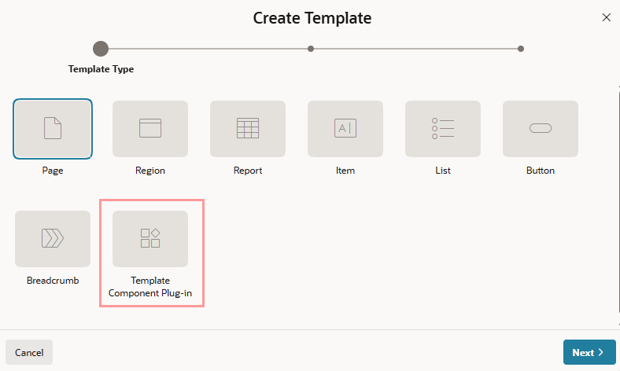{ style="display:block;margin:auto;" }

    Waehle **From Scratch** und nenne sie `MyTC`.

    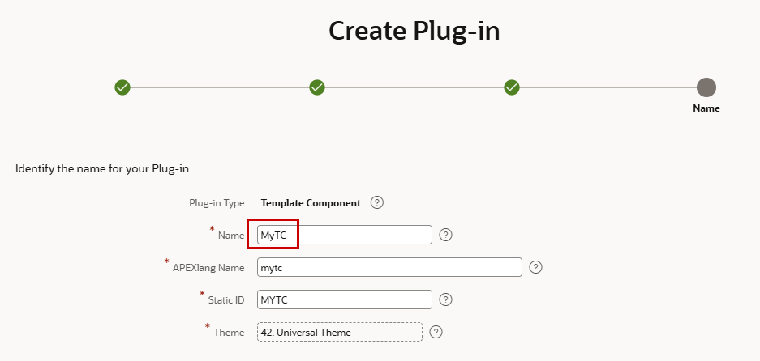{ style="display:block;margin:auto;" }

    Wir wollen diese Komponente fuer einen einzelnen Datensatz (**Single (Partial)**) und fuer mehrere Zeilen (**Multiple (Report)**) verwenden, damit wir diese Template Component fuer einen Report (Multiple) oder zum Beispiel in einer Report-Spalte (Single) nutzen koennen.
    HTML selbst unterstuetzt diese Template Conditions nicht, aber die APEX-Template-Syntax tut das. Gib im Feld **Partial** dieses Code-Snippet ein.

    ```HTML
          {if APEX$IS_LAZY_LOADING/}
            <div>#NAME# #JOB#</div>
          {else/}
            <div class="t-rotatingcard">
              <div class="t-front">
                <div>{with/}{apply THEME$AVATAR/}</div>
                <div class="t-name">#NAME#</div>
                <div>#JOB#</div>
              </div>
              <div class="t-back">
                <div>{with/}{apply THEME$AVATAR/}</div>
                <div>SAL=#SALARY#/COMM=#COMMISSION#</div>
              </div>
            </div>
          {endif/}
    ```

    Es gibt eine Referenz auf eine andere vordefinierte Template Component namens Avatar. Wir wollen eine rotierende Karte bauen, die die Avatar-Komponente verwendet und Informationen auf beiden Seiten zeigt. Die hier referenzierten CSS-Klassen werden spaeter hinzugefuegt.

    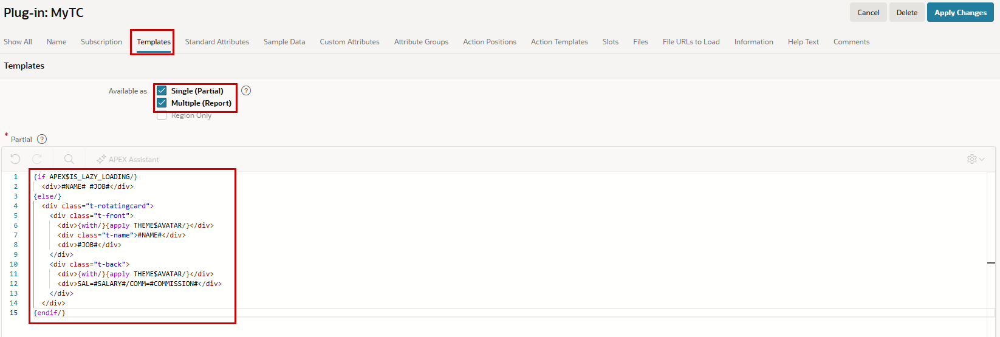{ style="display:block;margin:auto;" }

    Jetzt haben wir das Partial definiert, das aus den Multiple-Einstellungen ueber `#APEX$PARTIAL#` referenziert wird. Als Naechstes aendern wir das HTML fuer **Report Row**, **Report Body** und **Report Container** mit den folgenden HTML-Snippets.

    ```HTML
         <li #APEX$ROW_IDENTIFICATION# class="t-card-item">#APEX$PARTIAL#</li>
    ```

    ```HTML
         <ul class="t-card-list">  #APEX$ROWS# </ul>
    ```

    ```HTML
         <div id="#APEX$DOM_ID#" class="t-card-report">  #APEX$REPORT_BODY# </div>
    ```

    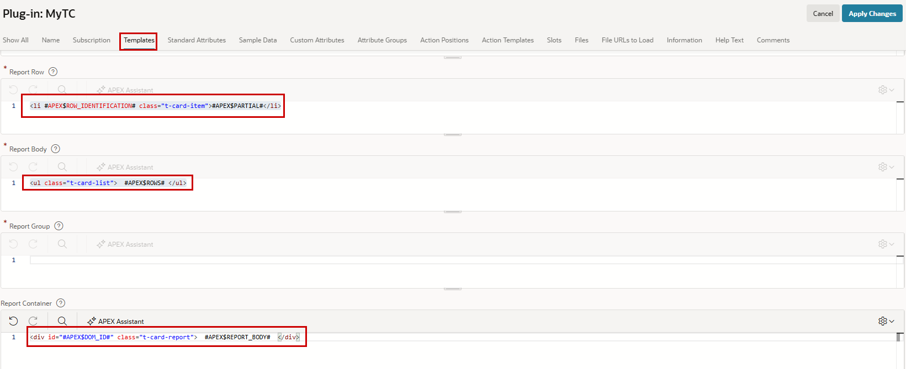{ style="display:block;margin:auto;" }

    Im Abschnitt **Custom Attributes** koennen wir Platzhalter definieren, die fuer Entwickler im Page Designer sichtbar sind und die Komponente einfacher nutzbar machen. Das machen wir ueber **Synchronize from Templates**.

    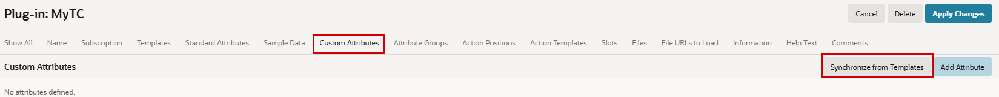{ style="display:block;margin:auto;" }

    Wenn es mehrere Attribute gibt, koennen sie gruppiert werden. Wir haben **Commission**, **JOB**, **Name** und **Salary** und gruppieren sie in `Basic` und `Money`, um spaeter im Page Designer zu sehen, wie das aussieht. Attribute, die keiner Gruppe zugeordnet sind, landen standardmaessig in der Gruppe Settings.

    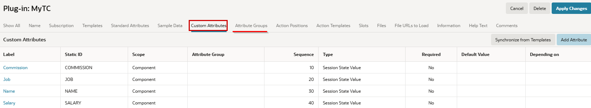{ style="display:block;margin:auto;" }

    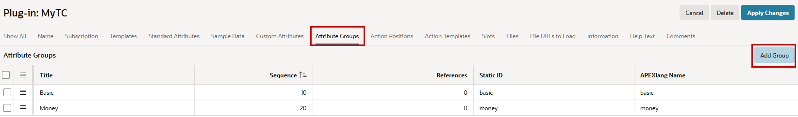{ style="display:block;margin:auto;" }

    Um ein Attribut einer Gruppe zuzuweisen, klicke auf den Namen des Attributs.

    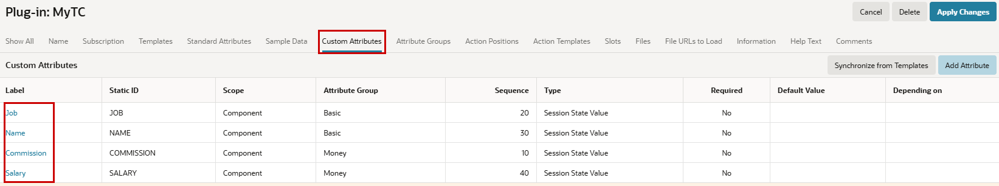{ style="display:block;margin:auto;" }

    Erstelle jetzt auf Seite 10 rechts neben der bestehenden Region **Layout** eine neue Region. Waehle als Typ unsere neue Template Component. Am einfachsten geht das per Drag-and-drop aus der Gallery, da unsere neue Komponente dort jetzt verfuegbar ist.

    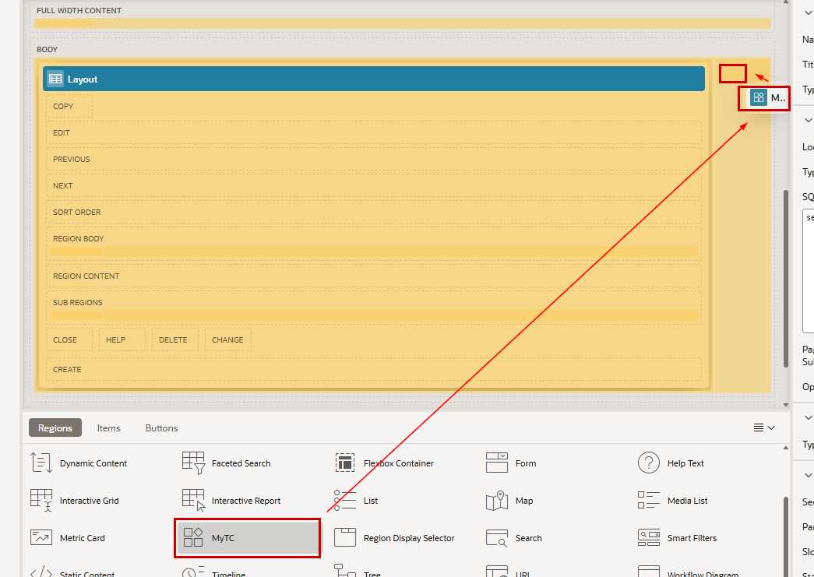{ style="display:block;margin:auto;" }

    Nenne die neue Region `Swap`. Die Komponente `MyTC` ist als **Type** bereits vorausgewaehlt, daher muessen wir fuer unsere Source nur noch `EMP` als **Table Name** auswaehlen.

    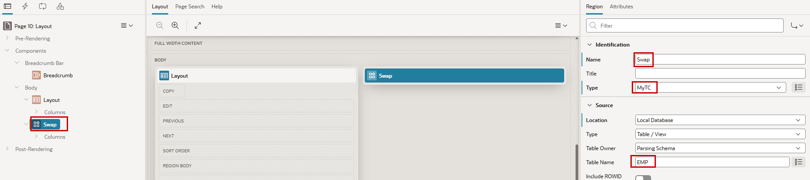{ style="display:block;margin:auto;" }

    Wenn wir den Attributes-Tab oeffnen, sehen wir die Abschnitte **Basic** und **Money** mit ihren Attributen aus der Template-Component-Definition. Wir mappen die Spalten entsprechend.

    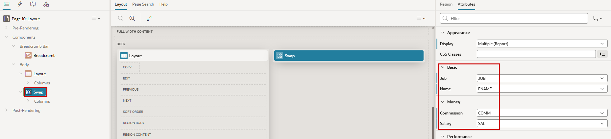{ style="display:block;margin:auto;" }

    Das Ausfuehren *funktioniert* irgendwie, sieht aber nicht schoen aus, weil das CSS fehlt. Kopiere auf Seitenebene das folgende CSS (das uebrigens mit etwas KI-Hilfe erzeugt wurde) in das Attribut **Inline**.

    ```CSS
        .t-card-list {
            list-style: none;
            padding: 0;
            margin: 0;

            display: grid;
            grid-template-columns: repeat(3, 1fr);
            gap: 2rem;
        }

        .t-card-item {
            display: flex;
            justify-content: center;
        }

        .t-rotatingcard {
            position: relative;
            width: 15rem;
            height: 10rem;
            perspective: 15rem;
            font-size: 14px;
        }

        .t-front, .t-back {
            position: absolute;
            width: 100%;
            height: 100%;
            display: flex;
            align-items: center;
            justify-content: center;
            margin: auto;
            border-radius: 20px;
            box-shadow: 0 1.5rem 4rem rgba(0, 0, 0, 0.8);
            transition: transform 2s cubic-bezier(0.25, 0.8, 0.25, 1);
            backface-visibility: hidden;
            overflow: hidden;
            flex-direction: column;
        }

        .t-front:before, .t-front:after, .t-back:before, .t-back:after {
            position: absolute;
        }

        .t-front:before, .t-back:before {
            top: -20px;
            right: -20px;
            width: 40px;
            height: 40px;
            background-color: rgba(255, 255, 255, 0.08);
            transform: rotate(45deg);
            z-index: 1;
        }

        .t-front:after, .t-back:after {
            top: 0;
            right: 5px;
            font-size: 24px;
            transform: rotate(45deg);
            z-index: 2;
        }

        .t-front {
            background-color: #90ee90;
            color: green;
            transform: rotateX(0deg);
        }

        .t-back {
            background-color: #ffcccb;
            color: red;
            transform: rotateX(180deg);
        }

        .t-rotatingcard:hover .t-back {
            transform: rotateX(360deg);
        }

        .t-rotatingcard:hover .t-front {
            transform: rotateX(180deg);
        }

        .t-name {
            text-decoration: underline;
        }
    ```

   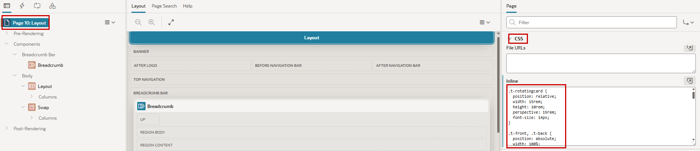{ style="display:block;margin:auto;" }

Ein anderer Ansatz ist, eine Datei in Shared Components - **Static Application Files** zu erstellen und sie im oben genannten Attribut **File URLs** zu referenzieren. Der am besten wiederverwendbare Ansatz, wenn du diese Template Component ueberall mit demselben CSS verwenden willst, ist, diese Datei in der Template Component selbst zu referenzieren. Dann ist sie unabhaengig von der verwendeten Seite verfuegbar.

<div class="two-columns">
  <div style="flex: 50%;">
     Akzeptanz durch Schnickschnack ;)
  </div>
  <div style="flex: 50%;">
        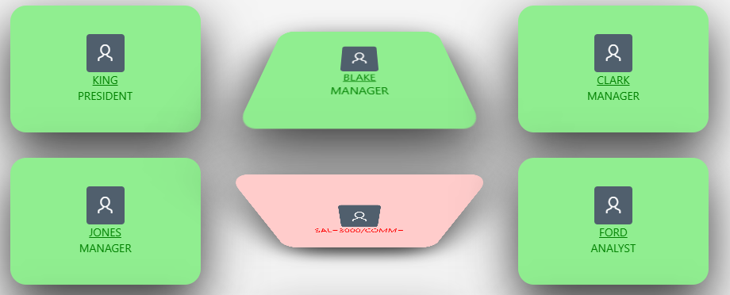
  </div>
</div>

## 12.4 Layout auf Objektebene

Du kannst Layout auf Objektebene beeinflussen, indem du CSS-Klassen hinzufuegst, ohne Templates zu aendern oder zu erstellen.

!!! exercise "CSS und Styles zu Items hinzufuegen"
    Wir aendern das Item **P3_SAL** in der Employee Form (Seite 3). Fuege im Abschnitt **Appearance** den String `my-highlight` zur Eigenschaft **CSS Classes** hinzu.
    Jetzt muessen wir diese Klasse definieren. Das koennte, wie im vorherigen Kapitel gesehen, auf Seitenebene passieren. Schreibe den folgenden Code auf Seitenebene in das Feld **Inline** im Abschnitt **CSS**.

    ``` CSS
        .my-highlight {
          background-color: #fffae6;
          border: 1px solid #f7c948;
          font-weight: bold;
        }
    ```

    Pruefe nun das SAL-Item in der Anwendung. Es sollte ein gelber Rahmen um das Gehalt erscheinen.

    Es ist auch moeglich, individuelle HTML-Styles hinzuzufuegen.

    Gehe jetzt zum Item **P3_COMM** und setze im Abschnitt **Advanced** das Feld **Custom Attributes** auf `style="color:red; font-size:28px;"`

    Die Provision sollte nun rot und gross angezeigt werden.

    Abschliessend wollen wir den Namen bedingt formatieren. Erstelle dazu eine **Dynamic Action** mit dem Event **Page Load**. Waehle in der **True Action** als Action **Execute JavaScript Code** und kopiere das folgende Snippet in das Feld **Code**.

    ```javascript
        if ($v('P3_JOB') == 'PRESIDENT' || $v('P3_JOB') == 'MANAGER') {
            $('#P3_ENAME').css('background-color', '#ffe6e6');
          } else {
            $('#P3_ENAME').css('background-color', '');
          }
    ```

    Der Name hat nun einen roten Hintergrund, wenn der Job Manager oder President ist.

!!! bytheway "CSS utility classes"
    <div class="two-columns">
      <div style="flex: 50%;">
            *Uebrigens*,<br>
            waehrend viele Komponenten im Universal Theme automatisch mehrere Farben verwenden, kannst du diese auch in eigenen Komponenten nutzen. Universal Theme stellt eine Reihe von CSS Utility Classes bereit, mit denen diese Farbpalette auf beliebiges HTML-Markup angewendet werden kann: [Hier klicken](https://oracleapex.com/ords/r/apex_pm/ut/color-and-status-modifiers){target="_blank"}
      </div>
      <div style="flex: 50%;">
          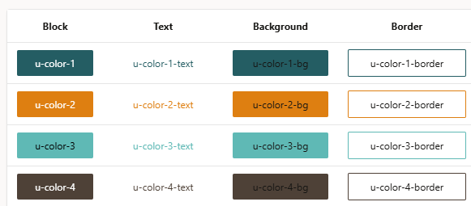{ style="display:block;margin:auto;" }
      </div>
    </div>

## 12.5 Responsive Grid Layout

Oracle APEX verwendet ein Responsive Grid Layout auf Basis eines 12-Spalten-Rasters. Seitenkomponenten wie Regionen und Items koennen positioniert werden, indem ausgewaehlt wird, wo sie starten und wie viele Spalten sie einnehmen. Dadurch lassen sich Layouts einfach erstellen, die sich an verschiedene Bildschirmgroessen anpassen und gleichzeitig eine konsistente Seitenstruktur behalten. Das Grid kann auch verschachtelt werden, sodass Regionen oder Items innerhalb einer Parent-Grid-Spalte ihr eigenes internes 12-Spalten-Layout definieren koennen.

Die Positionierung innerhalb des Grids wird ueber folgende Eigenschaften gesteuert:

* **Start New Row** - ob das Objekt eine neue Zeile startet
* **Column** - die Spalte von 1 bis 12, in der das Objekt startet
* **Column Span** - die Anzahl der Spalten, die das Objekt einnimmt
* **New Column** - ob das Objekt in derselben Zeile eine neue Spalte startet (nur verfuegbar, wenn **Start New Row** auf No steht)

!!! bytheway "Responsive Grid Layout"
    <div class="two-columns">
        <div style="flex: 50%;">
          *Uebrigens*,<br>
          du kannst das Grid mit der Developer Toolbar visualisieren. Klicke in der Toolbar auf das Informations-Icon und waehle **Show Layout Columns** oder **Hide Layout Columns**.
        </div>
        <div style="flex: 50%;">
            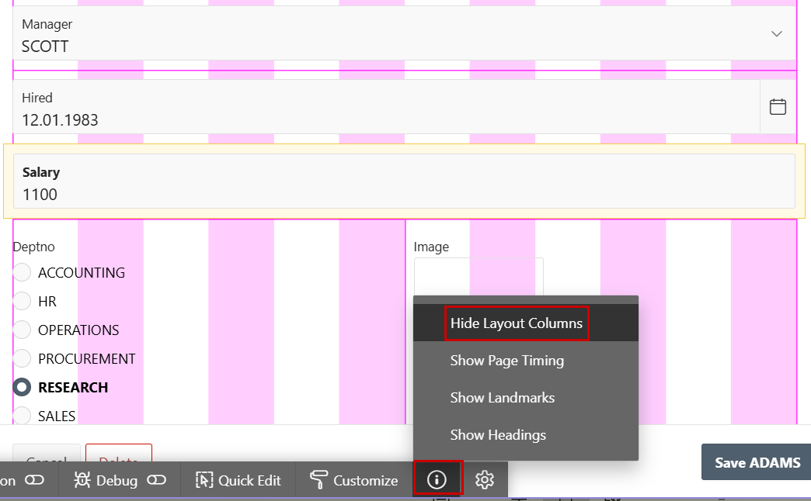{ style="display:block;margin:auto;" }
        </div>
    </div>

