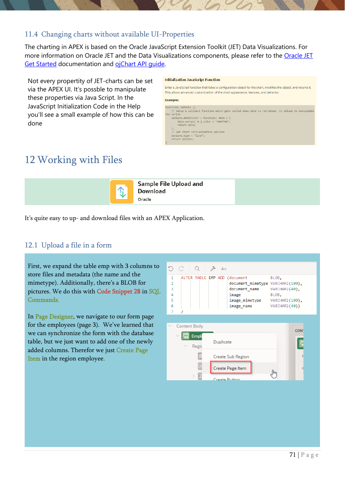

# 12. Working with Files

Upload, download, image display, and ZIP downloads.

{ .chapter-image }

## What this chapter covers

- Adds BLOB columns and metadata columns for file storage.
- Creates a file upload item with a dropzone UI.
- Displays downloadable documents in the employee report.
- Uploads and shows images in a form and in a report.
- Creates a ZIP download action for multiple files.

## Workshop transcript

Transcribed from PDF pages 71-78

### PDF page 71

11.4 Changing charts without available UI-Properties The charting in APEX is based on the Oracle JavaScript Extension Toolkit (JET) Data Visualizations. For more information on Oracle JET and the Data Visualizations components, please refer to the Oracle JET Get Started documentation and ojChart API guide.

Not every propertity of JET-charts can be set via the APEX UI. It’s possble to manipulate these properties via Java Script. In the JavaScript Initialization Code in the Help you’ll see a small example of how this can be done

12 Working with Files

It’s quite easy to up- and download files with an APEX Application.

12.1 Upload a file in a form

First, we expand the table emp with 3 columns to store files and metadata (the name and the mimetype). Additionally, there’s a BLOB for pictures. We do this with Code Snippet 28 in SQL Commands.

In Page Designer, we navigate to our form page for the employees (page 3). We’ve learned that we can synchronize the form with the database table, but we just want to add one of the newly added columns. Therefor we just Create Page Item in the region employee.

### PDF page 72

We name it P3_DOCUMENT, set the Type to File Upload.. and define the label.

There are different ways to display a File Upload. We choose Block Dropzone.

Files can be (temporarily) stored in a central table, but we want to store them in our just- created BLOB column. And here we see, why we’ve created the columns DOCUMENT_MIMETYPE & DOCUMENT_NAME. They can automatically store this metadata.

Last we had to define the source for the file, which is in our case the Column Document in the Form Region Employee of the Data Type BLOB.

In the application, you can now upload a file for an employee

### PDF page 73

12.2 Download Files

To download a file in the form itself, just set the properties Display Download Link and Download Link Text properly (in the properties of page item P3_DOCUMENT). This should be the defaut.

Latest here it’s nice to know the mimetype and the name of the file.

Now we want to add the download possibility to the report on page 2.

In the Employees Report Region (page 2), we change the Type in the Source section to SQL Query.

You will see the query with all columns including the Where-Clause we added in chapter 5.4

For the report itself we just need to know, if there’s a document or not, so we override the line document, with Code Snippet 29. With the length we know, if there’s a file or not.

Select to DOCUMENT column in the left pane and set Type to Download BLOB

and reference in the BLOB Attributes section our BLOB Column and die Primary Key.

DOCUMENT_MIMETYPE and DOCUMENT_NAME are relevant so that the browser is later able to know, what to do with the file.

### PDF page 74

In the Appearance Section, we define a display text for the download. We reference to name of the file, which is stored in the column DOCUMENT_NAME (enclosed by hashes).

Depending on the type of report (here Interactive Report), you need to make the new column visible in the Actions Menu under Columns.

Now you can download the documents from the table, and you’ll see that the name of the document and the mimetype is used.

### PDF page 75

12.3 Image Upload in a Form & Image Display in a Report Now, the same for pictures (which are just files that can be nicely shown) is very similar to do. Sure can you store even pictures in our document column, but we want to display these.

In Page Designer, we navigate again to our form page for the employees (page 3). Therefor we just Create Page Item in the region employee.

We name it P3_IMAGE, set the Type to Image Upload.. and define the label.

There are different ways to display an Image Upload. We choose the Icon Dropzone.

As before with the documents we choose the BLOB column. as Type for Storage. And here we see, why we’ve created the columns IMAGE_MIMETYPE & IMAGE_NAME.

Now we had to define the source for the file, which is in our case the Column Image in the Form Region Employee of the Data Type BLOB.

Last we drag and drop the Item P3_IMAGE in the Layout Editor to the right side of the Item P3_DEPTNO.

Now you can add Images to the employees.

### PDF page 76

Now let’s display the image in the report.

As before for the files, do now very similar the following on page 2

- Replace line image, in report query with Code Snippet 30

- Choose now Display Image as Type for the column IMAGE

- In the BLOB Attribute Section set Table Name, BLOB Column, Primary KEY Column 1, Mime Type

Column & Filename Column with the appropriate values.

- In the Actions Menu add the Image Column to Display in Report

Don’t forget to go to the Actions Menu and make this view via Report – Save Report visible as Default Report Setting for all users.

If the loaded images are different sizes, you will see different sizes in the report. To avoid having to rework this for each individual image, you can do this using a CSS snippet

Navigate to the Column Image in the Report at page 2 and set the Static ID to IMAGES

With that ID it’s possible to reference this column in some CSS Code.

In the Header of the Region Employees we copy Code Snippet 31. In this small CSS- Snippet we reference the previously set Static ID to manipulate the sizing of the images.

With that, all images are displayed in the same size, but probably one or the other with the wrong ratio of height and width. Delete the width from the code snippet, so all images have the same height and and the original ratio.

### PDF page 77

12.4 File Download with Dynamic Action or Process There is a declarative option to download one or more files (as a zip) outside of a report or a form. There is a suitable dynamic action and a corresponding process type for this. We will now place the download of all images in the table as a ZIP file behind a button.

In Page Designer, we navigate to our report page (page 2). Therefor we just Create Page Item in the region employee.

We name the button & the label ZIP …

… and position it Right of the Interactive Report Search (besides the CREATE-Button).

As Action in the Behaviour Section we choose Defined by Dynamic Action.

Then we right-click the Button in the left pane and choose Create Dynamic Action.

There’s now a True-Action for the Dynamic Action (called New per Default), which we change from Show to Download.

In the Settings Section we activate the Multiple Files Switch an choose images_&APP_USER..zip (two dots, that’s no typo) as Filename (&APP_USER. Is the syntax for substitution strings).

### PDF page 78

As SQL Query we use Code Snippet 32. This query selects all images of the table.

Now there’s a button at the right upper side of the report. Clicking on it downloads a file with all images which is named depending the current logged in user. There’s the same configuration possible with a process type (also with the name download) to initiate a download.

In our example we just selected the object itself and the name. When downloading a single file instead of multiple files at once, additionally the mimetype should be included in the query, so the browser is able to handle the file behaviour of the browser can react accordingly.

By the way, of course, it is also possible not to save the documents in the database, but only to reference them there. For example, the documents can be placed in the Object Store of the Oracle Cloud Infrastructure via the appropriate APIs and then referenced from there. Starting with release 23.2 it’s also possible to store static resources in the Object Storage.

