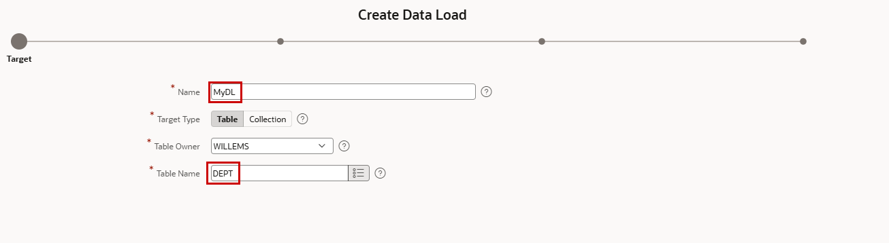
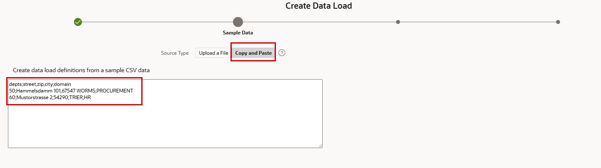
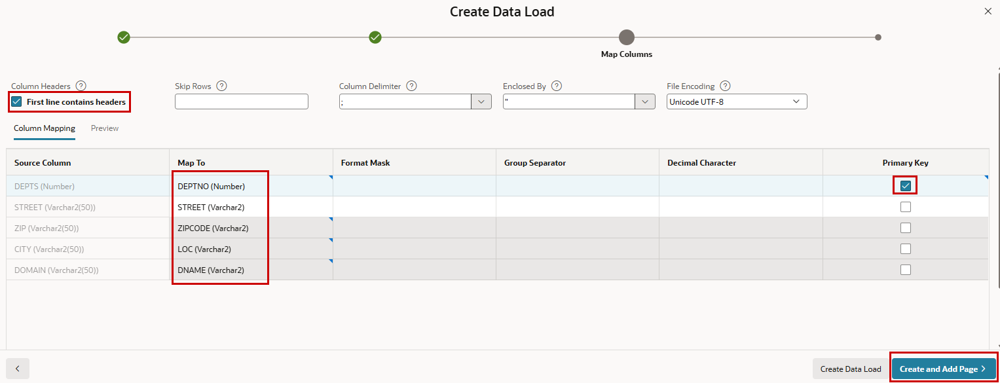
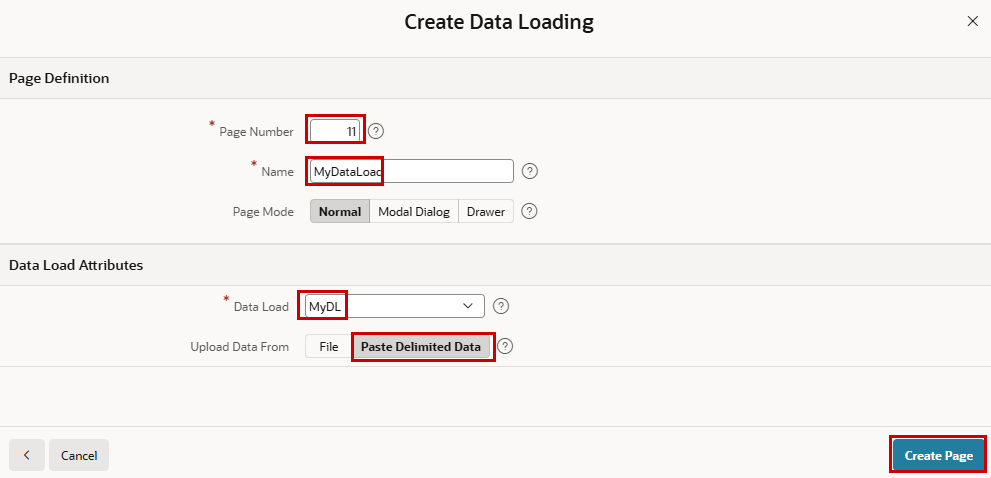

# 13. Daten laden

!!! sampleapp "Sample App Data Loading"
    <div class="two-columns">
      <div style="flex: 50%;">
           Diese Anwendung basiert auf einfachen EMP- und DEPT-Tabellen und zeigt, wie Entwickler Seiten definieren können, über die Endbenutzer Spreadsheet-Daten in eine bestehende Tabelle laden können.
      </div>
      <div style="flex: 50%;">
          { style="display:block;margin:auto;" }
      </div>
    </div>

APEX bietet leistungsfähige eingebaute Funktionen zum Importieren von Daten aus externen Quellen in Datenbanktabellen. Das Data-Loading-Framework unterstützt gängige Dateiformate wie CSV, XLSX, XML und JSON. Dadurch können Entwickler und Endbenutzer Daten mit wenig Aufwand laden. Während des Imports kann APEX Spalten automatisch erkennen, Quelldaten Datenbanktabellen zuordnen, Werte validieren und Fehler melden.

Im Hintergrund bietet Oracle APEX zwei APIs, die auch programmatisch verwendet werden können:

* **APEX Data Loading API** - stellt ein flexibles Framework zum Laden und Validieren von Daten in Datenbanktabellen bereit.
* **APEX Data Parser API** - extrahiert und parst Daten aus Dateien wie CSV, Excel, XML und JSON, ohne dass eine vordefinierte Datenbankstruktur nötig ist.

!!! exercise "Data Load für Endbenutzer aktivieren"
    Neben den APIs für Data Loading gibt es die Möglichkeit, **Data Load Definitions** deklarativ in **Shared Components** zu definieren, damit Benutzer Daten über APEX-Anwendungen laden können. Data Load Definitions gehören zu **Other Components** im oberen rechten Bereich. Klicke darauf und erstelle die erste Data Load Definition **From Scratch**. Nenne die Definition `MyDL` und verwende `DEPT` als **Table Name**.

    { style="display:block;margin:auto;" }

    Danach kannst du ein Beispiel für die erwarteten Dateien kopieren und einfügen oder hochladen. Idealerweise ist das eine Datei, die Endbenutzer später verwenden, um ihre Daten einzutragen, oder die an anderer Stelle generiert wird. Typischerweise wird XLSX verwendet, aber hier machen wir es mit CSV. Kopiere dieses CSV als Beispiel in den Wizard.

    ```CSV
      depts;street;zip;city;domain
      50;Hammelsdamm 101;67547;WORMS;PROCUREMENT
      60;Mustorstrasse 2;54290;TRIER;HR
    ```

    { style="display:block;margin:auto;" }

    Im nächsten Schritt kannst du den Inhalt deiner Datei deinem Zielobjekt zuordnen. Street ist bereits vorgemappt, weil es im CSV und in der Datenbank denselben Namen hat. In unserem Beispiel ist **First line contains headers** aktiviert, und wir markieren die Department-Nummer als **Primary Key**.
    Klicke auf **Create and Add Page**, um direkt eine neue Seite mit einer Data-Loading-Region zu erstellen.

    { style="display:block;margin:auto;" }

    Verwende `11` als **Page Number** und nenne die Seite `Loading`. Als **Data Load** wird unsere Definition `MyDL` verwendet, und wir nutzen **Paste Delimited Data**, um Daten zu laden.

    { style="display:block;margin:auto;" }

    Es gibt jetzt eine Seite `Loading`, aber sie ist nicht im Menü sichtbar, weil unsere gewählte Art der Erstellung keinen Menüeintrag hinzufügt.
    Gehe zu **Shared Components**, dann zum Abschnitt **Navigation and Search**, klicke auf **Lists** und danach auf **Navigation Menu**.
    Klicke rechts auf den hellblauen Button **Create List Entry**. Setze für den neuen Eintrag **List Entry Label** auf `Load Data` und **Page** auf unsere gerade erstellte Seite `11`. Klicke danach erneut auf **Create List Entry**.

    Jetzt kann ein Endbenutzer Daten über die APEX-Anwendung in die Datenbank laden. Lade ein Beispiel (das oben genannte) über diese Seite, um zu sehen, was passiert.

Wenn **File** statt Copy-and-paste als Quelle gewählt wird, wird ein File Upload erzeugt.

Sieh dir die **Data Load Definition** in **Shared Components** noch einmal an, um weitere Optionen der Definition zu sehen. Du kannst beim Laden von Daten **Append**, **Merge** oder **Replace** wählen und definieren, was im Fehlerfall passieren soll.

