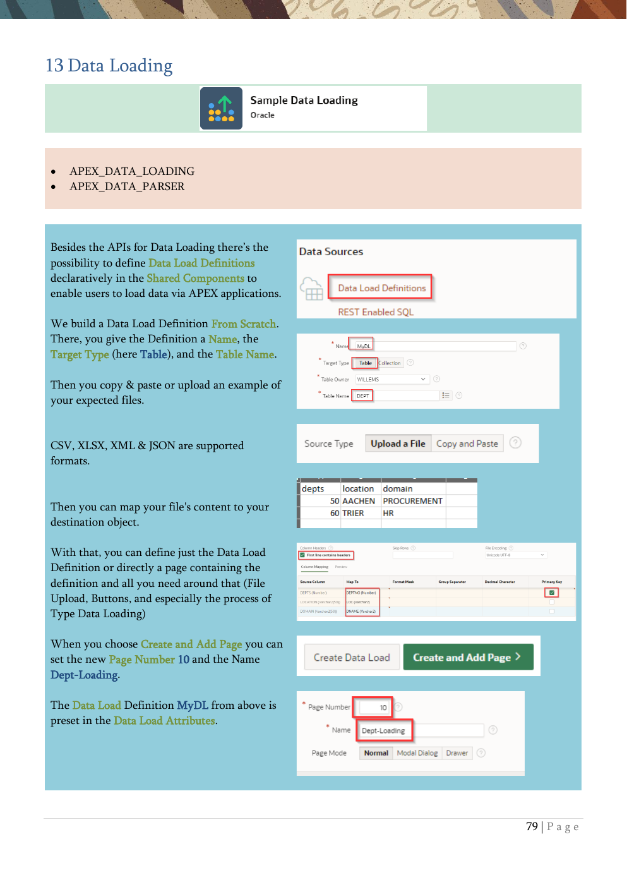

# 13. Data Loading

Declarative data load definitions and page generation.

{ .chapter-image }

## What this chapter covers

- Introduces APEX_DATA_LOADING and APEX_DATA_PARSER.
- Builds a Data Load Definition from scratch.
- Maps file content to database columns.
- Generates a page that includes upload, preview, and loading actions.

## Workshop transcript

Transcribed from PDF pages 79-80

### PDF page 79

13 Data Loading

- APEX_DATA_LOADING

- APEX_DATA_PARSER

Besides the APIs for Data Loading there’s the possibility to define Data Load Definitions declaratively in the Shared Components to enable users to load data via APEX applications.

We build a Data Load Definition From Scratch. There, you give the Definition a Name, the Target Type (here Table), and the Table Name.

Then you copy & paste or upload an example of your expected files.

CSV, XLSX, XML & JSON are supported formats.

Then you can map your file's content to your destination object.

With that, you can define just the Data Load Definition or directly a page containing the definition and all you need around that (File Upload, Buttons, and especially the process of Type Data Loading)

When you choose Create and Add Page you can set the new Page Number 10 and the Name Dept-Loading.

The Data Load Definition MyDL from above is preset in the Data Load Attributes.

### PDF page 80

There’s a new page created, based on the Data Load Definition. But it’s not automatically part of the menu, so we add this page now to the menu.

In the Shared Components in the Navigation & Search Section click on Lists and there on Navigation Menu.

You’ll see the Menu Entries and we add one via the button Create Entry.

We use Dept Data Loading as List Entry Label and choose Page 10 as Target.

Now an end user can load data via files into the database.

The page in the application uses File Upload Item for the document, a preview of the data, which is automatically generated in a query using the API APEX_DATA_PARSER, and a Process of type Data Loading, which uses the created definition MyDL.

By the way, Oracle APEX uses Monaco Editor to provide a good coding experience throughout the development environment. The editor provides in-context code completion, syntax highlighting, and superior accessibility. (https://microsoft.github.io/monaco-editor/).

