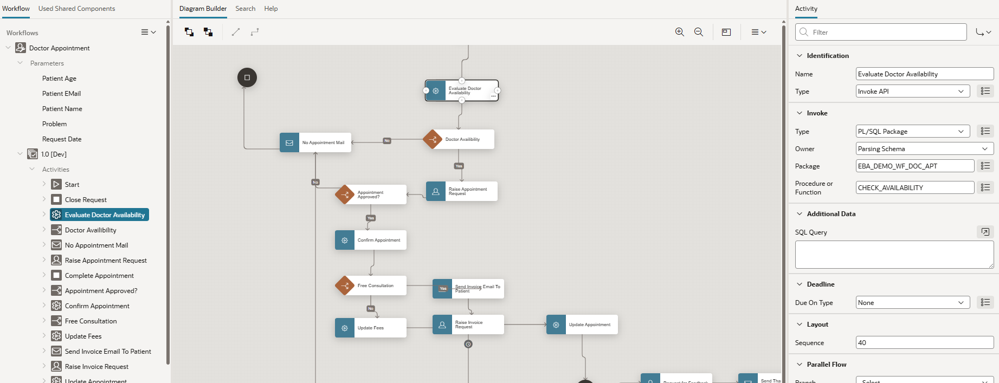

# 14. Approvals & Workflows

!!! sampleapp "Sample App Workflow, Approvals, and Tasks"
    

      

           This application highlights the key features of the Workflow, Approvals, and Tasks capabilities in Oracle APEX. It lets users manage changes to employees' salaries and jobs, provision a laptop for an employee, and manage employees' self-appraisals. All use cases involve human tasks that require action by an appropriate individual, some of which require approval or rejection.
      

      

          { style="display:block;margin:auto;" }
      

    

## 14.1 Approvals & Human Tasks

APEX provides built-in support for **Approvals** and **Human Tasks**, making it easy to implement approval workflows and other user-driven business processes in applications.

The feature includes a predefined data model and several application components, such as the **Unified Task List**, **Task Detail** pages, and the **Human Task** process type. Together, these components provide a framework for creating, assigning, tracking, and completing tasks that require human interaction.

Approvers can be defined statically at design time or determined dynamically at runtime based on application data, organizational structures, or business rules. This flexibility enables simple approval scenarios as well as more sophisticated routing and escalation processes.

For programmatic access, APEX provides the **APEX_APPROVAL** API. The API can be used to create, assign, update, approve, reject, and manage human tasks directly from application code.

Approvals integrate seamlessly with the **APEX Workflow Engine** and can be used as workflow activities within larger business processes. However, Human Tasks and Approvals can also be used independently without defining a complete workflow.

## 14.2 Workflow

**Workflow Engine**

Starting with APEX 23.2, a built-in Workflow Engine is available as part of the platform. Workflows can be designed visually using the **Workflow Designer**, which is integrated into App Builder.

APEX can automatically generate **Workflow Console** pages that allow administrators and users to monitor, manage, and interact with workflow instances. These generated pages can be customized like any other APEX page.

Workflow functionality can be integrated declaratively into applications using the provided **Workflow** process and dynamic action components. For programmatic access, Oracle APEX provides the **APEX_WORKFLOW** API, which allows developers to start workflows, manage workflow instances, and interact with workflow activities from application code.

The APEX Workflow Engine focuses on simplicity, extensibility, and seamless integration with the APEX platform. It is not intended to implement the BPMN 2.0 standard. Organizations requiring BPMN 2.0 support can consider **Flows for APEX**, an open-source workflow solution developed by APEX enthusiasts ([flowsforapex.org](https://flowsforapex.org/){target="_blank"}).

**Workflow Activities**

Workflow Activities are the building blocks of a workflow definition. Each activity represents a unit of work that is executed when the workflow reaches that step. Within the APEX architecture, workflow activities are implemented as **process type plug-ins**, which allows workflows to reuse existing APEX functionality.

Every workflow contains:

* Exactly one **Start Activity**
* One or more **End Activities**
* One or more intermediate activities connected by transitions

{ style="display:block;margin:auto;" }

The following native APEX process types can be used as workflow activities:

* Execute Code
* Send Email
* Human Task - Create Approval
* Send Push Notification

In addition, APEX provides workflow-specific activities such as:

* Workflow Start
* Workflow End
* Wait
* Workflow Switch

Together, these activities enable developers to model approval processes, business workflows, notifications, escalations, and other process-driven application scenarios without requiring a separate workflow server.
