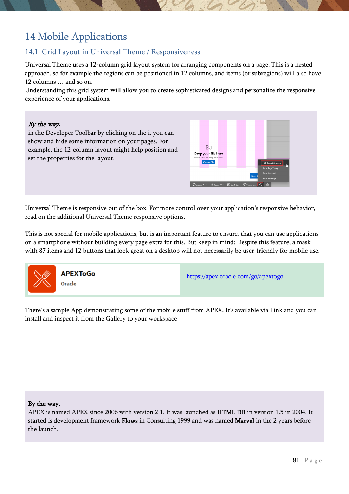

# 14. Mobile Applications

Responsive layout, report variants, PWA support, and push notifications.

{ .chapter-image }

## What this chapter covers

- Explains the Universal Theme 12-column grid layout.
- Builds a column toggle report and then a reflow report.
- Turns the application into a Progressive Web App.
- Shows the install flow and mobile home-screen experience.
- Introduces push notifications as a real-time capability.

## Workshop transcript

Transcribed from PDF pages 81-86

### PDF page 81

14 Mobile Applications 14.1 Grid Layout in Universal Theme / Responsiveness Universal Theme uses a 12-column grid layout system for arranging components on a page. This is a nested approach, so for example the regions can be positioned in 12 columns, and items (or subregions) will also have 12 columns … and so on. Understanding this grid system will allow you to create sophisticated designs and personalize the responsive experience of your applications.

By the way, in the Developer Toolbar by clicking on the i, you can show and hide some information on your pages. For example, the 12-column layout might help position and set the properties for the layout.

Universal Theme is responsive out of the box. For more control over your application's responsive behavior, read on the additional Universal Theme responsive options.

This is not special for mobile applications, but is an important feature to ensure, that you can use applications on a smartphone without building every page extra for this. But keep in mind: Despite this feature, a mask with 87 items and 12 buttons that look great on a desktop will not necessarily be user-friendly for mobile use.

https://apex.oracle.com/go/apextogo

There’s a sample App demonstrating some of the mobile stuff from APEX. It’s available via Link and you can install and inspect it from the Gallery to your workspace

By the way, APEX is named APEX since 2006 with version 2.1. It was launched as HTML DB in version 1.5 in 2004. It started is development framework Flows in Consulting 1999 and was named Marvel in the 2 years before the launch.

### PDF page 82

14.2 Create a Column Toggle Report A Column Toggle Report lets mobile end users easily choose, which columns of a report they want to see on their device.

Create a new page

… and choose a blank one (Blank Page)

Name the page MyReports and choose 11 as the Page Number

In Page Designer create a new region at the body

Name the region MobileReport and choose from the possible types for the region Column Toggle Report

Choose EMP as the underlying table for this report

Run the report on a desktop (and change your window size) or from a mobile device to see the handling for this report type.

### PDF page 83

By the way, unsaved settings can be identified by the green line in front of a property.

14.3 Modify to Reflow Report We will use the just-created Column Toggle Report and change it to another report type for mobile devices, a Reflow Report.

Change the Type of our MobileReport to Reflow Report

Run the report and see what happens when you shrink the browser window horizontally.

>

By the way, you need to enable network services to send mails. These are disabled by default in the database. Network services can be enabled via the package DBMS_NETWORK_ACL_ADMIN.

- Responsiveness of Applications

- Mobile Menu -> Design – Mobile Patterns – Navigation

- Appearance for Reports

- Universal Thema - App Components

o Alert o Badges List o Card Templates o Comments o Value Attribute Pairs

### PDF page 84

14.4 Use your application on a mobile device as PWA (Progressive Web App) Since APEX 21.2, it is possible to declaratively use APEX Applications as Progressive Web Apps (PWA). A PWA is a website that has many features known from native applications. It’s a mixture of a responsive website and an app. So-called service workers serve offline functionalities through optimized caching.

Go to the Shared Components and choose Progressive Web App in the User Interface section.

Activate the switches for Enable Progressive Web App and Installable

Select Fullscreen for Display and any color you want for a Custom Theme Color (should be a striking color )

On your PC you now see, in the top right corner, the Install App possibility

You will be asked to install the app when clicking there. Do this.

Now you can start the App via the Windows Menu.

By the way, APEX developers who want to get an overview of the database objects used in their application can use the API APEX_APP_OBJECT_DEPENDENCY. This API analyses the applications and reports all references to database objects by page and application.

### PDF page 85

You don’t see the Install App again after the installation. You can find (and uninstall) the app in Windows as follows

Click on Start and Settings

Click on Apps

You’ll find the installed app in the Apps & features (Windows 10) or Installed apps (Windows 11) section and there you can deinstall it.

You will see the app in a full window without seeing the browser.

There’s a shortcut on your desktop to run the application, and you will see your icon, for example in the taskbar.

By the way, you can decide where the developer toolbar is shown on the screen.

### PDF page 86

Do the same now on a mobile device. (Not every browser might support this)

You’ll see a symbol for the download

Clicking this shows you what to do to add this app to your home screen Follow this and search for the icon on your screen.

After that, you can start the application from the icon on your mobile device, and you will see the application – like on the desktop – without having to see the browser. Try this out and use the application on your mobile device. Rotate your screen and see how the app reacts.

14.5 Push Notification Starting with APEX 23.1 it’s possible to have a real-time communication capability for all devices. For a short introduction/overview have a look at https://youtu.be/XMjWF-x8D1w and see at https://apex.oracle.com/pls/apex/r/apex_pm/apex-pwa-reference/push-notifications for some related information about that.

