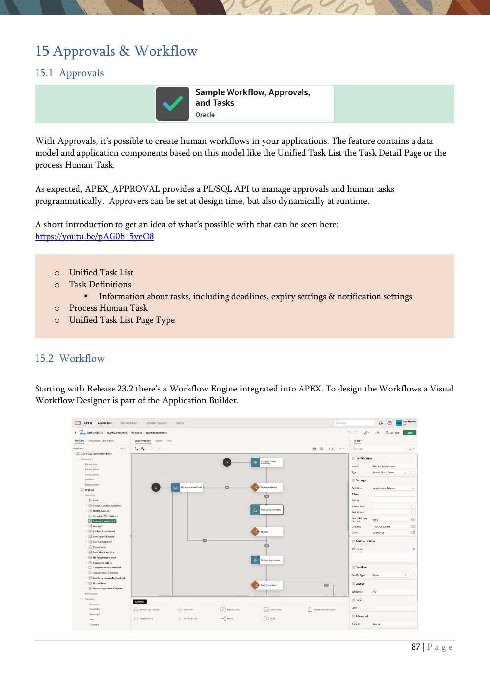

# 15. Approvals & Workflow

Human workflows, workflow console pages, and workflow activities.

{ .chapter-image }

## What this chapter covers

- Explains APEX Approvals and the Unified Task List.
- Introduces the workflow engine integrated into APEX.
- Shows workflow console pages and the workflow designer.
- Mentions debugging and advisor tools for inspection.

## Workshop transcript

Transcribed from PDF pages 87-88

### PDF page 87

15 Approvals & Workflow 15.1 Approvals

With Approvals, it’s possible to create human workflows in your applications. The feature contains a data model and application components based on this model like the Unified Task List the Task Detail Page or the process Human Task.

As expected, APEX_APPROVAL provides a PL/SQL API to manage approvals and human tasks programmatically. Approvers can be set at design time, but also dynamically at runtime.

A short introduction to get an idea of what’s possible with that can be seen here: https://youtu.be/pAG0b_5yeO8

o Unified Task List o Task Definitions ▪ Information about tasks, including deadlines, expiry settings & notification settings o Process Human Task o Unified Task List Page Type

15.2 Workflow

Starting with Release 23.2 there’s a Workflow Engine integrated into APEX. To design the Workflows a Visual Workflow Designer is part of the Application Builder.

### PDF page 88

Workflow Console pages can be generated and customized to manage and administer the workflows. With a provided Workflow Plugin in the Page Designer, the triggering and other workflow operations can be integrated into the applications declaratively. Sure, there’s a Workflow Engine to execute the Workflows, and not surprisingly, there is of course a PL/SQL API (APEX_WORKFLOW) available to work codebases with the Engine.

APEX Workflow focuses on simplicity, extensibility, and integration in the APEX infrastructure and does not and will not implement BPMN 2.0. Customers who like to have BPMN 2.0, can choose Flows for APEX10 from our German partner Hyand.

The Workflow Activities are the boxes within the Workflow definition. They specify which kind of work is performed in “Workflow Execution” when the Activity is activated. In the APEX Ecosystem, each workflow activity corresponds to a process-type plugin. All workflows have:

- Exactly one Start Activity at the beginning

- At least one End Activity at the end

- Existing Native Process Type Plugins like Execute Code, Send E-

Mail, Human Task – Create (Approval), and Send Push Notifications, are available as Workflow Activities.

- Workflow Specific Process Type Plugins are Workflow Start,

Workflow End, Wait, and Workflow Switch.

A short introduction to this engine can be seen in this video from product management: https://youtu.be/KGJPMVpI-Rw?si=OK1xJL53Ge_DZU-3

By the way, in the you can click on Debug to define the Debug Level you want to use und to have a look at the the current debug information. There you can see the current session information.

Generally, it’s recommended to run also the Advisor to check the application integrity after development steps. The Advisor can be foud at the applications homepage in the utilities.

10 https://flowsforapex.org/

