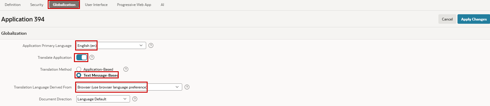
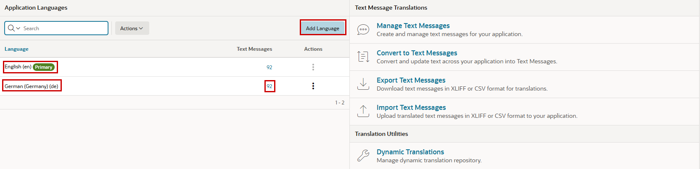

# 15. Translations

APEX has long provided a translation framework that enables developers to create multilingual applications. Traditionally, translations were based on XLIFF translation files, which are generated from an application, translated externally, and then imported back into APEX. This approach is well suited for professional translation workflows and large-scale projects, but managing translation files can become cumbersome when applications change frequently.

In the traditional translation approach, translated text is stored in a separate translated application that is generated from the primary application. Whenever translatable content changes in the source application, the translated applications must be synchronized and updated accordingly. While this approach integrates well with established translation workflows, maintaining multiple application versions can increase administrative effort.

With Oracle APEX 26.1, a new **Message-Based Translation** approach has been introduced. Instead of relying solely on exported translation files, application texts can now be managed directly as translatable messages within APEX. This simplifies maintenance and allows translations to be updated more quickly during development.

With Message-Based Translation, all translations are maintained within the same application. As a result, there is no need to manage separate translated applications, and the synchronization and regeneration steps required by the traditional approach are eliminated. This simplifies both development and maintenance.

A potential trade-off of Message-Based Translation is that translated texts are resolved at runtime rather than being stored in separate translated applications. While this introduces a small amount of additional processing, the impact is typically negligible for business applications. In return, developers benefit from a much simpler architecture, as only a single application must be maintained and no synchronization of translated applications is required.

Both approaches remain available and can be used depending on project requirements. Organizations with established translation processes may continue to use translation repositories and XLIFF files, while message-based translations provide a more agile alternative for many modern application development scenarios.

Steps for **Application-Based Translations**

1. Define the application language by mapping the primary-language application to one or more translated applications.
2. Seed the translatable text for the application so that it is available in the translation repository.
3. Translate the text directly in the APEX UI, or export it as XLIFF, translate the XLIFF file, and import it back into the repository.
4. Publish the translated application.

In the following exercise, you will explore **Message-Based Translation**.

!!! exercise "Translate the application to German"
    In **Shared Components**, open **Application Translations** in the **Globalization** section. First, enable translations for this application. APEX displays the **Globalization** properties for your application, where `English (en)` should be set as the **Application Primary Language**.

    After enabling **Translate Application**, you can choose between the two **Translation Methods**. For this exercise, select `Text Message-Based`. Finally, let the browser determine the language by setting **Translation Language Derived From** to `Browser (use browser language preference)`.

    ##### Browser Language

    { style="display:block;margin:auto;" }

    When you return to **Application Translations** in **Shared Components**, use the **Add Language** button to create a new language configuration. Add `German (de)`. You can now see two languages on the left: the primary language, **English**, and the translated language, **German**. You can also see the number of Text Messages in the application.

    { style="display:block;margin:auto;" }

    Click the number of Text Messages to translate them directly in APEX. As a shortcut, you can download the translation file as CSV from the three-dot menu in the Actions column, use an LLM to translate it, and then upload the translated CSV file again. You can upload it by using **Import Text Messages** on the right side of the translation screen. That's it. You still need to review the translation, but most of the work is done.

    Test the translation by changing the language settings of your browser.

    When you inspect the application definition, you will find references where static text was used before. Instead of `"Job"` as the label for the job item, you will now see `"&{JOB}."`, which is a reference that is resolved at runtime.

!!! bytheway "APEX UI Languages"
    *By the way*, 
    you can change the language of the APEX development interface directly on the APEX start page, provided that the relevant language sets have been installed. Scroll down and select the desired language. You can also select the language when logging in to the environment.
