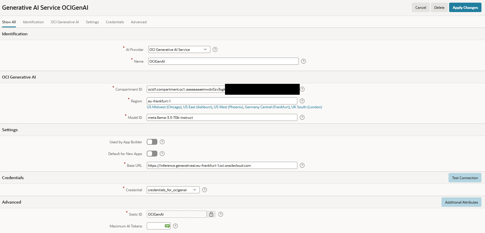

# 16. KI in APEX

Künstliche Intelligenz ist schnell zu einem wichtigen Thema für die Anwendungsentwicklung geworden. Eine umfassende Diskussion von KI liegt außerhalb des Umfangs dieses Workshops. Dieses Kapitel gibt aber eine kurze Einführung in die KI-Fähigkeiten von Oracle APEX und hebt einige der wichtigsten Features hervor, die in den letzten Releases eingeführt wurden.

Seit Oracle APEX 24.1 sind KI-Fähigkeiten ein integrierter Bestandteil der Plattform. Sie unterstützen sowohl Entwickler beim Bau von Anwendungen als auch Endbenutzer bei der Interaktion mit ihnen. Oracle APEX ermöglicht eine nahtlose Integration mit Large Language Models (LLMs) und KI-Services. Dadurch wird es einfacher, generative KI in Business-Anwendungen einzubauen.

Für Entwickler kann KI bei Aufgaben helfen wie SQL Queries erzeugen, Anwendungskomponenten erklären, Seiteninhalte erstellen und die Anwendungsentwicklung beschleunigen. Für Endbenutzer können KI-gestützte Features direkt in Anwendungen eingebettet werden, zum Beispiel natürliche Sprachinteraktion, intelligente Suche, Inhaltserzeugung, Zusammenfassung und dialogorientierte User Experiences.

Mit Oracle APEX 26.1 erweitert die Einführung der neuen APEXlang-Anwendungsrepräsentation die Möglichkeiten für KI-gestützte Entwicklung weiter. Da Anwendungsdefinitionen nun in einem strukturierten, menschenlesbaren Format dargestellt werden können, können KI-Werkzeuge Anwendungskomponenten, Beziehungen und Business-Logik besser verstehen. Das verbessert die Qualität von KI-generierten Erklärungen, Empfehlungen, Code-Vorschlägen und Anwendungsänderungen und unterstützt moderne Entwicklungsworkflows mit Source Control und Zusammenarbeit.

Da KI-Fähigkeiten sich weiterentwickeln, bietet Oracle APEX eine leistungsfähige Plattform, um Low-Code-Entwicklung mit generativer KI zu kombinieren. Organisationen können dadurch intelligentere, produktivere und benutzerfreundlichere Anwendungen bauen.

## 16.1 Generative AI Service konfigurieren

Wenn du Demos oder Screenshots von Oracle APEX siehst und dich fragst, warum bestimmte KI-Features in deiner Umgebung nicht verfügbar sind, liegt das normalerweise daran, dass kein **Generative AI Service** für den Workspace in den **Workspace Utilities** konfiguriert wurde. KI-gestützte Features im App Builder werden erst sichtbar, nachdem ein externer KI-Provider konfiguriert und aktiviert wurde.

Oracle APEX unterstützt aktuell mehrere Generative-AI-Provider, darunter OCI Generative AI Service, OpenAI, Cohere, Google Gemini, Anthropic Claude und Mistral AI. Zusätzlich können lokal gehostete Modelle integriert werden, zum Beispiel über Ollama.

Um KI-Features im App Builder zu aktivieren, muss ein Provider konfiguriert und die Option **Used by App Builder** aktiviert werden. Sobald das erledigt ist, werden KI-bezogene Features in der Entwicklungsumgebung verfügbar.

{ style="display:block;margin:auto;" }

Mehrere KI-Provider und Modelle können im selben Workspace konfiguriert werden. Allerdings kann jeweils nur ein Provider für App-Builder-Unterstützung festgelegt werden. Anwendungen selbst können weiterhin mehrere KI-Modelle verwenden, je nach konkreten Anforderungen.

## 16.2 KI-gestützte Anwendungsentwicklung

Oracle APEX enthält den **APEX AI Assistant**, einen integrierten dialogorientierten Assistenten, der Generative AI nutzt, um viele Entwicklungsaufgaben zu unterstützen. Er kann helfen, Anwendungen zu erstellen, Code zu generieren und zu erklären, SQL-Statements zu optimieren und Troubleshooting direkt in der APEX-Entwicklungsumgebung zu unterstützen.

**Anwendungen oder Seiten mit natürlicher Sprache erstellen**

Statt mit einem Wizard zu starten, können Entwickler die gewünschte Anwendung in natürlicher Sprache beschreiben. Auf Basis dieser Beschreibung erzeugt der AI Assistant einen Application Blueprint mit Seiten, Datenquellen und Features. Der Blueprint kann danach geprüft, verfeinert oder direkt generiert werden. Dasselbe ist möglich, wenn einer bestehenden Anwendung eine Seite hinzugefügt wird.

**KI-gestütztes SQL Authoring**

Der AI Assistant kann SQL Queries anhand natürlichsprachlicher Prompts erzeugen. Entwickler können beschreiben, welche Informationen sie abrufen möchten, ohne detaillierte Kenntnisse über Tabellenstrukturen, Spaltennamen oder SQL-Syntax zu brauchen. Bestehende Queries können durch dialogorientierte Anweisungen erweitert oder geändert werden.

**AI Code Assistance**

Der AI Assistant unterstützt die Erzeugung und Erklärung von Code in mehreren in APEX häufig verwendeten Sprachen, darunter:

* PL/SQL
* JavaScript
* HTML
* CSS

Das kann Entwicklung deutlich beschleunigen und Entwicklern helfen, unbekannte APIs oder Coding Patterns zu lernen. KI-generierter Code sollte trotzdem geprüft und getestet werden, bevor er in einer Anwendung verwendet wird.

**KI-gestütztes Debugging**

Wenn SQL- oder PL/SQL-Fehler auftreten, kann APEX den AI Assistant direkt aus dem Fehlerdialog über die Option **Help Me Fix This** aufrufen. Der Assistent analysiert die Fehlermeldung, erklärt die wahrscheinliche Ursache und schlägt mögliche Lösungen oder Code-Korrekturen vor.

**KI-gestützte Entwicklung mit APEXlang**

Oracle-APEX-Anwendungen werden mit einem maschinenlesbaren Metadatenmodell definiert. Dadurch eignen sich APEX-Anwendungen gut für KI-gestützte Entwicklung.

Moderne KI-Werkzeuge können APEXlang verstehen und generieren. Dadurch können Entwickler neue Anwendungskomponenten erstellen, bestehende Seiten ändern oder Anwendungen mit natürlichsprachlichen Anweisungen refaktorisieren. Zum Beispiel können Entwickler eine neue Seite, Region oder fachliche Anforderung in normalem Text beschreiben und die passenden APEX-Definitionen automatisch erzeugen lassen. Werkzeuge wie Visual Studio Code zusammen mit KI-Assistenten wie Codex können dadurch zu leistungsfähigen Begleitern für Entwicklung und Wartung von APEX-Anwendungen außerhalb des traditionellen App Builder werden.

## 16.3 KI-gestützte APEX-Anwendungen

APEX macht es einfach, künstliche Intelligenz in Business-Anwendungen zu integrieren. Durch die Konfiguration eines oder mehrerer KI-Provider auf Workspace-Ebene können Entwickler generative KI-Fähigkeiten deklarativ und programmatisch nutzen. Dadurch entstehen intelligente Anwendungen, die Benutzern natürliche Sprachinteraktion, Inhaltserzeugung, Zusammenfassung, Empfehlungen und dialogorientierte Erfahrungen bieten.

**Conversational AI Experiences**

APEX enthält eingebaute Unterstützung für KI-gestützte Konversationen. Entwickler können schnell chatbasierte Assistenten zu Anwendungen hinzufügen, indem sie einen System Prompt, eine Willkommensnachricht und UI-Optionen definieren. Diese Assistenten können inline auf einer Seite oder in einem modalen Dialog angezeigt werden, sodass Benutzer direkt im Anwendungskontext mit KI-Fähigkeiten interagieren können.

**APEX_AI API**

Für fortgeschrittenere Use Cases stellt APEX das Package **APEX_AI** bereit. Seine APIs erlauben Entwicklern, programmatisch mit konfigurierten KI-Services zu interagieren und eigene KI-getriebene Funktionalität zu bauen. Da Unterschiede zwischen einzelnen KI-Providern abstrahiert werden, können Entwickler sich auf fachliche Anforderungen konzentrieren statt auf provider-spezifische Implementierungsdetails.

**Retrieval-Augmented Generation (RAG)**

Während Large Language Models beeindruckendes Allgemeinwissen bieten, brauchen Enterprise-Anwendungen häufig Antworten auf Basis unternehmensspezifischer Informationen. Oracle APEX 26.1 unterstützt die Entwicklung von Retrieval-Augmented-Generation-Lösungen (RAG), die generative KI mit Daten in der Oracle Database kombinieren. Durch Vector Embeddings und Vector Search können relevante Informationen aus Dokumenten, Knowledge Bases oder Business-Daten abgerufen und dem KI-Modell als zusätzlicher Kontext bereitgestellt werden. Dieser Ansatz verbessert Genauigkeit, Relevanz und Vertrauenswürdigkeit KI-generierter Antworten.

**AI Agents und AI Tools**

APEX 26.1 führt Unterstützung für AI Agents und AI Tools ein. Damit können KI-Assistenten mit Anwendungsfunktionalität und externen Services interagieren. Statt nur Text zu erzeugen, kann ein KI-Assistent vordefinierte Tools aufrufen, um Aktionen auszuführen, Business-Daten abzurufen, Prozesse zu starten oder externe Systeme abzufragen. Entwickler können Anwendungslogik als Tools bereitstellen und genau steuern, welche Fähigkeiten dem KI-Modell zur Verfügung stehen.

Ein wichtiger Vorteil dieses Ansatzes ist, dass nicht alle potenziell relevanten Daten vorab an das Large Language Model gesendet werden müssen. Stattdessen erhält das Modell eine Beschreibung der verfügbaren Tools und kann entscheiden, wann zusätzliche Informationen nötig sind. Dann kann es das passende Tool aufrufen, um nur die benötigten Daten abzurufen. Das reduziert die Prompt-Größe, minimiert Datentransfer, verbessert Performance und hilft, sensible Business-Daten enger zu kontrollieren.

Zusammen mit Retrieval-Augmented Generation (RAG) ermöglichen AI Tools die Entwicklung intelligenter Assistenten, die nicht nur Fragen beantworten, sondern auch auf Enterprise-Wissen zugreifen, Aktionen ausführen und Benutzer aktiv bei Geschäftsaufgaben unterstützen können.

## 16.4 Semantische Suche mit VECTOR-Datentyp in 26ai

Semantische Ähnlichkeitssuche hilft Endbenutzern, relevante Ergebnisse zu finden, auch wenn ihre Suchbegriffe nicht exakt mit dem gespeicherten Text übereinstimmen. Eine **Search Configuration** kann verwendet werden, um Oracle Database 26ai Vector Search zu einer APEX-Anwendung hinzuzufügen. Entwickler können Details wie Indexnutzung, Distanzmetriken und maximale Vektordistanz konfigurieren und damit Sucherlebnisse schaffen, die natürliche Spracheingaben toleranter behandeln.

!!! sampleapp "Sample App Vector Search"
    

      

           Diese Anwendung zeigt, wie Vector Search in Oracle Database 26ai genutzt werden kann. Du lernst, wie Vector Embeddings erzeugt und Vector Search mit APEX Search Configurations ausgeführt werden. Die Anwendung hebt auch die Unterschiede zur traditionellen Oracle Text Search hervor und zeigt, wie beide Methoden kombiniert werden können.
      

      

          { style="display:block;margin:auto;" }
      

    

