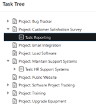
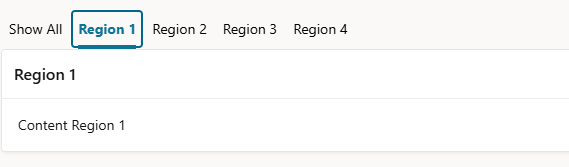

# 17. Weitere Entwicklungsfunktionen

## 17.1 Mobile Anwendungen

Universal Theme ist standardmäßig responsive. Wenn du mehr Kontrolle über das responsive Verhalten deiner Anwendung brauchst, nutze die zusätzlichen Responsive Options im Universal Theme.

Das ist nicht spezifisch für mobile Anwendungen, aber wichtig, wenn eine Anwendung auf einem Smartphone nutzbar sein soll, ohne für jede Bildschirmgröße eine eigene Seite zu bauen. Denke daran: Eine Form mit 87 Items und 12 Buttons kann technisch responsive sein, aber auf einem mobilen Gerät trotzdem nicht benutzerfreundlich.

Beim Design für mobile Nutzung solltest du mit der Aufgabe beginnen, die der Benutzer unterwegs erledigen will. Kürzere Forms, klare Buttons, sinnvolle Default Values und weniger sichtbare Spalten haben oft mehr Wirkung, als eine bestehende Desktop-Seite nur auf einen kleineren Bildschirm zu bringen. Teste wichtige Seiten früh auf einem echten Smartphone, weil Touch-Ziele, Scrollverhalten, Tastaturverhalten und Netzwerkbedingungen auf dem Desktop schwer einzuschätzen sind.

!!! sampleapp "Sample App APEXToGo"
    

      

           Diese Anwendung zeigt Features einer mobilen Webanwendung, die mit Oracle APEX gebaut wurde. Sie demonstriert Mobile-Design-Fähigkeiten und verwendet Progressive-Web-App-Technologie (PWA), um eine erweiterte, native-ähnliche Erfahrung bereitzustellen.
           Diese App ist online verfügbar unter: [https://oracleapex.com/ords/r/apex_pm/apextogo/](https://oracleapex.com/ords/r/apex_pm/apextogo/){target="_blank"}

      

      

          { style="display:block;margin:auto;" }
      

    

Für Reports bietet Oracle APEX zwei responsive Report-Typen für mobile Geräte: **Column Toggle Report** und **Reflow Report**. Sie können Benutzern helfen, bei Report-Daten auf kleineren Bildschirmen den Überblick zu behalten. Ein Report mit vielen Spalten ist aber oft besser als Card, Liste oder suchfokussierte Seite neu gestaltet, auf der Benutzer den relevanten Datensatz schnell finden und öffnen können.

Seit APEX 21.2 können Anwendungen deklarativ als Progressive Web Apps (PWAs) aktiviert werden. Eine PWA ist eine Webanwendung, die responsives Webdesign mit ausgewählten Fähigkeiten verbindet, die man sonst mit nativen Apps verbindet. Nach der Installation kann sie vom Home Screen oder App Launcher gestartet und ohne umgebendes Browserfenster angezeigt werden. Dadurch fühlt sie sich eher wie eine normale App an. PWAs verwenden ein Web App Manifest und einen Service Worker, um Features wie Installierbarkeit und optimiertes Caching zu unterstützen. Das kann Ladeverhalten verbessern und auf unzuverlässigen Netzwerken eine bessere Erfahrung bieten. Seiten und Daten, die offline funktionieren sollen, müssen aber bewusst entworfen werden.

Bei Business-Anwendungen liegt der größte Wert einer PWA oft nicht darin, eine native App vollständig zu ersetzen, sondern die Reibung für häufige Benutzer zu reduzieren. Sie können die Anwendung installieren, sie vom selben Ort wie ihre anderen Apps starten und zu einem fokussierten Workflow zurückkehren, ohne erst durch den Browser navigieren zu müssen. Das ist nützlich für Approval Apps, Field-Service-Szenarien, Inventurprüfungen, Event-Registrierung oder jeden Prozess, bei dem Benutzer schnellen Zugriff auf Smartphone oder Tablet brauchen.

Offline-Verhalten sollte sorgfältig geplant werden. Gecachte Anwendungsdateien können die Application Shell schneller laden lassen, aber Business-Daten sind ein anderes Thema: Du musst entscheiden, welche Informationen offline verfügbar sein dürfen, wie alt sie sein dürfen und was passieren soll, wenn der Benutzer wieder online ist. Für viele APEX-Anwendungen ist eine zuverlässige Online-First-Erfahrung mit gutem Caching bereits wertvoll, während volle Offline-Dateneingabe zusätzliches Design und Synchronisationslogik erfordern kann.

!!! sampleapp "Sample App APEX PWA Reference"
    

      

           Oracle APEX ermöglicht Entwicklern, Progressive Web Apps (PWAs) zu bauen, die auf jedem Desktop- oder Mobilgerät installiert werden können, um eine nativere App-Erfahrung zu liefern. Diese Anwendung dient als Referenz für wichtige PWA-Features in APEX und dafür, wie du sie in deinen eigenen Apps verwenden kannst. Sie ist ein guter Ort, um Installationsverhalten, Offline-Unterstützung, Caching und andere PWA-Einstellungen zu prüfen, bevor du sie auf deine eigenen Apps anwendest.
           Diese App ist online verfügbar unter: [https://oracleapex.com/go/pwa](https://oracleapex.com/go/pwa){target="_blank"}
      

      

          { style="display:block;margin:auto;" }
      

    

Push Notifications können mobile Workflows weiter verbessern. In APEX kann eine PWA Benutzern erlauben, Notifications zu abonnieren und kurze, zeitnahe Nachrichten auf unterstützten Browsern und Geräten zu empfangen, auch wenn die Anwendung gerade nicht geöffnet ist. Typische Use Cases sind Aufgabenzuweisungen, Approval Requests, Erinnerungen oder Statusänderungen, bei denen der Benutzer informiert werden soll, ohne die Anwendung zuerst zu öffnen.

Gute Notifications sind handlungsorientiert und selten genug, um nützlich zu bleiben. Eine Nachricht wie "Expense report waiting for approval" oder "Service request assigned to you" ist deutlich hilfreicher als eine generische Nachricht wie "Something changed". Verwende Notifications gezielt, stelle sicher, dass die Zielseite den richtigen Kontext öffnet, und denke daran, dass Benutzer der Anwendung ausdrücklich genug vertrauen müssen, um Notifications zu erlauben.

## 17.2 JSON

Im Kapitel zu REST Data Sources haben wir bereits erwähnt, dass APEX mit verschachtelten JSON-Dokumenten arbeiten kann. Diese Fähigkeit ist jedoch nicht auf REST-basierte Integrationen beschränkt. APEX kann auch direkt mit JSON-Daten arbeiten, die in der Oracle Database gespeichert sind. JSON-Dokumente können in JSON-Spalten gespeichert, in JSON Collections verwaltet oder über JSON Relational Duality Views bereitgestellt werden. Diese Datenstrukturen können sowohl als Datenquellen für APEX-Anwendungen als auch als Ziele für Datenänderungen dienen.

Durch native Unterstützung verschachtelter JSON-Strukturen ermöglicht APEX Entwicklern, Anwendungen zu bauen, die nahtlos mit relationalen und dokumentorientierten Datenmodellen arbeiten. Benutzer können JSON-basierte Business-Objekte anzeigen, erstellen, aktualisieren und löschen, ohne deren hierarchische Struktur zu verlieren.

Dieser Ansatz ist besonders nützlich für moderne Anwendungen, die flexible Datenmodelle, Integration mit REST Services oder die Verwaltung komplexer Business-Entitäten benötigen. In Kombination mit der nativen JSON-Funktionalität der Oracle Database bietet APEX eine leistungsfähige Low-Code-Umgebung für die Entwicklung von Anwendungen auf Basis von JSON-Dokumenten.

## 17.3 Master Detail

APEX bietet mehrere Out-of-the-box-Optionen für die Umsetzung von Master-Detail-Oberflächen. Ein Master-Detail-Layout kann auf einer einzigen Seite angezeigt werden, entweder vertikal gestapelt oder nebeneinander angeordnet. In diesem Fall zeigt die Auswahl eines Master-Datensatzes automatisch die zugehörigen Detaildatensätze an.

Alternativ können Anwendungen einen Drill-down-Ansatz verwenden, bei dem Benutzer von einer Master-Seite zu einer separaten Detailseite navigieren. Dieses Muster ist besonders nützlich, wenn Detaildaten umfangreich sind oder wenn zusätzliche Aktionen und Informationen für den ausgewählten Datensatz dargestellt werden sollen.

Beide Ansätze können deklarativ umgesetzt werden und benötigen wenig oder gar keinen eigenen Code.

!!! sampleapp "Sample App Master Detail"
    

      

           Diese Anwendung hebt die nativen Master-Detail-Fähigkeiten von Oracle APEX hervor. Die Anwendung enthält vier verschiedene Master-Detail-Seitenlayouts. Die ersten beiden Layouts zeigen Master Detail auf einer einzigen Seite mit bearbeitbaren Interactive Grids. Die letzten beiden Layouts zeigen Master Detail auf zwei Seiten mit einer Mischung aus bearbeitbaren Interactive Grids, Form Items, Classic Reports und modalen Popups.
      

      

          { style="display:block;margin:auto;" }
      

    

## 17.4 Collections

In traditionellen Datenbankanwendungen werden oft temporäre Tabellen verwendet, um Daten während einer Session zu speichern. In APEX sind Anwendungen jedoch webbasiert und verlassen sich auf Session State statt auf eine dedizierte Datenbanksession. Daher sind temporäre Tabellen nicht geeignet, um benutzerspezifische Anwendungsdaten zu speichern.

Dafür stellt APEX **Collections** bereit. Collections sind temporäre, sessionspezifische Datenstrukturen, die verwendet werden können, um Zeilen von Daten während einer Benutzersession zu speichern und zu verarbeiten. Sie werden häufig für Shopping Carts, mehrstufige Wizards, Staging importierter Daten oder Zwischenergebnisse verwendet, bevor diese in permanente Datenbanktabellen geschrieben werden.

Jede Collection besteht aus einer benannten Menge von Members. Ein Member kann bis zu 50 Character-Attribute (`C001-C050`), 5 Number-Attribute (`N001-N005`), 5 Date-Attribute (`D001-D005`), ein grosses Character-Attribut (`CLOB`), ein grosses binäres Attribut (`BLOB`) und ein XML-Type-Attribut enthalten.

Das Package **APEX_COLLECTION** stellt die API bereit, um Collections zu erstellen und Collection Members einzufügen, zu aktualisieren, zu löschen und abzufragen.

!!! sampleapp "Sample App Collections"
    

      

           Sample Collections ermöglicht es, Datenzeilen für die Verwendung innerhalb einer Oracle-APEX-Session zu speichern. Diese Datenbankanwendung zeigt, wie PL/SQL verwendet wird, um collection-basierten Session State zu erstellen und zu verwalten.
      

      

          { style="display:block;margin:auto;" }
      

    

## 17.5 Tree Navigation

    

       APEX stellt den Regionstyp **Tree** bereit, um hierarchische Datenstrukturen anzuzeigen. Ein Tree kann verwendet werden, um Parent-Child-Beziehungen darzustellen, zum Beispiel Organisationsstrukturen, Produktkategorien, Dateisysteme oder Menühierarchien.

       Nodes können vom Benutzer ein- und ausgeklappt werden. Dadurch lassen sich große hierarchische Datenmengen leicht navigieren. Die Auswahl eines Nodes kann eine Navigation zu einer anderen Seite auslösen, zugehörige Informationen anzeigen oder eigene Actions ausführen.

       Die Tree Region kann auf SQL Queries basieren, die hierarchische Daten zurückgeben, und unterstützt verschiedene Optionen zur Steuerung von Erscheinungsbild und Verhalten des Trees.
    

    

       
   

!!! sampleapp "Sample Trees"
    

      

           Lerne, wie ein Tree Control mit einer SQL Query erstellt wird. Diese Anwendung zeigt verschiedene Methoden, Tree Controls in deine Oracle-APEX-Anwendung zu integrieren.
      

      

          { style="display:block;margin:auto;" }
      

    

## 17.6 QR Codes

    

       APEX stellt einen QR-Code-Item-Typ bereit, mit dem scanbare QR Codes einfach in einer Anwendung erzeugt und angezeigt werden können. QR Codes können verschiedene Arten von Informationen enthalten, darunter Text, URLs, Telefonnummern, E-Mail-Adressen, SMS-Nachrichten und geografische Standorte.

       Zusätzlich zum Item-Typ stellt APEX die **APEX_BARCODE** API bereit, mit der QR Codes programmatisch erzeugt werden können. Dadurch können QR Codes in Reports, E-Mails, druckbaren Dokumenten oder anderen Teilen einer Anwendung eingebettet werden.

       Um einen QR Code auf einer Seite zu erstellen, füge einfach ein Item vom Typ QR Code hinzu, gib den Source-Wert an (statisch oder dynamisch) und wähle die gewünschte Größe. APEX erzeugt den QR Code dann automatisch zur Laufzeit.
    

    

       
   

## 17.7 Emails und Email Templates

APEX stellt das Package **APEX_MAIL** bereit, um E-Mails aus APEX-Anwendungen mit PL/SQL zu versenden. Intern basiert diese Funktionalität auf dem Datenbankpackage **UTL_SMTP**. Voraussetzung ist, dass für die APEX-Instanz ein SMTP-Server konfiguriert ist.

E-Mails können direkt in PL/SQL mit der **APEX_MAIL** API erstellt werden. Alternativ unterstützt Oracle APEX **Email Templates**, die in **Shared Components** definiert werden können. Email Templates erlauben Entwicklern, E-Mail-Inhalte von Anwendungslogik zu trennen und standardisierte E-Mail-Layouts in einer Anwendung wiederzuverwenden.

Templates können Platzhalter enthalten, zum Beispiel **#SALUTATION#** oder **#ORDER_ID#**, die beim Senden der E-Mail durch Laufzeitwerte ersetzt werden. Statt `APEX_MAIL.SEND` in PL/SQL aufzurufen, können Entwickler auch den deklarativen Prozesstyp **Send E-Mail** verwenden und Item-Werte auf Template-Platzhalter mappen. Email Templates unterstützen HTML- und Plain-Text-Inhalte, sodass professionelle und responsive E-Mails direkt in APEX erstellt werden können.

E-Mails werden nicht sofort versendet. Sie werden zuerst in die APEX Mail Queue gelegt und danach asynchron durch den Datenbankjob **ORACLE_APEX_MAIL_QUEUE** verarbeitet. Bei Bedarf kann die Queue-Verarbeitung sofort mit **APEX_MAIL.PUSH_QUEUE** ausgelöst werden.

Die aktuelle Mail Queue und die E-Mail-Sendehistorie können über die Views **APEX_MAIL_QUEUE** und **APEX_MAIL_LOG** überwacht werden.

## 17.8 Tabs und Region Switching

    

       APEX bietet mehrere Möglichkeiten, Inhalte zu organisieren und Benutzern das Wechseln zwischen verschiedenen Ansichten auf derselben Seite zu ermöglichen.

       Eine Option ist der **Tab Container**. Durch Aktivieren der Einstellung **Tab Container** in einer Parent Region können mehrere Child Regions als Tabs angezeigt werden. Benutzer können zwischen den Tabs wechseln, um den Inhalt der zugeordneten Regionen zu sehen, ohne die Seite zu verlassen.

       Eine weitere Option ist der Regionstyp **Region Display Selector (RDS)**. Ein RDS erzeugt automatisch eine tab-ähnliche Navigation für ausgewählte Regionen auf der Seite. Das bietet eine einfache Möglichkeit, zusammengehörige Inhalte zu organisieren und Unordnung auf der Seite zu reduzieren, während Benutzer schnell zwischen verschiedenen Regionen wechseln können.

       Beide Ansätze verbessern die Usability, indem sie große Informationsmengen in einem kompakten und leicht navigierbaren Layout präsentieren.
    

    

       
   

## 17.9 Automations

Automations erlauben APEX-Anwendungen, Daten zu überwachen und vordefinierte Actions automatisch auszuführen. Eine Automation besteht aus einem Trigger, einer optionalen Condition und einer oder mehreren Actions, die nacheinander ausgeführt werden, wenn die Automation läuft.

Automations können auf Zeitplänen, Events oder SQL-Query-Ergebnissen basieren. Typische Use Cases sind das Senden von Benachrichtigungen, die Verarbeitung von Daten, das Aktualisieren von Datensätzen, das Aufrufen von PL/SQL-Code oder die Integration mit externen Systemen.

Mehrere Actions können definiert und in Reihenfolge ausgeführt werden. Oracle APEX stellt außerdem die **APEX_AUTOMATION** API bereit, mit der Automations programmatisch aus PL/SQL gestartet und verwaltet werden können.

Alle Automation-Ausführungen werden protokolliert. Dadurch lassen sich Ausführungsdetails, Ergebnisse und Fehler einfach prüfen und überwachen. Ausführungshistorie, Statusinformationen und Log-Meldungen sind innerhalb der APEX-Entwicklungsumgebung verfügbar.

Automations werden mit Oracle Scheduler Jobs umgesetzt. Deshalb benötigt das Parsing Schema das Datenbankprivileg **CREATE JOB**. Diese enge Integration mit der Datenbank ermöglicht zuverlässige und skalierbare Hintergrundverarbeitung direkt aus Oracle APEX.

{ style="display:block;margin:auto;" }

## 17.10 Plug-ins

Plug-ins erlauben Entwicklern, APEX mit eigener Funktionalität zu erweitern, die nicht nativ in der Plattform verfügbar ist. Sie bieten einen Mechanismus, um wiederverwendbare Komponenten hinzuzufügen und Drittanbieter-Technologien in APEX-Anwendungen zu integrieren.

APEX unterstützt mehrere Arten von Plug-ins, darunter **Item**, **Region**, **Dynamic Action**, **Process** und **Authentication** Plug-ins. Nach der Installation können Plug-ins deklarativ in Anwendungen verwendet werden, genau wie eingebaute APEX-Komponenten.

Plug-ins werden in **Shared Components** im Abschnitt **Other Components** verwaltet. Sie können importiert, exportiert und über Anwendungen innerhalb eines Workspaces geteilt werden.

Eine große Sammlung von Community-Plug-ins ist auf der APEX-Community-Seite [**APEX World**](https://apex.world/ords/r/apex_world/apex-world/plug-ins){target="_blank"} verfügbar.

Oracle stellt außerdem einen Katalog von Beispiel- und unterstützten Plug-ins auf der [APEX-Website](https://apex.oracle.com/en/solutions/apps/#plug_ins){target="_blank"} bereit.
Plug-ins sind ein leistungsfähiger Weg, die Benutzeroberfläche zu erweitern, externe Bibliotheken zu integrieren und spezialisierte Funktionalität hinzuzufügen, während das Low-Code-Entwicklungsmodell von APEX erhalten bleibt.

## 17.11 Document Generation und Printing

APEX unterstützt Dokumentenerzeugung über externe Print Engines, die in den APEX-Instanzeinstellungen konfiguriert werden können. Je nach ausgewählter Print Engine können Anwendungen PDF- und andere Dokumentformate auf Basis von SQL-Query-Ergebnissen und Dokumentvorlagen erzeugen.

Die folgenden Print Engines werden unterstützt:

* **External (Apache FOP)** stellt grundlegende Druckfunktionen bereit. Es unterstützt Report Queries und Report Regions mit den von APEX gelieferten Standard-Templates sowie eigene XSL-FO-Templates.

* **Oracle Analytics Publisher** (Lizenz erforderlich) ermöglicht fortgeschrittene Dokumentenerzeugung mit eigenen RTF- und XSL-FO-Templates. Es unterstützt anspruchsvolle Layouts, Formatierungen und Anforderungen an Dokumentenerzeugung.

* **APEX Office Print (AOP)** (Lizenz oder Subscription erforderlich) erzeugt Dokumente in PDF- und Microsoft-Office-Formaten wie Word, Excel und PowerPoint. Es kombiniert Template-Dateien mit Anwendungsdaten, typischerweise als JSON bereitgestellt.

Seit APEX 24.1 unterstützt Oracle APEX auch **Oracle Document Generator**, einen OCI-basierten Service zur Dokumentenerzeugung. Mit DOCX-Templates und JSON-Daten kann er PDF-Dokumente ähnlich wie Oracle Analytics Publisher und APEX Office Print erzeugen. Eine OCI Tenancy ist erforderlich, um diesen Service zu nutzen.

{ style="display:block;margin:auto;" }

Dokumentenerzeugung ist in APEX über **Report Queries** und **Report Layouts** integriert, die in **Shared Components** definiert werden. Anwendungen können Dokumentenerzeugung deklarativ über den eingebauten Prozesstyp **Download Report** und verwandte Dynamic Actions aufrufen. Für programmatischen Zugriff stellt APEX die **APEX_PRINT** API bereit.

Diese Features erlauben Entwicklern, professionelle Reports, Rechnungen, Briefe, Zertifikate und andere Business-Dokumente direkt aus APEX-Anwendungen zu erzeugen.

!!! sampleapp "Sample App Document Generator"
    

      

           Diese Anwendung zeigt die Integration mit der Oracle Document Generator Pre-built Function auf OCI. Sie enthält Beispiele für die Erzeugung von PDF-Dokumenten aus einer Kombination von JSON-Daten und Microsoft-Word-Templates.
      

      

          { style="display:block;margin:auto;" }
      

    

