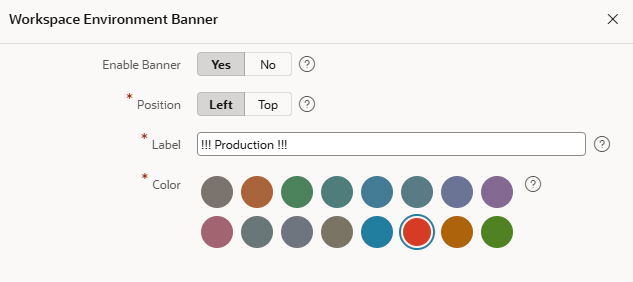

# 18. Betrieb & Lifecycle Management

## 18.1 Application Lifecycle Management

Moderne Anwendungsentwicklung besteht aus mehr als dem Erstellen von Seiten und Komponenten. Teams benötigen effiziente Möglichkeiten, gemeinsam zu arbeiten, Änderungen zu verwalten, Versionen nachzuverfolgen und Anwendungen verlässlich über mehrere Umgebungen hinweg bereitzustellen. Oracle APEX 26.1 führt mehrere Erweiterungen ein, die das Application Lifecycle Management (ALM) deutlich verbessern und APEX-Anwendungen leichter in moderne Entwicklungsprozesse integrieren.

Eine wichtige Neuerung in APEX 26.1 ist **APEXlang**, ein neues, menschenlesbares Format zur Beschreibung von Anwendungen. Statt mit großen SQL-Exportdateien zu arbeiten, können Anwendungen als strukturierte `.apx`-Dateien exportiert werden. Diese lassen sich leichter lesen, vergleichen, validieren und in Versionsverwaltungssystemen wie Git speichern. Dadurch werden aussagekräftige Diffs, einfachere Code Reviews, bessere Zusammenarbeit und eine bessere Integration in CI/CD-Pipelines möglich. APEXlang passt außerdem gut zu modernen Entwicklungstools und KI-gestützten Workflows.

Für die Zusammenarbeit mehrerer Entwickler stellt APEX **Working Copies** bereit. Damit können mehrere Personen parallel an derselben Anwendung arbeiten, ohne sich gegenseitig ihre Änderungen zu überschreiben. Änderungen können später wieder in die Hauptanwendung übernommen werden. Working Copies wurden mit APEX 23.2 eingeführt.

Erstellen Sie zum Beispiel eine Working Copy einer Anwendung, um einen Fehler zu beheben oder eine neue Funktion zu entwickeln, und führen Sie die Änderungen anschließend gezielt in die Hauptanwendung zurück. Sie können beliebig viele Working Copies erstellen, sodass mehrere Entwicklerinnen und Entwickler zu einer Anwendung beitragen können. Konflikte werden beim Vergleich der Dateien sichtbar, und Entwickler können entscheiden, ob alle oder nur bestimmte Komponenten zusammengeführt werden sollen.

Working Copies sind im App Builder entsprechend gekennzeichnet. Das gilt auch für die Übersicht aller Anwendungen im Workspace. Für eine Working Copy gibt es ein zusätzliches Menü, mit dem Sie zur Hauptanwendung zurückkehren, die Kopie mit der Hauptanwendung zusammenführen und die Änderungen vorher im Vergleich prüfen können. Es ist auch möglich, Änderungen aus der Hauptanwendung in die Working Copy zu übernehmen.

Zur Unterstützung kontrollierter Entwicklungsprozesse bietet APEX weitere Governance-Funktionen:

**Page Locking** verhindert versehentliche Änderungen, indem Entwickler einzelne Seiten sperren können, während sie daran arbeiten.

**Build Options** ermöglichen es, Funktionen, Seiten oder Komponenten zu aktivieren oder zu deaktivieren, ohne sie aus der Anwendung zu entfernen. Das ist besonders nützlich für Feature Toggles, stufenweise Rollouts, kundenspezifische Funktionen und unterschiedliche Deployment-Konfigurationen.

Zusammen bilden APEXlang, Source-Control-Integration, Working Copies, Page Locking und Build Options eine solide Grundlage für professionelles Application Lifecycle Management. Teams können moderne Entwicklungspraktiken übernehmen und gleichzeitig die Produktivität und Einfachheit von Oracle APEX beibehalten.

## 18.2 Anwendungen exportieren, importieren und bereitstellen

APEX-Anwendungen werden als Metadaten in der Datenbank gespeichert und können mit der eingebauten **Export and Import**-Funktion einfach zwischen Umgebungen transportiert werden. Anwendungen können aus einer Entwicklungsumgebung exportiert und in Test-, Staging- oder Produktionsumgebungen importiert werden. So entsteht ein kontrollierter und wiederholbarer Deployment-Prozess.

Für vollständige Anwendungsdeployments bietet APEX **Supporting Objects**. Damit können Entwickler Datenbankobjekte wie Tabellen, Views, Packages, Beispieldaten und Installationsskripte zusammen mit einer Anwendung paketieren. Beim Import können diese Supporting Objects automatisch installiert werden, sodass alle benötigten Datenbankartefakte in der Zielumgebung vorhanden sind.

Für automatisierte Deployments bietet **SQLcl** Kommandozeilenunterstützung für Export, Import und Deployment von Oracle APEX-Anwendungen. Damit ist SQLcl ein wichtiger Baustein für CI/CD-Pipelines und geskriptete Deployment-Prozesse.

In APEX 26.1 verbessert das bereits erwähnte APEXlang den Anwendungstransport und das Versionsmanagement weiter, weil es ein menschenlesbares Exportformat bereitstellt, das gut mit Source-Control-Systemen und automatisierten Deployment-Pipelines harmoniert. Zusammen bilden Anwendungsexporte, Supporting Objects und moderne Deployment-Praktiken die Grundlage für einen sicheren und konsistenten Transport von APEX-Anwendungen über mehrere Umgebungen hinweg.

!!! bytheway "Environment Banner"
    

      

            *By the way*, 
            um die aktuelle Umgebung sofort sichtbar zu machen, zum Beispiel Development, Test oder Production, können Sie einen **Environment Banner** definieren. Öffnen Sie **Administration** über die Navigation unten links, wählen Sie **Manage Service** und dann **Define Environment Banner**. Dadurch erhalten Entwickler und Administratoren einen klaren visuellen Hinweis, in welcher Umgebung sie gerade arbeiten.
      

      

          { style="display:block;margin:auto;" }
      

    

## 18.3 Instance Administration

APEX stellt einen speziellen Workspace **INTERNAL** bereit, der ausschließlich für administrative Aufgaben auf Instanzebene verwendet wird. Über diesen Workspace können Instanzadministratoren Workspaces verwalten, Nutzung überwachen, Sicherheitseinstellungen konfigurieren und die gesamte APEX-Umgebung pflegen. Die Instance Administration steuert Einstellungen, die für alle Workspaces einer APEX-Instanz gelten, zum Beispiel Authentifizierungsrichtlinien, E-Mail-Konfiguration, REST Services, AI-Service-Einstellungen und Workspace-Provisionierung. Administratoren können außerdem festlegen, ob Benutzer neue Workspaces anfordern dürfen und wie diese Anforderungen genehmigt werden.

Durch die Trennung von Instanzadministration und Anwendungsentwicklung ermöglicht Oracle APEX eine zentrale Governance, während einzelne Workspaces isoliert und unabhängig verwaltet werden können.

## 18.4 APEX und ORDS

Im Unterschied zu vielen anderen Entwicklungsplattformen wird Oracle APEX direkt in der Oracle Database installiert. Es ist kein separater Application Server erforderlich, um Anwendungslogik auszuführen, da Seiten, Metadaten, SQL, PL/SQL und Anwendungsdefinitionen in der Datenbank verwaltet und verarbeitet werden. Oracle APEX ist ohne zusätzliche Kosten in der Oracle Database enthalten und in allen unterstützten Editionen der Oracle Database verfügbar.

Damit APEX-Anwendungen über einen Webbrowser erreichbar sind, dient Oracle REST Data Services (ORDS) als Web- und REST-Gateway. ORDS nimmt HTTP-Anfragen entgegen, kommuniziert mit der Datenbank, führt APEX-Anwendungen aus und liefert die erzeugten Inhalte an den Client zurück. Darüber hinaus stellt ORDS Unterstützung für RESTful Services und moderne Webintegrationen bereit.

Diese Architektur ergibt ein kompaktes und effizientes Deployment-Modell, das im Wesentlichen aus der Oracle Database, der APEX-Runtime-Umgebung und ORDS besteht. Beim Betrieb einer APEX-Umgebung sind Administratoren dafür verantwortlich, APEX und ORDS zu installieren und zu aktualisieren, Sicherheits- und Verbindungseinstellungen zu konfigurieren und Verfügbarkeit sowie Performance der gesamten Plattform sicherzustellen.
