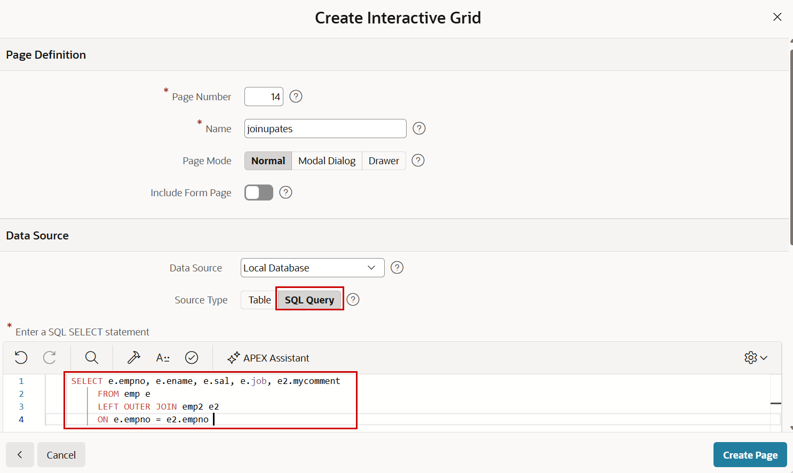
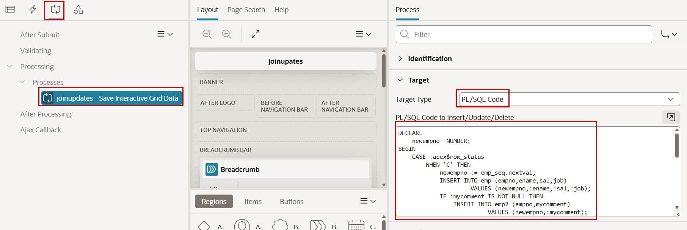

# 20. Forms: Updates over Joins

This chapter may not be an obvious fit for a beginner workshop, but I like it too much to leave it out.

So far, the forms and data changes we have built have changed one table at a time. Real scenarios can be more complex. In this chapter, we will see how forms can be used more flexibly and how more than one table can be involved. We will use a join as an example.

We will create a table `EMP2` to store comments for employees and join it to `EMP` via the primary key `EMPNO`. A row in `EMP2` exists only when an employee has a comment. When a comment is entered, we need to insert a row into `EMP2`. When a comment is deleted, the employee row in `EMP` remains, but the corresponding row in `EMP2` should be deleted.

In this example, we will use an Interactive Grid; the same approach also works for a form region.

!!! exercise "Updates over Joins in Interactive Grids"
    First, we create a new table to store comments for the employees. Obviously, this could be a column in table `EMP`, but we explicitly want a second table to showcase updates over joins.

    Run this command in **SQL Commands**.

    ```sql
        CREATE TABLE emp2 (
            empno      NUMBER PRIMARY KEY,
            mycomment  VARCHAR2(50),
            CONSTRAINT fk_emp FOREIGN KEY (empno)
                REFERENCES emp (empno)
        );
    ```

    Now try to run the following SQL query in **SQL Commands**. The SELECT statement inside the `UPDATE` uses an outer join so that rows from `EMP` are shown even when no corresponding row in `EMP2` is available yet.

    ```sql
        UPDATE (
            SELECT e.empno AS e_empno,
                   e.ename,
                   e.sal,
                   e.job,
                   e2.mycomment
              FROM emp e
              LEFT OUTER JOIN emp2 e2
                ON e.empno = e2.empno
        )
           SET sal = sal,
               mycomment = mycomment;
    ```

    You will get an *ORA-01776: cannot modify more than one base table through a join view*. Updating only the column `sal` works, but updating only the column `mycomment` results in an *ORA-01763: update or delete involves outer joined table*.

    But we want to perform updates, inserts, and deletes on both tables from the same form. How can we do that?

    Create a new page with an **Interactive Grid** component. Use any **Name** you like, set **Source Type** to `SQL Query`, and enter the following code in **Enter a SQL SELECT statement**.

    ```sql
        SELECT e.empno,
               e.ename,
               e.sal,
               e.job,
               e2.mycomment
          FROM emp e
          LEFT OUTER JOIN emp2 e2
            ON e.empno = e2.empno
    ```

    { style="display:block;margin:auto;" }

    In the region, go to the **Attributes** tab and activate the **Enabled** switch in the **Edit** section.

    Now define the column **EMPNO** as the **Primary Key**. There is a switch for this property in the **Source** section.

    You will see the same error messages as before when you try to update data. If you set the column **MYCOMMENT** to **Read Only**, the grid can be used for updates to `EMP`, but this column will be ignored.

    But we want to achieve the following:

    * update rows in `EMP`
    * update rows in `EMP2`
    * insert rows into `EMP2` when `MYCOMMENT` changes from `NULL` to a value
    * delete rows from `EMP2` when `MYCOMMENT` is set to `NULL` and was not `NULL` before
    * delete rows from `EMP` and `EMP2` when a row in the grid is deleted

    We can do this by using our own logic instead of the default process type `Interactive Grid - Automatic Row Processing (DML)`.

    Go to the **Processing** tab, select the process for the update, and change the **Target Type** of this process from `Region Source` (which is our query) to `PL/SQL Code`.

    As **PL/SQL Code to Insert/Update/Delete**, use this code:

    ```plsql
        DECLARE
            newempno NUMBER;
        BEGIN
            CASE :apex$row_status
            WHEN 'C' THEN
                newempno := emp_seq.nextval;

                INSERT INTO emp (empno, ename, sal, job)
                VALUES (newempno, :ename, :sal, :job);

                IF :mycomment IS NOT NULL THEN
                    INSERT INTO emp2 (empno, mycomment)
                    VALUES (newempno, :mycomment);
                END IF;

            WHEN 'U' THEN
                UPDATE emp
                   SET ename = :ename,
                       sal   = :sal,
                       job   = :job
                 WHERE empno = :empno;

                MERGE INTO emp2 target
                USING (
                    SELECT :empno     AS empno,
                           :mycomment AS mycomment
                      FROM sys.dual
                ) source
                   ON (source.empno = target.empno)
                 WHEN MATCHED THEN
                    UPDATE
                       SET target.mycomment = source.mycomment
                    DELETE WHERE source.mycomment IS NULL
                 WHEN NOT MATCHED THEN
                    INSERT (target.empno, target.mycomment)
                    VALUES (source.empno, source.mycomment)
                    WHERE source.mycomment IS NOT NULL;

            WHEN 'D' THEN
                DELETE FROM emp2 WHERE empno = :empno;
                DELETE FROM emp  WHERE empno = :empno;
            END CASE;
        END;
    ```

    { style="display:block;margin:auto;" }

    For each changed grid row, the code checks whether it was updated (`U`), created (`C`), or deleted (`D`) and then performs the logic described above. This code uses a sequence, so create it in **SQL Commands**:

    ```sql
        CREATE SEQUENCE emp_seq START WITH 100;
    ```


There are now two ways to generate keys for table `EMP`: the existing identity column or sequence used by the sample table, and this additional sequence. That is not good practice, and we use the second sequence here only to demonstrate the code above. In a real application, use one clear key-generation strategy. Now test the application, make some data changes, and check in Object Browser what happens in table `EMP`, and especially in `EMP2`.
There is a little bit of coding involved, but you get the full flexibility and power when you need it.

!!! bytheway "Prevent Lost Updates"
    *By the way*,<br>
    Even with our own DML code, **Prevent Lost Updates** is still handled automatically.

!!! bytheway "Instead of Triggers"
    *By the way*,<br>
    As an alternative, consider this approach:

    * Create a view with the query above
    * Create `INSTEAD OF` triggers for this view to move the logic from the code above into the database
    * Use the view as the basis for a form

    With this approach, the logic is reusable from other environments.
