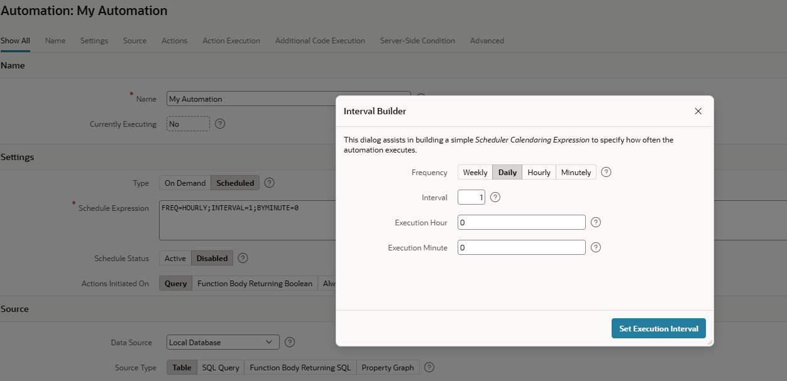

# 21. Miscellaneous

## 21.1 JSON

In the chapter on REST Data Sources we already mentioned that APEX can work with nested JSON documents. However, this capability is not limited to REST-based integrations. APEX can also work directly with JSON data stored in the Oracle Database. JSON documents can be stored in JSON columns, managed in JSON collections, or exposed through JSON Relational Duality Views, a feature introduced with Oracle Database 26ai. These data structures can be used both as data sources for APEX applications and as targets for data modifications.

By supporting nested JSON structures natively, APEX enables developers to build applications that work seamlessly with both relational and document-oriented data models. Users can view, create, update, and delete JSON-based business objects while preserving their hierarchical structure.

This approach is particularly useful for modern applications that require flexible data models, integration with REST services, or the management of complex business entities. Combined with Oracle Database's native JSON functionality, APEX provides a powerful low-code environment for developing applications based on JSON documents.

## 21.2 Master Detail

APEX provides several out-of-the-box options for implementing master-detail interfaces. A master-detail layout can be displayed on a single page, either stacked vertically or arranged side by side. In this case, selecting a master record automatically displays the corresponding detail records.

Alternatively, applications can use a drill-down approach, where users navigate from a master page to a separate detail page. This pattern is particularly useful when detail data is extensive or when additional actions and information need to be presented for the selected record.

Both approaches can be implemented declaratively and require little or no custom coding.

!!! sampleapp "Sample App Master Detail"
    

      

           This application highlights the native master detail capabilities of Oracle APEX. The application contains four different master detail page layouts. The first two layouts display master detail in a single page using editable Interactive Grids. The last two layouts display master detail in two pages with mix of editable Interactive Grids, form items, classic reports and modal popups.
      

      

          { style="display:block;margin:auto;" }
      

    

## 21.3 Collections

In traditional database applications, temporary tables are often used to store data during a session. In APEX, however, applications are web-based and rely on session state rather than a dedicated database session. As a result, temporary tables are not suitable for storing user-specific application data.

For this purpose, APEX provides **Collections**. Collections are temporary, session-specific data structures that can be used to store and process rows of data during a user's session. They are commonly used for shopping carts, multi-step wizards, staging imported data, or holding intermediate results before they are written to permanent database tables.

Each collection consists of a named set of members. A member can contain up to 50 character attributes (C001–C050), 5 number attributes (N001–N005), 5 date attributes (D001–D005), and one attribute each of type CLOB, BLOB, XMLTYPE, and JSON.

The **APEX_COLLECTION** package provides the API for creating collections and for inserting, updating, deleting, and querying collection members.

!!! sampleapp "Sample App Collections"

## 21.4 Tree Navigation

    

       APEX provides the **Tree** region type for displaying hierarchical data structures. A tree can be used to represent parent-child relationships, such as organizational structures, product categories, file systems, or menu hierarchies.

       Nodes can be expanded and collapsed by the user, making it easy to navigate large hierarchical datasets. Selecting a node can trigger navigation to another page, display related information, or execute custom actions.

        The Tree region can be based on SQL queries that return hierarchical data and supports various options for controlling the appearance and behavior of the tree.
    

    

       
   

!!! sampleapp "Sample Trees"
    

      

           Learn how to create a tree control using a SQL query. This application shows various methods of integrating tree controls into your Oracle APEX application.
      

      

          { style="display:block;margin:auto;" }
      

    

## 21.5 QR Codes

    

       APEX provides a QR Code item type that makes it easy to generate and display scannable QR codes within an application. QR codes can contain different types of information, including text, URLs, phone numbers, email addresses, SMS messages, and geographic locations.

       In addition to the item type, APEX provides the **APEX_BARCODE** API, which can be used to generate QR codes programmatically. This allows QR codes to be embedded in reports, emails, printable documents, or other parts of an application.
       
       To create a QR code on a page, simply add an item of type QR Code, specify the source value (either static or dynamic), and choose the desired size. APEX then generates the QR code automatically at runtime.
    

    

       
   

## 21.6 EMails & EMail-Templates

APEX provides the **APEX_MAIL** package for sending emails from APEX applications using PL/SQL. Internally, this functionality relies on the database package **UTL_SMTP**. A prerequisite is that an SMTP server is configured for the APEX instance.

Emails can be created directly in PL/SQL using the **APEX_MAIL** API. Alternatively, Oracle APEX supports **Email Templates**, which can be defined in **Shared Components**. Email templates allow developers to separate email content from application logic and to reuse standardized email layouts throughout an application.

Templates can contain placeholders, such as **#SALUTATION#** or **#ORDER_ID#**, which are replaced with runtime values when the email is sent. Instead of calling APEX_MAIL.SEND in PL/SQL, developers can also use the declarative **Send E-Mail** process type and map item values to template placeholders. Email Templates support both HTML and plain text content, making it easy to create professional and responsive emails directly within APEX.

Emails are not sent immediately. They are first placed in the APEX mail queue and are then processed asynchronously by the database job `ORACLE_APEX_MAIL_QUEUE`. If required, queue processing can be triggered immediately using `APEX_MAIL.PUSH_QUEUE`.

The current mail queue and the email sending history can be monitored using the views **APEX_MAIL_QUEUE** and **APEX_MAIL_LOG**.

## 21.7 Tabs and Region Switching

    

       APEX provides several ways to organize content and allow users to switch between different views on the same page.
       
       One option is the **Tab Container**. By enabling the **Tab Container** setting in a parent region, multiple child regions can be displayed as tabs. Users can switch between the tabs to view the content of the associated regions without leaving the page.
       
       Another option is the **Region Display Selector (RDS)** region type. An RDS automatically generates a tab-like navigation for selected regions on the page. This provides a simple way to organize related content and reduce page clutter while allowing users to quickly switch between different regions.
       
       Both approaches improve usability by presenting large amounts of information in a compact and easy-to-navigate layout.
    

    

       
   

## 21.8 Automations

Automations allow APEX applications to monitor data and execute predefined actions automatically. An automation consists of a trigger, an optional condition, and one or more actions that are executed sequentially when the automation runs.

Automations can be based on schedules, events, or SQL query results. Typical use cases include sending notifications, processing data, updating records, invoking PL/SQL code, or integrating with external systems.

Multiple actions can be defined and executed in sequence. Oracle APEX also provides the **APEX_AUTOMATION** API, which allows automations to be started and managed programmatically from PL/SQL.

All automation executions are logged, making it easy to review execution details, monitor results, and troubleshoot errors. Execution history, status information, and log messages are available within the APEX development environment.

Automations are implemented using Oracle Scheduler jobs. Therefore, the database privilege **CREATE JOB** is required for the parsing schema. This tight integration with the database enables reliable and scalable background processing directly from Oracle APEX.

{ style="display:block;margin:auto;" }

## 21.9 Plug-Ins

Plug-ins allow developers to extend APEX with custom functionality that is not available natively in the platform. They provide a mechanism for adding reusable components and integrating third-party technologies into APEX applications.

APEX supports several types of plug-ins, including **Item**, **Region**, **Dynamic Action**, **Process**, and **Authentication** plug-ins. Once installed, plug-ins can be used declaratively in applications just like built-in APEX components.

Plug-ins are managed in **Shared Components** under the **Other Components** section. They can be imported, exported, and shared across applications within a workspace.

A large collection of community-developed plug-ins is available on the APEX community site [**APEX World**](https://apex.world/ords/r/apex_world/apex-world/plug-ins){target="_blank"})

Oracle also provides a catalog of sample and supported plug-ins on the [APEX website](https://apex.oracle.com/en/solutions/apps/#plug_ins
){target="_blank"}
Plug-ins are a powerful way to enhance the user interface, integrate external libraries, and add specialized functionality while preserving the low-code development model of APEX.

## 21.10 Document Generation and Printing

APEX supports document generation through external print engines that can be configured in the APEX instance settings. Depending on the selected print engine, applications can generate PDF and other document formats based on SQL query results and document templates.

The following print engines are supported:

* **External (Apache FOP)** provides basic printing capabilities. It supports report queries and report regions using the default templates supplied with APEX, as well as custom XSL-FO templates.

* **Oracle Analytics Publisher** (license required) enables advanced document generation using custom RTF and XSL-FO templates. It supports sophisticated layouts, formatting, and document generation requirements.

* **APEX Office Print (AOP)** (license or subscription required) generates documents in PDF and Microsoft Office formats such as Word, Excel, and PowerPoint. It combines template files with application data, typically provided as JSON.

Starting with APEX 24.1, Oracle APEX also supports **Oracle Document Generator**, an OCI-based document generation service. Using DOCX templates and JSON data, it can generate PDF documents in a manner similar to Oracle Analytics Publisher and APEX Office Print. An OCI tenancy is required to use this service.

{ style="display:block;margin:auto;" }

Document generation is integrated into APEX through **Report Queries** and **Report Layouts**, which are defined in **Shared Components**. Applications can invoke document generation declaratively using the built-in **Download Report** process type and related dynamic actions. For programmatic access, APEX provides the **APEX_PRINT** API.

These features allow developers to generate professional reports, invoices, letters, certificates, and other business documents directly from APEX applications.

!!! sampleapp "Sample App Document Generator"
    

      

           This application showcases the integration with the Oracle Document Generator Pre-built Function on OCI. It features examples of generating PDF documents from a combination of JSON data and MS Word templates.
      

      

          { style="display:block;margin:auto;" }
      

    

