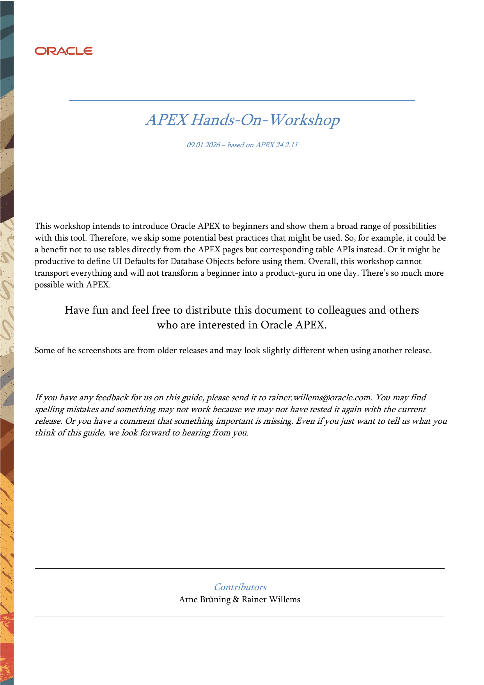

# Welcome to the APEX Hands-On Workshop

{ .cover-image }

This workshop intends to introduce Oracle APEX to beginners and show them a broad range of possibilities with this tool. Therefore, we skip some potential best practices that might be used. So, for example, it could be a benefit not to use tables directly from the APEX pages but corresponding table APIs instead. Or it might be productive to define UI Defaults for Database Objects before using them. Overall, this workshop cannot transport everything and will not transform a beginner into a product-guru in one day. There’s so much more possible with APEX.

Have fun and feel free to distribute this document to colleagues and others 
who are interested in Oracle APEX.

Some of he screenshots are from older releases and may look slightly different when using another release.

If you have any feedback for us on this guide, please send it to rainer.willems@oracle.com. You may find spelling mistakes and something may not work because we may not have tested it again with the current release. Or you have a comment that something important is missing. Even if you just want to tell us what you think of this guide, we look forward to hearing from you.

Best Regards
Arne & Rainer

# Quick start

- Read the [Workshop Notes](workshop-notes.md) first.
- Use the chapter pages in the sidebar for the step-by-step flow.

# Chapters

- [Workshop Notes](workshop-notes.md)

  ---

  How the guide uses colors, code snippets, and exercise blocks.

- [1. Workshop Start - Introduction](01-workshop-start-introduction.md)

  ---

  Opening remarks and workshop framing.

- [2. APEX - First Steps](02-apex-first-steps.md)

  ---

  Tools, sample tables, first app wizard, and faceted search.

- [3. MyEmployees Application Adjustments](03-myemployees-application-adjustments.md)

  ---

  Navigation, formatting, LOVs, conditions, and session state.

- [4. Layout - UI in APEX](04-layout-ui-in-apex.md)

  ---

  Themes, templates, template components, and object-level styling.

- [5. Authentication & Authorization](05-authentication-authorization.md)

  ---

  Custom auth, authorization schemes, and row-level filtering.

- [6. Store and show geographical information](06-geographical-information.md)

  ---

  Spatial columns, geocoding, and maps.

- [7. Integrate RESTful Services](07-restful-services.md)

  ---

  REST Data Sources, synchronization, nested JSON, and catalogs.

- [8. Reports](08-reports.md)

  ---

  Classic reports, interactive reports, grids, cards, and smart filters.

- [9. Calendar](09-calendar.md)

  ---

  Data loading script, calendar page, and color coding.

- [10. JavaScript in APEX](10-javascript-in-apex.md)

  ---

  Calendar init, console work, dynamic actions, and button labeling.

- [11. Charts](11-charts.md)

  ---

  Pie chart, bar chart, drilldown, and client-side refresh.

- [12. Working with Files](12-working-with-files.md)

  ---

  Upload, download, image display, and ZIP downloads.

- [13. Data Loading](13-data-loading.md)

  ---

  Declarative data load definitions and generated pages.

- [14. Mobile Applications](14-mobile-applications.md)

  ---

  Responsive layout, column toggle, reflow, PWA, and notifications.

- [15. Approvals & Workflow](15-approvals-workflow.md)

  ---

  Human workflows and the workflow engine.

- [16. Individual Form Handling - Updates over Joins](16-individual-form-handling.md)

  ---

  Updates over joins, PL/SQL DML, and instead-of trigger alternatives.

- [17. Translations](17-translations.md)

  ---

  Languages, XLIFF, and translated application publishing.

- [18. Application Lifecycle Management](18-application-lifecycle-management.md)

  ---

  Working copies and lifecycle integration.

- [19. AI in APEX](19-ai-in-apex.md)

  ---

  AI assistant, AI-powered apps, and vector search.

- [20. Printing/PDF with APEX](20-printing-pdf.md)

  ---

  Print servers, document generation, and build options.

- [21. Miscellaneous](21-miscellaneous.md)

  ---

  JSON, master detail, collections, trees, QR codes, emails, tabs, automations, plug-ins, and search.

- [22. Links & More Learning Content](22-links-more-learning-content.md)

  ---

  External learning links and reference material.

