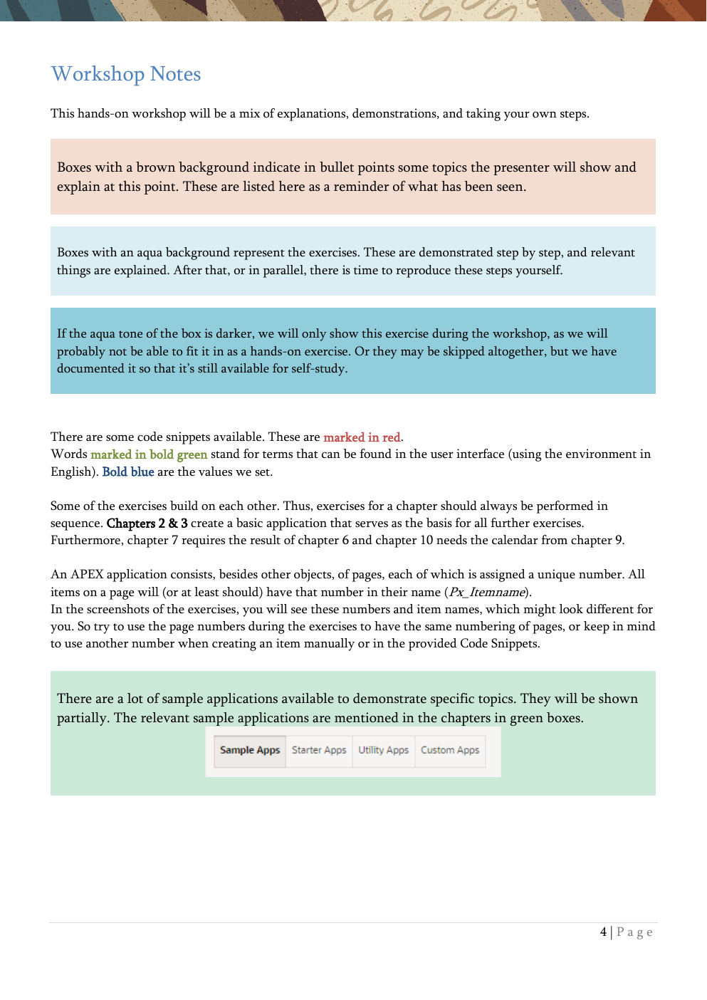
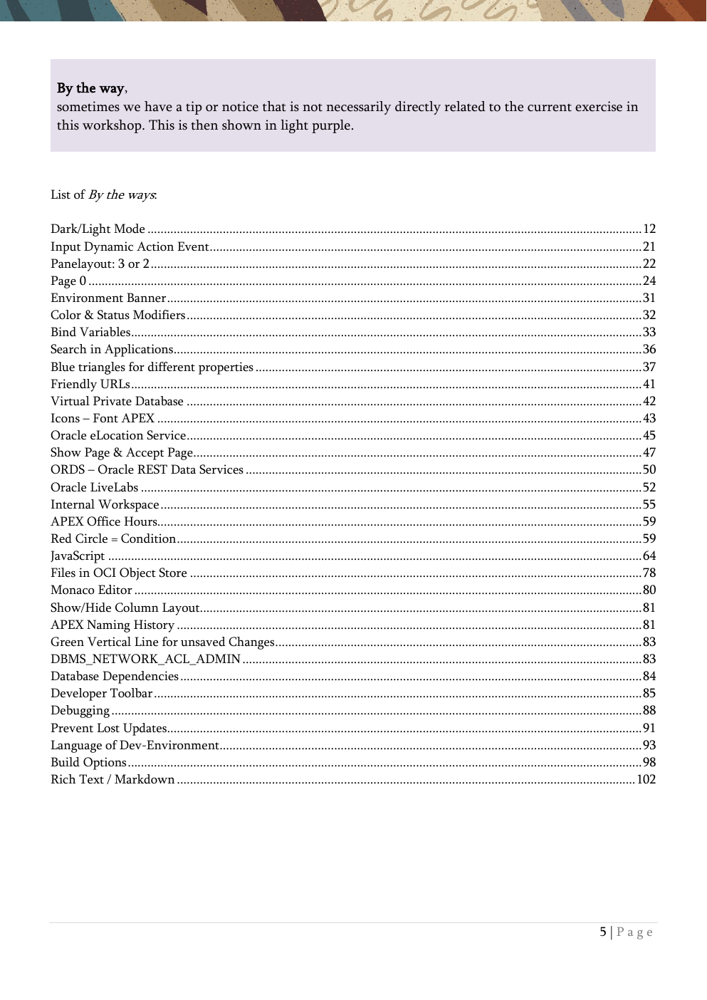

# Workshop Notes

The PDF uses a visual language to distinguish explanations, exercises, and side notes.

{ .chapter-image }
{ .chapter-image }

## Color and box meaning

- Brown boxes highlight topics the presenter demonstrates and explains.
- Aqua boxes mark exercises that are meant to be reproduced hands-on.
- Darker aqua can mean an exercise is for demo only or may be skipped.
- Purple boxes are side notes that are not directly part of the current exercise.
- Red text is used for code snippets.
- Bold green text typically indicates UI terms in the English environment.
- Bold blue text marks values to enter.

## How the workshop is structured

Some exercises depend on earlier ones. The guide calls out these dependencies explicitly, for example:

- Chapters 2 and 3 build the base application.
- Chapter 7 depends on the result from chapter 6.
- Chapter 10 uses the calendar from chapter 9.

## Practical note

The document also explains APEX page numbering, object names, debugging hints, and how to read the screenshots so that you can reproduce the exercise flow even when your own environment looks a little different.
