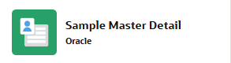

# Workshop Notes

This hands-on workshop is a mix of explanations, demonstrations, and hands-on exercises.


!!! presented "Presented"
    Boxes with a brown background list topics the presenter will show and explain at this point. They are included as a reminder of what has been covered. That's the part that's missing when you go through it on your own.

!!! exercise "Exercise"
    Boxes with this aqua background represent the exercises. These are demonstrated step by step, and relevant details are explained. After that, or in parallel, there is time to reproduce these steps yourself.


Some code snippets are available and can be copied easily to the clipboard.

```sql title="Example for Copy to Clipboard of a Code Snippet"
SELECT *
FROM emp;
```

Property names, button labels, and similar terms mentioned in the text are **bold**, and property values are formatted `like this`.

Some of the exercises build on each other. Therefore, exercises for a chapter should always be performed in sequence. Chapters 1 and 2 create a basic application that serves as the basis for all further exercises.
Furthermore, the chapter with RESTful Service integration requires the result of the exercise for geographical information, and the JavaScript example is built on top of the calendar exercise.

An APEX application consists, among other objects, of pages, each of which is assigned a unique number. All items on a page will (or at least should) have that number in their name (`Px_ITEMNAME`).
In the screenshots of the exercises, you will see these numbers (automatically pre-assigned in ascending order) and item names, which might look different for you. Try to use the page numbers from the exercises to keep the same page numbering, or remember to use another number when creating an item manually or when using the provided code snippets.

!!! sampleapp "Sample Apps"
    Many sample applications are available to demonstrate specific topics. Relevant sample applications for a chapter will be mentioned in such green boxes.

!!! bytheway "By the way"
    *By the way*,<br>
    Sometimes we have a tip or notice that is not necessarily directly related to the current exercise in this workshop. This is shown in light purple.

!!! tip "Tips"
    Sometimes we have a hint, especially when there is a dedicated hands-on lab (Oracle LiveLab) for practicing that topic in the guide.

<!--
```sql title="Abfrage Tabelle EMP"
SELECT *
FROM emp;
```

!!! tip "LiveLab"
    There is an Oracle LiveLab **Implement custom authentication in APEX** available.
    [Click here](https://livelabs.oracle.com/ords/r/dbpm/livelabs/view-workshop?wid=3315){target="_blank"}


[Link zu Oracle](https://www.oracle.com){target="_blank"}

Bild mkdocs 
          { style="display:block;margin:auto;" }

Bild sonst 
    

> Ich bin ein Zitat

!!! note "Note"
    Bitte zuerst die Datenbankverbindung pruefen.

!!! tip "Tip"
    Das ist ein Tipp.

!!! warning "Warning"
    Warning

!!! success "Success"
    Erfolgreich ausgefuehrt

!!! info "Info"
    Zusaetzliche Information.

!!! danger "Danger"
    Vorsicht!


SamleApps Bildchen 293*80
-->


